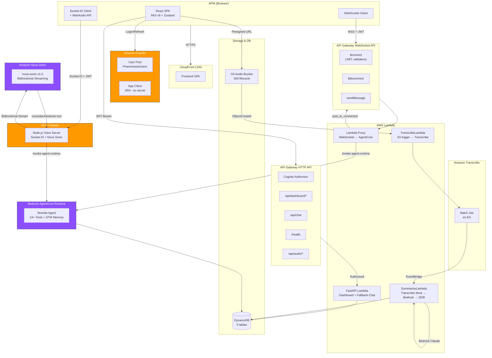
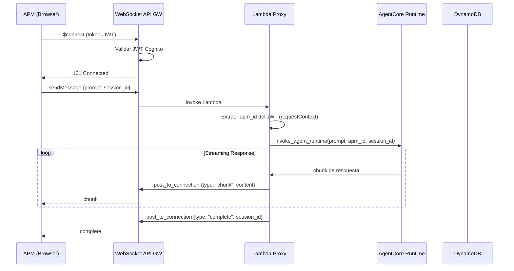
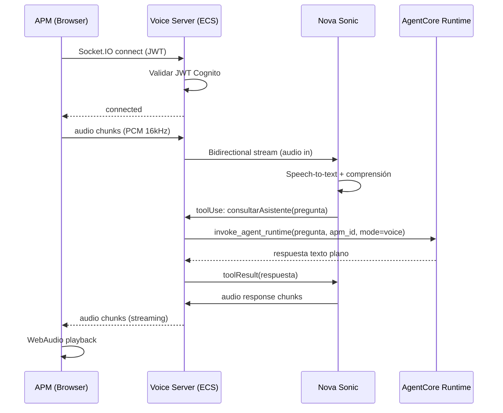
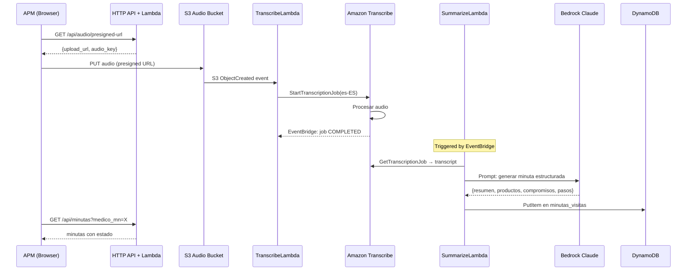

# Diseño Técnico — Migración Chat a AgentCore + Cognito Auth + Voice

## Resumen

Este documento describe el diseño técnico para migrar PharmAssist de su arquitectura actual (HTTP POST → Lambda → Strands Agent embebido) a una arquitectura de producción con:

1. **Cognito User Pool** para autenticación de APMs
2. **WebSocket API Gateway + Lambda Proxy** para chat streaming via AgentCore Runtime
3. **Nova Sonic voice-to-voice** con AgentCore como "super tool"
4. **Pipeline de notas de voz** (S3 → Transcribe → Bedrock → DynamoDB)
5. **Nuevos tools** (sugerir_proxima_visita, obtener_minutas_medico)

La migración preserva toda la funcionalidad existente del dashboard y agrega autenticación a todos los endpoints.

## Arquitectura

### Diagrama General



### Flujo de Chat (WebSocket + AgentCore)



### Flujo de Voz (Nova Sonic + AgentCore)



### Pipeline de Notas de Voz




## Componentes e Interfaces

### 1. Cognito User Pool (CDK)

```python
# En PharmAssistStack
from aws_cdk import aws_cognito as cognito

user_pool = cognito.UserPool(
    self, "PharmAssistUsers",
    user_pool_name="PharmAssistUsers",
    sign_in_aliases=cognito.SignInAliases(email=True),
    self_sign_up_enabled=False,  # Solo admin crea usuarios
    password_policy=cognito.PasswordPolicy(
        min_length=8,
        require_lowercase=True,
        require_uppercase=True,
        require_digits=True,
        require_symbols=False,
    ),
    custom_attributes={
        "apm_id": cognito.StringAttribute(mutable=True),
    },
    removal_policy=RemovalPolicy.DESTROY,
)

app_client = user_pool.add_client(
    "SPAClient",
    auth_flows=cognito.AuthFlow(
        user_password=True,   # USER_PASSWORD_AUTH
        user_srp=True,        # USER_SRP_AUTH
    ),
    generate_secret=False,  # SPA no usa client secret
)
```

**Usuario de demo** (creado via Custom Resource o post-deploy script):
- Email: `valentina@pharmassist.demo`
- Password: configurable via env var `DEMO_USER_PASSWORD`
- `custom:apm_id`: `"Valentina Pérez"`

### 2. Cognito Authorizer para HTTP API

```python
from aws_cdk import aws_apigatewayv2_authorizers as authorizers

cognito_authorizer = authorizers.HttpJwtAuthorizer(
    "CognitoAuthorizer",
    jwt_issuer=f"https://cognito-idp.{self.region}.amazonaws.com/{user_pool.user_pool_id}",
    jwt_audience=[app_client.user_pool_client_id],
)

# Aplicar a todas las rutas excepto /health
http_api.add_routes(
    path="/{proxy+}",
    methods=[apigwv2.HttpMethod.ANY],
    integration=integration,
    authorizer=cognito_authorizer,
)
# /health sin authorizer
http_api.add_routes(
    path="/health",
    methods=[apigwv2.HttpMethod.GET],
    integration=integration,
)
```

### 3. WebSocket API Gateway + Lambda Proxy (CDK)

```python
from aws_cdk import aws_apigatewayv2 as apigwv2
from aws_cdk import aws_apigatewayv2_integrations as ws_integrations

# Lambda Proxy — código mínimo, solo forwarding
ws_lambda = _lambda.Function(
    self, "WebSocketProxy",
    runtime=_lambda.Runtime.PYTHON_3_12,
    handler="ws_handler.handler",
    code=_lambda.Code.from_asset("../backend/ws_proxy"),
    timeout=Duration.seconds(120),
    memory_size=256,
    environment={
        "AGENTCORE_AGENT_ARN": os.environ.get("AGENTCORE_AGENT_ARN", ""),
        "AGENTCORE_REGION": os.environ.get("AGENTCORE_REGION", "us-east-1"),
        "USER_POOL_ID": user_pool.user_pool_id,
        "USER_POOL_REGION": self.region,
    },
)

# Permisos
ws_lambda.add_to_role_policy(iam.PolicyStatement(
    actions=["bedrock-agentcore:InvokeAgentRuntime"],
    resources=["*"],
))
ws_lambda.add_to_role_policy(iam.PolicyStatement(
    actions=["execute-api:ManageConnections"],
    resources=[f"arn:aws:execute-api:{self.region}:{self.account}:*/@connections/*"],
))

# WebSocket API
ws_api = apigwv2.WebSocketApi(
    self, "PharmAssistWS",
    connect_route_options=apigwv2.WebSocketRouteOptions(
        integration=ws_integrations.WebSocketLambdaIntegration("ConnectIntegration", ws_lambda),
        # NOTA: WebSocket API GW NO soporta Cognito JWT authorizer nativo.
        # La validación del JWT se hace dentro de la Lambda en $connect.
        # El token se pasa como query param: wss://...?token=<JWT>
    ),
    disconnect_route_options=apigwv2.WebSocketRouteOptions(
        integration=ws_integrations.WebSocketLambdaIntegration("DisconnectIntegration", ws_lambda),
    ),
)
ws_api.add_route(
    "sendMessage",
    integration=ws_integrations.WebSocketLambdaIntegration("SendMsgIntegration", ws_lambda),
)

ws_stage = apigwv2.WebSocketStage(
    self, "WSStage",
    web_socket_api=ws_api,
    stage_name="prod",
    auto_deploy=True,
)
```

### 4. Lambda Proxy — Código (`backend/ws_proxy/ws_handler.py`)

```python
"""Lambda Proxy para WebSocket → AgentCore. Código mínimo, solo forwarding."""
import json
import logging
import os
import boto3

logger = logging.getLogger()
logger.setLevel(logging.INFO)

AGENTCORE_ARN = os.environ["AGENTCORE_AGENT_ARN"]
AGENTCORE_REGION = os.environ.get("AGENTCORE_REGION", "us-east-1")

agentcore_client = boto3.client("bedrock-agentcore", region_name=AGENTCORE_REGION)


def handler(event, context):
    route = event.get("requestContext", {}).get("routeKey")
    connection_id = event["requestContext"]["connectionId"]
    domain = event["requestContext"]["domainName"]
    stage = event["requestContext"]["stage"]

    if route == "$connect":
        # WebSocket API GW NO soporta Cognito JWT authorizer nativo.
        # Validamos el JWT manualmente en la Lambda.
        token = event.get("queryStringParameters", {}).get("token", "")
        if not _validate_cognito_jwt(token):
            logger.warning(f"Invalid JWT on $connect: {connection_id}")
            return {"statusCode": 401}
        logger.info(f"Connected: {connection_id}")
        return {"statusCode": 200}

    if route == "$disconnect":
        logger.info(f"Disconnected: {connection_id}")
        return {"statusCode": 200}

    if route == "sendMessage":
        return _handle_message(event, connection_id, domain, stage)

    return {"statusCode": 400}


def _handle_message(event, connection_id, domain, stage):
    apigw = boto3.client("apigatewaymanagementapi",
                         endpoint_url=f"https://{domain}/{stage}")
    try:
        body = json.loads(event.get("body", "{}"))
        data = body.get("data", {})
        prompt = data.get("prompt", "")
        session_id = data.get("session_id", connection_id)

        # Extraer apm_id del JWT (inyectado por authorizer en requestContext)
        claims = event.get("requestContext", {}).get("authorizer", {})
        apm_id = claims.get("custom:apm_id", "")

        if not prompt:
            _post(apigw, connection_id, {"type": "error", "message": "Prompt vacío"})
            return {"statusCode": 400}

        # Invocar AgentCore
        payload = json.dumps({"prompt": prompt, "apm_id": apm_id}).encode()
        response = agentcore_client.invoke_agent_runtime(
            agentRuntimeArn=AGENTCORE_ARN,
            runtimeSessionId=session_id,
            payload=payload,
        )

        # Retransmitir respuesta
        content_type = response.get("contentType", "")
        full_response = ""

        if "text/event-stream" in content_type:
            for line in response["response"].iter_lines(chunk_size=10):
                if line:
                    decoded = line.decode("utf-8") if isinstance(line, bytes) else line
                    text = decoded[6:] if decoded.startswith("data: ") else decoded
                    full_response += text
                    _post(apigw, connection_id, {"type": "chunk", "content": text})
        else:
            # JSON response
            chunks = []
            for chunk in response.get("response", []):
                chunks.append(chunk.decode("utf-8") if isinstance(chunk, bytes) else chunk)
            body_json = json.loads("".join(chunks))
            full_response = body_json.get("result", str(body_json))
            _post(apigw, connection_id, {"type": "chunk", "content": full_response})

        _post(apigw, connection_id, {"type": "complete", "session_id": session_id})

        logger.info(json.dumps({
            "apm_id": apm_id,
            "session_id": session_id,
            "connection_id": connection_id,
            "prompt_length": len(prompt),
            "response_length": len(full_response),
        }))

        return {"statusCode": 200}

    except Exception as e:
        logger.error(f"Error: {e}", exc_info=True)
        try:
            _post(apigw, connection_id, {
                "type": "error",
                "message": "El asistente no está disponible en este momento."
            })
        except Exception:
            pass
        return {"statusCode": 500}


def _post(apigw, connection_id, data):
    apigw.post_to_connection(
        ConnectionId=connection_id,
        Data=json.dumps(data).encode(),
    )
```

### 5. Frontend — Servicio de Autenticación (`frontend/src/api/auth.ts`)

```typescript
import {
  CognitoIdentityProviderClient,
  InitiateAuthCommand,
  type InitiateAuthCommandOutput,
} from "@aws-sdk/client-cognito-identity-provider";

const REGION = import.meta.env.VITE_AWS_REGION ?? "us-east-1";
const USER_POOL_CLIENT_ID = import.meta.env.VITE_COGNITO_CLIENT_ID ?? "";

const cognitoClient = new CognitoIdentityProviderClient({ region: REGION });

export interface AuthTokens {
  idToken: string;
  accessToken: string;
  refreshToken: string;
  expiresIn: number;
}

export async function login(email: string, password: string): Promise<AuthTokens> {
  const command = new InitiateAuthCommand({
    AuthFlow: "USER_PASSWORD_AUTH",
    ClientId: USER_POOL_CLIENT_ID,
    AuthParameters: { USERNAME: email, PASSWORD: password },
  });
  const response: InitiateAuthCommandOutput = await cognitoClient.send(command);
  const result = response.AuthenticationResult!;
  return {
    idToken: result.IdToken!,
    accessToken: result.AccessToken!,
    refreshToken: result.RefreshToken!,
    expiresIn: result.ExpiresIn ?? 3600,
  };
}

export async function refreshSession(refreshToken: string): Promise<AuthTokens> {
  const command = new InitiateAuthCommand({
    AuthFlow: "REFRESH_TOKEN_AUTH",
    ClientId: USER_POOL_CLIENT_ID,
    AuthParameters: { REFRESH_TOKEN: refreshToken },
  });
  const response = await cognitoClient.send(command);
  const result = response.AuthenticationResult!;
  return {
    idToken: result.IdToken!,
    accessToken: result.AccessToken!,
    refreshToken: refreshToken, // refresh token no cambia
    expiresIn: result.ExpiresIn ?? 3600,
  };
}

export function parseJwt(token: string): Record<string, unknown> {
  const base64Url = token.split(".")[1];
  const base64 = base64Url.replace(/-/g, "+").replace(/_/g, "/");
  return JSON.parse(atob(base64));
}

export function getApmIdFromToken(idToken: string): string {
  const claims = parseJwt(idToken);
  return (claims["custom:apm_id"] as string) ?? "";
}
```

### 6. Frontend — Store de Auth (`frontend/src/stores/useAuthStore.ts`)

```typescript
import { create } from "zustand";
import { login, refreshSession, getApmIdFromToken, type AuthTokens } from "../api/auth";

interface AuthState {
  tokens: AuthTokens | null;
  apmId: string;
  isAuthenticated: boolean;
  isLoading: boolean;
  error: string | null;

  login: (email: string, password: string) => Promise<void>;
  logout: () => void;
  refresh: () => Promise<void>;
  getIdToken: () => string | null;
}

const useAuthStore = create<AuthState>((set, get) => ({
  tokens: null,
  apmId: "",
  isAuthenticated: false,
  isLoading: false,
  error: null,

  login: async (email, password) => {
    set({ isLoading: true, error: null });
    try {
      const tokens = await login(email, password);
      const apmId = getApmIdFromToken(tokens.idToken);
      set({ tokens, apmId, isAuthenticated: true });
    } catch (e) {
      set({ error: "Credenciales inválidas. Verificá tu email y contraseña." });
    } finally {
      set({ isLoading: false });
    }
  },

  logout: () => set({ tokens: null, apmId: "", isAuthenticated: false }),

  refresh: async () => {
    const { tokens } = get();
    if (!tokens?.refreshToken) return;
    try {
      const newTokens = await refreshSession(tokens.refreshToken);
      const apmId = getApmIdFromToken(newTokens.idToken);
      set({ tokens: newTokens, apmId });
    } catch {
      set({ tokens: null, apmId: "", isAuthenticated: false });
    }
  },

  getIdToken: () => get().tokens?.idToken ?? null,
}));

export default useAuthStore;
```

### 7. Frontend — WebSocket Chat Service (`frontend/src/api/websocket.ts`)

```typescript
const WS_URL = import.meta.env.VITE_WS_URL ?? "";

export type MessageType = "chunk" | "complete" | "error" | "tools";

export interface WSMessage {
  type: MessageType;
  content?: string;
  session_id?: string;
  message?: string;
  steps?: string[];
}

export type WSMessageHandler = (msg: WSMessage) => void;

export class ChatWebSocket {
  private ws: WebSocket | null = null;
  private reconnectAttempts = 0;
  private maxReconnects = 3;
  private baseDelay = 1000;
  private onMessage: WSMessageHandler;
  private onStatusChange: (connected: boolean) => void;
  private token: string;

  constructor(
    token: string,
    onMessage: WSMessageHandler,
    onStatusChange: (connected: boolean) => void,
  ) {
    this.token = token;
    this.onMessage = onMessage;
    this.onStatusChange = onStatusChange;
  }

  connect() {
    const url = `${WS_URL}?token=${encodeURIComponent(this.token)}`;
    this.ws = new WebSocket(url);

    this.ws.onopen = () => {
      this.reconnectAttempts = 0;
      this.onStatusChange(true);
    };

    this.ws.onmessage = (event) => {
      try {
        const msg: WSMessage = JSON.parse(event.data);
        this.onMessage(msg);
      } catch { /* ignore malformed */ }
    };

    this.ws.onclose = () => {
      this.onStatusChange(false);
      this._tryReconnect();
    };

    this.ws.onerror = () => {
      this.ws?.close();
    };
  }

  send(prompt: string, sessionId: string) {
    if (this.ws?.readyState !== WebSocket.OPEN) return;
    this.ws.send(JSON.stringify({
      action: "sendMessage",
      data: { prompt, session_id: sessionId },
    }));
  }

  disconnect() {
    this.maxReconnects = 0; // prevent reconnect
    this.ws?.close();
  }

  private _tryReconnect() {
    if (this.reconnectAttempts >= this.maxReconnects) return;
    this.reconnectAttempts++;
    const delay = this.baseDelay * Math.pow(2, this.reconnectAttempts - 1);
    setTimeout(() => this.connect(), delay);
  }
}
```

### 8. Voice Server — Node.js (ECS Fargate)

Basado en `aws-samples/sample-nova-sonic-mcp`, adaptado para PharmAssist.

```typescript
// voice-server/src/index.ts (esquema simplificado)
import { Server } from "socket.io";
import { createServer } from "http";
import { NovaSonicBidirectionalStream } from "./nova-sonic-client";
import { validateCognitoJwt } from "./auth";
import { invokeAgentCore } from "./agentcore-client";

const httpServer = createServer();
const io = new Server(httpServer, {
  cors: { origin: "*" },
});

// Middleware: validar JWT Cognito
io.use(async (socket, next) => {
  const token = socket.handshake.auth.token || socket.handshake.query.token;
  try {
    const claims = await validateCognitoJwt(token as string);
    socket.data.apmId = claims["custom:apm_id"];
    socket.data.token = token;
    next();
  } catch {
    next(new Error("Authentication failed"));
  }
});

io.on("connection", (socket) => {
  let novaSonic: NovaSonicBidirectionalStream | null = null;

  socket.on("startSession", async () => {
    novaSonic = new NovaSonicBidirectionalStream({
      region: "us-east-1",
      modelId: "amazon.nova-sonic-v1:0",
      // NOTA: Nova Sonic v1 tiene límite de conexión de 8 minutos.
      // El voice server debe manejar reconexión automática si la
      // conversación supera ese tiempo.
      systemPrompt: "Sos el asistente de voz de PharmAssist...",
      voiceId: "laura",  // voz femenina español
      tools: [{
        toolSpec: {
          name: "consultarAsistente",
          description: "Consulta al asistente PharmAssist para obtener datos de médicos, visitas, ventas y más.",
          inputSchema: {
            json: {
              type: "object",
              properties: {
                pregunta: { type: "string", description: "La pregunta del APM" }
              },
              required: ["pregunta"]
            }
          }
        }
      }],
      onToolUse: async (toolName, input) => {
        if (toolName === "consultarAsistente") {
          const result = await invokeAgentCore(
            input.pregunta,
            socket.data.apmId,
            "voice"  // mode flag
          );
          return result;
        }
        return "Tool no reconocido";
      },
      onAudioOutput: (audioChunk) => {
        socket.emit("audioOutput", audioChunk);
      },
      onStateChange: (state) => {
        // "listening" | "thinking" | "speaking"
        socket.emit("stateChange", state);
      },
    });
    await novaSonic.start();
  });

  socket.on("audioInput", (chunk: Buffer) => {
    novaSonic?.sendAudio(chunk);
  });

  socket.on("disconnect", () => {
    novaSonic?.close();
  });
});

httpServer.listen(3001);
```

### 9. Tool: `sugerir_proxima_visita`

```python
@tool
def sugerir_proxima_visita(apm_id: str) -> dict[str, Any]:
    """
    Sugiere los próximos médicos a visitar priorizados por urgencia.

    Combina: (a) días de SLA vencido, (b) productos con caída de ventas
    en la zona del médico, (c) visitas planificadas pendientes.
    Incluye contexto de la última minuta si existe.

    Args:
        apm_id: Identificador del APM.

    Returns:
        Top 5 médicos priorizados con motivo y productos recomendados.
    """
    # 1. Obtener médicos del APM con SLA vencido
    # 2. Obtener ventas declinando por zona
    # 3. Obtener visitas planificadas pendientes
    # 4. Obtener última minuta por médico (si existe)
    # 5. Calcular score: sla_weight * dias_vencido + ventas_weight * caida_pct
    # 6. Retornar top 5 con: nombre, especialidad, zona, dirección,
    #    motivo, productos_recomendados, resumen_ultima_minuta
```

### 10. Tool: `obtener_minutas_medico`

```python
@tool
def obtener_minutas_medico(medico_mn: int, apm_id: str) -> dict[str, Any]:
    """
    Obtiene las últimas minutas de visitas a un médico.

    Usa esta herramienta cuando el APM pide contexto de visitas previas,
    un brief con notas, o cuando sugerir_proxima_visita necesita contexto.

    Args:
        medico_mn: Matrícula Nacional del médico.
        apm_id: Identificador del APM.

    Returns:
        Últimas 3 minutas con fecha, resumen, productos, compromisos.
    """
    # Query minutas_visitas por Medico-Fecha-index
    # Filtrar por APM
    # Retornar últimas 3 ordenadas por fecha desc
```


## Modelos de Datos

### Protocolo WebSocket — Mensajes

**Cliente → Servidor:**
```json
{
  "action": "sendMessage",
  "data": {
    "prompt": "¿Cuáles son mis visitas de hoy?",
    "session_id": "uuid-v4"
  }
}
```

**Servidor → Cliente:**
```json
// Chunk parcial
{"type": "chunk", "content": "Tenés 4 visitas planificadas..."}

// Fin de respuesta
{"type": "complete", "session_id": "uuid-v4"}

// Herramientas usadas
{"type": "tools", "steps": ["Consultando agenda de hoy", "Enriqueciendo datos de médicos"]}

// Error
{"type": "error", "message": "El asistente no está disponible."}
```

### Protocolo Voice — Socket.IO Events

**Cliente → Servidor:**
| Evento | Payload | Descripción |
|--------|---------|-------------|
| `startSession` | `{}` | Inicia sesión Nova Sonic |
| `audioInput` | `Buffer (PCM 16kHz mono)` | Chunk de audio del micrófono |
| `endSession` | `{}` | Cierra sesión |

**Servidor → Cliente:**
| Evento | Payload | Descripción |
|--------|---------|-------------|
| `audioOutput` | `Buffer (PCM)` | Chunk de audio de respuesta |
| `stateChange` | `"listening" \| "thinking" \| "speaking"` | Estado de la conversación |
| `transcript` | `{role, text}` | Transcripción parcial (para debug/UI) |
| `error` | `{message}` | Error |

### AgentCore Payload — Mode Flag

```json
// Modo texto (default)
{
  "prompt": "Dame un brief del Dr. Herrera",
  "apm_id": "Valentina Pérez",
  "mode": "text"
}

// Modo voz (desde Nova Sonic via consultarAsistente)
{
  "prompt": "¿Cuáles son mis visitas de hoy?",
  "apm_id": "Valentina Pérez",
  "mode": "voice"
}
```

**Diferencias por modo:**

| Aspecto | `mode: "text"` | `mode: "voice"` |
|---------|----------------|-----------------|
| Formato | Markdown, tablas, listas | Texto plano, oraciones naturales |
| Web search | Habilitado | Deshabilitado |
| Longitud | Detallado | Conciso (2-3 oraciones) |
| Emojis/símbolos | Sin emojis | Sin emojis ni caracteres especiales |
| Datos tabulares | Tabla markdown | Resumen narrativo |

### Modelo de Minuta (DynamoDB — `minutas_visitas`)

| Campo | Tipo | Descripción |
|-------|------|-------------|
| `Minuta_ID` | String (PK) | UUID generado |
| `APM` | String | Nombre del APM |
| `Medico_MN` | Number | Matrícula del médico |
| `Fecha_Creacion` | String (ISO) | Timestamp de creación |
| `Transcripcion` | String | Texto transcrito del audio |
| `Resumen` | String | Resumen generado por IA |
| `Productos_Discutidos` | String | Pipe-separated (`"PAMOXET\|ALACIR"`) |
| `Compromisos` | String | Compromisos acordados |
| `Proximos_Pasos` | String | Próximos pasos |
| `Audio_S3_Key` | String | Key del audio en S3 (nuevo) |
| `Estado` | String | `"procesando" \| "listo" \| "error"` (nuevo) |

**GSIs existentes:** `APM-Fecha-index`, `Medico-Fecha-index`

### Modelo de Sugerencia de Visita (respuesta del tool)

```json
{
  "success": true,
  "message": "✅ Top 5 médicos sugeridos para visitar",
  "data": [
    {
      "medico_mn": 770487,
      "nombre": "Dr. Christian Kreutzer",
      "especialidad": "Cardiología",
      "zona": "Belgrano-R",
      "direccion": "Av. Cabildo 1234, Belgrano",
      "motivo": "SLA vencido hace 22 días. APSICO cayó -86% en su zona.",
      "productos_recomendados": ["APSICO", "PAMOXET"],
      "score": 108,
      "ultima_minuta": {
        "fecha": "2025-05-15",
        "resumen": "Discutimos eficacia de PAMOXET. Comprometido a probar en 3 pacientes.",
        "compromisos": "Enviar estudios clínicos de PAMOXET"
      }
    }
  ]
}
```

### Nuevos Recursos CDK (resumen)

| Recurso | Tipo | Descripción |
|---------|------|-------------|
| `PharmAssistUsers` | Cognito User Pool | Auth de APMs |
| `SPAClient` | Cognito App Client | Para frontend SPA |
| `CognitoAuthorizer` | HTTP JWT Authorizer | Protege HTTP API |
| `WebSocketProxy` | Lambda Function | Proxy WS → AgentCore |
| `PharmAssistWS` | WebSocket API | Chat streaming |
| `AudioUploadsBucket` | S3 Bucket | Audio uploads (30d lifecycle) |
| `TranscribeLambda` | Lambda Function | S3 trigger → Transcribe |
| `SummarizeLambda` | Lambda Function | Transcribe → Bedrock → DDB |
| `VoiceServerTask` | ECS Fargate Service | Node.js Nova Sonic server |
| `VoiceServerALB` | ALB | Load balancer para voice server |

### Nuevas Variables de Entorno

| Variable | Componente | Descripción |
|----------|-----------|-------------|
| `VITE_COGNITO_CLIENT_ID` | Frontend | Cognito App Client ID |
| `VITE_COGNITO_USER_POOL_ID` | Frontend | Cognito User Pool ID |
| `VITE_AWS_REGION` | Frontend | Región AWS |
| `VITE_WS_URL` | Frontend | WebSocket API URL |
| `VITE_VOICE_URL` | Frontend | Voice server URL |
| `USER_POOL_ID` | Lambda Proxy | Para validar JWT |
| `DEMO_USER_PASSWORD` | CDK deploy | Password del usuario demo |
| `AUDIO_BUCKET_NAME` | Lambdas de audio | Bucket de audio uploads |

### Stack Outputs Nuevos

```python
CfnOutput(self, "UserPoolId", value=user_pool.user_pool_id)
CfnOutput(self, "UserPoolClientId", value=app_client.user_pool_client_id)
CfnOutput(self, "WebSocketUrl", value=ws_stage.url)
CfnOutput(self, "AudioBucketName", value=audio_bucket.bucket_name)
CfnOutput(self, "VoiceServerUrl", value=voice_alb.load_balancer_dns_name)
```


## Propiedades de Correctitud

*Una propiedad es una característica o comportamiento que debe cumplirse en todas las ejecuciones válidas de un sistema — esencialmente, una declaración formal sobre lo que el sistema debe hacer. Las propiedades sirven como puente entre especificaciones legibles por humanos y garantías de correctitud verificables por máquinas.*

### Property 1: Extracción de apm_id desde JWT

*Para cualquier* JWT válido que contenga un claim `custom:apm_id` con un string arbitrario, la función `parseJwt` seguida de la extracción del claim debe retornar exactamente el mismo string que fue codificado.

**Validates: Requirements 1.8**

### Property 2: Formato de mensajes WebSocket (cliente → servidor)

*Para cualquier* mensaje de texto no vacío y cualquier session_id UUID válido, la función de formateo del frontend debe producir un JSON con estructura `{"action": "sendMessage", "data": {"prompt": <mensaje>, "session_id": <session_id>}}` donde prompt y session_id coinciden exactamente con los valores de entrada.

**Validates: Requirements 4.1, 5.1**

### Property 3: Lambda Proxy — parsing y forwarding

*Para cualquier* evento WebSocket válido con un body que contenga `prompt` y `session_id`, y un `requestContext` con claims JWT que incluyan `custom:apm_id`, la Lambda Proxy debe: (a) extraer correctamente los tres campos, y (b) invocar AgentCore con un payload que contenga exactamente el `prompt` y `apm_id` extraídos, usando el `session_id` como `runtimeSessionId`.

**Validates: Requirements 3.4, 3.6**

### Property 4: Protocolo de respuesta WebSocket — tipos válidos

*Para cualquier* respuesta generada por la Lambda Proxy hacia el cliente WebSocket, el campo `type` debe ser uno de: `"chunk"`, `"complete"`, `"error"`, `"tools"`. Además, mensajes de tipo `"chunk"` deben incluir `content`, tipo `"complete"` debe incluir `session_id`, tipo `"error"` debe incluir `message`, y tipo `"tools"` debe incluir `steps`.

**Validates: Requirements 5.2, 5.3, 5.4, 5.5, 5.6**

### Property 5: Acumulación de chunks produce texto completo

*Para cualquier* secuencia de mensajes tipo `"chunk"` recibidos por el frontend, la concatenación de todos los `content` debe producir exactamente el texto completo de la respuesta del agente.

**Validates: Requirements 4.3**

### Property 6: Aislamiento de datos por apm_id

*Para cualquier* apm_id y cualquier invocación de tools del agente (buscar_medicos_por_apm, obtener_visitas_planificadas_hoy, sugerir_proxima_visita, obtener_minutas_medico), todos los registros retornados deben pertenecer exclusivamente al APM identificado por ese apm_id.

**Validates: Requirements 6.4**

### Property 7: Mapeo de errores a mensajes en español

*Para cualquier* excepción o error retornado por AgentCore, la Lambda Proxy debe producir un mensaje WebSocket de tipo `"error"` con un `message` en español que no exponga detalles técnicos internos (sin stack traces, sin nombres de excepciones, sin ARNs).

**Validates: Requirements 10.2**

### Property 8: Respuesta parcial con sufijo de incompleto

*Para cualquier* secuencia de chunks recibidos seguida de una desconexión WebSocket (sin mensaje `"complete"`), el frontend debe appendear `"(respuesta incompleta)"` al texto acumulado.

**Validates: Requirements 10.6**

### Property 9: Ranking de sugerencia de visita — orden y límite

*Para cualquier* conjunto de médicos de un APM con datos de SLA, ventas y visitas planificadas, el tool `sugerir_proxima_visita` debe retornar como máximo 5 médicos, ordenados de mayor a menor prioridad (score descendente), donde cada resultado incluye: nombre, especialidad, zona, dirección, motivo y productos_recomendados.

**Validates: Requirements 12.2, 12.3, 12.4**

### Property 10: Inclusión de contexto de minutas en sugerencias

*Para cualquier* médico sugerido por `sugerir_proxima_visita` que tenga minutas previas en DynamoDB, la sugerencia debe incluir un campo `ultima_minuta` con resumen y compromisos. Para médicos sin minutas, el campo debe estar ausente o nulo.

**Validates: Requirements 12.6, 14.3**

### Property 11: Minutas ordenadas y limitadas a 3

*Para cualquier* médico con N minutas en DynamoDB (N >= 0), el tool `obtener_minutas_medico` debe retornar min(N, 3) minutas ordenadas por `Fecha_Creacion` descendente, cada una con los campos: fecha, resumen, productos_discutidos, compromisos.

**Validates: Requirements 14.4**

### Property 12: Payload de consultarAsistente incluye mode voice

*Para cualquier* pregunta transcrita por Nova Sonic y cualquier apm_id, el handler de `consultarAsistente` en el voice server debe invocar AgentCore con un payload que contenga exactamente `{"prompt": <pregunta>, "apm_id": <apm_id>, "mode": "voice"}`.

**Validates: Requirements 15.13, 15.18, 15.19**

### Property 13: Formato de respuesta en modo voz

*Para cualquier* respuesta del agente generada con `mode: "voice"`, el texto no debe contener: caracteres markdown (`#`, `**`, `|`, `-` como viñeta), tablas, emojis, ni listas con viñetas. Debe ser texto plano optimizado para ser hablado naturalmente.

**Validates: Requirements 15.15**


## Manejo de Errores

### Capa de Autenticación (Cognito)

| Error | Causa | Acción Frontend | Acción Backend |
|-------|-------|-----------------|----------------|
| `NotAuthorizedException` | Credenciales inválidas | Mostrar "Credenciales inválidas" en login | N/A |
| `UserNotFoundException` | Email no registrado | Mostrar "Usuario no encontrado" | N/A |
| Token expirado | JWT vencido | Refresh automático con refresh_token | HTTP 401 → frontend refresh |
| Refresh token expirado | Sesión larga | Redirect a login | N/A |
| `NewPasswordRequired` | Primer login | Mostrar formulario de cambio de password | N/A |

### Capa WebSocket

| Error | Causa | Acción Frontend | Acción Lambda Proxy |
|-------|-------|-----------------|---------------------|
| Conexión rechazada | JWT inválido en $connect | Mostrar "Sesión expirada. Recargá la página." | Log + return 401 |
| Desconexión inesperada | Red inestable | Reconectar (3 intentos, backoff exponencial) | Log disconnect |
| Reconexión fallida (3x) | Sin conectividad | Mostrar "Se perdió la conexión" + botón reconectar | N/A |
| Timeout 120s | AgentCore lento | Mostrar "El asistente está tardando" + liberar UI | Log warning con duración |
| AgentCore error | Error interno del agente | Mostrar "El asistente no está disponible" | Log error + enviar `{type: "error"}` |
| Desconexión durante respuesta | Red cortada mid-stream | Mostrar texto parcial + "(respuesta incompleta)" | N/A |
| Payload inválido | Mensaje malformado | Ignorar silenciosamente | Log + enviar `{type: "error"}` |

### Capa de Voz (Nova Sonic)

| Error | Causa | Acción Frontend | Acción Voice Server |
|-------|-------|-----------------|---------------------|
| Micrófono denegado | Permisos del browser | Mostrar "Necesitás permitir el micrófono" | N/A |
| Socket.IO desconexión | Red inestable | Mostrar "Conexión perdida" + cerrar overlay | Log + cleanup Nova Sonic session |
| Nova Sonic error | Error del modelo | Mostrar "El asistente de voz no está disponible" | Log + emit error event |
| consultarAsistente timeout | AgentCore lento | Nova Sonic maneja internamente | Log warning |
| Audio no soportado | Browser viejo | Ocultar botón de voz | N/A |

### Pipeline de Notas de Voz

| Error | Causa | Acción Frontend | Acción Backend |
|-------|-------|-----------------|----------------|
| Upload S3 falla | Presigned URL expirada | Mostrar "Error al subir audio. Intentá de nuevo." | N/A |
| Transcribe falla | Audio corrupto/corto | Mostrar "No se pudo transcribir" | Escribir estado "error" en DDB |
| Bedrock falla | Error de modelo | Mostrar "No se pudo generar resumen" | Guardar transcripción sin resumen |
| Grabación < 3s | Audio muy corto | Mostrar "Grabación muy corta" (ya implementado) | N/A |

### Principios Generales de Error Handling

1. **Nunca exponer errores técnicos al usuario** — siempre mensajes en español argentino amigables
2. **Degradación graceful** — si WebSocket falla, el chat HTTP fallback sigue disponible
3. **Errores de voz no afectan chat** — son experiencias independientes
4. **Errores de WebSocket no afectan dashboard** — las tarjetas usan HTTP independiente
5. **Logging estructurado** — todos los errores se loguean con `apm_id`, `session_id`, timestamp
6. **Retry automático** — WebSocket reconecta 3 veces; presigned URLs se regeneran

## Estrategia de Testing

### Enfoque Dual: Unit Tests + Property-Based Tests

La estrategia combina tests unitarios para casos específicos y edge cases con property-based tests para verificar propiedades universales.

### Property-Based Testing

**Librería**: `fast-check` (TypeScript/frontend), `hypothesis` (Python/backend)

**Configuración**: Mínimo 100 iteraciones por property test.

**Tag format**: `Feature: agentcore-chat-migration, Property {N}: {título}`

Cada propiedad del documento de diseño se implementa como un PBT:

| Property | Componente | Librería | Descripción |
|----------|-----------|----------|-------------|
| 1 | Frontend | fast-check | JWT apm_id extraction round-trip |
| 2 | Frontend | fast-check | WebSocket message format |
| 3 | Backend | hypothesis | Lambda Proxy parsing + forwarding |
| 4 | Backend | hypothesis | Response protocol type validation |
| 5 | Frontend | fast-check | Chunk accumulation |
| 6 | Backend | hypothesis | Data isolation by apm_id |
| 7 | Backend | hypothesis | Error mapping to Spanish |
| 8 | Frontend | fast-check | Partial response incomplete suffix |
| 9 | Backend | hypothesis | Visit suggestion ranking + limit |
| 10 | Backend | hypothesis | Minuta context inclusion |
| 11 | Backend | hypothesis | Minutas ordered, max 3 |
| 12 | Backend (Node) | fast-check | consultarAsistente payload format |
| 13 | Backend | hypothesis | Voice mode response formatting |

### Unit Tests (Example-Based)

| Área | Tests | Framework |
|------|-------|-----------|
| Auth flow | Login success/failure, token refresh, logout | vitest + MSW |
| WebSocket lifecycle | Connect, disconnect, reconnect (3x backoff) | vitest |
| Chat UI | Send disabled during loading, clear chat resets session | vitest + testing-library |
| Dashboard cards | Cards load independently of WebSocket | vitest |
| Lambda Proxy | Empty prompt rejection, missing apm_id | pytest |
| Voice UI | Mute toggle, state transitions | vitest |
| Audio recorder | Min duration validation (ya existe) | vitest |

### Integration Tests

| Área | Tests | Entorno |
|------|-------|---------|
| Cognito auth | Login → JWT → API call → 200 | AWS (post-deploy) |
| WebSocket E2E | Connect → send → receive chunks → complete | AWS (post-deploy) |
| Voice E2E | Socket.IO → audio → Nova Sonic → response | AWS (post-deploy) |
| Audio pipeline | Upload → Transcribe → Summarize → DDB | AWS (post-deploy) |
| Dashboard regression | All endpoints return same shape with JWT | AWS (post-deploy) |

### CDK Assertion Tests

```python
# infrastructure/tests/test_pharmassist_stack.py
from aws_cdk.assertions import Template

def test_cognito_user_pool_created(template: Template):
    template.has_resource_properties("AWS::Cognito::UserPool", {
        "UserPoolName": "PharmAssistUsers",
    })

def test_websocket_api_created(template: Template):
    template.resource_count_is("AWS::ApiGatewayV2::Api", 2)  # HTTP + WS

def test_lambda_proxy_timeout(template: Template):
    template.has_resource_properties("AWS::Lambda::Function", {
        "Timeout": 120,
        "Runtime": "python3.12",
    })

def test_audio_bucket_lifecycle(template: Template):
    template.has_resource_properties("AWS::S3::Bucket", {
        "LifecycleConfiguration": {
            "Rules": [{"ExpirationInDays": 30, "Status": "Enabled"}]
        }
    })

def test_stack_outputs(template: Template):
    template.has_output("UserPoolId", {})
    template.has_output("UserPoolClientId", {})
    template.has_output("WebSocketUrl", {})
```

### Cobertura por Requerimiento

| Req | Unit | PBT | Integration | CDK |
|-----|------|-----|-------------|-----|
| 1 (Cognito) | Login flow | P1 (JWT parse) | Auth E2E | User Pool, App Client |
| 2 (HTTP Auth) | Interceptor | — | Endpoints + JWT | Authorizer |
| 3 (WebSocket) | — | P3, P4 | WS E2E | WS API, Lambda |
| 4 (Chat FE) | Reconnect, UI states | P2, P5 | — | — |
| 5 (Protocolo) | — | P4 | — | — |
| 6 (Identity) | — | P6 | SSO flow | — |
| 7 (Preservación) | — | — | Regression | No breaking changes |
| 8 (Observabilidad) | Log format | — | CloudWatch | — |
| 9 (Sesiones) | Session lifecycle | — | STM memory | — |
| 10 (Errores) | Error messages | P7, P8 | — | — |
| 11 (CDK) | — | — | — | All resources |
| 12 (Sugerencia) | — | P9, P10 | Tool E2E | — |
| 13 (Audio) | Recorder | — | Pipeline E2E | Bucket, Lambdas |
| 14 (Minutas) | — | P11 | Brief + minutas | — |
| 15 (Voz) | UI states, mute | P12, P13 | Voice E2E | ECS, ALB |
