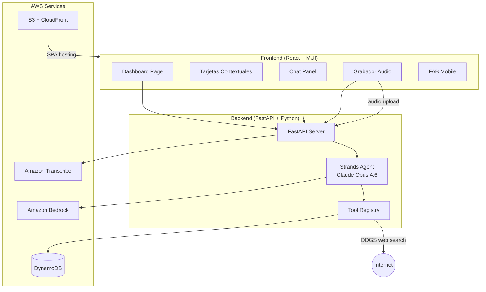
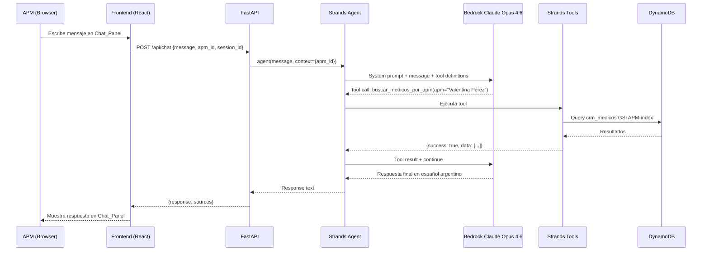
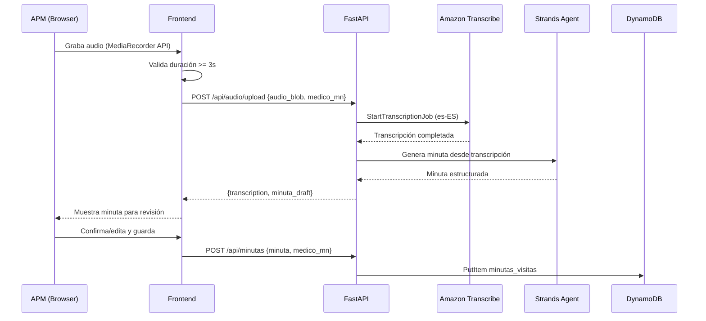
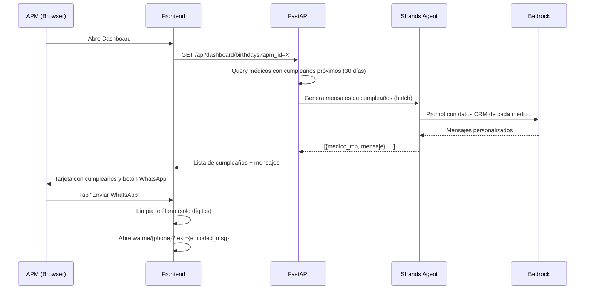

# Design Document — Asistente APM (PharmAssist)

## Overview

PharmAssist es una webapp mobile-first que funciona como "Single Pane of Glass" para APMs de Megalabs Argentina. La aplicación combina un dashboard con tarjetas contextuales (visitas del día, cumpleaños, alertas SLA) y un chat conversacional respaldado por un agente Strands con Amazon Bedrock (Claude Opus 4.6).

### Decisión Arquitectónica: Single Agent con Tools vs Multi-Agent

Se evaluaron dos enfoques:

| Criterio | Single Agent + Tools | Multi-Agent (Coordinador + Especialistas) |
|----------|---------------------|------------------------------------------|
| Latencia | Menor — 1 sola invocación LLM | Mayor — N invocaciones LLM en cadena |
| Complejidad | Baja — 1 system prompt, N tools | Alta — N system prompts, routing logic |
| Confiabilidad demo | Alta — menos puntos de falla | Media — fallas en routing o delegación |
| Costo Bedrock | Menor — 1 llamada por query | Mayor — múltiples llamadas por query |
| Escalabilidad | Media — system prompt crece | Alta — cada agente es independiente |
| Wow-factor demo | Igual — el usuario no ve la arquitectura interna | Igual |

**Decisión: Single Agent con Tools especializados.**

Para un prototipo de demo, un solo agente Strands con tools dedicados por dominio (CRM, visitas, ventas, web search, generación IA) ofrece menor latencia, mayor confiabilidad y menor complejidad. El LLM (Claude Opus 4.6) es suficientemente capaz para seleccionar el tool correcto basándose en docstrings descriptivos. Si en el futuro el system prompt supera ~2000 palabras o se agregan dominios nuevos, se puede migrar a multi-agent sin cambiar los tools.

### Stack Tecnológico

- **Frontend**: React 18 + TypeScript, Material UI v6, Vite, Zustand, React Router v7
- **Backend**: Python 3.12+, FastAPI (API REST), Strands Agents SDK
- **LLM**: Amazon Bedrock — Claude Opus 4.6 (`anthropic.claude-opus-4-6-20250514-v1:0`)
- **Database**: Amazon DynamoDB (5 tablas)
- **Web Search**: DDGS (Dux Distributed Global Search) — metabuscador open source, sin API key, sin costo
- **Transcripción**: Amazon Transcribe (es-ES)
- **IaC**: AWS CDK (Python)
- **Deploy agente**: Amazon Bedrock AgentCore
- **CDN**: CloudFront + S3 para frontend SPA

### Decisión: Web Search con DDGS (ex duckduckgo-search)

Se evaluaron opciones para la búsqueda de información pública de médicos (Brief de Médico):

| Opción | Costo | API Key | Confiabilidad | Latencia |
|--------|-------|---------|---------------|----------|
| DDGS (`pip install ddgs`) | Gratis | No requiere | Alta — múltiples backends (Google, Bing, DuckDuckGo, Brave) | ~1-2s |
| Google Custom Search API | Gratis hasta 100 queries/día | Sí | Alta | ~0.5s |
| Strands `http_request` + scraping | Gratis | No | Baja — depende de estructura HTML | Variable |
| Strands `browser` (Chromium) | Gratis | No | Media | ~5-10s (pesado) |

**Decisión: DDGS** — Librería open source ([github.com/deedy5/ddgs](https://github.com/deedy5/duckduckgo_search)) que agrega resultados de múltiples motores de búsqueda. Cero configuración, sin API keys, sin límites duros para un prototipo. Incluye `text()` para búsqueda web y `extract()` para extraer contenido de URLs en formato Markdown.

**Instalación**: `pip install -U ddgs`

**Uso en el tool de búsqueda**:
```python
from ddgs import DDGS

# Buscar info pública del médico
results = DDGS().text(
    f"Dr. {nombre} {apellido} {especialidad} {hospital} Argentina",
    region="ar-es",
    max_results=5
)

# Extraer contenido de las URLs más relevantes
for r in results[:3]:
    content = DDGS().extract(r["href"], fmt="text_markdown")
```

## Architecture

### Diagrama de Arquitectura General



### Diagrama de Flujo del Agente (Query del APM)



### Diagrama de Flujo: Nota de Voz → Minuta



### Diagrama de Flujo: Cumpleaños → WhatsApp




## Components and Interfaces

### Frontend Components

```
DashboardPage
├── TarjetaVisitasHoy          — Lista de visitas planificadas para hoy
│   └── VisitaCard             — Card individual con médico, dirección, productos
├── TarjetaCumpleaños          — Cumpleaños próximos (30 días)
│   └── CumpleañosCard         — Card con nombre, fecha, botón WhatsApp
├── TarjetaAlertasSLA          — Médicos con SLA vencido
│   └── AlertaSLACard          — Card con médico, días vencidos, cadencia
├── ChatPanel                  — Panel de chat conversacional
│   ├── MessageList            — Lista de mensajes (APM + Asistente)
│   ├── MessageInput           — Input de texto + botón enviar
│   └── LoadingIndicator       — Indicador de carga mientras responde
├── GrabadorAudio              — Componente de grabación de voz
│   ├── RecordButton           — Botón grabar/parar
│   ├── AudioPreview           — Preview del audio grabado
│   └── MinutaPreview          — Preview de la minuta generada
└── FABChat                    — Floating Action Button (solo mobile)
```

### Backend API Endpoints

| Method | Endpoint | Description | Request | Response |
|--------|----------|-------------|---------|----------|
| POST | `/api/chat` | Envía mensaje al agente | `{message, apm_id, session_id}` | `{response, sources[]}` |
| GET | `/api/dashboard/visits-today` | Visitas planificadas hoy | `?apm_id=X` | `{visits[]}` |
| GET | `/api/dashboard/birthdays` | Cumpleaños próximos 30d | `?apm_id=X` | `{birthdays[], messages[]}` |
| GET | `/api/dashboard/sla-alerts` | Alertas SLA vencidas | `?apm_id=X` | `{alerts[]}` |
| POST | `/api/audio/upload` | Sube audio para transcripción | `multipart: audio_file, medico_mn` | `{transcription, minuta_draft}` |
| POST | `/api/minutas` | Guarda minuta de visita | `{medico_mn, apm_id, minuta}` | `{minuta_id}` |
| GET | `/api/minutas` | Lista minutas del APM | `?apm_id=X&medico_mn=Y` | `{minutas[]}` |

### Strands Agent Architecture

```python
# Single agent con tools especializados
agent = Agent(
    model=BedrockModel(
        model_id="anthropic.claude-opus-4-6-20250514-v1:0",
        region_name="us-east-1",
        temperature=0.3,
        max_tokens=4096,
    ),
    tools=[
        # CRM Tools
        buscar_medico_por_nombre,
        buscar_medicos_por_zona,
        buscar_medicos_por_apm,
        obtener_perfil_medico,
        # Visitas Tools
        obtener_visitas_por_medico,
        obtener_visitas_planificadas_hoy,
        obtener_historial_visitas_apm,
        # Ventas Tools
        obtener_ventas_por_zona,
        obtener_ventas_declinando,
        obtener_ventas_por_producto,
        # Generación Tools
        generar_brief_medico,
        generar_mensaje_cumpleanos,
        # Web Search (DDGS — sin API key, sin costo)
        buscar_info_publica_medico,
    ],
    system_prompt=SYSTEM_PROMPT_APM_ASSISTANT,
)
```

### Strands Tools por Dominio

**CRM/Médicos Tools** (`backend/tools/medicos_tools.py`):
- `buscar_medico_por_nombre(nombre: str, apm_id: str)` — Busca médico por nombre, filtrado por APM
- `buscar_medicos_por_zona(zona: str, apm_id: str)` — Lista médicos de una zona del APM
- `buscar_medicos_por_apm(apm_id: str)` — Lista todos los médicos del APM
- `obtener_perfil_medico(medico_mn: int, apm_id: str)` — Perfil completo de un médico

**Visitas Tools** (`backend/tools/visitas_tools.py`):
- `obtener_visitas_por_medico(medico_mn: int, apm_id: str)` — Historial de visitas a un médico
- `obtener_visitas_planificadas_hoy(apm_id: str)` — Visitas planificadas para hoy
- `obtener_historial_visitas_apm(apm_id: str, fecha_desde: str, fecha_hasta: str)` — Historial por rango

**Ventas Tools** (`backend/tools/ventas_tools.py`):
- `obtener_ventas_por_zona(zona: str, anio: int, mes: int)` — Ventas de una zona
- `obtener_ventas_declinando(zonas: list[str])` — Productos con YoY negativo en zonas
- `obtener_ventas_por_producto(producto: str, zona: str)` — Detalle de ventas de un producto

**Generación Tools** (`backend/tools/generacion_tools.py`):
- `generar_brief_medico(medico_mn: int, apm_id: str)` — Brief combinando CRM + web + visitas
- `generar_mensaje_cumpleanos(medico_mn: int)` — Mensaje personalizado de cumpleaños

**Web Search Tools** (`backend/tools/web_search_tools.py`):
- `buscar_info_publica_medico(nombre: str, apellido: str, especialidad: str, hospital: str)` — Busca info pública del médico usando DDGS (metabuscador). Combina `DDGS().text()` para buscar y `DDGS().extract()` para extraer contenido de las URLs más relevantes en formato Markdown. Sin API key, sin costo.

**Implementación del Web Search Tool**:
```python
from strands import tool
from ddgs import DDGS

@tool
def buscar_info_publica_medico(
    nombre: str,
    apellido: str,
    especialidad: str,
    hospital: str = ""
) -> dict:
    """
    Busca información pública de un médico en internet.
    Usa DDGS (metabuscador) para encontrar publicaciones,
    afiliaciones hospitalarias y logros profesionales.

    Args:
        nombre: Nombre del médico
        apellido: Apellido del médico
        especialidad: Especialidad médica
        hospital: Hospital donde trabaja (opcional)

    Returns:
        {success: bool, message: str, data: {search_results, extracted_content}}
    """
    try:
        query = f"Dr. {nombre} {apellido} {especialidad}"
        if hospital:
            query += f" {hospital}"
        query += " Argentina"

        ddgs = DDGS()
        search_results = ddgs.text(query, region="ar-es", max_results=5)

        extracted = []
        for result in search_results[:3]:
            try:
                content = ddgs.extract(result["href"], fmt="text_markdown")
                extracted.append({
                    "title": result.get("title", ""),
                    "url": result["href"],
                    "snippet": result.get("body", ""),
                    "content": content.get("content", "")[:2000]  # Limitar tamaño
                })
            except Exception:
                extracted.append({
                    "title": result.get("title", ""),
                    "url": result["href"],
                    "snippet": result.get("body", ""),
                })

        return {
            "success": True,
            "message": f"✅ Se encontraron {len(search_results)} resultados para Dr. {nombre} {apellido}",
            "data": {"search_results": search_results, "extracted_content": extracted}
        }
    except Exception as e:
        return {
            "success": False,
            "message": f"⚠️ No se pudo buscar información pública: {str(e)}. Se generará el brief solo con datos internos."
        }
```


## Data Models

### DynamoDB Tables

#### Table 1: `crm_medicos`

Stores doctor CRM data. ~500 records.

| Attribute | Type | Key | Description |
|-----------|------|-----|-------------|
| Medico_MN | N | PK | Matrícula Nacional (unique ID) |
| APM | S | GSI1-PK | APM asignado |
| Zona | S | GSI2-PK | Zona geográfica |
| Nombre | S | | Nombre del médico |
| Apellido | S | | Apellido del médico |
| Mail | S | | Email |
| Telefono_Consultorio | S | | Teléfono consultorio |
| Telefono_Celular | S | | Celular (formato +54 9 11 XXXX-XXXX) |
| Especialidad_Medica | S | | Especialidad |
| Calle | S | | Calle de consultorio |
| Altura | S | | Número de calle |
| Barrio | S | | Barrio |
| Fecha_Ultima_Visita | S | | ISO date o vacío |
| Fecha_Nacimiento | S | | ISO date (YYYY-MM-DD) |
| Hobby_Intereses | S | | Hobbies separados por coma |
| Religion | S | | Religión |
| Cadencia | S | | Mensual/Trimestral/Semestral/Anual/Digital |
| Hospital | S | | Hospital donde trabaja |
| Facultad | S | | Facultad de egreso |
| Anio_Egresado | N | | Año de egreso |
| Latitud | N | | Coordenada lat |
| Longitud | N | | Coordenada lon |

**GSI1** (APM-index): PK=`APM` — Query all doctors for an APM
**GSI2** (Zona-index): PK=`Zona` — Query all doctors in a zone

#### Table 2: `apm_visitas`

Historical visit records. ~2500 records.

| Attribute | Type | Key | Description |
|-----------|------|-----|-------------|
| Visita_ID | N | PK | ID único de visita |
| APM | S | GSI1-PK | APM que realizó la visita |
| Medico_MN | N | GSI2-PK | Médico visitado |
| Fecha_Visita | S | GSI1-SK, GSI2-SK | ISO date |
| Zona | S | | Zona de la visita |
| Tipo_Visita | S | | Presencial/Virtual/Telefónica |
| Productos_Presentados | S | | Productos separados por `\|` |
| Notas | S | | Notas de la visita |

**GSI1** (APM-Fecha-index): PK=`APM`, SK=`Fecha_Visita` — Query visits by APM + date range
**GSI2** (Medico-Fecha-index): PK=`Medico_MN`, SK=`Fecha_Visita` — Query visits by doctor + date range

#### Table 3: `ventas_reportadas`

Sales data by zone/product/month. ~6000 records.

| Attribute | Type | Key | Description |
|-----------|------|-----|-------------|
| Zona_Producto | S | PK | Composite: `{Zona}#{Producto}` |
| Anio_Mes | S | SK | Sort key: `{Anio}#{Mes:02d}` |
| Zona | S | GSI1-PK | Zona geográfica |
| Producto | S | | Nombre del producto |
| Presentacion | S | | Presentación farmacéutica |
| Tipo_OTC_RX | S | | OTC o RX |
| Unidades_Vendidas | N | | Unidades vendidas |
| Valor_Venta_ARS | N | | Valor en pesos argentinos |
| Crecimiento_YoY_Pct | N | | % crecimiento interanual (puede ser null) |
| Farmacia | S | | Farmacia que reportó |

**GSI1** (Zona-index): PK=`Zona`, SK=`Anio_Mes` — Query sales by zone + period

#### Table 4: `visitas_planificadas`

Auto-generated planned visits calendar.

| Attribute | Type | Key | Description |
|-----------|------|-----|-------------|
| APM_Fecha | S | PK | Composite: `{APM}#{Fecha_Planificada}` |
| Medico_MN | N | SK | Médico a visitar |
| APM | S | GSI1-PK | APM asignado |
| Fecha_Planificada | S | GSI1-SK | ISO date planificada |
| Zona | S | | Zona del médico |
| Tipo_Visita | S | | Presencial/Virtual/Telefónica |
| Productos_Sugeridos | S | | Productos sugeridos por especialidad, separados por `\|` |

**GSI1** (APM-Fecha-index): PK=`APM`, SK=`Fecha_Planificada` — Query planned visits by APM + date

#### Table 5: `minutas_visitas`

AI-generated visit summaries from voice notes.

| Attribute | Type | Key | Description |
|-----------|------|-----|-------------|
| Minuta_ID | S | PK | UUID |
| APM | S | GSI1-PK | APM que generó la minuta |
| Medico_MN | N | GSI2-PK | Médico asociado |
| Fecha_Creacion | S | GSI1-SK, GSI2-SK | ISO datetime de creación |
| Transcripcion | S | | Texto transcrito del audio |
| Resumen | S | | Párrafo resumen generado por IA |
| Productos_Discutidos | S | | Productos mencionados, separados por `\|` |
| Compromisos | S | | Compromisos acordados |
| Proximos_Pasos | S | | Próximos pasos |

**GSI1** (APM-Fecha-index): PK=`APM`, SK=`Fecha_Creacion` — Query minutas by APM
**GSI2** (Medico-Fecha-index): PK=`Medico_MN`, SK=`Fecha_Creacion` — Query minutas by doctor

### Pydantic Models (Backend)

```python
from pydantic import BaseModel
from datetime import date, datetime
from typing import Optional

class Medico(BaseModel):
    medico_mn: int
    nombre: str
    apellido: str
    especialidad_medica: str
    zona: str
    apm: str
    cadencia: str  # Mensual|Trimestral|Semestral|Anual|Digital
    fecha_nacimiento: Optional[date] = None
    fecha_ultima_visita: Optional[date] = None
    telefono_celular: Optional[str] = None
    telefono_consultorio: Optional[str] = None
    mail: Optional[str] = None
    hobby_intereses: Optional[str] = None
    religion: Optional[str] = None
    hospital: Optional[str] = None
    facultad: Optional[str] = None
    anio_egresado: Optional[int] = None
    calle: Optional[str] = None
    altura: Optional[str] = None
    barrio: Optional[str] = None
    latitud: Optional[float] = None
    longitud: Optional[float] = None

class Visita(BaseModel):
    visita_id: int
    apm: str
    medico_mn: int
    fecha_visita: date
    zona: str
    tipo_visita: str  # Presencial|Virtual|Telefónica
    productos_presentados: list[str]
    notas: Optional[str] = None

class VentaReportada(BaseModel):
    zona: str
    producto: str
    presentacion: str
    tipo_otc_rx: str
    anio: int
    mes: int
    unidades_vendidas: int
    valor_venta_ars: float
    crecimiento_yoy_pct: Optional[float] = None
    farmacia: Optional[str] = None

class VisitaPlanificada(BaseModel):
    apm: str
    medico_mn: int
    fecha_planificada: date
    zona: str
    tipo_visita: str
    productos_sugeridos: list[str]

class MinutaVisita(BaseModel):
    minuta_id: str
    apm: str
    medico_mn: int
    fecha_creacion: datetime
    transcripcion: str
    resumen: str
    productos_discutidos: list[str]
    compromisos: Optional[str] = None
    proximos_pasos: Optional[str] = None

class ChatRequest(BaseModel):
    message: str
    apm_id: str
    session_id: Optional[str] = None

class ChatResponse(BaseModel):
    response: str
    sources: list[str] = []
    session_id: str
```

### TypeScript Types (Frontend)

```typescript
interface Medico {
  medico_mn: number;
  nombre: string;
  apellido: string;
  especialidad_medica: string;
  zona: string;
  apm: string;
  cadencia: 'Mensual' | 'Trimestral' | 'Semestral' | 'Anual' | 'Digital';
  fecha_nacimiento?: string;
  fecha_ultima_visita?: string;
  telefono_celular?: string;
  calle?: string;
  altura?: string;
  barrio?: string;
  latitud?: number;
  longitud?: number;
  hobby_intereses?: string;
  religion?: string;
  hospital?: string;
  facultad?: string;
}

interface VisitaPlanificada {
  apm: string;
  medico_mn: number;
  fecha_planificada: string;
  zona: string;
  tipo_visita: 'Presencial' | 'Virtual' | 'Telefónica';
  productos_sugeridos: string[];
  medico?: Medico; // enriched from CRM
}

interface CumpleañosEntry {
  medico: Medico;
  dias_hasta: number;
  mensaje_cumpleanos?: string;
}

interface AlertaSLA {
  medico: Medico;
  cadencia: string;
  fecha_ultima_visita?: string;
  dias_vencido: number;
}

interface ChatMessage {
  id: string;
  role: 'user' | 'assistant';
  content: string;
  timestamp: string;
  sources?: string[];
}

interface MinutaVisita {
  minuta_id: string;
  medico_mn: number;
  fecha_creacion: string;
  transcripcion: string;
  resumen: string;
  productos_discutidos: string[];
  compromisos?: string;
  proximos_pasos?: string;
}
```

### Specialty → Product Mapping (Reference Data)

Stored as a Python dict in `backend/data/product_catalog.py`:

```python
ESPECIALIDAD_PRODUCTOS: dict[str, list[str]] = {
    "Gastroenterología": ["ALACIR", "CIRUELAX MINITABS"],
    "Psiquiatría": ["APSICO", "PAMOXET"],
    "Dermatología": ["PANCUTAN NF", "TRIMACREM PLUS", "MENCOGRIN AP", "SUTRICO TAR", "TRICOPLUS"],
    "Ginecología": ["TRICOFIN", "TANVIMIL ACD"],
    "Clínica Médica": ["TANDIUR", "TIOCTAN", "CO-TIOCTAN", "TANVIMIL B1 B6 B12"],
    "Endocrinología": ["TIOCTAN", "CO-TIOCTAN", "TANVIMIL AMINOÁCIDOS"],
    "Neurología": ["APSICO", "PAMOXET", "ONEFIN"],
    "Urología": ["ONEFIN", "TACNA"],
    "Pediatría": ["TANVIMIL ACD", "TANVIMIL ACD FLUOR", "AEROGAL"],
    "Nutrición": ["TANVIMIL AMINOÁCIDOS", "TANVIMIL PLUS", "TANVIMIL B1 B6 B12"],
    "Infectología": ["TRICOFIN", "TACNA"],
    "Traumatología": ["TIOCTAN", "TANVIMIL B1 B6 B12"],
}

CADENCIA_DIAS: dict[str, int] = {
    "Mensual": 30,
    "Trimestral": 90,
    "Semestral": 180,
    "Anual": 365,
    "Digital": 60,
}
```

### CSV → DynamoDB Loading Pipeline

A Python script (`backend/data/loader.py`) handles data ingestion:

1. **Parse CSVs** with pandas: `crm_medicos.csv`, `apm_visitas.csv`, `ventas_reportadas.csv`
2. **Transform** to DynamoDB item format (composite keys, type conversions)
3. **Batch write** to DynamoDB tables using `boto3` `batch_write_item`
4. **Generate `visitas_planificadas`** from CRM cadence data:
   - For each médico, calculate visit frequency from `Cadencia`
   - Distribute across working days (Mon-Fri) targeting 3-5 visits/day per APM
   - Set `Tipo_Visita` = "Virtual"/"Telefónica" for `Cadencia == "Digital"`
   - Populate `Productos_Sugeridos` from `ESPECIALIDAD_PRODUCTOS` mapping


## Correctness Properties

*A property is a characteristic or behavior that should hold true across all valid executions of a system — essentially, a formal statement about what the system should do. Properties serve as the bridge between human-readable specifications and machine-verifiable correctness guarantees.*

### Property 1: Visit filtering by APM and date

*For any* APM identifier and any date, querying planned visits SHALL return only visits where both the APM field matches the requesting APM and the Fecha_Planificada matches the requested date. No visits belonging to other APMs or other dates shall be included.

**Validates: Requirements 1.1**

### Property 2: Digital cadencia excludes presencial visits

*For any* médico with Cadencia = "Digital", all generated Visitas_Planificadas for that médico SHALL have Tipo_Visita in {"Virtual", "Telefónica"} and never "Presencial".

**Validates: Requirements 1.5, 9.4**

### Property 3: Visit distribution within daily bounds

*For any* APM and any working day (Monday–Friday) in the generated schedule, the number of Visitas_Planificadas SHALL be between 3 and 5 inclusive.

**Validates: Requirements 1.6, 9.2**

### Property 4: Google Maps URL construction

*For any* valid latitude and longitude pair, the generated Google Maps URL SHALL match the format `https://www.google.com/maps/search/?api=1&query={lat},{lon}` where lat and lon are the original coordinate values.

**Validates: Requirements 1.3**

### Property 5: Declining sales filtering and sorting

*For any* set of sales records and a set of zones, the declining sales function SHALL return only records where Crecimiento_YoY_Pct is negative, and the results SHALL be sorted by Crecimiento_YoY_Pct ascending (most severe decline first).

**Validates: Requirements 2.2**

### Property 6: APM zone extraction

*For any* APM, the set of assigned zones SHALL equal the distinct set of Zona values from all médicos in the CRM whose APM field matches the requesting APM.

**Validates: Requirements 2.4**

### Property 7: Audio duration validation

*For any* audio recording duration, recordings with duration less than 3 seconds SHALL be rejected, and recordings with duration >= 3 seconds SHALL be accepted.

**Validates: Requirements 3.7**

### Property 8: Birthday filtering and proximity sorting

*For any* set of médicos and any reference date, the birthday function SHALL return only médicos whose Fecha_Nacimiento (month and day) falls within the next 30 calendar days from the reference date, and the results SHALL be sorted by days until birthday ascending (nearest first).

**Validates: Requirements 4.1, 4.3**

### Property 9: Phone number cleaning

*For any* phone string in CRM format (containing digits, spaces, dashes, plus signs), the cleaning function SHALL produce a string containing only digit characters, and the digit sequence SHALL be preserved in order.

**Validates: Requirements 4.9**

### Property 10: WhatsApp deep link construction

*For any* cleaned phone number (digits only) and any message string, the generated URL SHALL match the format `https://wa.me/{phone}?text={encoded_message}` where encoded_message is the URL-encoded version of the original message. Decoding the URL parameter SHALL recover the original message.

**Validates: Requirements 4.10**

### Property 11: Visit history summary aggregation

*For any* set of visits for a médico, the summary SHALL correctly report: total visit count equal to the number of visits, last visit date equal to the maximum Fecha_Visita, products previously presented equal to the distinct union of all Productos_Presentados, and visit type distribution counts matching the actual counts per Tipo_Visita.

**Validates: Requirements 5.5**

### Property 12: APM data isolation

*For any* data query (médicos, visitas, ventas, alertas) and any APM identifier, the returned results SHALL contain only records associated with the requesting APM. No records belonging to other APMs shall be included. Sensitive fields (Telefono_Consultorio, Telefono_Celular, Mail) SHALL only be present for médicos assigned to the requesting APM.

**Validates: Requirements 5.8, 7.7, 10.1, 10.2**

### Property 13: SLA breach calculation and sorting

*For any* médico with a Cadencia and a Fecha_Ultima_Visita (or null), the SLA breach function SHALL correctly identify a breach when the days since last visit exceeds the cadencia interval (Mensual=30, Trimestral=90, Semestral=180, Anual=365, Digital=60). Médicos with null Fecha_Ultima_Visita SHALL always be flagged as breached. Results SHALL be sorted by days overdue descending.

**Validates: Requirements 6.1, 6.2, 6.4, 6.6**

### Property 14: Visit generation cadencia frequency

*For any* médico with a given Cadencia, the visit generation algorithm SHALL produce the correct number of visits per period: Mensual = 1/month, Trimestral = 1/3 months, Semestral = 1/6 months, Anual = 1/year, Digital = 1/2 months.

**Validates: Requirements 9.1**

### Property 15: Generated visit completeness and APM assignment

*For any* generated Visita_Planificada, all required fields (APM, Medico_MN, Fecha_Planificada, Zona, Tipo_Visita, Productos_Sugeridos) SHALL be non-null, and the APM field SHALL match the APM field of the corresponding médico in the CRM.

**Validates: Requirements 9.3, 9.5**

### Property 16: Specialty to product mapping

*For any* médico with a known Especialidad_Medica, the Productos_Sugeridos in generated Visitas_Planificadas SHALL exactly match the products defined in the ESPECIALIDAD_PRODUCTOS mapping for that specialty.

**Validates: Requirements 9.6**


## Error Handling

### Frontend Error Handling

| Scenario | Behavior |
|----------|----------|
| API unreachable | Show toast: "No se pudo conectar con el servidor. Verificá tu conexión." Retry button. |
| Chat response timeout (>30s) | Show message: "El asistente está tardando más de lo esperado. Intentá de nuevo." |
| Audio recording not supported | Show message: "Tu navegador no soporta grabación de audio." Hide recorder. |
| Audio < 3 seconds | Show message: "La grabación es muy corta. Grabá al menos 3 segundos." Discard. |
| Transcription failure | Show message: "No se pudo transcribir el audio. Intentá de nuevo." Allow re-record. |
| Empty dashboard data | Show contextual empty state messages per card (Req 1.7, 4.5, 6.7). |
| WhatsApp button — no phone | Disable button, tooltip: "Sin número de celular registrado." |
| Invalid APM session | Redirect to login/APM selection. |

### Backend Error Handling

| Scenario | Behavior |
|----------|----------|
| DynamoDB query failure | Log error, return `{success: false, message: "Error al consultar datos."}` |
| Bedrock invocation failure | Log error, return fallback: "El asistente no está disponible en este momento." |
| Transcribe job failure | Return `{success: false, error: "transcription_failed"}` |
| Invalid APM ID | Return 403: "APM no autorizado." |
| Médico not found | Return `{success: false, message: "No se encontró un médico con ese nombre en tu cartera."}` |
| Médico not assigned to APM | Return 403: "No tenés acceso a la información de ese médico." |
| Multiple médico matches | Return disambiguation list with Medico_MN, Especialidad, Zona. |
| Tool execution error | Agent catches exception, logs it, returns user-friendly message. |
| Web search failure (brief) | Generate brief without web data, note: "No se encontró información pública adicional." |

### Agent Error Handling (Strands)

All Strands tools follow the standard return pattern:
```python
{
    "success": bool,
    "message": str,  # Human-readable, used by LLM for response
    "data": Any      # Optional, present on success
}
```

The agent's system prompt instructs it to:
- Never expose raw error messages to the user
- Suggest alternative queries when a tool fails
- Respond in Spanish argentino even for error cases

## Deployment Architecture

### Estrategia de Deploy

El sistema se despliega en AWS con tres componentes principales:

1. **Frontend SPA** → S3 + CloudFront
2. **Agente IA** → Amazon Bedrock AgentCore (Strands Agent wrapeado)
3. **Infraestructura de datos** → DynamoDB (5 tablas via CDK)

El backend FastAPI se usa solo para desarrollo local. En producción, el frontend se comunica directamente con el agente desplegado en AgentCore, y los endpoints de dashboard se resuelven via Lambda functions en el CDK stack.

### AgentCore Deployment

El agente Strands se wrapea con `BedrockAgentCoreApp` para deploy en AgentCore:

```
agentcore/
├── agent.py                    # Entry point con BedrockAgentCoreApp wrapper
├── .bedrock_agentcore.yaml     # Config generada por agentcore configure
├── requirements.txt            # bedrock-agentcore, strands-agents, etc.
├── tools/                      # Copia de backend/tools/
├── utils/                      # Copia de backend/utils/
├── models/                     # Copia de backend/models/
└── data/                       # Copia de backend/data/product_catalog.py
```

**Wrapper del agente**:
```python
from bedrock_agentcore import BedrockAgentCoreApp
from strands import Agent
from strands.models import BedrockModel

app = BedrockAgentCoreApp()

@app.entrypoint
def invoke(payload, context):
    user_message = payload.get("prompt", "Hola")
    apm_id = payload.get("apm_id", "")
    
    agent = Agent(
        model=BedrockModel(
            model_id=os.environ.get("BEDROCK_MODEL_ID", "anthropic.claude-opus-4-6-20250514-v1:0"),
            region_name=os.environ.get("AWS_REGION", "us-east-1"),
        ),
        tools=[...],  # Todos los tools registrados
        system_prompt=SYSTEM_PROMPT,
    )
    
    response = agent(user_message)
    return {"result": str(response)}

if __name__ == "__main__":
    app.run()
```

**Deploy commands**:
```bash
cd agentcore
agentcore configure --entrypoint agent.py --non-interactive
agentcore launch \
  --env BEDROCK_MODEL_ID=$BEDROCK_MODEL_ID \
  --env AWS_REGION=$AWS_REGION \
  --env MEDICOS_TABLE_NAME=<CDK output> \
  --env VISITAS_TABLE_NAME=<CDK output> \
  --env VENTAS_TABLE_NAME=<CDK output> \
  --env PLANIFICADAS_TABLE_NAME=<CDK output> \
  --env MINUTAS_TABLE_NAME=<CDK output>
```

### CDK Stack — Recursos completos

El CDK stack (`infrastructure/stacks/pharmassist_stack.py`) incluye:

- **5 DynamoDB tables** con GSIs (crm_medicos, apm_visitas, ventas_reportadas, visitas_planificadas, minutas_visitas)
- **S3 bucket** para frontend SPA (con website hosting)
- **CloudFront distribution** apuntando al S3 bucket
- **Tags automáticos** via CDK Aspects (TAG_PROJECT, TAG_ENVIRONMENT, TAG_OWNER)
- **Removal policies**: DESTROY para dev
- **Stack outputs**: nombres de tablas DynamoDB, CloudFront domain, S3 bucket name

### Carga de Datos

El script `backend/data/loader.py` carga los CSVs a DynamoDB:

```bash
# Después de cdk deploy
python -m backend.data.loader \
  --medicos-table <MEDICOS_TABLE_NAME> \
  --visitas-table <VISITAS_TABLE_NAME> \
  --ventas-table <VENTAS_TABLE_NAME> \
  --planificadas-table <PLANIFICADAS_TABLE_NAME>
```

### Frontend Deploy

```bash
cd frontend
npm run build
aws s3 sync dist/ s3://<BUCKET_NAME> --delete
aws cloudfront create-invalidation --distribution-id <DIST_ID> --paths "/*"
```

## Testing Strategy

### Property-Based Testing

**Library**: [Hypothesis](https://hypothesis.readthedocs.io/) (Python) for backend logic, [fast-check](https://fast-check.dev/) (TypeScript) for frontend utilities.

**Configuration**: Minimum 100 iterations per property test.

**Tag format**: `Feature: apm-assistant, Property {number}: {property_text}`

Each correctness property (Properties 1–16) maps to a single property-based test. The tests use generated inputs to verify universal invariants:

| Property | Test File | Generator Strategy |
|----------|-----------|-------------------|
| P1: Visit filtering | `test_visitas_tools.py` | Random APM names, dates, mixed visit records |
| P2: Digital → non-presencial | `test_visit_generator.py` | Random médicos with Cadencia="Digital" |
| P3: 3-5 visits per day | `test_visit_generator.py` | Random CRM datasets with various cadencias |
| P4: Google Maps URL | `test_url_utils.py` | Random lat/lon floats in valid range |
| P5: Declining sales filter | `test_ventas_tools.py` | Random sales records with mixed YoY values |
| P6: APM zone extraction | `test_medicos_tools.py` | Random CRM datasets with multiple APMs/zones |
| P7: Audio duration | `test_audio_validation.ts` | Random float durations (0-300s) |
| P8: Birthday filtering | `test_birthday_utils.py` | Random birth dates and reference dates |
| P9: Phone cleaning | `test_phone_utils.ts` | Random phone strings with digits, spaces, dashes, + |
| P10: WhatsApp URL | `test_whatsapp_utils.ts` | Random phone numbers and message strings |
| P11: Visit summary | `test_visitas_tools.py` | Random visit histories with various types/products |
| P12: APM data isolation | `test_data_access.py` | Random multi-APM datasets, cross-APM queries |
| P13: SLA breach calc | `test_sla_utils.py` | Random médicos with various cadencias and last visit dates (including null) |
| P14: Cadencia frequency | `test_visit_generator.py` | Random médicos with each cadencia type |
| P15: Visit completeness | `test_visit_generator.py` | Random CRM datasets |
| P16: Specialty mapping | `test_visit_generator.py` | Random médicos with known specialties |

### Unit Tests (Example-Based)

Focus on specific scenarios, edge cases, and UI component behavior:

- **Frontend components**: Render tests for each Tarjeta_Contextual, ChatPanel, GrabadorAudio
- **Empty states**: Verify correct messages for no visits (1.7), no birthdays (4.5), no SLA breaches (6.7), no declining sales (2.5)
- **Responsive layout**: Mobile (<600px) vs desktop (>=600px) layout tests (7.4, 7.5)
- **Agent tool registration**: Verify all tools are registered with correct docstrings (8.7)
- **Disambiguation**: Multiple médico matches return selection list (5.6)
- **Not found**: Non-existent médico returns correct message (5.7)
- **Access denied**: Cross-APM query returns denial message (10.4)

### Integration Tests

- **Agent end-to-end**: Send example queries, verify correct tool invocation and response format
- **Transcription pipeline**: Upload audio → Transcribe → minuta generation (with mocked AWS services)
- **Birthday message generation**: Verify Bedrock generates non-empty Spanish messages
- **Brief generation**: Verify CRM + web search + visit history combination
- **DynamoDB operations**: CRUD operations against local DynamoDB (DynamoDB Local or mocked)

### Test Infrastructure

- **Backend**: pytest + hypothesis, moto (AWS mocks), pytest-asyncio
- **Frontend**: vitest + fast-check, @testing-library/react, MSW (API mocking)
- **CI**: Run all tests on PR, property tests with 100 iterations minimum

