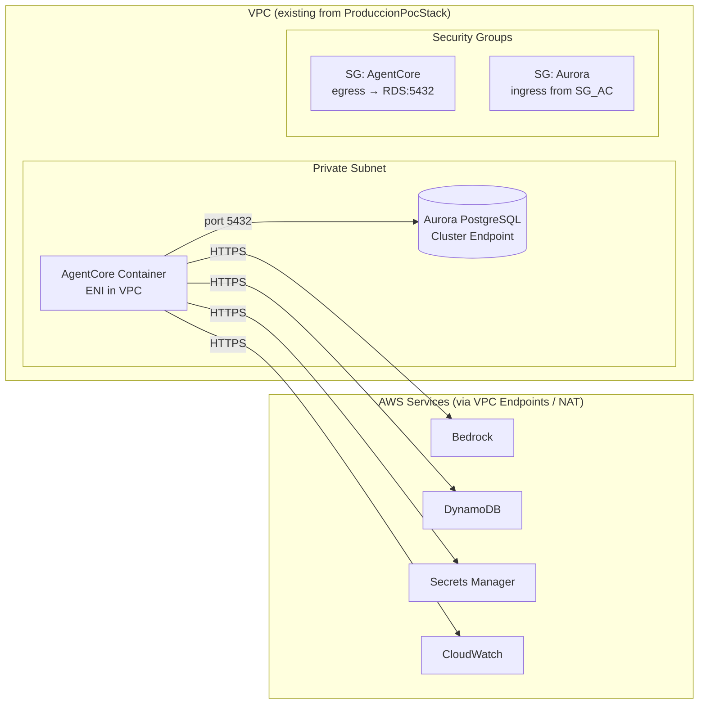
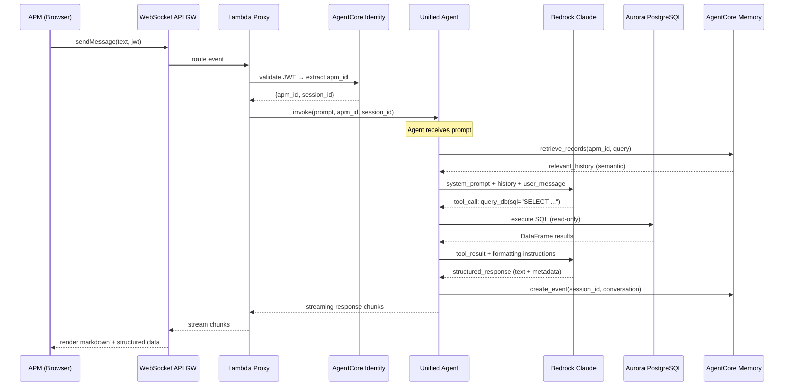
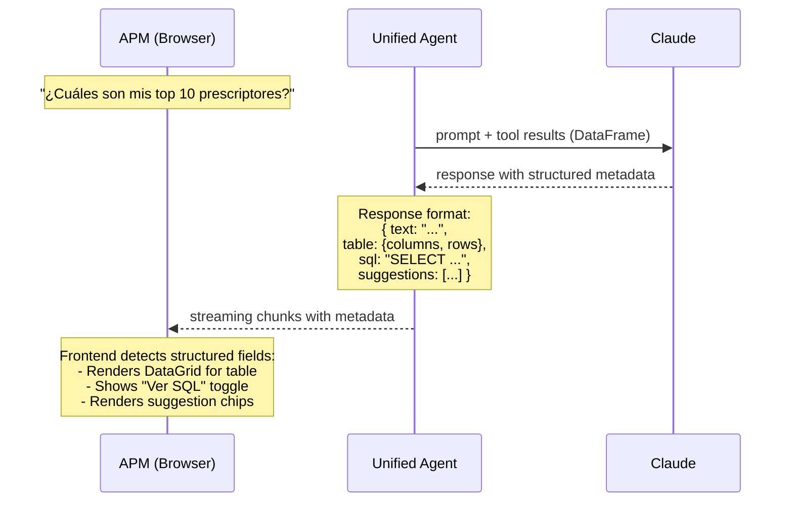

# Design Document: CodeAgent WebApp Integration

## Overview

Este spec integra el CodeAgent validado en el POC de producción (Aurora PostgreSQL, 2M filas, 21 tablas, `@tool query_db`) en la webapp PharmAssist existente como un ÚNICO runtime de AgentCore. Reemplaza 7 tools de consulta de datos que actualmente usan CSVs en DynamoDB por un solo `query_db` contra Aurora, manteniendo tools de utilidad (web search, generación de briefs, mensajes de cumpleaños, minutas desde DynamoDB).

Adicionalmente implementa features de plataforma AgentCore:
- **Memory**: STM (sesión) + Semantic Memory (historial cross-session)
- **Observability**: Traces, métricas de latencia, dashboard GenAI
- **Identity**: AgentCore Identity con Cognito JWT → acceso scoped por APM
- **Evaluations**: Suite de evaluación automatizada con 30+ preguntas

Y mejoras de UX en el frontend:
- Tablas de datos inline (MUI DataGrid) cuando el agente devuelve datos tabulares
- Toggle "Ver SQL" para mostrar la query generada
- Gráficos inline (MUI X Charts) para preguntas de tendencia (EVO TRM, shares)
- Sugerencias de follow-up contextuales como chips clickeables

La arquitectura elegida es **Opción C: Single runtime, sin orquestador explícito** — Claude selecciona el tool correcto via docstrings descriptivos.


## Architecture

### Vista General del Sistema Integrado

```mermaid
graph TD
    subgraph "Frontend (React + MUI)"
        UI[ChatPanel.tsx]
        DG[MUI DataGrid<br/>Tablas inline]
        CH[MUI X Charts<br/>Gráficos inline]
        CHIPS[Follow-up Chips]
        SQL[Toggle "Ver SQL"]
    end

    subgraph "Capa de Transporte"
        WS[WebSocket API Gateway]
        LP[Lambda Proxy<br/>JWT validation + invoke]
    end

    subgraph "AgentCore Runtime (VPC Mode)"
        AGENT[Unified Agent<br/>Strands Agent + 5 tools]
        MEM[AgentCore Memory<br/>STM + Semantic]
        OBS[AgentCore Observability<br/>Traces + Metrics]
    end

    subgraph "Identity"
        COG[Cognito User Pool<br/>custom:apm_id]
        ACID[AgentCore Identity<br/>JWT Validation]
    end

    subgraph "Data Layer"
        AURORA[(Aurora PostgreSQL<br/>21 tablas, 2M filas)]
        DDB[(DynamoDB<br/>minutas table)]
        SM[Secrets Manager<br/>DB credentials]
    end

    subgraph "Modelo"
        LLM[Amazon Bedrock<br/>Claude Sonnet 4]
    end

    UI -->|WS stream| WS
    UI --> DG
    UI --> CH
    UI --> CHIPS
    UI --> SQL
    WS -->|route| LP
    LP -->|validate JWT| ACID
    ACID -->|verify| COG
    LP -->|invoke| AGENT
    AGENT -->|query_db| AURORA
    AGENT -->|obtener_minutas| DDB
    AGENT -->|LLM calls| LLM
    AGENT -->|events| MEM
    AGENT -->|traces| OBS
    AURORA --- SM
```

### Diagrama de Red (VPC)




### Flujo Principal: APM hace una pregunta de datos



### Flujo: Respuesta Estructurada con Datos Tabulares




## Components and Interfaces

### Componente 1: Unified Agent (AgentCore Runtime)

**Purpose**: Runtime único que recibe preguntas del APM, ejecuta SQL contra Aurora, consulta minutas en DynamoDB, genera contenido con LLM, y devuelve respuestas estructuradas.

**Interface**:
```python
# agentcore/agent.py — Entry point para AgentCore

from bedrock_agentcore import BedrockAgentCoreApp
from strands import Agent, tool
from strands.models import BedrockModel

class UnifiedAgentConfig:
    model_id: str          # us.anthropic.claude-sonnet-4-20250514-v1:0
    region: str            # us-east-1
    db_secret_arn: str     # Secrets Manager ARN for Aurora creds
    minutas_table: str     # DynamoDB table for minutas
    memory_id: str         # AgentCore Memory resource ID

app = BedrockAgentCoreApp()

@app.entrypoint
def handle_invoke(payload: dict, context: Any = None) -> dict:
    """
    Expected payload:
    {
        "prompt": str,
        "apm_id": str,
        "session_id": str,
        "mode": "text" | "voice"  (optional, default "text")
    }

    Returns:
    {
        "result": str,          # Markdown response
        "structured": {         # Optional structured data
            "table": {"columns": [...], "rows": [...]},
            "sql": str,
            "chart": {"type": str, "data": [...]},
            "suggestions": [str, ...]
        },
        "success": bool,
        "retries": int
    }
    """
```

**Responsabilidades**:
- Inicializar Agent con 5 tools (query_db, buscar_info_publica, generar_brief, obtener_minutas, generar_mensaje_cumpleanos)
- Inyectar APM_ID y CICLO_ACTUAL como contexto del system prompt
- Manejar Memory: crear eventos y recuperar historial semántico
- Formatear respuestas con metadata estructurada para el frontend
- Retry logic para SQL fallido (max 2 reintentos)

### Componente 2: PharmaToolkit (query_db)

**Purpose**: Tool principal que ejecuta SQL read-only contra Aurora PostgreSQL. Reemplaza 7 tools DynamoDB existentes.

**Interface**:
```python
@tool
def query_db(sql: str) -> str:
    """Ejecuta una query SQL SELECT contra PostgreSQL.
    
    Retorna el resultado como string tabular (para el LLM) con metadata
    adicional en formato JSON para rendering estructurado en el frontend.
    
    Solo permite SELECT y WITH (CTEs). Rechaza cualquier DDL/DML.
    Timeout: 5 segundos por query.
    
    Args:
        sql: Query SQL válida (SELECT o WITH).
    
    Returns:
        String con resultados formateados + metadata JSON.
    """
```

**Responsabilidades**:
- Validar SQL (solo SELECT/WITH)
- Ejecutar con statement_timeout = 5000ms
- Connection pooling (SQLAlchemy QueuePool, pool_size=5)
- SSL/TLS obligatorio con RDS CA bundle
- Retornar DataFrame como string + metadata para structured rendering

### Componente 3: Utility Tools (kept/adapted)

**Purpose**: Tools de utilidad que no dependen de Aurora.

```python
@tool
def buscar_info_publica(nombre: str, apellido: str, especialidad: str) -> dict:
    """Busca info pública de un médico en internet usando DDGS."""

@tool
def generar_brief(doctor_id: int) -> dict:
    """Genera brief pre-visita combinando datos Aurora + web + minutas DDB."""

@tool
def obtener_minutas(doctor_id: int) -> dict:
    """Obtiene las últimas minutas de visitas desde DynamoDB."""

@tool
def generar_mensaje_cumpleanos(doctor_id: int) -> dict:
    """Genera mensaje de cumpleaños personalizado con datos de Aurora."""
```

### Componente 4: AgentCore Memory Integration

**Purpose**: Memoria de corto plazo (STM por sesión) y memoria semántica (cross-session) para contexto conversacional.

```python
class MemoryManager:
    """Gestiona STM y Semantic Memory via AgentCore Memory API."""

    def __init__(self, memory_id: str):
        self.memory_id = memory_id
        self.client = boto3.client("bedrock-agentcore")

    def store_event(self, actor_id: str, session_id: str, messages: list[dict]) -> None:
        """Almacena un turno de conversación como evento (STM)."""

    def retrieve_context(self, actor_id: str, query: str, top_k: int = 5) -> list[str]:
        """Recupera memorias relevantes via semantic search (cross-session)."""

    def get_session_history(self, actor_id: str, session_id: str) -> list[dict]:
        """Recupera eventos de la sesión actual (STM)."""
```

### Componente 5: Response Formatter

**Purpose**: Transforma la respuesta del agente en formato estructurado para el frontend.

```python
class ResponseFormatter:
    """Parsea la respuesta del agente y extrae metadata estructurada."""

    def format_response(self, raw_response: str, tool_calls: list) -> dict:
        """
        Analiza la respuesta y genera:
        - result: texto markdown para rendering
        - structured.table: datos tabulares si hubo query_db con >2 filas
        - structured.sql: la última SQL ejecutada
        - structured.chart: datos para chart si detecta tendencia temporal
        - structured.suggestions: follow-ups contextuales
        """

    def detect_chart_data(self, df: pd.DataFrame, sql: str) -> dict | None:
        """Detecta si el DataFrame tiene estructura temporal para chart."""

    def generate_suggestions(self, prompt: str, response: str) -> list[str]:
        """Genera 2-3 follow-up suggestions basadas en contexto."""
```


### Componente 6: Frontend — Structured Response Rendering

**Purpose**: Extiende ChatPanel para renderizar respuestas estructuradas del agente.

```typescript
// types/agent.ts — Tipos de respuesta estructurada

interface AgentResponse {
  result: string;           // Markdown text
  structured?: {
    table?: TableData;
    sql?: string;
    chart?: ChartData;
    suggestions?: string[];
  };
  success: boolean;
}

interface TableData {
  columns: { field: string; headerName: string; width?: number }[];
  rows: Record<string, unknown>[];
}

interface ChartData {
  type: 'line' | 'bar';
  xAxis: { data: string[]; label: string };
  series: { data: number[]; label: string }[];
}

// components/Chat/StructuredResponse.tsx

interface StructuredResponseProps {
  response: AgentResponse;
}

function StructuredResponse({ response }: StructuredResponseProps): JSX.Element;
// Renders: DataGrid for tables, LineChart/BarChart for charts,
//          SQL toggle, suggestion chips
```

**Responsabilidades**:
- Detectar si la respuesta tiene `structured` metadata
- Renderizar MUI DataGrid para datos tabulares (sortable, filterable)
- Renderizar MUI X Charts para datos de tendencia
- Mostrar toggle "Ver SQL" con la query ejecutada
- Mostrar chips de sugerencia clickeables que envían nuevo mensaje

### Componente 7: Lambda Proxy (updated)

**Purpose**: Lambda existente que valida JWT y routea al AgentCore runtime. Se actualiza para pasar metadata de identity.

```python
# Lambda proxy updates

def handle_websocket_message(event, context):
    """
    Cambios vs versión actual:
    1. Valida Cognito JWT y extrae custom:apm_id
    2. Pasa apm_id + session_id al payload del agent invoke
    3. Parsea respuesta estructurada y la forwardea por WS
    """
```

## Data Models

### Payload de Request (Lambda → AgentCore)

```python
class AgentInvokePayload(BaseModel):
    prompt: str                    # Pregunta del APM
    apm_id: str                    # Extraído del JWT (custom:apm_id)
    session_id: str                # WebSocket connection ID
    mode: Literal["text", "voice"] = "text"
    conversation_history: list[dict] = []  # Últimos N mensajes (STM)
```

### Payload de Response (AgentCore → Lambda → Frontend)

```python
class AgentResponsePayload(BaseModel):
    result: str                    # Markdown response
    structured: StructuredData | None = None
    success: bool = True
    retries: int = 0

class StructuredData(BaseModel):
    table: TablePayload | None = None
    sql: str | None = None
    chart: ChartPayload | None = None
    suggestions: list[str] | None = None

class TablePayload(BaseModel):
    columns: list[dict]            # [{field, headerName, width?}]
    rows: list[dict]               # [{col1: val1, col2: val2, ...}]

class ChartPayload(BaseModel):
    type: Literal["line", "bar"]
    x_axis: dict                   # {data: [...], label: str}
    series: list[dict]             # [{data: [...], label: str}]
```

### WebSocket Message Protocol (Frontend ↔ Lambda)

```typescript
// Client → Server
interface WsClientMessage {
  action: "sendMessage";
  data: {
    message: string;
    sessionId: string;
  };
  // JWT in $request.header.Authorization (managed by API GW)
}

// Server → Client (streaming chunks)
interface WsServerChunk {
  type: "chunk" | "tool_step" | "complete" | "error";
  // type: "chunk" → partial text
  text?: string;
  // type: "tool_step" → agent is using a tool
  toolName?: string;
  toolLabel?: string;
  // type: "complete" → full structured response
  response?: AgentResponsePayload;
  // type: "error"
  error?: string;
}
```


## Key Functions with Formal Specifications

### Function 1: query_db(sql)

```python
@tool
def query_db(sql: str) -> str:
    """Ejecuta SQL SELECT contra PostgreSQL. Retorna resultado como string tabular."""
```

**Preconditions:**
- `sql` is non-empty string
- `sql.strip().upper()` starts with "SELECT" or "WITH"
- Database connection pool is initialized
- DB_SECRET_ARN environment variable is set

**Postconditions:**
- If SQL is valid: returns DataFrame.to_string() with max 50 rows
- If SQL is invalid (not SELECT/WITH): raises ValueError with descriptive message
- If SQL times out (>5s): raises TimeoutError
- If connection fails: raises ConnectionError
- No mutations to the database (enforced by read-only user)
- Connection is returned to pool after execution

**Loop Invariants:** N/A (single query execution)

### Function 2: handle_invoke(payload, context)

```python
@app.entrypoint
def handle_invoke(payload: dict, context: Any = None) -> dict:
    """AgentCore entrypoint — main request handler."""
```

**Preconditions:**
- `payload` contains key "prompt" (non-empty string)
- `payload` contains key "apm_id" (non-empty string)
- Bedrock model is accessible from VPC
- Aurora is reachable on port 5432

**Postconditions:**
- Returns dict with keys: result (str), success (bool), retries (int)
- If success=True: result contains agent's response in markdown
- If success=False: result contains user-friendly error message in Spanish
- retries ∈ {0, 1, 2} (max 2 retry attempts)
- Memory event is created for the conversation turn
- Structured metadata is included when applicable

### Function 3: retrieve_context(actor_id, query)

```python
def retrieve_context(self, actor_id: str, query: str, top_k: int = 5) -> list[str]:
    """Semantic search over cross-session memory."""
```

**Preconditions:**
- `actor_id` matches pattern `apm-{apm_id}` (1-255 chars)
- `query` is non-empty (1-10000 chars)
- AgentCore Memory resource exists and is ACTIVE

**Postconditions:**
- Returns list of 0 to `top_k` memory record contents
- Records are ordered by semantic relevance (highest first)
- If memory is empty or no matches: returns empty list
- Does not raise exceptions (fails gracefully with empty result)

### Function 4: format_response(raw_response, tool_calls)

```python
def format_response(self, raw_response: str, tool_calls: list) -> dict:
    """Parse agent response into structured format for frontend."""
```

**Preconditions:**
- `raw_response` is a string (may be empty on error)
- `tool_calls` is a list of tool invocation records (may be empty)

**Postconditions:**
- Returns dict matching AgentResponsePayload schema
- `result` field always present (even if empty string)
- `structured.table` present only if query_db returned >2 rows
- `structured.sql` present only if query_db was called
- `structured.chart` present only if data has temporal pattern
- `structured.suggestions` always present with 2-3 items (or empty list)


## Algorithmic Pseudocode

### Main Agent Invocation Flow

```python
ALGORITHM handle_invoke(payload):
    INPUT: payload = {prompt, apm_id, session_id, mode?}
    OUTPUT: {result, structured?, success, retries}

    # 1. Extract and validate input
    prompt = payload["prompt"]
    apm_id = payload["apm_id"]
    session_id = payload.get("session_id", generate_session_id())
    mode = payload.get("mode", "text")

    ASSERT prompt is not empty
    ASSERT apm_id is not empty

    # 2. Initialize toolkit and agent (lazy, cached per session)
    toolkit = get_or_create_toolkit(apm_id)
    agent = get_or_create_agent(session_id, toolkit)

    # 3. Retrieve semantic memory context
    memory_context = memory_manager.retrieve_context(
        actor_id=f"apm-{apm_id}",
        query=prompt,
        top_k=3
    )

    # 4. Build augmented prompt with context
    augmented_prompt = build_prompt(prompt, apm_id, memory_context, mode)

    # 5. Invoke agent with retry logic
    result = None
    retries = 0
    FOR attempt IN range(MAX_RETRIES + 1):
        TRY:
            response = agent(augmented_prompt)
            result = format_response(str(response), agent.last_tool_calls)
            BREAK
        EXCEPT Exception as e:
            retries = attempt
            IF attempt < MAX_RETRIES:
                augmented_prompt += f"\n[SQL error: {e}. Corregí y reintentá.]"
            ELSE:
                result = error_response(e)

    # 6. Store conversation in memory (async, non-blocking)
    memory_manager.store_event(
        actor_id=f"apm-{apm_id}",
        session_id=session_id,
        messages=[
            {"role": "user", "content": prompt},
            {"role": "assistant", "content": result["result"]}
        ]
    )

    # 7. Return structured response
    result["retries"] = retries
    RETURN result
```

### SQL Validation and Execution

```python
ALGORITHM query_db(sql):
    INPUT: sql (string)
    OUTPUT: formatted result string with metadata

    # 1. Validate SQL type
    normalized = sql.strip().upper()
    IF NOT (normalized.startswith("SELECT") OR normalized.startswith("WITH")):
        RAISE ValueError("Solo se permiten queries SELECT o WITH")

    # 2. Execute with timeout
    WITH engine.connect() AS conn:
        conn.execute("SET LOCAL statement_timeout = '5000'")
        df = pd.read_sql(text(sql), conn)

    # 3. Format result
    IF df.empty:
        RETURN "La query retornó 0 filas."

    # 4. Build response with metadata for structured rendering
    text_result = df.to_string(index=False, max_rows=50)

    # 5. Attach metadata as JSON suffix (parsed by ResponseFormatter)
    metadata = {
        "columns": [{"field": c, "headerName": c} for c in df.columns],
        "rows": df.head(100).to_dict(orient="records"),
        "total_rows": len(df),
        "sql": sql
    }

    RETURN f"{text_result}\n\n<!--STRUCTURED:{json.dumps(metadata)}-->"
```

### Semantic Memory Retrieval

```python
ALGORITHM retrieve_context(actor_id, query, top_k):
    INPUT: actor_id, query, top_k
    OUTPUT: list of relevant memory strings

    TRY:
        response = agentcore_client.search_memory_records(
            memory_id=self.memory_id,
            namespace=actor_id,
            search_query=query,
            top_k=top_k
        )

        records = response.get("memoryRecords", [])
        RETURN [r["content"]["text"] for r in records if r.get("content")]

    EXCEPT Exception:
        # Memory retrieval is non-critical — graceful degradation
        RETURN []
```

### Response Formatting with Chart Detection

```python
ALGORITHM format_response(raw_response, tool_calls):
    INPUT: raw_response (str), tool_calls (list)
    OUTPUT: AgentResponsePayload dict

    result = {"result": raw_response, "success": True, "structured": {}}

    # 1. Extract structured metadata from tool results
    FOR call IN tool_calls:
        IF call.tool_name == "query_db" AND "<!--STRUCTURED:" in call.result:
            metadata_json = extract_between(call.result, "<!--STRUCTURED:", "-->")
            metadata = json.loads(metadata_json)

            # Strip metadata marker from visible text
            result["result"] = raw_response.replace(f"<!--STRUCTURED:{metadata_json}-->", "")

            # Include table if >2 rows
            IF metadata["total_rows"] > 2:
                result["structured"]["table"] = {
                    "columns": metadata["columns"],
                    "rows": metadata["rows"][:100]
                }

            # Include SQL
            result["structured"]["sql"] = metadata["sql"]

            # Detect chart opportunity
            chart = detect_chart_data(metadata)
            IF chart:
                result["structured"]["chart"] = chart

    # 2. Generate follow-up suggestions
    result["structured"]["suggestions"] = generate_suggestions(raw_response)

    RETURN result
```


## Example Usage

### Backend: Agent Invocation

```python
# agentcore/agent.py — Unified agent entry point

import os
from bedrock_agentcore import BedrockAgentCoreApp
from strands import Agent, tool
from strands.models import BedrockModel
from toolkit import PharmaToolkit
from memory_manager import MemoryManager
from response_formatter import ResponseFormatter

BEDROCK_MODEL_ID = os.environ.get("BEDROCK_MODEL_ID", "us.anthropic.claude-sonnet-4-20250514-v1:0")
DB_SECRET_ARN = os.environ.get("DB_SECRET_ARN")
MEMORY_ID = os.environ.get("AGENTCORE_MEMORY_ID")
MINUTAS_TABLE = os.environ.get("MINUTAS_TABLE_NAME")

app = BedrockAgentCoreApp()
memory = MemoryManager(memory_id=MEMORY_ID)
formatter = ResponseFormatter()

@app.entrypoint
def handle_invoke(payload: dict, context=None) -> dict:
    prompt = payload.get("prompt", "")
    apm_id = payload.get("apm_id", "")
    session_id = payload.get("session_id", "default")

    if not prompt or not apm_id:
        return {"result": "Faltan datos requeridos.", "success": False, "retries": 0}

    # Build toolkit for this APM
    toolkit = PharmaToolkit(apm_id=apm_id, db_secret_arn=DB_SECRET_ARN)

    # Define tools scoped to this invocation
    @tool
    def query_db(sql: str) -> str:
        """Ejecuta SQL SELECT contra PostgreSQL. Retorna resultado tabular."""
        return toolkit.execute_query(sql)

    @tool
    def obtener_minutas(doctor_id: int) -> dict:
        """Obtiene minutas de visitas previas desde DynamoDB."""
        return toolkit.get_minutas(doctor_id, MINUTAS_TABLE)

    @tool
    def buscar_info_publica(nombre: str, apellido: str, especialidad: str) -> dict:
        """Busca info pública del médico en internet (DDGS)."""
        return toolkit.web_search(nombre, apellido, especialidad)

    @tool
    def generar_brief(doctor_id: int) -> dict:
        """Genera brief pre-visita combinando Aurora + web + minutas."""
        return toolkit.generate_brief(doctor_id)

    @tool
    def generar_mensaje_cumpleanos(doctor_id: int) -> dict:
        """Genera mensaje de cumpleaños personalizado."""
        return toolkit.generate_birthday_message(doctor_id)

    # Retrieve memory context
    history = memory.retrieve_context(f"apm-{apm_id}", prompt, top_k=3)

    # Create agent
    model = BedrockModel(
        model_id=BEDROCK_MODEL_ID,
        region_name=os.environ.get("AWS_REGION", "us-east-1"),
        temperature=0.3,
        max_tokens=4096,
    )
    agent = Agent(
        model=model,
        tools=[query_db, obtener_minutas, buscar_info_publica, generar_brief, generar_mensaje_cumpleanos],
        system_prompt=build_system_prompt(apm_id, toolkit.get_ciclo_actual_id(), history),
    )

    # Invoke with retry
    result = invoke_with_retry(agent, prompt, max_retries=2)

    # Store in memory (fire-and-forget)
    memory.store_event(f"apm-{apm_id}", session_id, [
        {"role": "user", "content": prompt},
        {"role": "assistant", "content": result.get("result", "")}
    ])

    return result
```

### Frontend: Structured Response Rendering

```typescript
// components/Chat/StructuredResponse.tsx

import { useState } from 'react';
import { DataGrid } from '@mui/x-data-grid';
import { LineChart, BarChart } from '@mui/x-charts';
import { Chip, Stack, Collapse, Button, Typography, Box } from '@mui/material';
import CodeIcon from '@mui/icons-material/Code';

interface StructuredResponseProps {
  response: AgentResponse;
  onSuggestionClick: (suggestion: string) => void;
}

export function StructuredResponse({ response, onSuggestionClick }: StructuredResponseProps) {
  const [showSql, setShowSql] = useState(false);
  const { structured } = response;

  return (
    <Stack spacing={1.5}>
      {/* Markdown text (always rendered) */}
      <ReactMarkdown>{response.result}</ReactMarkdown>

      {/* Data table */}
      {structured?.table && (
        <Box sx={{ height: 300, width: '100%' }}>
          <DataGrid
            rows={structured.table.rows.map((r, i) => ({ id: i, ...r }))}
            columns={structured.table.columns}
            density="compact"
            pageSizeOptions={[10, 25]}
            initialState={{ pagination: { paginationModel: { pageSize: 10 } } }}
          />
        </Box>
      )}

      {/* Chart */}
      {structured?.chart && structured.chart.type === 'line' && (
        <LineChart
          xAxis={[structured.chart.xAxis]}
          series={structured.chart.series}
          height={250}
        />
      )}

      {/* SQL toggle */}
      {structured?.sql && (
        <>
          <Button
            size="small"
            startIcon={<CodeIcon />}
            onClick={() => setShowSql(!showSql)}
            variant="text"
          >
            {showSql ? 'Ocultar SQL' : 'Ver SQL'}
          </Button>
          <Collapse in={showSql}>
            <Box sx={{ bgcolor: 'action.hover', p: 1, borderRadius: 1, fontFamily: 'monospace', fontSize: '0.75rem' }}>
              {structured.sql}
            </Box>
          </Collapse>
        </>
      )}

      {/* Follow-up suggestions */}
      {structured?.suggestions && structured.suggestions.length > 0 && (
        <Stack direction="row" spacing={0.5} flexWrap="wrap" useFlexGap>
          {structured.suggestions.map((s, i) => (
            <Chip key={i} label={s} size="small" variant="outlined" onClick={() => onSuggestionClick(s)} />
          ))}
        </Stack>
      )}
    </Stack>
  );
}
```

### BidiAgent Update: New ARN Reference

```python
# bidiagent/agent.py — Change TEXT_AGENT_ARN to unified agent

# Before (points to old DynamoDB text agent):
TEXT_AGENT_ARN = os.environ.get("TEXT_AGENT_ARN", "arn:...old-agent...")

# After (points to new unified CodeAgent):
TEXT_AGENT_ARN = os.environ.get("TEXT_AGENT_ARN", "arn:...new-unified-agent...")
# No other changes needed — the payload format {prompt, apm_id, mode} is the same
```


## Correctness Properties

*A property is a characteristic or behavior that should hold true across all valid executions of a system — essentially, a formal statement about what the system should do. Properties serve as the bridge between human-readable specifications and machine-verifiable correctness guarantees.*

### Property 1: SQL Validation Safety

*For any* string passed to query_db, the tool SHALL accept it if and only if the trimmed, uppercased string starts with "SELECT" or "WITH". All other strings SHALL be rejected with a ValueError before any database interaction occurs.

**Validates: Requirements 2.1, 2.2, 16.1**

### Property 2: Row Limit Enforcement

*For any* DataFrame result returned by query_db, the text representation SHALL contain at most 50 rows, and the structured metadata SHALL contain at most 100 rows regardless of the actual result set size.

**Validates: Requirements 2.6, 21.5**

### Property 3: Retry Bound

*For any* invocation of handle_invoke that encounters SQL errors, the retry count SHALL never exceed 2 (initial attempt + 2 retries = 3 total), and the response retries field SHALL be in the set {0, 1, 2}.

**Validates: Requirements 3.2, 3.4**

### Property 4: No Sensitive Data Leakage

*For any* error condition (database connection failure, SQL error, timeout, throttle), the user-facing response SHALL not contain hostnames, IP addresses, connection strings, stack traces, database credentials, or raw error messages from underlying services.

**Validates: Requirements 4.5, 16.4, 17.5, 20.5**

### Property 5: Graceful Degradation

*For any* external service failure (Aurora unreachable, AgentCore Memory unavailable, Bedrock throttled), handle_invoke SHALL never raise an unhandled exception and SHALL always return a dict with keys "result" (str), "success" (bool=False), and "retries" (int).

**Validates: Requirements 5.4, 6.4, 20.1, 20.2, 20.3, 20.4**

### Property 6: Actor ID Format Consistency

*For any* apm_id string, the actor_id used in all AgentCore Memory operations (store_event, retrieve_context, get_session_history) SHALL be exactly "apm-{apm_id}" matching the pattern `apm-[a-zA-Z0-9_-]+`.

**Validates: Requirements 5.2, 6.5**

### Property 7: Response Schema Completeness

*For any* invocation of handle_invoke with valid (prompt, apm_id) inputs, the response SHALL always contain the keys "result" (str), "success" (bool), and "retries" (int in {0,1,2}), regardless of whether the invocation succeeded or failed.

**Validates: Requirements 3.3, 19.3**

### Property 8: Voice Mode Omits Structured Data

*For any* invocation where mode is "voice", the response SHALL contain only {result, success, retries} and SHALL NOT include structured metadata (table, chart, sql, suggestions).

**Validates: Requirement 19.4**

### Property 9: Table Rendering Threshold

*For any* agent response where structured.table exists, the table rows count SHALL be greater than 2. Conversely, *for any* query_db result with 2 or fewer rows, structured.table SHALL be None or absent.

**Validates: Requirements 10.1, 21.1**

### Property 10: Chart Type Rendering Correctness

*For any* agent response with structured.chart, if chart.type is "line" then the frontend SHALL render a LineChart component, and if chart.type is "bar" then the frontend SHALL render a BarChart component. No other chart types SHALL be produced.

**Validates: Requirements 11.1, 11.2, 11.3**

### Property 11: Suggestions Count Bound

*For any* completed agent response in text mode, the structured.suggestions array SHALL contain exactly 2 or 3 elements (never fewer, never more).

**Validates: Requirements 13.4, 21.4**

### Property 12: Temporal Data Chart Detection

*For any* DataFrame result from query_db that contains a temporal column (fecha, mes, año, periodo) AND at least one numeric column, the ResponseFormatter SHALL detect it and include structured.chart. *For any* DataFrame without temporal columns, structured.chart SHALL be None.

**Validates: Requirement 21.2**

## Error Handling

### Error Scenario 1: SQL Timeout (>5s)

**Condition**: Aurora query exceeds statement_timeout (complex JOINs, full table scans)
**Response**: Catch SQLAlchemy OperationalError, extract timeout message
**Recovery**: Return error to agent with suggestion to simplify query. Agent retries with simpler SQL (max 2 retries). If all fail, return "La consulta es demasiado compleja. Intentá ser más específico."

### Error Scenario 2: Invalid SQL Generated by LLM

**Condition**: Claude generates SQL with syntax errors or references non-existent columns
**Response**: Catch pg8000 DatabaseError, return full PostgreSQL error to agent
**Recovery**: Agent sees the error in context and self-corrects on next attempt. The retry prompt includes the error message. Max 2 retries.

### Error Scenario 3: Aurora Connection Failed

**Condition**: VPC connectivity issue, Aurora cluster paused, credentials expired
**Response**: Catch ConnectionError from SQLAlchemy
**Recovery**: Return "El sistema de datos no está disponible. Intentá en unos minutos." Log critical error to CloudWatch. Don't retry (infrastructure issue).

### Error Scenario 4: Memory Service Unavailable

**Condition**: AgentCore Memory API returns error or times out
**Response**: Catch exception in MemoryManager methods
**Recovery**: Graceful degradation — skip memory context, proceed without history. Log warning. Never fail the main request due to memory.

### Error Scenario 5: Bedrock Throttling

**Condition**: Model invocation throttled (concurrent request limit)
**Response**: Catch ThrottlingException from Bedrock
**Recovery**: Return "El asistente está ocupado. Intentá en unos segundos." with exponential backoff suggestion. Don't burn retries on throttle.

### Error Scenario 6: JWT Validation Failed

**Condition**: Lambda proxy receives invalid/expired Cognito token
**Response**: Return 401 via WebSocket error frame
**Recovery**: Frontend detects 401, redirects to login. User re-authenticates and retries.


## Testing Strategy

### Unit Testing Approach

- Test `query_db` validation: reject DML/DDL, accept SELECT/WITH
- Test `ResponseFormatter`: correct extraction of structured metadata from tool results
- Test `MemoryManager`: graceful degradation when service unavailable
- Test `detect_chart_data`: correct identification of temporal data patterns
- Test `generate_suggestions`: always returns list of 2-3 strings

**Framework**: pytest + moto (AWS mocks) + unittest.mock

### Property-Based Testing (Evaluation Suite)

**Library**: Custom evaluation framework (not PBT library — evaluation-focused)

The evaluation suite tests 30+ questions covering all query patterns:

```python
EVAL_QUESTIONS = [
    # Cartera
    {"q": "¿Cuántos médicos tengo?", "expects": "numeric_answer"},
    {"q": "¿Cuáles son mis productos foco?", "expects": "list_of_products"},
    # Prescripciones
    {"q": "¿Quién prescribe más mis productos?", "expects": "ranked_list"},
    {"q": "Evolución de prescripción del Dr. X", "expects": "temporal_data"},
    # Visitas
    {"q": "¿A quién no visité en 3 meses?", "expects": "list_with_dates"},
    {"q": "¿Cuántas visitas hice este mes?", "expects": "numeric_answer"},
    # Cross-domain
    {"q": "Generame un brief del Dr. X", "expects": "structured_brief"},
    {"q": "¿Cuál es el share de mis marcas?", "expects": "table_data"},
]
```

**Evaluation criteria per question**:
1. `success == True` (agent didn't crash)
2. Response contains expected data type (number, list, table)
3. Latency < 6 seconds end-to-end
4. SQL generated is valid (no runtime errors)
5. Data isolation: only APM's own data returned

### Integration Testing

- Deploy agent locally with `agentcore dev`
- Execute evaluation suite against real Aurora (dev cluster)
- Verify WebSocket streaming works end-to-end
- Test BidiAgent → Unified Agent delegation (voice mode)
- Verify Memory events are persisted and retrievable

### Frontend Testing

- Component tests for `StructuredResponse` with vitest + @testing-library/react
- Mock WebSocket for ChatPanel streaming behavior
- Visual regression for DataGrid and Chart rendering

## Performance Considerations

### Latency Budget (target: <6s end-to-end)

| Phase | Budget | Notes |
|-------|--------|-------|
| JWT validation | <50ms | Lambda cold start cached |
| Memory retrieval | <200ms | Semantic search |
| LLM reasoning + SQL gen | <2500ms | Claude Sonnet 4, temperature 0.3 |
| SQL execution | <1000ms | Aurora with proper indexes |
| LLM response formatting | <2000ms | Second LLM call for structured output |
| Network + serialization | <250ms | VPC internal |
| **Total** | **<6000ms** | |

### Connection Pooling

- SQLAlchemy QueuePool: pool_size=5, max_overflow=2
- pool_pre_ping=True (detect stale connections)
- Connections reused across invocations within same AgentCore session
- AgentCore session timeout: 15 min idle (default)

### System Prompt Size

- Schema DDL: ~5K tokens (21 tables, optimized)
- Business rules: ~2K tokens
- Query examples: ~3K tokens
- Instructions: ~1K tokens
- Total system prompt: ~11K tokens (within Claude's 200K context window)

### Aurora Optimization

- Read replica for agent queries (if needed for scale)
- statement_timeout = 5s prevents runaway queries
- Indexes on: cartera_medica(id_apm), agenda(id_apm, fecha), "UltimaMillaMarca"("idMedico", "codMarcaCUP")
- Read-only user prevents any mutation risk

## Security Considerations

### Data Isolation

- Every query MUST filter by APM's cartera_medica (enforced via system prompt + business rules)
- The system prompt instructs Claude to ALWAYS filter by APM_ID
- Database user is read-only (no INSERT/UPDATE/DELETE/DDL possible)
- query_db validates SQL starts with SELECT/WITH before execution

### Authentication & Authorization

- Cognito JWT with `custom:apm_id` claim → extracted by Lambda proxy
- AgentCore Identity validates JWT before agent invocation
- No raw credentials in code — all via Secrets Manager
- VPC-only access to Aurora (no public endpoint)

### SQL Injection Mitigation

- LLM generates SQL (not user directly) — reduces but doesn't eliminate risk
- query_db rejects non-SELECT statements
- Read-only database user (ultimate safety net)
- statement_timeout prevents resource exhaustion

### Secrets Management

- DB credentials in Secrets Manager (rotated automatically)
- Environment variables for non-secret config (model ID, region)
- No secrets in system prompt or code

## Dependencies

### AgentCore Runtime (Python)

```
bedrock-agentcore
strands-agents
strands-agents-tools
boto3
pandas
sqlalchemy
pg8000                  # Pure Python PostgreSQL driver (no libpq)
ddgs                    # Web search (metabuscador)
pydantic>=2.0
```

### Frontend (npm)

```
@mui/x-data-grid       # Tablas inline
@mui/x-charts          # Gráficos inline (LineChart, BarChart)
react-markdown          # Rendering markdown existente
remark-gfm             # GitHub Flavored Markdown
rehype-raw             # HTML en markdown (<details>)
```

### Infrastructure

- Aurora PostgreSQL Serverless v2 (existing from ProduccionPocStack)
- DynamoDB minutas table (existing)
- Cognito User Pool (existing, with custom:apm_id)
- AgentCore Memory resource (new)
- AgentCore Runtime in VPC mode (new, replaces existing text agent)
- Lambda proxy (existing, updated for structured responses)
- WebSocket API Gateway (existing)

### External Services

- Amazon Bedrock (Claude Sonnet 4) — LLM inference
- DDGS (DuckDuckGo Search) — web search for briefs
- Amazon Transcribe — audio pipeline for minutas (unchanged)
