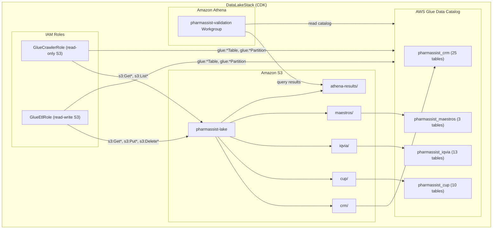
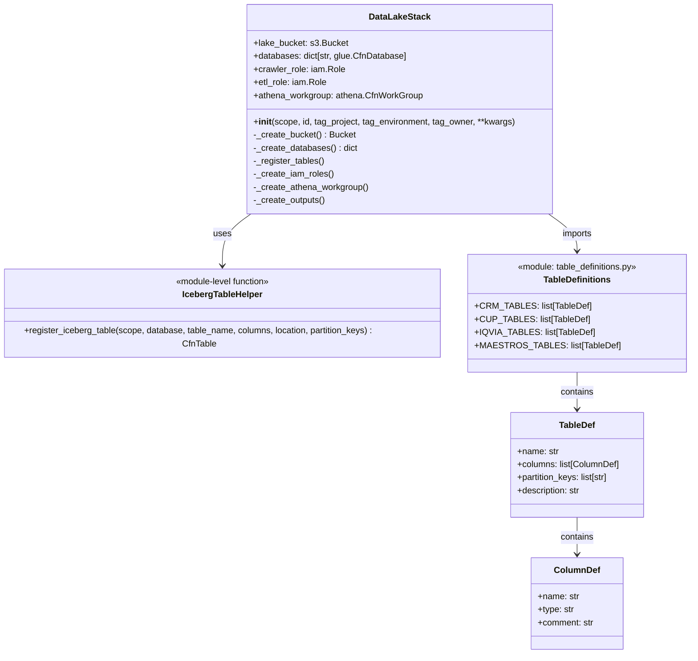

# Design — data-lake-foundation

## Overview

Este diseño describe la infraestructura fundacional del data lake de PharmAssist, implementada como un CDK stack independiente (`DataLakeStack`). El stack provisiona:

- **S3 Bucket** con estructura de prefijos por dominio (`crm/`, `cup/`, `iqvia/`, `maestros/`)
- **Glue Data Catalog** con 4 databases y 51 tablas Iceberg registradas declarativamente
- **IAM Roles** para Glue Crawler y ETL con least privilege
- **Athena Workgroup** para validación con control de costos

La estrategia central es registrar las 51 tablas Iceberg directamente en Glue Catalog usando CDK L1 constructs (`CfnTable`), sin depender de crawlers ni custom resources. Esto permite gestión declarativa, drift detection via CloudFormation, y reproducibilidad completa del catálogo.

## Architecture



### Decisiones Arquitectónicas

| Decisión | Elección | Rationale |
|----------|----------|-----------|
| Registro de tablas Iceberg | CDK `CfnTable` (L1) | Declarativo, drift detection, no requiere Athena runtime |
| Definición de columnas | En CDK (completa) | Athena resuelve columnas sin crawler previo (Req 3.6) |
| Partitioning | Identity transform en Iceberg | Compatible con Athena v3, partition pruning automático |
| Helper para 51 tablas | Función Python `register_iceberg_table()` | Reduce boilerplate, centraliza configuración Iceberg |
| Entry point | `app_datalake.py` separado | Deploy independiente sin afectar otros stacks |
| Removal policy | DESTROY en dev | Permite `cdk destroy` limpio en desarrollo |


## Components and Interfaces

### CDK Stack Class Hierarchy



### File Structure

```
infrastructure/
├── app_datalake.py                    # Entry point (instancia DataLakeStack)
├── stacks/
│   └── data_lake_stack.py             # Stack principal
├── constructs/
│   └── iceberg_table.py               # Helper function register_iceberg_table()
└── table_definitions/
    ├── __init__.py                     # Exports ALL_TABLES
    ├── crm_tables.py                   # 25 tablas CRM con columnas
    ├── cup_tables.py                   # 10 tablas CloseUp con columnas
    ├── iqvia_tables.py                 # 13 tablas IQVIA con columnas
    └── maestros_tables.py             # 3 tablas Maestros con columnas
```

### Table Definition Strategy

Con 51 tablas, definir cada una inline en el stack sería inmanejable (~3000+ líneas). La estrategia es:

1. **Dataclass `TableDef`** — estructura tipada con nombre, columnas, partition keys y descripción
2. **Archivos por dominio** — cada archivo exporta una lista de `TableDef` con todas las columnas
3. **Helper `register_iceberg_table()`** — función que recibe un `TableDef` y genera el `CfnTable` con toda la configuración Iceberg
4. **Loop en el stack** — itera sobre las 4 listas de tablas y llama al helper

```python
# Ejemplo de uso en data_lake_stack.py
from table_definitions import CRM_TABLES, CUP_TABLES, IQVIA_TABLES, MAESTROS_TABLES
from constructs.iceberg_table import register_iceberg_table

for table_def in CRM_TABLES:
    register_iceberg_table(
        scope=self,
        database=self.databases["crm"],
        bucket=self.lake_bucket,
        domain_prefix="crm",
        table_def=table_def,
    )
```


## Data Models

### Type Mapping: PostgreSQL → Iceberg/Glue

Los schemas fuente están en PostgreSQL (RDS). La conversión a tipos Glue/Iceberg sigue esta tabla:

| PostgreSQL Type | Glue/Iceberg Type | Notas |
|----------------|-------------------|-------|
| `SERIAL`, `INTEGER` | `int` | Iceberg `integer` |
| `BIGSERIAL`, `BIGINT` | `bigint` | Iceberg `long` |
| `SMALLINT` | `smallint` | Iceberg `integer` (Glue no tiene smallint) |
| `VARCHAR(n)` | `string` | Iceberg `string` (sin límite) |
| `TEXT` | `string` | |
| `BOOLEAN` | `boolean` | |
| `DATE` | `date` | |
| `TIMESTAMP` | `timestamp` | |
| `DECIMAL(p,s)` | `decimal(p,s)` | Preserva precisión |
| `CHAR(1)` | `string` | |

### TableDef Dataclass

```python
from dataclasses import dataclass, field

@dataclass
class ColumnDef:
    name: str
    type: str  # Glue/Iceberg type: "int", "bigint", "string", "boolean", "date", "timestamp", "decimal(p,s)"
    comment: str = ""

@dataclass
class TableDef:
    name: str
    columns: list[ColumnDef]
    partition_keys: list[str] = field(default_factory=list)  # column names used as partition keys
    description: str = ""
```

### Tabla Resumen por Dominio

| Dominio | Database | Tablas | Particionadas | Partition Strategy |
|---------|----------|--------|---------------|-------------------|
| CRM | `pharmassist_crm` | 25 | `agenda` (fecha_inicio) | Identity transform en fecha |
| CloseUp | `pharmassist_cup` | 10 | `prescripcion` (anio, mes, cdgreg_pmix) | Composite identity |
| IQVIA | `pharmassist_iqvia` | 13 | `fact_mercado_valor` (idperiodo) | Identity transform en período |
| Maestros | `pharmassist_maestros` | 3 | Ninguna | Sin partición (bajo volumen) |

### Listado Completo de Tablas

#### CRM (25 tablas en `pharmassist_crm`)

| # | Tabla | Partition Keys | Volumen Esperado |
|---|-------|---------------|-----------------|
| 1 | apm | — | ~100 rows |
| 2 | doctor | — | ~5,000 rows |
| 3 | zona | — | ~100 rows |
| 4 | especialidad | — | ~50 rows |
| 5 | cartera_medica | — | ~10,000 rows |
| 6 | cartera_medica_estado | — | ~20,000 rows |
| 7 | linea | — | ~20 rows |
| 8 | linea_apm | — | ~200 rows |
| 9 | familia_producto | — | ~200 rows |
| 10 | catalogo_productos | — | ~500 rows |
| 11 | ciclo | — | ~12 rows |
| 12 | grilla | — | ~400 rows |
| 13 | categoria | — | ~10 rows |
| 14 | detalle_promocion_producto | — | ~1,000 rows |
| 15 | agenda | `fecha_inicio` | ~100,000 rows |
| 16 | agenda_producto | — | ~300,000 rows |
| 17 | agenda_muestra | — | ~50,000 rows |
| 18 | datos_visita | — | ~500 rows |
| 19 | visita_planificada | — | ~5,000 rows |
| 20 | tag | — | ~50 rows |
| 21 | tag_doctor | — | ~5,000 rows |
| 22 | ultima_milla_medico | — | ~5,000 rows |
| 23 | ultima_milla_marca | — | ~50,000 rows |
| 24 | ultima_milla_objetivo | — | ~500 rows |

**Nota**: La tabla `agenda` se particiona por `fecha_inicio` (campo TIMESTAMP en el DDL real) en lugar de `fecha_visita` (nombre del requirements). El requirements usa `fecha_visita` como nombre conceptual; en la implementación se usará el campo real `fecha_inicio` del DDL.

**Nota 2**: El requirements lista 25 tablas pero el DDL tiene `linea_especializacion` como tabla adicional. Se incluirá como tabla #25 para completar las 25 del requirement.

| 25 | linea_especializacion | — | ~100 rows |


#### CloseUp (10 tablas en `pharmassist_cup`)

| # | Tabla | Partition Keys | Volumen Esperado |
|---|-------|---------------|-----------------|
| 1 | medico | — | ~20,000 rows |
| 2 | marca | — | ~5,000 rows |
| 3 | mercado | — | ~100 rows |
| 4 | mercado_producto | — | ~10,000 rows |
| 5 | representante | — | ~1,000 rows |
| 6 | prescripcion | `anio, mes, cdgreg_pmix` | ~5,000,000 rows |
| 7 | medico_rep_novisitado | — | ~50,000 rows |
| 8 | medico_representante | — | ~50,000 rows |
| 9 | medico_visitado | — | ~20,000 rows |
| 10 | mercado_modulo_linea | — | ~500 rows |

#### IQVIA (13 tablas en `pharmassist_iqvia`)

| # | Tabla | Partition Keys | Volumen Esperado |
|---|-------|---------------|-----------------|
| 1 | dim_periodo | — | ~48 rows |
| 2 | dim_droga | — | ~1,000 rows |
| 3 | dim_forma_farmaceutica | — | ~30 rows |
| 4 | dim_laboratorio | — | ~200 rows |
| 5 | dim_clase_terapeutica | — | ~500 rows |
| 6 | dim_presentacion | — | ~10,000 rows |
| 7 | dim_geografia | — | ~100 rows |
| 8 | dim_clase | — | ~200 rows |
| 9 | dim_combinacion_droga | — | ~500 rows |
| 10 | rel_presentacion_droga | — | ~10,000 rows |
| 11 | rel_presentacion_forma | — | ~10,000 rows |
| 12 | rel_producto_laboratorio | — | ~10,000 rows |
| 13 | fact_mercado_valor | `idperiodo` | ~4,000,000 rows |

#### Maestros (3 tablas en `pharmassist_maestros`)

| # | Tabla | Partition Keys | Volumen Esperado |
|---|-------|---------------|-----------------|
| 1 | maestro_medicos | — | ~5,000 rows |
| 2 | maestro_integrador_producto | — | ~500 rows |
| 3 | familia_interno_a_marca_cup | — | ~600 rows |

### Iceberg Table Configuration (CfnTable Properties)

Cada tabla Iceberg se registra en Glue con las siguientes propiedades:

```python
# Estructura del CfnTable para una tabla Iceberg
glue.CfnTable(
    scope=self,
    id=f"{table_name}-table",
    catalog_id=cdk.Aws.ACCOUNT_ID,
    database_name=database_name,
    table_input=glue.CfnTable.TableInputProperty(
        name=table_name,
        description=description,
        table_type="EXTERNAL_TABLE",
        parameters={
            "table_type": "ICEBERG",
            "format-version": "2",
            "metadata_location": f"s3://{bucket_name}/{domain}/{table_name}/metadata/",
        },
        storage_descriptor=glue.CfnTable.StorageDescriptorProperty(
            location=f"s3://{bucket_name}/{domain}/{table_name}/",
            input_format="org.apache.iceberg.mr.hive.HiveIcebergInputFormat",
            output_format="org.apache.iceberg.mr.hive.HiveIcebergOutputFormat",
            serde_info=glue.CfnTable.SerdeInfoProperty(
                serialization_library="org.apache.iceberg.mr.hive.HiveIcebergSerDe",
            ),
            columns=[
                glue.CfnTable.ColumnProperty(name=col.name, type=col.type, comment=col.comment)
                for col in columns
            ],
        ),
        partition_keys=[
            glue.CfnTable.ColumnProperty(name=pk, type=get_column_type(pk, columns))
            for pk in partition_keys
        ] if partition_keys else None,
    ),
)
```


## S3 Bucket Configuration

### Bucket Properties

```python
lake_bucket = s3.Bucket(
    self, "LakeBucket",
    bucket_name=None,  # CDK genera nombre con prefijo
    # Prefijo lógico via naming: stack genera "pharmassist-lake-{hash}"
    encryption=s3.BucketEncryption.S3_MANAGED,  # SSE-S3 (AES-256)
    versioned=True,
    block_public_access=s3.BlockPublicAccess.BLOCK_ALL,
    removal_policy=RemovalPolicy.DESTROY,  # dev environment
    auto_delete_objects=True,  # permite cdk destroy limpio
    lifecycle_rules=[
        # Rule 1: Archive objetos con tag lifecycle=archive después de 365 días
        s3.LifecycleRule(
            id="archive-tagged-objects",
            tag_filters={"lifecycle": "archive"},
            transitions=[
                s3.Transition(
                    storage_class=s3.StorageClass.GLACIER,
                    transition_after=Duration.days(365),
                )
            ],
        ),
        # Rule 2: Eliminar versiones no-current después de 90 días
        s3.LifecycleRule(
            id="delete-noncurrent-versions",
            noncurrent_version_expiration=Duration.days(90),
        ),
        # Rule 3: Abortar multipart uploads incompletos después de 7 días
        s3.LifecycleRule(
            id="abort-incomplete-multipart",
            abort_incomplete_multipart_upload_after=Duration.days(7),
        ),
    ],
)
```

### Bucket Structure (Prefixes)

Los prefijos se definen implícitamente por las locations de las tablas Iceberg. No se crean objetos placeholder — la existencia de los prefijos queda verificable en el template CloudFormation via las `location` properties de cada `CfnTable`.

```
s3://pharmassist-lake-{hash}/
├── crm/{table_name}/              ← 25 tablas
│   ├── data/                      ← archivos Parquet (escritos por ETL)
│   └── metadata/                  ← metadata Iceberg (snapshots, manifests)
├── cup/{table_name}/              ← 10 tablas
├── iqvia/{table_name}/            ← 13 tablas
├── maestros/{table_name}/         ← 3 tablas
└── athena-results/                ← output de queries Athena
```

## Glue Catalog Configuration

### Databases

```python
DATABASES = {
    "crm": {
        "name": "pharmassist_crm",
        "description": "Fuente: CRM interno | Cadencia: diaria",
        "location_prefix": "crm",
    },
    "cup": {
        "name": "pharmassist_cup",
        "description": "Fuente: CloseUp International | Cadencia: mensual",
        "location_prefix": "cup",
    },
    "iqvia": {
        "name": "pharmassist_iqvia",
        "description": "Fuente: IQVIA | Cadencia: mensual",
        "location_prefix": "iqvia",
    },
    "maestros": {
        "name": "pharmassist_maestros",
        "description": "Fuente: Tablas de integración cross-source | Cadencia: bajo demanda",
        "location_prefix": "maestros",
    },
}
```

Cada database se crea con `CfnDatabase`:

```python
glue.CfnDatabase(
    self, f"{key}-database",
    catalog_id=cdk.Aws.ACCOUNT_ID,
    database_input=glue.CfnDatabase.DatabaseInputProperty(
        name=db_config["name"],
        description=db_config["description"],
        location_uri=f"s3://{lake_bucket.bucket_name}/{db_config['location_prefix']}/",
    ),
)
```

### Iceberg Compatibility (Athena v3)

Todas las tablas se registran con:
- `table_type=ICEBERG` en parameters
- `format-version=2` (soporte para row-level deletes, required para MERGE INTO)
- `metadata_location` apuntando a `s3://{bucket}/{domain}/{table}/metadata/`
- InputFormat/OutputFormat/SerDe de Iceberg para Hive compatibility

Esto permite que Athena v3 lea las tablas como Iceberg nativo, con soporte para:
- Schema evolution (ADD COLUMN sin recrear tabla)
- Time travel (query snapshots anteriores)
- ACID transactions (escrituras atómicas)
- Partition pruning automático via identity transforms


## IAM Design

### GlueCrawlerRole

Rol para crawlers que descubren/actualizan metadata de tablas existentes.

```python
crawler_role = iam.Role(
    self, "GlueCrawlerRole",
    assumed_by=iam.ServicePrincipal("glue.amazonaws.com"),
    managed_policies=[
        iam.ManagedPolicy.from_aws_managed_policy_name("service-role/AWSGlueServiceRole"),
    ],
)

# S3: solo lectura sobre el lake bucket
crawler_role.add_to_policy(iam.PolicyStatement(
    actions=["s3:GetObject", "s3:ListBucket"],
    resources=[
        lake_bucket.bucket_arn,
        f"{lake_bucket.bucket_arn}/*",
    ],
))

# Glue Catalog: crear/actualizar tablas y particiones
crawler_role.add_to_policy(iam.PolicyStatement(
    actions=[
        "glue:CreateTable",
        "glue:UpdateTable",
        "glue:GetTable",
        "glue:GetDatabase",
        "glue:BatchCreatePartition",
    ],
    resources=["*"],  # Glue catalog resources use account-level ARNs
))
```

### GlueEtlRole

Rol para jobs ETL que escriben datos en el lake.

```python
etl_role = iam.Role(
    self, "GlueEtlRole",
    assumed_by=iam.ServicePrincipal("glue.amazonaws.com"),
    managed_policies=[
        iam.ManagedPolicy.from_aws_managed_policy_name("service-role/AWSGlueServiceRole"),
    ],
)

# S3: lectura y escritura sobre el lake bucket
etl_role.add_to_policy(iam.PolicyStatement(
    actions=["s3:GetObject", "s3:PutObject", "s3:DeleteObject", "s3:ListBucket"],
    resources=[
        lake_bucket.bucket_arn,
        f"{lake_bucket.bucket_arn}/*",
    ],
))

# Glue Catalog: operaciones de tabla y particiones
etl_role.add_to_policy(iam.PolicyStatement(
    actions=[
        "glue:GetTable",
        "glue:GetDatabase",
        "glue:CreateTable",
        "glue:UpdateTable",
        "glue:BatchCreatePartition",
        "glue:GetPartitions",
    ],
    resources=["*"],
))
```

### Principios IAM

- **No wildcards en Action**: cada policy statement lista acciones explícitas
- **Resource scoping**: S3 permissions limitadas al ARN del lake bucket
- **Trust policy**: solo `glue.amazonaws.com` puede asumir los roles
- **Managed policy base**: `AWSGlueServiceRole` provee permisos de logs, métricas y bookmarks
- **Glue Catalog resources**: usan `*` en resource porque los ARNs de Glue Catalog son a nivel cuenta/región (no se pueden scoper a una database específica sin conocer el ARN completo en deploy time)

## Athena Workgroup Configuration

```python
athena.CfnWorkGroup(
    self, "ValidationWorkgroup",
    name="pharmassist-validation",
    state="ENABLED",
    work_group_configuration=athena.CfnWorkGroup.WorkGroupConfigurationProperty(
        result_configuration=athena.CfnWorkGroup.ResultConfigurationProperty(
            output_location=f"s3://{lake_bucket.bucket_name}/athena-results/",
        ),
        bytes_scanned_cutoff_per_query=104_857_600,  # 100 MB
        enforce_work_group_configuration=True,
        engine_version=athena.CfnWorkGroup.EngineVersionProperty(
            selected_engine_version="Athena engine version 3",
        ),
    ),
)
```

### Configuración clave:
- **Output location**: `s3://{bucket}/athena-results/` — dentro del mismo bucket del lake
- **Byte scan limit**: 100 MB por query — suficiente para validación, previene queries costosas accidentales
- **Enforce configuration**: usuarios no pueden sobreescribir output location, scan limit ni engine version
- **Engine version 3**: requerido para soporte nativo de Iceberg (CREATE TABLE, MERGE INTO, time travel)


## Entry Point — app_datalake.py

Sigue el patrón establecido por `app_datasources.py`:

```python
#!/usr/bin/env python3
"""CDK app entry point — DataLakeStack only.

Usage:
    cdk deploy --app '.venv/bin/python3 app_datalake.py' --profile $AWS_PROFILE
"""
import os
import aws_cdk as cdk
from dotenv import load_dotenv
from stacks.data_lake_stack import DataLakeStack

# Load .env from project root
load_dotenv(os.path.join(os.path.dirname(__file__), "..", ".env"))

app = cdk.App()

DataLakeStack(
    app,
    "DataLakeStack",
    env=cdk.Environment(
        account=os.environ.get("AWS_ACCOUNT_ID"),
        region=os.environ.get("AWS_REGION", "us-east-1"),
    ),
    tag_project=os.environ.get("TAG_PROJECT", "PharmAssist"),
    tag_environment=os.environ.get("TAG_ENVIRONMENT", "dev"),
    tag_owner=os.environ.get("TAG_OWNER", "team"),
)

app.synth()
```

### CloudFormation Outputs

El stack exporta 6 outputs:

| Output | Valor | Uso |
|--------|-------|-----|
| `LakeBucketName` | Nombre del bucket S3 | Referencia para DMS/ETL (Spec #3) |
| `CrmDatabaseName` | `pharmassist_crm` | Referencia para crawlers/queries |
| `CupDatabaseName` | `pharmassist_cup` | Referencia para crawlers/queries |
| `IqviaDatabaseName` | `pharmassist_iqvia` | Referencia para crawlers/queries |
| `MaestrosDatabaseName` | `pharmassist_maestros` | Referencia para crawlers/queries |
| `AthenaWorkgroupName` | `pharmassist-validation` | Referencia para scripts de validación |

## Helper Function: register_iceberg_table()

```python
# infrastructure/constructs/iceberg_table.py

import aws_cdk as cdk
from aws_cdk import aws_glue as glue, aws_s3 as s3
from table_definitions import TableDef


def register_iceberg_table(
    scope: cdk.Stack,
    database_name: str,
    bucket: s3.IBucket,
    domain_prefix: str,
    table_def: "TableDef",
) -> glue.CfnTable:
    """Register an Iceberg table in Glue Data Catalog.

    Creates a CfnTable with full Iceberg configuration including:
    - Column definitions with types
    - Iceberg InputFormat/OutputFormat/SerDe
    - table_type=ICEBERG, format-version=2
    - metadata_location pointing to S3
    - Partition keys (if any) as identity transforms
    """
    table_name = table_def.name
    location = f"s3://{bucket.bucket_name}/{domain_prefix}/{table_name}/"
    metadata_location = f"s3://{bucket.bucket_name}/{domain_prefix}/{table_name}/metadata/"

    # Build column list (excluding partition key columns)
    partition_key_names = set(table_def.partition_keys)
    storage_columns = [
        glue.CfnTable.ColumnProperty(
            name=col.name,
            type=col.type,
            comment=col.comment if col.comment else None,
        )
        for col in table_def.columns
        if col.name not in partition_key_names
    ]

    # Build partition keys
    partition_keys = None
    if table_def.partition_keys:
        col_type_map = {col.name: col.type for col in table_def.columns}
        partition_keys = [
            glue.CfnTable.ColumnProperty(
                name=pk,
                type=col_type_map[pk],
            )
            for pk in table_def.partition_keys
        ]

    return glue.CfnTable(
        scope,
        f"{domain_prefix}-{table_name}-table",
        catalog_id=cdk.Aws.ACCOUNT_ID,
        database_name=database_name,
        table_input=glue.CfnTable.TableInputProperty(
            name=table_name,
            description=table_def.description,
            table_type="EXTERNAL_TABLE",
            parameters={
                "table_type": "ICEBERG",
                "format-version": "2",
                "metadata_location": metadata_location,
            },
            storage_descriptor=glue.CfnTable.StorageDescriptorProperty(
                location=location,
                input_format="org.apache.iceberg.mr.hive.HiveIcebergInputFormat",
                output_format="org.apache.iceberg.mr.hive.HiveIcebergOutputFormat",
                serde_info=glue.CfnTable.SerdeInfoProperty(
                    serialization_library="org.apache.iceberg.mr.hive.HiveIcebergSerDe",
                ),
                columns=storage_columns,
            ),
            partition_keys=partition_keys,
        ),
    )
```


## Correctness Properties

*A property is a characteristic or behavior that should hold true across all valid executions of a system — essentially, a formal statement about what the system should do. Properties serve as the bridge between human-readable specifications and machine-verifiable correctness guarantees.*

### PBT Applicability Assessment

Este feature es primariamente IaC (CDK), lo cual normalmente NO es candidato para PBT. Sin embargo, el **helper `register_iceberg_table()`** es una función pura que transforma `TableDef → CfnTable properties`. Esta transformación tiene un input space grande (51 tablas con distintas combinaciones de columnas, tipos y partition keys) y propiedades universales que deben cumplirse para TODAS las tablas. Por lo tanto, PBT aplica específicamente al helper de registro de tablas.

El resto del stack (bucket, IAM, Athena) se valida con CDK assertions (snapshot/example tests).

### Property 1: Iceberg Configuration Invariant

*For any* valid `TableDef` (with any combination of name, columns, and partition keys) and any valid domain prefix, `register_iceberg_table()` SHALL produce a table configuration where:
- `table_type` parameter equals `"ICEBERG"`
- `format-version` parameter equals `"2"`
- `metadata_location` parameter matches the pattern `s3://{bucket}/{domain}/{table_name}/metadata/`
- `location` matches the pattern `s3://{bucket}/{domain}/{table_name}/`
- `input_format` equals `"org.apache.iceberg.mr.hive.HiveIcebergInputFormat"`
- `output_format` equals `"org.apache.iceberg.mr.hive.HiveIcebergOutputFormat"`
- `serialization_library` equals `"org.apache.iceberg.mr.hive.HiveIcebergSerDe"`
- `table_type` (TableInput level) equals `"EXTERNAL_TABLE"`

**Validates: Requirements 3.3, 3.4, 3.5, 4.3, 4.4, 5.3, 5.4, 6.2, 6.3, 7.1, 7.2, 7.3**

### Property 2: Column Preservation

*For any* valid `TableDef` with N columns (where some may be partition keys), `register_iceberg_table()` SHALL produce a StorageDescriptor whose columns list contains exactly the non-partition-key columns, each with the correct name and type from the original `TableDef`.

**Validates: Requirements 3.6**

### Property 3: Partition Key Handling

*For any* valid `TableDef` with non-empty `partition_keys`, `register_iceberg_table()` SHALL produce a table configuration where:
- The `partition_keys` list contains exactly the specified partition key columns
- Each partition key has the correct type as defined in the TableDef columns
- The partition key columns do NOT appear in the StorageDescriptor columns list (they are separated)

*For any* valid `TableDef` with empty `partition_keys`, the output SHALL have `partition_keys` as None.

**Validates: Requirements 3.2, 3.7, 4.2, 5.2, 6.4, 7.4**


## Error Handling

### CDK Synth Errors

| Error | Causa | Mitigación |
|-------|-------|-----------|
| Duplicate logical ID | Dos tablas con mismo nombre en mismo dominio | Helper usa `{domain}-{table_name}-table` como ID |
| Invalid column type | Tipo no soportado por Glue | Validación en `TableDef` con tipos permitidos |
| Missing partition key column | Partition key no existe en columns | Helper valida que partition_keys ⊆ column names |
| Circular dependency | Bucket referenciado antes de crearse | Orden de creación: bucket → databases → tables |

### Runtime Errors (post-deploy)

| Error | Causa | Mitigación |
|-------|-------|-----------|
| Athena query fails on table | metadata_location vacío (no hay datos aún) | Esperado — las tablas se registran vacías, datos llegan en Spec #3 |
| Glue crawler fails | Permisos insuficientes | GlueCrawlerRole tiene permisos explícitos |
| ETL write fails | Permisos insuficientes | GlueEtlRole tiene s3:PutObject + s3:DeleteObject |

### Validación Pre-Deploy

El stack incluye validaciones implícitas:
- CDK synth falla si hay tipos inválidos en CfnTable properties
- CDK synth falla si hay referencias circulares
- CDK synth falla si faltan required properties en CfnTable

## Testing Strategy

### CDK Assertion Tests (Unit)

Tests que validan el template CloudFormation sintetizado sin deploy:

```python
# infrastructure/tests/unit/test_data_lake_stack.py

def test_bucket_has_encryption():
    """Verify bucket has SSE-S3 encryption."""
    template.has_resource_properties("AWS::S3::Bucket", {
        "BucketEncryption": {
            "ServerSideEncryptionConfiguration": [...]
        }
    })

def test_bucket_blocks_public_access():
    """Verify all 4 public access blocks are enabled."""

def test_bucket_has_lifecycle_rules():
    """Verify 3 lifecycle rules: archive, noncurrent, multipart."""

def test_creates_4_glue_databases():
    """Verify exactly 4 CfnDatabase resources exist."""

def test_creates_51_glue_tables():
    """Verify total CfnTable count = 51 (25+10+13+3)."""

def test_crm_tables_count():
    """Verify 25 tables in pharmassist_crm database."""

def test_cup_tables_count():
    """Verify 10 tables in pharmassist_cup database."""

def test_iqvia_tables_count():
    """Verify 13 tables in pharmassist_iqvia database."""

def test_maestros_tables_count():
    """Verify 3 tables in pharmassist_maestros database."""

def test_agenda_has_partition_key():
    """Verify agenda table is partitioned by fecha_inicio."""

def test_prescripcion_has_3_partition_keys():
    """Verify prescripcion partitioned by anio, mes, cdgreg_pmix."""

def test_fact_mercado_valor_has_partition_key():
    """Verify fact_mercado_valor partitioned by idperiodo."""

def test_iam_roles_no_wildcard_actions():
    """Verify no IAM policy uses * in Action field."""

def test_iam_roles_scoped_to_bucket():
    """Verify S3 permissions reference only the lake bucket ARN."""

def test_athena_workgroup_configuration():
    """Verify workgroup has 100MB limit, enforce=true, engine v3."""

def test_stack_has_6_outputs():
    """Verify exactly 6 CfnOutput resources."""
```

### Property-Based Tests

Tests que validan el helper `register_iceberg_table()` con inputs generados:

```python
# infrastructure/tests/unit/test_iceberg_table_properties.py
# Library: hypothesis

from hypothesis import given, strategies as st

@given(table_def=valid_table_def_strategy(), domain=st.sampled_from(["crm","cup","iqvia","maestros"]))
def test_iceberg_config_invariant(table_def, domain):
    """Feature: data-lake-foundation, Property 1: Iceberg Configuration Invariant
    For any valid TableDef and domain, the helper produces correct Iceberg config."""
    # ... verify all Iceberg properties

@given(table_def=table_def_with_columns_strategy())
def test_column_preservation(table_def):
    """Feature: data-lake-foundation, Property 2: Column Preservation
    For any TableDef with columns, non-partition columns appear in StorageDescriptor."""
    # ... verify columns

@given(table_def=table_def_with_partitions_strategy())
def test_partition_key_handling(table_def):
    """Feature: data-lake-foundation, Property 3: Partition Key Handling
    For any TableDef with partition_keys, they appear in PartitionKeys and not in columns."""
    # ... verify partition keys
```

**PBT Configuration:**
- Library: `hypothesis` (Python, standard for CDK projects)
- Minimum iterations: 100 per property
- Generators: random `TableDef` instances with varying column counts (1-30), types, and partition key combinations

### Integration Test

```bash
# Validate cdk synth succeeds
cd infrastructure
cdk synth --app '.venv/bin/python3 app_datalake.py' --quiet
echo "Exit code: $?"
```

### Test Balance

| Test Type | Count | What it validates |
|-----------|-------|-------------------|
| CDK assertions (unit) | ~15 | Template correctness, resource counts, configurations |
| Property tests | 3 | Helper function universal properties |
| Integration (synth) | 1 | Full stack synthesizes without errors |

