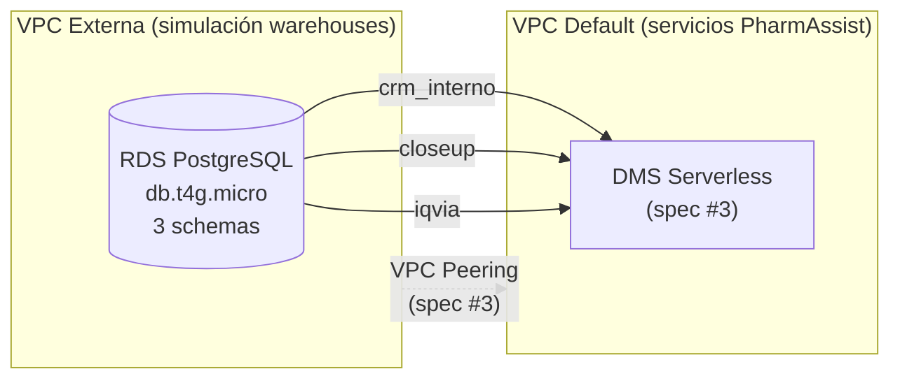

# Design — data-sources-simulation

## Arquitectura



## Decisiones de diseño

### RDS PostgreSQL (no Aurora, no MySQL)

- PostgreSQL soporta schemas nativamente (un solo cluster, 3 schemas separados)
- Es el motor más cercano a lo que usan los clientes reales (SQL Server/Synapse se mapea bien a PG)
- `db.t4g.micro` es suficiente para datos sintéticos y cuesta ~$12/mes
- Aurora sería overkill para simulación

### VPC separada

- Simula el escenario real donde los warehouses están fuera de AWS (o en otra cuenta)
- Permite practicar VPC Peering (que se configura en spec #3 para DMS)
- Security Groups restringen acceso solo desde la VPC de servicios

### Un solo RDS con 3 schemas (no 3 instancias)

- Reduce costo (una sola instancia)
- PostgreSQL schemas proveen aislamiento lógico suficiente
- En producción real serían 3 fuentes distintas, pero para simulación es equivalente

### Datos sintéticos via script Python (no Glue, no Lambda)

- Script local que se ejecuta una vez para poblar el RDS
- Usa `faker` + `numpy` para distribuciones realistas
- Se conecta directamente al RDS via Security Group temporal o bastion
- No necesita infraestructura adicional — es un one-shot

## CDK Stack: DataSourcesStack

### Recursos

| Recurso | Tipo | Config |
|---------|------|--------|
| VPC | `ec2.Vpc` | 2 AZs, solo subnets privadas + NAT (o isolated sin NAT) |
| Security Group | `ec2.SecurityGroup` | Ingress: PostgreSQL (5432) desde VPC de servicios |
| RDS Instance | `rds.DatabaseInstance` | PostgreSQL 16, db.t4g.micro, 20GB gp3 |
| Secret | `secretsmanager.Secret` | Credenciales del RDS (auto-generated) |

### Configuración del RDS

```python
# Parámetros clave
engine = rds.DatabaseInstanceEngine.postgres(version=rds.PostgresEngineVersion.VER_16)
instance_type = ec2.InstanceType.of(ec2.InstanceClass.T4G, ec2.InstanceSize.MICRO)
allocated_storage = 20  # GB, suficiente para ~10M rows total
multi_az = False  # dev, no necesita HA
deletion_protection = False  # dev, fácil de destruir
removal_policy = RemovalPolicy.DESTROY
```

### Outputs del stack

| Output | Valor | Consumidor |
|--------|-------|-----------|
| `RdsEndpoint` | Endpoint del RDS | Script de datos + DMS (spec #3) |
| `RdsPort` | 5432 | Script de datos + DMS |
| `RdsSecretArn` | ARN del secret en Secrets Manager | DMS + script |
| `VpcId` | ID de la VPC externa | VPC Peering (spec #3) |
| `SecurityGroupId` | SG del RDS | DMS endpoint config |

## Schema DDL

Los schemas completos están definidos en `docs/research-external-schemas.md`. El CDK stack no crea los schemas — eso lo hace el script de inicialización post-deploy.

### Orden de creación de schemas

1. `crm_interno` — tablas independientes primero (zona, especialidad, tag), luego dependientes
2. `closeup` — dimensiones primero, fact table después
3. `iqvia` — dimensiones primero, fact table después
4. `maestros` — al final (referencia conceptual a las otras 3)

## Script de datos sintéticos

### Estructura

```
scripts/
└── seed_data/
    ├── __init__.py
    ├── main.py              # Entry point — orquesta la generación
    ├── config.py            # Volúmenes, seeds, conexión
    ├── generators/
    │   ├── __init__.py
    │   ├── crm_generator.py      # Genera datos del CRM interno
    │   ├── closeup_generator.py  # Genera datos de CloseUp
    │   ├── iqvia_generator.py    # Genera datos de IQVIA
    │   └── maestros_generator.py # Genera maestros de integración
    ├── schemas/
    │   ├── __init__.py
    │   ├── crm_ddl.sql           # DDL del schema crm_interno
    │   ├── closeup_ddl.sql       # DDL del schema closeup
    │   ├── iqvia_ddl.sql         # DDL del schema iqvia
    │   └── maestros_ddl.sql      # DDL del schema maestros
    └── requirements.txt          # faker, numpy, psycopg2-binary, python-dotenv
```

### Volúmenes objetivo

| Schema | Tabla | Rows | Justificación |
|--------|-------|------|---------------|
| crm_interno | apm | 50 | Equipo de campo mediano |
| crm_interno | doctor | 3,000 | ~60 médicos por APM |
| crm_interno | agenda | 80,000 | ~2 años, ~5 visitas/día/APM |
| crm_interno | agenda_producto | 240,000 | ~3 productos por visita |
| crm_interno | familia_producto | 150 | Portfolio del laboratorio |
| crm_interno | ultima_milla_medico | 3,000 | 1 row por médico |
| crm_interno | ultima_milla_marca | 30,000 | ~10 marcas por médico |
| closeup | medico | 15,000 | Universo de médicos trackeados |
| closeup | marca | 3,000 | Productos de todos los labs |
| closeup | prescripcion | 3,000,000 | 24 meses × 15K médicos × ~8 prod/mes |
| closeup | mercado | 60 | Categorías terapéuticas |
| iqvia | dim_presentacion | 8,000 | Productos comerciales |
| iqvia | fact_mercado_valor | 2,500,000 | 8K prod × 36 meses × ~10 geos |
| maestros | maestro_medicos | 3,000 | Médicos atendidos por el lab |
| maestros | maestro_integrador_producto | 300 | Productos del lab + competidores clave |

### Estrategia de coherencia

```
1. Generar dimensiones base (zonas, especialidades, líneas)
2. Generar APMs y asignar zonas/líneas
3. Generar médicos (CRM) con especialidades y zonas
4. Generar médicos (CloseUp) — superset de los del CRM
5. Generar maestro_medicos — subset que cruza CRM ↔ CloseUp
6. Generar productos (CRM familia_producto)
7. Generar productos (CloseUp marca) y (IQVIA dim_presentacion)
8. Generar maestro_integrador_producto — cruza los 3
9. Generar familia_interno_a_marca_cup — N:M con DISTINCT
10. Generar fact tables con distribuciones realistas
    - Prescripciones: Pareto (20% médicos = 80% volumen)
    - Ventas: estacionalidad + tendencia + ruido
    - Visitas: distribución uniforme con gaps realistas
```

## Variables de entorno nuevas

Agregar a `.env.example`:

```bash
# === Data Sources Simulation (from CDK DataSourcesStack outputs) ===
DATASOURCES_RDS_ENDPOINT=xxx.xxx.us-east-1.rds.amazonaws.com
DATASOURCES_RDS_PORT=5432
DATASOURCES_RDS_SECRET_ARN=arn:aws:secretsmanager:us-east-1:ACCOUNT:secret:xxx
DATASOURCES_VPC_ID=vpc-xxxxxxxxx
```

## Queries de validación

Post-seed, ejecutar estas queries para confirmar coherencia:

```sql
-- 1. CRM: médicos asignados a un APM con productos foco
SELECT d.nombre, d.apellido, fp.nombre as producto_foco
FROM crm_interno.cartera_medica cm
JOIN crm_interno.doctor d ON d.id = cm.doctor_id
JOIN crm_interno.linea_apm la ON la.apm_id = cm.apm_id
JOIN crm_interno.grilla g ON g.linea_id = la.linea_id
JOIN crm_interno.detalle_promocion_producto dpp ON dpp.grilla_id = g.id
JOIN crm_interno.categoria c ON c.id = dpp.categoria_id
JOIN crm_interno.ciclo ci ON ci.id = g.ciclo_id
JOIN crm_interno.familia_producto fp ON fp.id = dpp.familia_producto_id
WHERE cm.apm_id = 1 AND cm.activa = true
  AND c.nombre IN ('foco', 'hiperfoco') AND ci.activo = true
LIMIT 10;

-- 2. CloseUp: top 5 productos prescritos por un médico
SELECT m.codigo_marca, m.nombre_marca, SUM(p.cantidad) as total
FROM closeup.prescripcion p
JOIN closeup.marca m ON m.codigo_marca = p.CDGPRO
WHERE p.CDGMED = (SELECT CDGMED FROM closeup.medico LIMIT 1)
GROUP BY m.codigo_marca, m.nombre_marca
ORDER BY total DESC LIMIT 5;

-- 3. IQVIA: ventas de un producto por período
SELECT dp.nombre_producto, dper.anio, dper.mes, f.unidades, f.valores_ars
FROM iqvia.fact_mercado_valor f
JOIN iqvia.dim_presentacion dp ON dp.idProducto = f.idProducto
JOIN iqvia.dim_periodo dper ON dper.idPeriodo = f.idPeriodo
WHERE dp.idProducto = (SELECT idProducto FROM iqvia.dim_presentacion LIMIT 1)
ORDER BY dper.anio, dper.mes;

-- 4. Cross-source: prescripciones de productos foco de un APM
SELECT d.nombre || ' ' || d.apellido as medico, mk.nombre_marca, SUM(p.cantidad) as px
FROM crm_interno.cartera_medica cm
JOIN maestros.maestro_medicos mm ON mm.cod_interno = cm.doctor_id
JOIN closeup.prescripcion p ON p.CDGMED = mm.cod_closeup
JOIN maestros.familia_interno_a_marca_cup fimc ON fimc.codigo_marca = p.CDGPRO
JOIN crm_interno.familia_producto fp ON fp.id = fimc.cod_interno::integer
JOIN closeup.marca mk ON mk.codigo_marca = p.CDGPRO
JOIN crm_interno.doctor d ON d.id = cm.doctor_id
WHERE cm.apm_id = 1 AND cm.activa = true
GROUP BY d.nombre, d.apellido, mk.nombre_marca
ORDER BY px DESC LIMIT 10;
```
