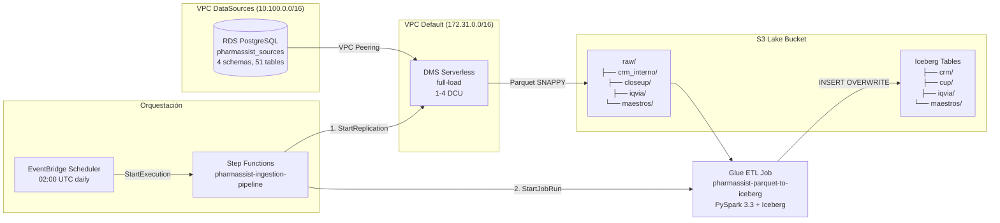
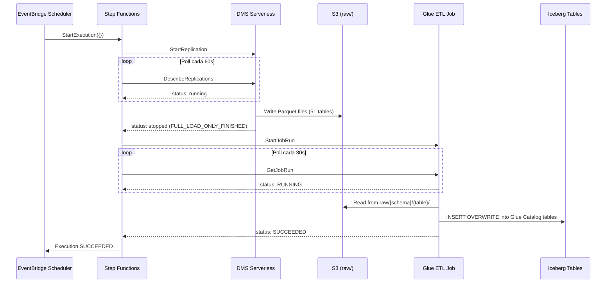
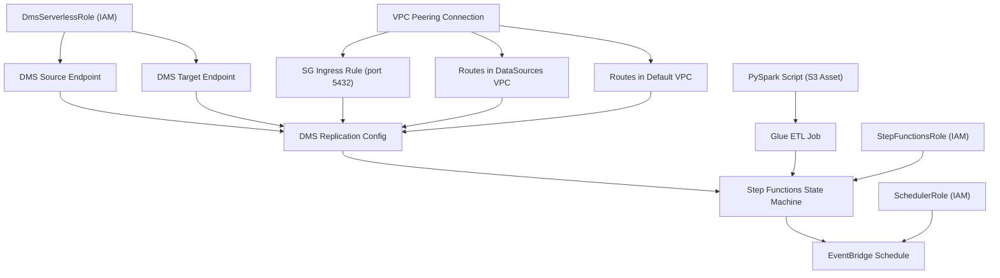

# Design — ingestion-dms

## Overview

Este documento describe el diseño técnico del pipeline de ingesta que replica datos desde el RDS PostgreSQL (VPC 10.100.0.0/16, spec #1) hacia el data lake S3 Iceberg (spec #2), orquestado por Step Functions y programado con EventBridge.

El pipeline sigue un patrón **full-load diario**: DMS Serverless extrae los 4 schemas completos a Parquet en una landing zone (`raw/`), y un Glue ETL Job convierte esos Parquet a tablas Iceberg ya registradas en Glue Catalog. La orquestación usa polling (no callbacks) para monitorear el progreso de DMS y Glue.

### Decisiones de diseño clave

| Decisión | Elección | Razón |
|----------|----------|-------|
| Replicación | Full-load (no CDC) | Volúmenes de simulación pequeños (~5M rows total), simplicidad operativa |
| Formato intermedio | Parquet SNAPPY | Columnar, comprimido, nativo de DMS y Spark |
| Escritura Iceberg | Overwrite por tabla | Idempotencia sin lógica de merge |
| Orquestación | Step Functions + polling | Sin callbacks, sin Lambda intermedias para DMS |
| Networking | VPC Peering | DMS Serverless opera en VPC default, necesita alcanzar RDS en VPC aislada |
| Schedule | EventBridge Scheduler | Cron diario 02:00 UTC, disabled en dev |


## Architecture

### Data Flow Diagram



### Sequence Diagram — Pipeline Execution




## Components and Interfaces

### CDK Stack Structure

```
infrastructure/
├── app_ingestion.py                          ← Entry point CDK (nuevo)
├── stacks/
│   └── ingestion_stack.py                    ← IngestionStack (nuevo)
├── scripts/
│   └── parquet_to_iceberg.py                 ← PySpark script (nuevo, se sube como CDK Asset)
└── tests/
    └── unit/
        └── test_ingestion_stack.py           ← CDK assertion tests (nuevo)
```

### IngestionStack — Constructor Interface

```python
class IngestionStack(cdk.Stack):
    def __init__(
        self,
        scope: Construct,
        construct_id: str,
        *,
        # Cross-stack parameters (from .env)
        rds_secret_arn: str,           # ARN del Secret de RDS (DataSourcesStack output)
        datasources_vpc_id: str,       # VPC ID de DataSources (10.100.0.0/16)
        lake_bucket_name: str,         # Nombre del bucket S3 (DataLakeStack output)
        glue_database_names: dict,     # {"crm": "pharmassist_crm", "cup": "...", ...}
        # Tags
        tag_project: str = "PharmAssist",
        tag_environment: str = "dev",
        tag_owner: str = "team",
        **kwargs,
    ) -> None:
```

### Resource Dependency Graph




### VPC Peering Design

**Topología de red:**

| VPC | CIDR | Subnets | Propósito |
|-----|------|---------|-----------|
| DataSources VPC | 10.100.0.0/16 | 2× PRIVATE_ISOLATED (/24) | RDS PostgreSQL |
| Default VPC | 172.31.0.0/16 | 3× Public + 3× Private (varies) | DMS Serverless ENIs |

**Peering Connection:**
- Auto-accept: `true` (misma cuenta y región)
- DNS resolution: habilitado en ambos lados (DMS resuelve hostname RDS via peering)

**Route Tables:**

| VPC | Destination CIDR | Target | Subnets afectadas |
|-----|-----------------|--------|-------------------|
| DataSources | 172.31.0.0/16 | pcx-xxx (peering) | Isolated subnets (donde vive RDS) |
| Default | 10.100.0.0/16 | pcx-xxx (peering) | Todas (public + private) — DMS puede instanciarse en cualquiera |

**Security Group (RDS):**

| Direction | Protocol | Port | Source | Descripción |
|-----------|----------|------|--------|-------------|
| Ingress | TCP | 5432 | 172.31.0.0/16 | DMS Serverless desde VPC default |

**Nota CDK:** Se usa `ec2.Vpc.from_lookup()` para importar la VPC default y la VPC de DataSources. Las rutas se agregan iterando sobre las route tables de cada subnet.

### DMS Configuration

#### Source Endpoint (RDS PostgreSQL)

```python
# Pseudocódigo CDK
source_endpoint = dms.CfnEndpoint(
    endpoint_type="source",
    engine_name="postgres",
    postgres_settings=dms.CfnEndpoint.PostgreSqlSettingsProperty(
        secrets_manager_secret_id=rds_secret_arn,
        secrets_manager_access_role_arn=dms_role.role_arn,
        database_name="pharmassist",  # Nota: DMS usa "pharmassist" no "pharmassist_sources"
    ),
    ssl_mode="require",
)
```

**Nota importante:** El RDS fue creado con `database_name="pharmassist_sources"` en spec #1, pero los schemas viven dentro de esa database. DMS necesita el nombre real de la database para conectarse. Verificar en deploy que el `database_name` del endpoint coincida con el nombre real.

#### Target Endpoint (S3 Parquet)

```python
target_endpoint = dms.CfnEndpoint(
    endpoint_type="target",
    engine_name="s3",
    s3_settings=dms.CfnEndpoint.S3SettingsProperty(
        bucket_name=lake_bucket_name,
        bucket_folder="raw",
        service_access_role_arn=dms_role.role_arn,
        data_format="parquet",
        parquet_version="PARQUET_2_0",
        encoding_type="PLAIN_DICTIONARY",
        compression_type="SNAPPY",  # Nota: DMS usa "SNAPPY" no "snappy"
        add_column_name=True,
        timestamp_column_name="fecha_carga",
    ),
)
```

#### Table Mappings JSON

```json
{
  "rules": [
    {
      "rule-type": "selection",
      "rule-id": "1",
      "rule-name": "include-crm-interno",
      "object-locator": {
        "schema-name": "crm_interno",
        "table-name": "%"
      },
      "rule-action": "include"
    },
    {
      "rule-type": "selection",
      "rule-id": "2",
      "rule-name": "include-closeup",
      "object-locator": {
        "schema-name": "closeup",
        "table-name": "%"
      },
      "rule-action": "include"
    },
    {
      "rule-type": "selection",
      "rule-id": "3",
      "rule-name": "include-iqvia",
      "object-locator": {
        "schema-name": "iqvia",
        "table-name": "%"
      },
      "rule-action": "include"
    },
    {
      "rule-type": "selection",
      "rule-id": "4",
      "rule-name": "include-maestros",
      "object-locator": {
        "schema-name": "maestros",
        "table-name": "%"
      },
      "rule-action": "include"
    }
  ]
}
```

**Resultado en S3:** DMS escribe archivos en `s3://{bucket}/raw/{schema_name}/{table_name}/LOAD00000001.parquet`


#### DMS Replication Config (Serverless)

```python
replication_config = dms.CfnReplicationConfig(
    replication_config_identifier="pharmassist-full-load",
    replication_type="full-load",
    source_endpoint_arn=source_endpoint.ref,
    target_endpoint_arn=target_endpoint.ref,
    table_mappings=json.dumps(table_mappings),
    compute_config=dms.CfnReplicationConfig.ComputeConfigProperty(
        min_capacity_units=1,
        max_capacity_units=4,
        multi_az=False,
        replication_subnet_group_id=subnet_group.ref,
        vpc_security_group_ids=[dms_security_group.security_group_id],
    ),
)
```

### Glue ETL Design

#### PySpark Script Logic (`parquet_to_iceberg.py`)

```python
# Pseudocódigo del script PySpark
import sys
from awsglue.utils import getResolvedOptions
from pyspark.sql import SparkSession

args = getResolvedOptions(sys.argv, ["lake_bucket", "JOB_NAME"])
lake_bucket = args["lake_bucket"]

# Configurar SparkSession con Iceberg + Glue Catalog
spark = SparkSession.builder \
    .config("spark.sql.catalog.glue_catalog", "org.apache.iceberg.spark.SparkCatalog") \
    .config("spark.sql.catalog.glue_catalog.catalog-impl", "org.apache.iceberg.aws.glue.GlueCatalog") \
    .config("spark.sql.catalog.glue_catalog.warehouse", f"s3://{lake_bucket}/") \
    .config("spark.sql.extensions", "org.apache.iceberg.spark.extensions.IcebergSparkSessionExtensions") \
    .getOrCreate()

# Schema mapping: RDS schema → Glue database
SCHEMA_MAP = {
    "crm_interno": "pharmassist_crm",
    "closeup": "pharmassist_cup",
    "iqvia": "pharmassist_iqvia",
    "maestros": "pharmassist_maestros",
}

results = {"success": [], "failed": [], "skipped": []}

for schema_name, glue_db in SCHEMA_MAP.items():
    # Descubrir tablas del Glue Catalog (no hardcoded)
    tables = spark.catalog.listTables(f"glue_catalog.{glue_db}")
    
    for table in tables:
        raw_path = f"s3://{lake_bucket}/raw/{schema_name}/{table.name}/"
        
        try:
            # Verificar si existen archivos Parquet
            df = spark.read.parquet(raw_path)
            if df.head(1) is None:
                results["skipped"].append(f"{glue_db}.{table.name}")
                continue
            
            # Escribir en tabla Iceberg con overwrite
            df.writeTo(f"glue_catalog.{glue_db}.{table.name}") \
              .overwritePartitions()  # Para tablas particionadas
            
            count = df.count()
            results["success"].append(f"{glue_db}.{table.name} ({count} rows)")
            
        except Exception as e:
            results["failed"].append(f"{glue_db}.{table.name}: {str(e)}")
            continue

# Resumen final
print(f"SUCCESS: {len(results['success'])} tables")
print(f"SKIPPED: {len(results['skipped'])} tables")
print(f"FAILED: {len(results['failed'])} tables")

if results["failed"]:
    for f in results["failed"]:
        print(f"  ERROR: {f}")
    sys.exit(1)
```

#### Glue Job Configuration

| Parámetro | Valor | Razón |
|-----------|-------|-------|
| Worker type | G.1X (4 vCPU, 16 GB) | Suficiente para ~5M rows total |
| Number of workers | 2 | Mínimo para paralelismo |
| Glue version | 4.0 | Spark 3.3 con Iceberg nativo |
| Timeout | 60 min | Margen amplio para full-load |
| Job bookmark | DISABLED | Full-load idempotente, no necesita tracking |
| Max retries | 0 | Step Functions maneja reintentos |
| Script location | `s3://{bucket}/scripts/parquet_to_iceberg.py` | CDK Asset |

#### Iceberg Write Strategy

| Tipo de tabla | Estrategia | Ejemplo |
|---------------|-----------|---------|
| Sin particiones | `overwritePartitions()` (equivale a overwrite completo) | `dim_droga`, `zona`, `especialidad` |
| Particionada por fecha | `overwritePartitions()` | `agenda` (por `fecha_visita`) |
| Particionada multi-columna | `overwritePartitions()` | `prescripcion` (por `anio`, `mes`, `cdgreg_pmix`) |
| Particionada por período | `overwritePartitions()` | `fact_mercado_valor` (por `idperiodo`) |

**Nota:** `overwritePartitions()` en Iceberg reemplaza solo las particiones presentes en el DataFrame. Como hacemos full-load, todas las particiones se reescriben. Esto es idempotente: ejecutar dos veces produce el mismo resultado.


### Step Functions State Machine

#### ASL Definition (conceptual)

```json
{
  "Comment": "PharmAssist Ingestion Pipeline: DMS → Glue ETL",
  "StartAt": "StartDmsReplication",
  "TimeoutSeconds": 3600,
  "States": {
    "StartDmsReplication": {
      "Type": "Task",
      "Resource": "arn:aws:states:::aws-sdk:databasemigration:startReplication",
      "Parameters": {
        "ReplicationConfigArn": "${ReplicationConfigArn}"
      },
      "ResultPath": "$.dmsStart",
      "Next": "WaitForDms",
      "Catch": [{
        "ErrorEquals": ["States.ALL"],
        "Next": "PipelineFailed"
      }]
    },
    "WaitForDms": {
      "Type": "Wait",
      "Seconds": 60,
      "Next": "CheckDmsStatus"
    },
    "CheckDmsStatus": {
      "Type": "Task",
      "Resource": "arn:aws:states:::aws-sdk:databasemigration:describeReplications",
      "Parameters": {
        "Filters": [{
          "Name": "replication-config-arn",
          "Values": ["${ReplicationConfigArn}"]
        }]
      },
      "ResultPath": "$.dmsStatus",
      "Next": "IsDmsComplete"
    },
    "IsDmsComplete": {
      "Type": "Choice",
      "Choices": [
        {
          "Variable": "$.dmsStatus.Replications[0].Status",
          "StringEquals": "stopped",
          "Next": "CheckDmsStopReason"
        },
        {
          "Variable": "$.dmsStatus.Replications[0].Status",
          "StringEquals": "failed",
          "Next": "PipelineFailed"
        }
      ],
      "Default": "WaitForDms"
    },
    "CheckDmsStopReason": {
      "Type": "Choice",
      "Choices": [
        {
          "Variable": "$.dmsStatus.Replications[0].StopReason",
          "StringEquals": "FULL_LOAD_ONLY_FINISHED",
          "Next": "StartGlueJob"
        }
      ],
      "Default": "PipelineFailed"
    },
    "StartGlueJob": {
      "Type": "Task",
      "Resource": "arn:aws:states:::aws-sdk:glue:startJobRun",
      "Parameters": {
        "JobName": "pharmassist-parquet-to-iceberg",
        "Arguments": {
          "--lake_bucket": "${LakeBucketName}"
        }
      },
      "ResultPath": "$.glueStart",
      "Next": "WaitForGlue",
      "Catch": [{
        "ErrorEquals": ["States.ALL"],
        "Next": "PipelineFailed"
      }]
    },
    "WaitForGlue": {
      "Type": "Wait",
      "Seconds": 30,
      "Next": "CheckGlueStatus"
    },
    "CheckGlueStatus": {
      "Type": "Task",
      "Resource": "arn:aws:states:::aws-sdk:glue:getJobRun",
      "Parameters": {
        "JobName": "pharmassist-parquet-to-iceberg",
        "RunId.$": "$.glueStart.JobRunId"
      },
      "ResultPath": "$.glueStatus",
      "Next": "IsGlueComplete"
    },
    "IsGlueComplete": {
      "Type": "Choice",
      "Choices": [
        {
          "Variable": "$.glueStatus.JobRun.JobRunState",
          "StringEquals": "SUCCEEDED",
          "Next": "PipelineSucceeded"
        },
        {
          "Or": [
            {"Variable": "$.glueStatus.JobRun.JobRunState", "StringEquals": "FAILED"},
            {"Variable": "$.glueStatus.JobRun.JobRunState", "StringEquals": "TIMEOUT"},
            {"Variable": "$.glueStatus.JobRun.JobRunState", "StringEquals": "ERROR"}
          ],
          "Next": "PipelineFailed"
        }
      ],
      "Default": "WaitForGlue"
    },
    "PipelineSucceeded": {
      "Type": "Succeed"
    },
    "PipelineFailed": {
      "Type": "Fail",
      "Error": "PipelineError",
      "Cause": "DMS replication or Glue ETL job failed"
    }
  }
}
```

### EventBridge Schedule

| Parámetro | Valor |
|-----------|-------|
| Name | `pharmassist-ingestion-schedule` |
| Expression | `cron(0 2 * * ? *)` (02:00 UTC diario) |
| Timezone | UTC |
| State | DISABLED (dev) / ENABLED (prod) |
| Target | State Machine ARN |
| Input | `{}` |
| Retry policy | max 2 retries, 60 min max event age |
| Flexible time window | OFF |


### IAM Roles

#### DmsServerlessRole

```yaml
Trust Policy:
  Service: dms.amazonaws.com

Inline Policy - S3Access:
  - Effect: Allow
    Action:
      - s3:PutObject
      - s3:DeleteObject
    Resource: arn:aws:s3:::{lake_bucket}/raw/*
  - Effect: Allow
    Action:
      - s3:ListBucket
      - s3:GetBucketLocation
    Resource: arn:aws:s3:::{lake_bucket}
    Condition:
      StringLike:
        s3:prefix: "raw/*"

Inline Policy - SecretsAccess:
  - Effect: Allow
    Action:
      - secretsmanager:GetSecretValue
      - secretsmanager:DescribeSecret
    Resource: {rds_secret_arn}
```

#### StepFunctionsRole

```yaml
Trust Policy:
  Service: states.amazonaws.com

Inline Policy - DmsAccess:
  - Effect: Allow
    Action:
      - dms:StartReplication
      - dms:DescribeReplications
    Resource: {replication_config_arn}

Inline Policy - GlueAccess:
  - Effect: Allow
    Action:
      - glue:StartJobRun
      - glue:GetJobRun
    Resource: arn:aws:glue:{region}:{account}:job/pharmassist-parquet-to-iceberg
```

#### SchedulerRole

```yaml
Trust Policy:
  Service: scheduler.amazonaws.com

Inline Policy - StartExecution:
  - Effect: Allow
    Action:
      - states:StartExecution
    Resource: {state_machine_arn}
```

#### DMS VPC Role (service-linked)

```yaml
Role Name: dms-vpc-role
Trust Policy:
  Service: dms.amazonaws.com
Managed Policy: arn:aws:iam::aws:policy/service-role/AmazonDMSVPCManagementRole
```

**Nota:** Este role es un service-linked role que DMS necesita para gestionar ENIs en la VPC. Se crea solo si no existe previamente en la cuenta.


## Data Models

### S3 Path Structure

```
s3://{lake_bucket}/
├── raw/                              ← Landing zone (DMS output)
│   ├── crm_interno/
│   │   ├── apm/LOAD00000001.parquet
│   │   ├── doctor/LOAD00000001.parquet
│   │   ├── agenda/LOAD00000001.parquet
│   │   └── ... (25 tables)
│   ├── closeup/
│   │   ├── prescripcion/LOAD00000001.parquet
│   │   └── ... (10 tables)
│   ├── iqvia/
│   │   ├── fact_mercado_valor/LOAD00000001.parquet
│   │   └── ... (13 tables)
│   └── maestros/
│       ├── maestro_medicos/LOAD00000001.parquet
│       └── ... (3 tables)
├── crm/                              ← Iceberg tables (Glue ETL output)
│   ├── apm/
│   │   ├── data/...
│   │   └── metadata/...
│   └── ...
├── cup/
├── iqvia/
├── maestros/
├── scripts/
│   └── parquet_to_iceberg.py         ← PySpark script (CDK Asset)
└── athena-results/                   ← Athena query results
```

### Schema Mapping (RDS → Glue Catalog)

| RDS Schema | Glue Database | S3 Iceberg Prefix | Tables |
|------------|---------------|-------------------|--------|
| `crm_interno` | `pharmassist_crm` | `crm/` | 25 |
| `closeup` | `pharmassist_cup` | `cup/` | 10 |
| `iqvia` | `pharmassist_iqvia` | `iqvia/` | 13 |
| `maestros` | `pharmassist_maestros` | `maestros/` | 3 |

### Partition Strategy

| Table | Partition Columns | Transform |
|-------|-------------------|-----------|
| `crm_interno.agenda` | `fecha_visita` | identity |
| `closeup.prescripcion` | `anio`, `mes`, `cdgreg_pmix` | identity |
| `iqvia.fact_mercado_valor` | `idperiodo` | identity |
| Todas las demás | (ninguna) | — |

### DMS Timestamp Column

DMS agrega una columna `fecha_carga` (tipo TIMESTAMP) a cada registro con el momento UTC de la extracción. Esta columna:
- Se incluye en los Parquet de la landing zone
- Se descarta durante la escritura a Iceberg (las tablas Iceberg no la tienen en su schema)
- Sirve para auditoría y debugging en la landing zone

### CloudFormation Outputs

| Output | Valor | Uso |
|--------|-------|-----|
| `StateMachineArn` | ARN de la State Machine | Para EventBridge y ejecución manual |
| `GlueJobName` | `pharmassist-parquet-to-iceberg` | Para monitoreo y debugging |
| `ScheduleArn` | ARN del EventBridge Schedule | Para habilitar/deshabilitar |


## Correctness Properties

*A property is a characteristic or behavior that should hold true across all valid executions of a system — essentially, a formal statement about what the system should do. Properties serve as the bridge between human-readable specifications and machine-verifiable correctness guarantees.*

**Nota sobre alcance PBT:** Este spec es mayoritariamente IaC (CDK) + orquestación (Step Functions, EventBridge). La infraestructura se valida con CDK assertion tests (snapshot/template inspection). Las propiedades a continuación aplican al **PySpark script** y al **entry point**, que son los componentes con lógica pura testeable.

### Property 1: Schema-to-database mapping is correct and complete

*For any* schema name in the set `{crm_interno, closeup, iqvia, maestros}`, the mapping function SHALL return the corresponding Glue database name (`pharmassist_crm`, `pharmassist_cup`, `pharmassist_iqvia`, `pharmassist_maestros` respectively), and for any string NOT in that set, the mapping SHALL raise an error or return None.

**Validates: Requirements 5.4, 5.5, 5.6, 5.7, 11.4**

### Property 2: S3 read path construction follows convention

*For any* valid schema name and table name (non-empty strings without path separators), the constructed S3 read path SHALL match the pattern `s3://{bucket}/raw/{schema_name}/{table_name}/` exactly, with no double slashes, no trailing characters beyond the final slash, and preserving the original case of schema and table names.

**Validates: Requirements 5.2, 11.4**

### Property 3: Idempotent write produces identical results

*For any* valid input DataFrame written to an Iceberg table, executing the write operation twice with the same input data SHALL produce the same row count in the target table after each execution, verifiable by `COUNT(*)` returning an identical value.

**Validates: Requirements 5.3, 6.1, 6.7**

### Property 4: Partition strategy selection matches table definition

*For any* table in the Glue Catalog, if the table has partition keys defined, the write operation SHALL use `overwritePartitions()` with those specific partition columns. If the table has no partition keys, the write operation SHALL use full table overwrite. The partition columns used SHALL exactly match those defined in the Glue Catalog table metadata.

**Validates: Requirements 6.2, 6.3, 6.4, 6.5**

### Property 5: Resilient processing continues despite individual failures

*For any* set of N tables to process where K tables (0 ≤ K < N) fail or have missing data, the script SHALL successfully process all remaining (N - K) tables, and the final results SHALL contain exactly (N - K) entries in the success/skipped lists and K entries in the failed list.

**Validates: Requirements 5.11, 5.12, 11.6, 11.8**

### Property 6: Exit code reflects failure state

*For any* execution where at least one table fails during processing (not skipped, but actually errors), the script SHALL exit with code 1. *For any* execution where zero tables fail (all succeed or are skipped), the script SHALL exit with code 0.

**Validates: Requirements 11.9**

### Property 7: Progress logging contains required fields

*For any* table that is successfully processed, the log output SHALL contain the fully qualified table name (`{database}.{table}`), the row count as a positive integer, and the processing time in seconds. All three fields must be present for every successful table.

**Validates: Requirements 11.7**

### Property 8: Missing parameter validation fails fast

*For any* combination of required parameters (`rds_secret_arn`, `datasources_vpc_id`, `lake_bucket_name`, `glue_database_names`) where at least one is None or empty string, the entry point SHALL raise a ValueError (or equivalent) that names the specific missing variable, before attempting to synthesize the CDK stack.

**Validates: Requirements 10.10**


## Error Handling

### DMS Replication Errors

| Error | Causa | Manejo |
|-------|-------|--------|
| Connection timeout | VPC Peering no configurado, SG bloqueando | Step Functions detecta `status=failed`, pipeline termina con FAILED |
| Authentication failure | Secret incorrecto o rotado | DMS reporta error sin exponer credenciales |
| Table not found | Schema no existe en RDS | DMS omite la tabla, continúa con las demás |
| S3 write failure | Permisos insuficientes en DmsServerlessRole | Step Functions detecta `status=failed` |

### Glue ETL Errors

| Error | Causa | Manejo |
|-------|-------|--------|
| No Parquet files | DMS no generó datos para una tabla | Script registra warning, omite tabla, continúa |
| Schema mismatch | Columnas en Parquet no coinciden con Iceberg | Script registra error, omite tabla, continúa |
| S3 permission denied | GlueEtlRole sin permisos | Job falla con FAILED, Step Functions captura |
| OOM (Out of Memory) | Tabla demasiado grande para G.1X workers | Job falla con ERROR, Step Functions captura |
| Timeout (60 min) | Procesamiento excede el límite | Job falla con TIMEOUT, Step Functions captura |

### Step Functions Error Handling

| Estado | Error | Acción |
|--------|-------|--------|
| StartDmsReplication | API error | Catch → PipelineFailed |
| CheckDmsStatus | DMS status=failed | Choice → PipelineFailed |
| StartGlueJob | API error | Catch → PipelineFailed |
| CheckGlueStatus | Glue status=FAILED/TIMEOUT/ERROR | Choice → PipelineFailed |
| Global | TimeoutSeconds=3600 exceeded | Execution status=TIMED_OUT |

### Entry Point Validation

| Condición | Error | Mensaje |
|-----------|-------|---------|
| `RDS_SECRET_ARN` vacío/None | ValueError | "Missing required env var: RDS_SECRET_ARN" |
| `DATASOURCES_VPC_ID` vacío/None | ValueError | "Missing required env var: DATASOURCES_VPC_ID" |
| `LAKE_BUCKET_NAME` vacío/None | ValueError | "Missing required env var: LAKE_BUCKET_NAME" |
| Cualquier `GLUE_DB_*` vacío/None | ValueError | "Missing required env var: GLUE_DB_{domain}" |

### Recovery Strategy

El pipeline es **full-load idempotente**: la estrategia de recovery es simplemente re-ejecutar. No hay estado parcial que limpiar porque:
- DMS full-load sobrescribe archivos en `raw/`
- Glue ETL usa `overwritePartitions()` que reemplaza datos existentes
- No hay CDC ni offsets que trackear

Para re-ejecutar manualmente:
```bash
aws stepfunctions start-execution \
  --state-machine-arn {arn} \
  --input '{}' \
  --region us-east-1
```


## Testing Strategy

### Dual Testing Approach

Este spec combina **infraestructura (CDK)** con **lógica de datos (PySpark)**. Cada parte se testea con la estrategia apropiada:

| Componente | Estrategia | Framework |
|------------|-----------|-----------|
| CDK Stack (IaC) | CDK assertion tests (template inspection) | pytest + aws_cdk.assertions |
| PySpark script (lógica) | Property-based tests + unit tests | pytest + hypothesis |
| Pipeline end-to-end | Integration tests (post-deploy) | pytest + boto3 |

### CDK Assertion Tests (`test_ingestion_stack.py`)

Tests que inspeccionan el template CloudFormation sintetizado:

1. **VPC Peering** — Verifica que existe CfnVPCPeeringConnection con CIDRs correctos
2. **Routes** — Verifica rutas en ambas VPCs con destinos correctos
3. **Security Group** — Verifica ingress rule TCP/5432 desde 172.31.0.0/16
4. **DMS Source Endpoint** — Verifica engine=postgres, SSL=require, SecretsManager config
5. **DMS Target Endpoint** — Verifica engine=s3, Parquet, SNAPPY, bucket folder=raw
6. **Replication Config** — Verifica full-load, capacity 1-4 DCU, multi_az=false
7. **Glue Job** — Verifica nombre, worker type G.1X, workers=2, version 4.0, timeout 60min
8. **State Machine** — Verifica tipo STANDARD, timeout 3600s
9. **EventBridge Schedule** — Verifica cron, state=DISABLED, target=state machine
10. **IAM No Wildcards** — Verifica que ninguna policy tiene Action="*"
11. **IAM DmsServerlessRole** — Verifica trust policy y permisos específicos
12. **Outputs** — Verifica exactamente 3 CfnOutputs
13. **Tags** — Verifica tags Project, Environment, Owner, ManagedBy en recursos

### Property-Based Tests (PySpark logic)

Framework: **hypothesis** (Python PBT library)
Configuración: mínimo 100 ejemplos por propiedad

Cada test referencia su propiedad del design document:

```python
# Tag format example:
# Feature: ingestion-dms, Property 1: Schema-to-database mapping is correct and complete

@given(schema_name=st.sampled_from(["crm_interno", "closeup", "iqvia", "maestros"]))
@settings(max_examples=100)
def test_property_1_schema_mapping(schema_name):
    """Feature: ingestion-dms, Property 1: Schema-to-database mapping"""
    result = get_glue_database(schema_name)
    expected = {
        "crm_interno": "pharmassist_crm",
        "closeup": "pharmassist_cup",
        "iqvia": "pharmassist_iqvia",
        "maestros": "pharmassist_maestros",
    }
    assert result == expected[schema_name]
```

Properties to implement:
- **Property 1**: Schema mapping correctness (sampled_from valid schemas + text for invalid)
- **Property 2**: S3 path construction (generated schema/table name strings)
- **Property 3**: Idempotent write (mock Iceberg writer, verify same state after 2 calls)
- **Property 4**: Partition strategy selection (generated table metadata with/without partitions)
- **Property 5**: Resilient processing (generated list of tables with random failures injected)
- **Property 6**: Exit code reflects failures (generated success/failure combinations)
- **Property 7**: Progress logging fields (generated table processing results)
- **Property 8**: Missing parameter validation (generated combinations of None/empty params)

### Unit Tests (specific examples)

1. Table mappings JSON has exactly 4 selection rules
2. State machine ASL has correct state transitions
3. Entry point loads .env correctly
4. PySpark script handles `fecha_carga` column (drop before Iceberg write)

### Integration Tests (post-deploy)

Ejecutar después de `cdk deploy` exitoso:

1. **DMS connectivity** — `dms:TestConnection` al source endpoint
2. **Full pipeline run** — Start execution, wait for SUCCEEDED
3. **Row count validation** — Compare RDS COUNT(*) vs Athena COUNT(*) for key tables
4. **Partition pruning** — Query with WHERE on partition column, verify reduced scan
5. **Idempotency** — Run pipeline twice, verify same row counts

### Test File Structure

```
infrastructure/tests/
├── unit/
│   ├── test_ingestion_stack.py       ← CDK assertion tests (13+ tests)
│   └── test_pyspark_logic.py         ← Property-based tests (8 properties)
└── integration/
    └── test_ingestion_pipeline.py    ← Post-deploy validation (5 tests)
```

### PBT Library Configuration

```python
# conftest.py or test file header
from hypothesis import settings, Phase

# Global settings for ingestion-dms property tests
settings.register_profile(
    "ingestion-dms",
    max_examples=100,
    phases=[Phase.explicit, Phase.generate, Phase.shrink],
)
settings.load_profile("ingestion-dms")
```

