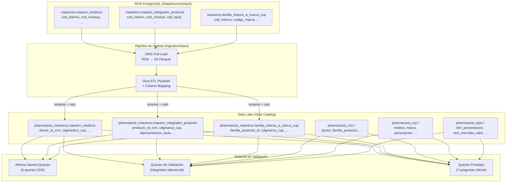

# Documento de Diseño — Maestros Integration

## Overview

Este diseño cubre el sistema de validación e integración de las tablas maestras que actúan como "pegamento" entre las 3 fuentes de datos de PharmAssist (CRM interno, CloseUp/CUP, IQVIA). El sistema tiene 4 componentes principales:

1. **Column Mapping ETL**: Extensión del script PySpark existente (`parquet_to_iceberg.py`) para manejar el renombrado de columnas RDS → Glue y el enriquecimiento de columnas derivadas.
2. **Athena Named Queries (CDK)**: 6 named queries desplegadas como recursos CDK en el workgroup `pharmassist-validation` para monitoreo continuo de calidad.
3. **Scripts de Validación**: Queries SQL ejecutables en Athena que validan integridad referencial, cobertura de mapeo y coherencia cross-source.
4. **Queries Prototipo**: 7 queries SQL que demuestran que los maestros habilitan las preguntas priorizadas del cliente.

### Decisiones de diseño clave

- **No se crea un stack CDK nuevo**: Las named queries se agregan al `IngestionStack` existente (o a un construct dedicado dentro del mismo) porque dependen del mismo workgroup Athena.
- **El ETL no enriquece columnas**: Las columnas extra en Glue (nombre, apellido, especialidad, etc.) se dejan NULL en la carga inicial. Se poblarán en un paso posterior de enriquecimiento (fuera de scope de este spec).
- **Validación post-pipeline**: Todas las queries de validación requieren que el pipeline de ingesta haya corrido al menos una vez. El diseño documenta este prerequisito.
- **SQL puro en Athena**: Las validaciones se implementan como SQL estándar ejecutable en Athena, no como scripts Python complejos.


## Arquitectura



### Flujo de ejecución

1. **Pipeline de ingesta** (Step Functions): DMS extrae de RDS → S3 Parquet → Glue ETL transforma y carga en Iceberg
2. **Post-pipeline**: Se ejecutan las named queries de validación para verificar calidad
3. **Ad-hoc**: Las queries prototipo se ejecutan manualmente para validar que los joins cross-source funcionan

### Dependencias de ejecución

| Componente | Prerequisito |
|---|---|
| Named Queries (CDK) | Solo requiere `cdk deploy` — no necesita datos |
| Queries de validación | Pipeline ejecutado al menos 1 vez (tablas con datos) |
| Queries prototipo | Pipeline ejecutado + datos en CRM, CUP, IQVIA |


## Componentes e Interfaces

### 1. Column Mapping (extensión de `pyspark_helpers.py`)

Se agrega un diccionario de mapeo de columnas al módulo `pyspark_helpers.py` existente. El script ETL principal (`parquet_to_iceberg.py`) lo usa para renombrar columnas antes de escribir en Iceberg.

```python
# En pyspark_helpers.py — nuevo diccionario
COLUMN_MAPPING: dict[str, dict[str, str]] = {
    "maestros.maestro_medicos": {
        "cod_interno": "doctor_id_crm",
        "cod_closeup": "cdgmedico_cup",
        "nombre_verificado": "nombre",
        "fecha_mapeo": "fecha_actualizacion",
        # confianza → se descarta (no existe en Glue schema)
    },
    "maestros.maestro_integrador_producto": {
        "cod_interno": "producto_id_crm",
        "cod_closeup": "cdgmarca_cup",
        "cod_iqvia": "idpresentacion_iqvia",
        "nombre_unificado": "nombre_interno",
        "fecha_mapeo": "fecha_actualizacion",
        # principio_activo → se descarta
        # codigo_barras_ean11 → se descarta
    },
    "maestros.familia_interno_a_marca_cup": {
        "cod_interno": "familia_producto_id",
        "codigo_marca": "cdgmarca_cup",
        "relacion": "confianza_match",
        # relacion se transforma: 'exacta'→1.00, 'parcial'→0.70, 'generico'→0.40
    },
}
```

**Interfaz de la función de renombrado:**

```python
def apply_column_mapping(
    df: "DataFrame",
    schema_name: str,
    table_name: str,
) -> "DataFrame":
    """Aplica renombrado de columnas según COLUMN_MAPPING.
    
    Args:
        df: DataFrame PySpark con columnas originales de RDS.
        schema_name: Schema RDS (ej: "maestros").
        table_name: Nombre de la tabla (ej: "maestro_medicos").
    
    Returns:
        DataFrame con columnas renombradas según el mapping.
        Columnas sin mapping se descartan.
        Columnas destino sin origen se agregan como NULL.
    
    Raises:
        ValueError: Si una columna fuente del mapping no existe en el DataFrame.
    """
```

### 2. Athena Named Queries (CDK Construct)

Se crea un construct `MaestrosValidationQueries` que registra las 6 named queries como recursos `CfnNamedQuery` en el workgroup `pharmassist-validation`.

```python
# infrastructure/constructs/maestros_validation.py
class MaestrosValidationQueries(Construct):
    """Registra named queries de validación de maestros en Athena."""
    
    def __init__(self, scope, id, *, workgroup_name: str, glue_databases: dict):
        # Crea 6 CfnNamedQuery resources
        pass
```

**Named queries a crear:**

| Nombre | Propósito |
|---|---|
| `validacion_maestros_cobertura_medicos` | % de médicos CRM con mapeo en maestro |
| `validacion_maestros_cobertura_productos` | Distribución por cantidad de códigos (3/2/1) |
| `validacion_maestros_huerfanos_medicos` | IDs sin correspondencia en CRM o CloseUp |
| `validacion_maestros_huerfanos_productos` | IDs sin correspondencia en CRM, CloseUp o IQVIA |
| `validacion_maestros_constraint_al_menos_un_codigo` | Registros que violan la constraint |
| `validacion_maestros_duplicados_familia_marca` | Pares duplicados en familia→marca |

### 3. Scripts de Validación SQL

Archivos `.sql` en `infrastructure/scripts/validation/` con queries ejecutables en Athena:

```
infrastructure/scripts/validation/
├── integridad_maestro_medicos.sql
├── integridad_maestro_productos.sql
├── integridad_familia_marca.sql
├── cross_source_medicos.sql
├── cross_source_productos.sql
├── cross_source_familias.sql
└── preguntas_prototipo.sql
```

### 4. Documentación de Mapping

Archivo markdown con el mapping completo RDS ↔ Glue:

```
docs/etl-column-mapping-maestros.md
```


## Data Models

### Column Mapping: maestro_medicos

| Columna RDS | Tipo RDS | Columna Glue | Tipo Glue | Correspondencia |
|---|---|---|---|---|
| `id` | SERIAL | `id` | int | directa |
| `cod_interno` | INTEGER | `doctor_id_crm` | int | renombrada |
| `cod_closeup` | VARCHAR(20) | `cdgmedico_cup` | int | renombrada + cast |
| `nombre_verificado` | VARCHAR(200) | `nombre` | string | renombrada |
| `fecha_mapeo` | DATE | `fecha_actualizacion` | timestamp | renombrada + cast |
| `confianza` | VARCHAR(20) | — | — | descartada |
| — | — | `apellido` | string | derivada (NULL) |
| — | — | `matricula_nacional` | string | derivada (NULL) |
| — | — | `especialidad` | string | derivada (NULL) |
| — | — | `zona` | string | derivada (NULL) |
| — | — | `localidad` | string | derivada (NULL) |
| — | — | `provincia` | string | derivada (NULL) |
| — | — | `fuente_primaria` | string | derivada (NULL) |
| — | — | `activo` | boolean | derivada (default TRUE) |

### Column Mapping: maestro_integrador_producto

| Columna RDS | Tipo RDS | Columna Glue | Tipo Glue | Correspondencia |
|---|---|---|---|---|
| `id` | SERIAL | `id` | int | directa |
| `cod_interno` | VARCHAR(30) | `producto_id_crm` | int | renombrada + cast |
| `cod_closeup` | VARCHAR(20) | `cdgmarca_cup` | int | renombrada + cast |
| `cod_iqvia` | VARCHAR(20) | `idpresentacion_iqvia` | int | renombrada + cast |
| `nombre_unificado` | VARCHAR(300) | `nombre_interno` | string | renombrada |
| `fecha_mapeo` | DATE | `fecha_actualizacion` | timestamp | renombrada + cast |
| `principio_activo` | VARCHAR(200) | — | — | descartada |
| `codigo_barras_ean11` | VARCHAR(20) | — | — | descartada |
| — | — | `nombre_iqvia` | string | derivada (NULL) |
| — | — | `nombre_cup` | string | derivada (NULL) |
| — | — | `familia` | string | derivada (NULL) |
| — | — | `linea` | string | derivada (NULL) |
| — | — | `activo` | boolean | derivada (default TRUE) |

### Column Mapping: familia_interno_a_marca_cup

| Columna RDS | Tipo RDS | Columna Glue | Tipo Glue | Correspondencia |
|---|---|---|---|---|
| `id` | SERIAL | `id` | int | directa |
| `cod_interno` | VARCHAR(30) | `familia_producto_id` | int | renombrada + cast |
| `codigo_marca` | VARCHAR(20) | `cdgmarca_cup` | int | renombrada + cast |
| `relacion` | VARCHAR(50) | `confianza_match` | decimal(3,2) | transformada |
| — | — | `nombre_familia` | string | derivada (NULL) |
| — | — | `nombre_marca_cup` | string | derivada (NULL) |
| — | — | `fecha_mapeo` | date | derivada (NULL) |
| — | — | `activo` | boolean | derivada (default TRUE) |

**Transformación `relacion` → `confianza_match`:**
- `'exacta'` → `1.00`
- `'parcial'` → `0.70`
- `'generico'` → `0.40`

### Modelo de validación (resultado de named queries)

Cada named query retorna un resultado tabular interpretable por el ingeniero de datos. No se persiste en ninguna tabla — se ejecuta ad-hoc o se integra en un futuro pipeline de calidad.


### SQL de Named Queries

#### 1. `validacion_maestros_cobertura_medicos`

```sql
-- Cobertura de médicos: % de doctores CRM con mapeo en maestro
SELECT
    (SELECT COUNT(*) FROM pharmassist_crm.doctor WHERE activo = true) AS total_medicos_crm,
    (SELECT COUNT(*) FROM pharmassist_maestros.maestro_medicos WHERE cdgmedico_cup IS NOT NULL) AS con_mapeo_closeup,
    ROUND(
        CAST((SELECT COUNT(*) FROM pharmassist_maestros.maestro_medicos mm
              JOIN pharmassist_crm.doctor d ON mm.doctor_id_crm = d.id
              WHERE d.activo = true AND mm.cdgmedico_cup IS NOT NULL) AS DOUBLE)
        / NULLIF(CAST((SELECT COUNT(*) FROM pharmassist_crm.doctor WHERE activo = true) AS DOUBLE), 0)
        * 100, 2
    ) AS porcentaje_cobertura
```

#### 2. `validacion_maestros_cobertura_productos`

```sql
-- Distribución de productos por cantidad de códigos mapeados
SELECT
    CASE
        WHEN producto_id_crm IS NOT NULL AND cdgmarca_cup IS NOT NULL AND idpresentacion_iqvia IS NOT NULL THEN '3_codigos'
        WHEN (CASE WHEN producto_id_crm IS NOT NULL THEN 1 ELSE 0 END
            + CASE WHEN cdgmarca_cup IS NOT NULL THEN 1 ELSE 0 END
            + CASE WHEN idpresentacion_iqvia IS NOT NULL THEN 1 ELSE 0 END) = 2 THEN '2_codigos'
        ELSE '1_codigo'
    END AS grupo,
    COUNT(*) AS cantidad,
    ROUND(CAST(COUNT(*) AS DOUBLE) / CAST((SELECT COUNT(*) FROM pharmassist_maestros.maestro_integrador_producto) AS DOUBLE) * 100, 2) AS porcentaje
FROM pharmassist_maestros.maestro_integrador_producto
GROUP BY 1
ORDER BY 1 DESC
```

#### 3. `validacion_maestros_huerfanos_medicos`

```sql
-- Registros huérfanos en maestro_medicos
SELECT 'doctor_id_crm sin correspondencia en CRM' AS tipo_huerfano, COUNT(*) AS cantidad
FROM pharmassist_maestros.maestro_medicos mm
LEFT JOIN pharmassist_crm.doctor d ON mm.doctor_id_crm = d.id
WHERE mm.doctor_id_crm IS NOT NULL AND d.id IS NULL

UNION ALL

SELECT 'cdgmedico_cup sin correspondencia en CloseUp' AS tipo_huerfano, COUNT(*) AS cantidad
FROM pharmassist_maestros.maestro_medicos mm
LEFT JOIN pharmassist_cup.medico m ON mm.cdgmedico_cup = m.cdgmedico
WHERE mm.cdgmedico_cup IS NOT NULL AND m.cdgmedico IS NULL
```

#### 4. `validacion_maestros_huerfanos_productos`

```sql
-- Registros huérfanos en maestro_integrador_producto
SELECT 'producto_id_crm sin correspondencia en CRM' AS tipo_huerfano, COUNT(*) AS cantidad
FROM pharmassist_maestros.maestro_integrador_producto mip
LEFT JOIN pharmassist_crm.familia_producto fp ON mip.producto_id_crm = fp.id
WHERE mip.producto_id_crm IS NOT NULL AND fp.id IS NULL

UNION ALL

SELECT 'cdgmarca_cup sin correspondencia en CloseUp' AS tipo_huerfano, COUNT(*) AS cantidad
FROM pharmassist_maestros.maestro_integrador_producto mip
LEFT JOIN pharmassist_cup.marca m ON mip.cdgmarca_cup = m.cdgmarca
WHERE mip.cdgmarca_cup IS NOT NULL AND m.cdgmarca IS NULL

UNION ALL

SELECT 'idpresentacion_iqvia sin correspondencia en IQVIA' AS tipo_huerfano, COUNT(*) AS cantidad
FROM pharmassist_maestros.maestro_integrador_producto mip
LEFT JOIN pharmassist_iqvia.dim_presentacion dp ON mip.idpresentacion_iqvia = dp.idpresentacion
WHERE mip.idpresentacion_iqvia IS NOT NULL AND dp.idpresentacion IS NULL
```

#### 5. `validacion_maestros_constraint_al_menos_un_codigo`

```sql
-- Registros que violan la constraint al_menos_un_codigo
SELECT id, producto_id_crm, cdgmarca_cup, idpresentacion_iqvia, nombre_interno
FROM pharmassist_maestros.maestro_integrador_producto
WHERE producto_id_crm IS NULL
  AND cdgmarca_cup IS NULL
  AND idpresentacion_iqvia IS NULL
```

#### 6. `validacion_maestros_duplicados_familia_marca`

```sql
-- Pares duplicados en familia_interno_a_marca_cup
SELECT familia_producto_id, cdgmarca_cup, COUNT(*) AS ocurrencias
FROM pharmassist_maestros.familia_interno_a_marca_cup
GROUP BY familia_producto_id, cdgmarca_cup
HAVING COUNT(*) > 1
ORDER BY ocurrencias DESC
```


### SQL de Queries Prototipo (Preguntas Priorizadas)

#### Pregunta 1: "Recomendar médicos según prescripciones y productos foco"

```sql
-- Médicos con alta prescripción en productos foco que no están en cartera
SELECT
    m.cdgmedico,
    cup_med.nombre AS nombre_medico,
    cup_med.especialidad,
    SUM(p.unidades) AS total_prescripciones_foco
FROM pharmassist_cup.prescripcion p
JOIN pharmassist_cup.medico cup_med ON p.cdgmedico = cup_med.cdgmedico
JOIN pharmassist_maestros.familia_interno_a_marca_cup fam ON p.cdgmarca = fam.cdgmarca_cup
JOIN pharmassist_maestros.maestro_medicos mm ON p.cdgmedico = mm.cdgmedico_cup
WHERE p.anio >= YEAR(CURRENT_DATE) - 1
  AND mm.doctor_id_crm IS NULL  -- no está en cartera CRM
GROUP BY m.cdgmedico, cup_med.nombre, cup_med.especialidad
HAVING SUM(p.unidades) > 0
ORDER BY total_prescripciones_foco DESC
LIMIT 20
```

#### Pregunta 2: "Médicos creciendo en foco que visito poco"

```sql
-- Médicos en cartera con prescripciones crecientes pero baja frecuencia de visita
SELECT
    d.id AS doctor_id,
    d.nombre || ' ' || d.apellido AS nombre_medico,
    d.cadencia,
    SUM(p.unidades) AS prescripciones_foco_12m,
    MAX(a.fecha_inicio) AS ultima_visita
FROM pharmassist_crm.doctor d
JOIN pharmassist_maestros.maestro_medicos mm ON d.id = mm.doctor_id_crm
JOIN pharmassist_cup.prescripcion p ON mm.cdgmedico_cup = p.cdgmedico
JOIN pharmassist_maestros.familia_interno_a_marca_cup fam ON p.cdgmarca = fam.cdgmarca_cup
LEFT JOIN pharmassist_crm.agenda a ON d.id = a.doctor_id AND a.estado = 'Realizada'
WHERE p.anio >= YEAR(CURRENT_DATE) - 1
  AND d.activo = true
GROUP BY d.id, d.nombre, d.apellido, d.cadencia
HAVING MAX(a.fecha_inicio) < CURRENT_DATE - INTERVAL '90' DAY
   OR MAX(a.fecha_inicio) IS NULL
ORDER BY prescripciones_foco_12m DESC
LIMIT 20
```

#### Pregunta 3: "Médicos a visitar para crecer con producto X"

```sql
-- Médicos que prescriben competencia pero no nuestro producto X
SELECT
    d.id AS doctor_id,
    d.nombre || ' ' || d.apellido AS nombre_medico,
    d.especialidad_id,
    SUM(p.unidades) AS prescripciones_competencia
FROM pharmassist_crm.doctor d
JOIN pharmassist_maestros.maestro_medicos mm ON d.id = mm.doctor_id_crm
JOIN pharmassist_cup.prescripcion p ON mm.cdgmedico_cup = p.cdgmedico
JOIN pharmassist_maestros.maestro_integrador_producto mip ON p.cdgmarca = mip.cdgmarca_cup
WHERE p.anio >= YEAR(CURRENT_DATE) - 1
  AND mip.producto_id_crm IS NULL  -- producto de competencia (no nuestro)
  AND d.activo = true
GROUP BY d.id, d.nombre, d.apellido, d.especialidad_id
ORDER BY prescripciones_competencia DESC
LIMIT 20
```

#### Pregunta 7: "Medicamentos que NO promociono y más prescribe Dr. X"

```sql
-- Para un médico dado, productos que prescribe pero no están en nuestra cartera
SELECT
    p.cdgmarca,
    marca.nombre AS nombre_marca,
    SUM(p.unidades) AS total_prescripciones
FROM pharmassist_cup.prescripcion p
JOIN pharmassist_cup.marca marca ON p.cdgmarca = marca.cdgmarca
JOIN pharmassist_maestros.maestro_medicos mm ON p.cdgmedico = mm.cdgmedico_cup
LEFT JOIN pharmassist_maestros.maestro_integrador_producto mip ON p.cdgmarca = mip.cdgmarca_cup
WHERE mm.doctor_id_crm = :doctor_id  -- parámetro
  AND p.anio >= YEAR(CURRENT_DATE) - 1
  AND mip.producto_id_crm IS NULL  -- no es nuestro producto
GROUP BY p.cdgmarca, marca.nombre
ORDER BY total_prescripciones DESC
LIMIT 10
```

#### Pregunta 8: "Medicamentos que SÍ promociono y más prescribe Dr. X"

```sql
-- Para un médico dado, nuestros productos que más prescribe
SELECT
    mip.nombre_interno,
    fp.nombre AS nombre_familia,
    SUM(p.unidades) AS total_prescripciones
FROM pharmassist_cup.prescripcion p
JOIN pharmassist_maestros.maestro_medicos mm ON p.cdgmedico = mm.cdgmedico_cup
JOIN pharmassist_maestros.maestro_integrador_producto mip ON p.cdgmarca = mip.cdgmarca_cup
JOIN pharmassist_crm.familia_producto fp ON mip.producto_id_crm = fp.id
WHERE mm.doctor_id_crm = :doctor_id  -- parámetro
  AND p.anio >= YEAR(CURRENT_DATE) - 1
  AND mip.producto_id_crm IS NOT NULL  -- es nuestro producto
GROUP BY mip.nombre_interno, fp.nombre
ORDER BY total_prescripciones DESC
LIMIT 10
```


### Cross-Source Validation Queries

#### Validación cross-source médicos (CRM + CloseUp)

```sql
-- Médicos visitados con prescripciones en CloseUp (últimos 12 meses)
SELECT
    d.id AS doctor_id_crm,
    d.nombre || ' ' || d.apellido AS nombre_medico,
    mm.cdgmedico_cup,
    COUNT(DISTINCT a.id) AS visitas_12m,
    COALESCE(SUM(p.unidades), 0) AS prescripciones_12m
FROM pharmassist_crm.doctor d
JOIN pharmassist_maestros.maestro_medicos mm ON d.id = mm.doctor_id_crm
LEFT JOIN pharmassist_crm.agenda a ON d.id = a.doctor_id
    AND a.estado = 'Realizada'
    AND a.fecha_inicio >= CURRENT_DATE - INTERVAL '365' DAY
LEFT JOIN pharmassist_cup.prescripcion p ON mm.cdgmedico_cup = p.cdgmedico
    AND p.anio >= YEAR(CURRENT_DATE) - 1
WHERE d.activo = true
  AND mm.cdgmedico_cup IS NOT NULL
GROUP BY d.id, d.nombre, d.apellido, mm.cdgmedico_cup
ORDER BY prescripciones_12m DESC
```

#### Validación cross-source productos triple join (CRM + CloseUp + IQVIA)

```sql
-- Productos con cobertura completa: prescripciones + ventas
SELECT
    fp.nombre AS producto_familia,
    mip.nombre_interno,
    SUM(p.unidades) AS prescripciones_cup,
    SUM(fmv.unidades) AS ventas_iqvia
FROM pharmassist_maestros.maestro_integrador_producto mip
JOIN pharmassist_crm.familia_producto fp ON mip.producto_id_crm = fp.id
LEFT JOIN pharmassist_cup.prescripcion p ON mip.cdgmarca_cup = p.cdgmarca
    AND p.anio >= YEAR(CURRENT_DATE) - 1
LEFT JOIN pharmassist_iqvia.fact_mercado_valor fmv ON mip.idpresentacion_iqvia = fmv.idpresentacion
WHERE mip.producto_id_crm IS NOT NULL
  AND mip.cdgmarca_cup IS NOT NULL
  AND mip.idpresentacion_iqvia IS NOT NULL
GROUP BY fp.nombre, mip.nombre_interno
HAVING SUM(p.unidades) > 0 OR SUM(fmv.unidades) > 0
ORDER BY prescripciones_cup DESC
```

#### Validación cross-source familias (CRM + CloseUp)

```sql
-- Familias internas con prescripciones agregadas por marca CUP
SELECT
    fp.nombre AS nombre_familia,
    fp.id AS familia_producto_id,
    COUNT(DISTINCT fam.cdgmarca_cup) AS marcas_cup_mapeadas,
    SUM(p.unidades) AS prescripciones_12m
FROM pharmassist_crm.familia_producto fp
JOIN pharmassist_maestros.familia_interno_a_marca_cup fam ON fp.id = fam.familia_producto_id
JOIN (SELECT DISTINCT familia_producto_id, cdgmarca_cup FROM pharmassist_maestros.familia_interno_a_marca_cup) fam_dist
    ON fp.id = fam_dist.familia_producto_id
LEFT JOIN pharmassist_cup.prescripcion p ON fam_dist.cdgmarca_cup = p.cdgmarca
    AND p.anio >= YEAR(CURRENT_DATE) - 1
WHERE fp.activo = true
GROUP BY fp.nombre, fp.id
ORDER BY prescripciones_12m DESC
```


## Correctness Properties

*Una propiedad es una característica o comportamiento que debe mantenerse verdadero en todas las ejecuciones válidas de un sistema — esencialmente, una declaración formal sobre lo que el sistema debe hacer. Las propiedades sirven como puente entre especificaciones legibles por humanos y garantías de correctitud verificables por máquina.*

### Análisis de aplicabilidad PBT

Este feature tiene dos capas claramente diferenciadas:

1. **Lógica pura testeable con PBT**: Las funciones de column mapping (`apply_column_mapping`) y detección de drift de schema son funciones puras con input/output claro. Varían significativamente con el input (diferentes DataFrames, diferentes schemas) y 100 iteraciones encuentran más bugs que 2-3.

2. **Validaciones de infraestructura (NO PBT)**: Las named queries SQL, queries cross-source y validaciones de integridad referencial son tests de integración contra Athena con datos reales. No varían significativamente con input repetido y tienen alto costo por iteración.

**Conclusión**: PBT aplica para la capa de transformación ETL (funciones en `pyspark_helpers.py`). Las validaciones SQL se testean con CDK assertions (named queries) e integration tests (ejecución post-pipeline).

---

### Property 1: Column mapping preserva valores (round-trip)

*Para cualquier* DataFrame válido con columnas que coinciden con las columnas fuente definidas en `COLUMN_MAPPING` para una tabla dada, aplicar `apply_column_mapping` debe producir un DataFrame donde cada columna destino contiene exactamente los mismos valores que la columna fuente correspondiente (preservando el contenido, solo cambiando el nombre).

**Validates: Requirements 1.1, 1.2, 1.3, 1.4, 1.5, 1.6, 1.7**

---

### Property 2: Columna fuente faltante produce error

*Para cualquier* DataFrame que no contiene al menos una de las columnas fuente requeridas por `COLUMN_MAPPING` para una tabla dada, aplicar `apply_column_mapping` debe lanzar un `ValueError` indicando la tabla y la columna faltante.

**Validates: Requirements 1.10**

---

### Property 3: Detección de drift de schema es correcta

*Para cualquier* par de conjuntos de columnas (schema actual vs mapping documentado), la función de detección de drift debe identificar correctamente: (a) todas las columnas presentes en el schema actual pero ausentes del mapping, y (b) todas las columnas presentes en el mapping pero ausentes del schema actual. La unión de columnas reportadas como drift más las columnas correctamente mapeadas debe ser igual a la unión de ambos conjuntos de columnas.

**Validates: Requirements 10.2, 10.3, 10.4**


## Error Handling

### ETL Column Mapping

| Error | Causa | Acción |
|---|---|---|
| `ValueError("Columna fuente '{col}' no existe en tabla '{table}'")` | Schema RDS cambió sin actualizar el mapping | Job falla, se registra en CloudWatch. Requiere actualizar `COLUMN_MAPPING`. |
| Columna destino con todos NULLs | Datos fuente vacíos o mapping incorrecto | Alerta post-validación (no falla el job). |
| Cast fallido (VARCHAR → INT) | Datos no numéricos en columna que debería ser numérica | Registro se escribe con NULL en esa columna. Se reporta en validación post-carga. |

### Athena Named Queries

| Error | Causa | Acción |
|---|---|---|
| `HIVE_METASTORE_ERROR` | Tabla no existe en Glue Catalog | Verificar que DataLakeStack está desplegado. |
| `QUERY_EXHAUSTED_RESOURCES` | Scan excede 100MB del workgroup | Agregar filtros de partición o reducir scope temporal. |
| 0 resultados en query cross-source | Tablas vacías (pipeline no ejecutado) | Ejecutar pipeline de ingesta primero. |
| Timeout (>30s para queries simples) | Tablas sin datos o Iceberg metadata corrupta | Verificar que el ETL completó exitosamente. |

### CDK Deploy

| Error | Causa | Acción |
|---|---|---|
| `Resource already exists` | Named query con mismo nombre ya existe | CDK maneja esto con logical IDs únicos. |
| Workgroup no encontrado | `pharmassist-validation` no desplegado | Verificar que DataLakeStack incluye el workgroup. |

## Testing Strategy

### Estrategia dual

#### Unit Tests + Property Tests (lógica ETL)

- **Framework**: pytest + hypothesis (property-based testing)
- **Scope**: Funciones puras en `pyspark_helpers.py`
- **Ubicación**: `infrastructure/tests/unit/test_pyspark_helpers.py`

**Property tests** (mínimo 100 iteraciones cada uno):
- Property 1: Column mapping preserva valores — genera DataFrames aleatorios con columnas válidas, aplica mapping, verifica que valores se preservan
- Property 2: Columna faltante produce error — genera DataFrames con subconjuntos de columnas requeridas removidas, verifica ValueError
- Property 3: Drift detection — genera pares de conjuntos de columnas aleatorios, verifica que la detección es correcta

**Tag format**: `Feature: maestros-integration, Property {N}: {description}`

**Unit tests** (ejemplos específicos):
- Transformación `relacion` → `confianza_match` con valores conocidos
- Columnas derivadas se agregan como NULL
- Columna `fecha_carga` se descarta correctamente

#### CDK Assertion Tests

- **Framework**: pytest + aws_cdk.assertions
- **Scope**: Verificar que el construct `MaestrosValidationQueries` crea los 6 `CfnNamedQuery` resources
- **Ubicación**: `infrastructure/tests/unit/test_maestros_validation.py`

Tests:
- 6 named queries existen con nombres correctos (prefijo `validacion_maestros_`)
- Cada query referencia el workgroup `pharmassist-validation`
- El SQL de cada query es sintácticamente válido (no vacío, contiene SELECT)

#### Integration Tests (post-pipeline)

- **Framework**: pytest + boto3 (Athena client)
- **Scope**: Ejecutar queries de validación contra datos reales
- **Ubicación**: `infrastructure/tests/integration/test_maestros_validation.py`
- **Prerequisito**: Pipeline de ingesta ejecutado al menos 1 vez
- **Ejecución**: Manual (`pytest -m integration`)

Tests:
- Named queries ejecutan sin error en Athena
- Queries cross-source retornan al menos 1 fila
- Scan de cada query no excede 100MB
- Queries prototipo retornan resultados con claves de join no nulas

### Configuración de Property Tests

```python
from hypothesis import given, settings, HealthCheck
from hypothesis import strategies as st

@settings(max_examples=100, suppress_health_check=[HealthCheck.too_slow])
@given(...)
def test_column_mapping_preserves_values(...):
    """Feature: maestros-integration, Property 1: Column mapping preserva valores"""
    ...
```

### Orden de ejecución de tests

1. `pytest infrastructure/tests/unit/` — sin dependencias externas (~5s)
2. `cdk synth` — valida template CloudFormation
3. `cdk deploy` — despliega named queries
4. Ejecutar pipeline de ingesta (manual)
5. `pytest infrastructure/tests/integration/ -m integration` — contra datos reales
