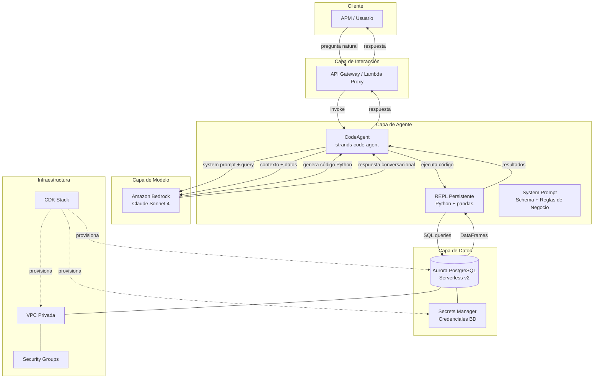
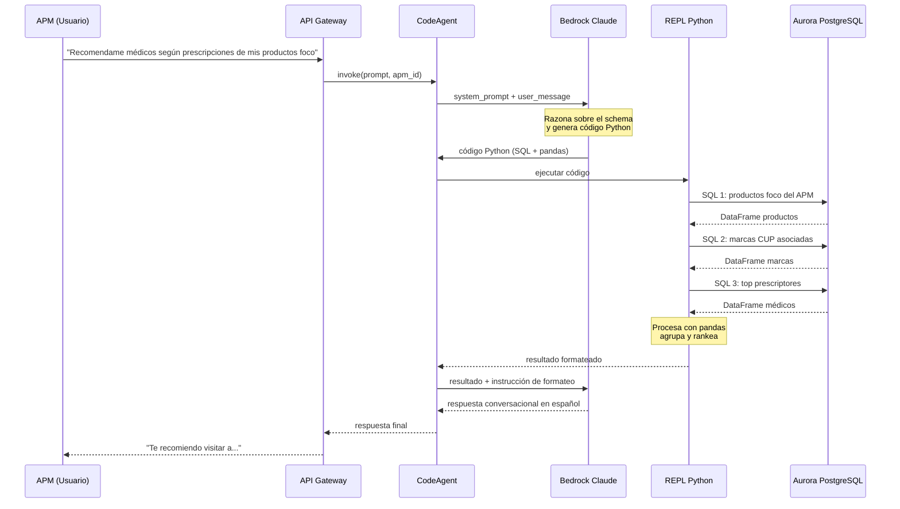
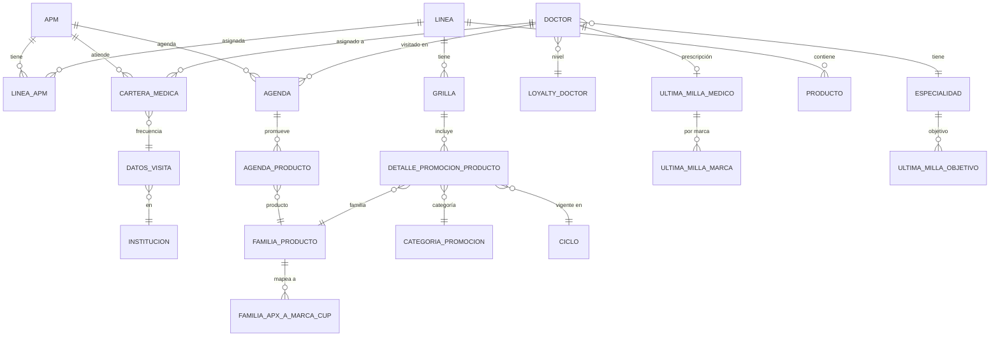
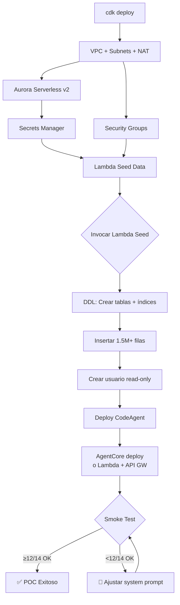

# Design Document: POC Producción — CodeAgent con Modelo de Datos Real

## Overview

Este POC valida la factibilidad técnica de PharmAssist operando con el modelo de datos real del cliente farmacéutico (52 tablas, 1.5M+ filas, JOINs de 5-6 niveles) usando un `CodeAgent` con REPL persistente en lugar de tool-calling tradicional. El sistema despliega una infraestructura completa en AWS (Aurora PostgreSQL Serverless v2, VPC, Secrets Manager) y demuestra que un APM puede hacer preguntas complejas sobre prescripciones, productos foco y gestión de visitas, obteniendo respuestas correctas en <6 segundos.

La innovación clave es reemplazar 15+ tools con SQL hardcodeado por un `strands-code-agent` (`CodeAgent`) que genera SQL dinámicamente y ejecuta cálculos con pandas en un REPL. Esto logra +7% accuracy, 78% menos tokens, y 56% más velocidad vs tool-calling tradicional.

El POC incluye: infraestructura CDK completa, seed data mocked con volúmenes realistas, CodeAgent desplegado, y validación end-to-end con 14 preguntas tipo respondidas correctamente.

## Architecture

### Vista General del Sistema



### Flujo de Datos Principal



### Presupuesto de Latencia

```mermaid
gantt
    title Presupuesto de Latencia por Interacción (<6s)
    dateFormat X
    axisFormat %Ls

    section LLM
    Reasoning + Code Gen   :0, 2500
    
    section Ejecución
    SQL Queries + pandas   :2500, 3500
    
    section LLM
    Response Generation    :3500, 5500
    
    section Overhead
    Network + serialization :5500, 6000
```




## Components and Interfaces

### Componente 1: CodeAgent (Orquestador)

**Purpose**: Recibe preguntas del APM, coordina con el LLM para generar código Python/SQL, ejecuta en el REPL, y devuelve respuestas conversacionales.

**Interface**:
```python
class PharmaCodeAgent:
    """Agente principal que orquesta la generación y ejecución de código."""
    
    def __init__(self, model: BedrockModel, system_prompt: str, toolkit: Toolkit):
        ...
    
    def invoke(self, message: str, apm_id: str) -> str:
        """Procesa una pregunta del APM y devuelve respuesta conversacional."""
        ...
    
    def reset_session(self) -> None:
        """Reinicia el REPL manteniendo el contexto del APM."""
        ...
```

**Responsabilidades**:
- Inicializar el CodeAgent con system prompt que incluye schema + reglas de negocio
- Inyectar `APM_ID` y `CICLO_ACTUAL` como variables del REPL al inicio de sesión
- Manejar el ciclo reasoning → code generation → execution → response
- Gestionar errores de ejecución SQL (retry con corrección)

### Componente 2: PharmaToolkit (Funciones del REPL)

**Purpose**: Expone funciones Python al REPL del CodeAgent para acceder a la base de datos y obtener contexto del APM.

**Interface**:
```python
class PharmaToolkit:
    """Toolkit que expone query_db, get_apm_id, get_ciclo_actual al REPL."""
    
    def query_db(self, sql: str) -> pd.DataFrame:
        """Ejecuta SQL contra Aurora PostgreSQL y retorna DataFrame."""
        ...
    
    def get_apm_id(self) -> str:
        """Retorna el ID del APM de la sesión actual."""
        ...
    
    def get_ciclo_actual_id(self) -> int:
        """Retorna el ID del ciclo promocional vigente."""
        ...
```

**Responsabilidades**:
- Mantener connection pool a Aurora PostgreSQL (psycopg2 + SQLAlchemy)
- Ejecutar queries con read-only user (seguridad contra SQL injection del LLM)
- Retornar resultados como DataFrames pandas
- Manejar timeouts de conexión y reconexión

### Componente 3: SystemPromptBuilder

**Purpose**: Construye el system prompt dinámicamente con el schema de BD, reglas de negocio, y patrones de consulta.

**Interface**:
```python
class SystemPromptBuilder:
    """Construye el system prompt completo para el CodeAgent."""
    
    def build(self, schema_path: str, rules_path: str) -> str:
        """Genera el system prompt concatenando schema + reglas + instrucciones."""
        ...
    
    def get_schema_section(self) -> str:
        """Retorna la sección de schema (tablas, columnas, FKs, índices)."""
        ...
    
    def get_business_rules_section(self) -> str:
        """Retorna reglas de negocio (EVO TRM, Foco/Hiperfoco, ciclos)."""
        ...
    
    def get_query_patterns_section(self) -> str:
        """Retorna ejemplos de SQL para preguntas frecuentes."""
        ...
```

**Responsabilidades**:
- Incluir schema completo (nombres de tablas, columnas, tipos, FKs)
- Documentar reglas de negocio en lenguaje natural
- Proveer 5-8 patrones de consulta SQL como few-shot examples
- Instrucciones de formato de respuesta (español argentino, datos concretos)

### Componente 4: CDK Infrastructure Stack

**Purpose**: Provisiona toda la infraestructura AWS necesaria para el POC.

**Interface**:
```python
class ProduccionPocStack(Stack):
    """Stack CDK con Aurora, VPC, Secrets, Lambda seed."""
    
    def __init__(self, scope: Construct, id: str, **kwargs):
        ...
    
    # Outputs
    aurora_endpoint: CfnOutput       # Endpoint de Aurora
    aurora_secret_arn: CfnOutput     # ARN del secret con credenciales
    vpc_id: CfnOutput               # VPC ID
    seed_lambda_arn: CfnOutput       # Lambda de seed data
```

**Responsabilidades**:
- Crear VPC con subnets privadas (2 AZs mínimo para Aurora)
- Crear Aurora PostgreSQL Serverless v2 cluster (0.5-4 ACU)
- Crear secret en Secrets Manager con credenciales auto-generadas
- Crear Security Groups para acceso Lambda → Aurora
- Crear Lambda de seed data con acceso a Aurora
- Exportar outputs para referencia de otros componentes

### Componente 5: SeedDataGenerator (Lambda)

**Purpose**: Genera y carga 1.5M+ filas de datos mocked con distribuciones realistas.

**Interface**:
```python
class SeedDataGenerator:
    """Genera seed data para todas las tablas del modelo."""
    
    def generate_all(self, conn: Connection) -> dict:
        """Genera y carga datos en todas las tablas. Retorna conteos."""
        ...
    
    def generate_apms(self, n: int = 200) -> pd.DataFrame: ...
    def generate_doctors(self, n: int = 30000) -> pd.DataFrame: ...
    def generate_cartera_medica(self, apms: pd.DataFrame, doctors: pd.DataFrame) -> pd.DataFrame: ...
    def generate_agenda(self, cartera: pd.DataFrame, ciclos: pd.DataFrame) -> pd.DataFrame: ...
    def generate_ultima_milla_marca(self, doctors: pd.DataFrame, marcas: list) -> pd.DataFrame: ...
```

**Responsabilidades**:
- Generar datos coherentes entre tablas (FKs válidas)
- Distribuciones realistas (no uniformes): especialidades siguen distribución real, prescripciones siguen Pareto
- Tabla `UltimaMillaMarca` con 1.5M filas (30k médicos × ~50 marcas)
- Bulk insert optimizado (COPY o batch INSERT) para cargar en <5 minutos
- Crear índices después del bulk load


## Data Models

### Modelo Relacional Completo (DER Simplificado)



### Tablas Core — Definición SQL (DDL)

```sql
-- Schema: public (default en Aurora PostgreSQL)

CREATE TABLE especialidad (
    id VARCHAR(10) PRIMARY KEY,
    nombre VARCHAR(100) NOT NULL
);

CREATE TABLE loyalty_doctor (
    id VARCHAR(10) PRIMARY KEY,
    nombre VARCHAR(50) NOT NULL
);

CREATE TABLE institucion (
    id VARCHAR(20) PRIMARY KEY,
    nombre VARCHAR(200) NOT NULL
);

CREATE TABLE linea (
    id VARCHAR(10) PRIMARY KEY,
    nombre VARCHAR(100) NOT NULL,
    abreviatura VARCHAR(10)
);

CREATE TABLE ciclo (
    id VARCHAR(10) PRIMARY KEY,
    inicio DATE NOT NULL,
    fin DATE NOT NULL,
    nombre VARCHAR(50)
);

CREATE TABLE categoria_promocion (
    id VARCHAR(5) PRIMARY KEY,  -- '1' = HP, '2' = FC
    abreviatura VARCHAR(5) NOT NULL,  -- 'HP', 'FC'
    nombre_categoria VARCHAR(50)
);

CREATE TABLE apm (
    id VARCHAR(20) PRIMARY KEY,
    primerNombre VARCHAR(100),
    primerApellido VARCHAR(100),
    email VARCHAR(200),
    id_linea VARCHAR(10) REFERENCES linea(id),
    gerente_regional_id VARCHAR(20),
    codigoPromotor VARCHAR(20),
    inactivo BOOLEAN DEFAULT false
);

CREATE TABLE doctor (
    id VARCHAR(20) PRIMARY KEY,
    primerNombre VARCHAR(100),
    primerApellido VARCHAR(100),
    matriculaNacional VARCHAR(20),
    especialidad_id VARCHAR(10) REFERENCES especialidad(id),
    loyalty_id VARCHAR(10) REFERENCES loyalty_doctor(id),
    categoria_id VARCHAR(10),
    inactivo BOOLEAN DEFAULT false
);

CREATE TABLE linea_apm (
    id VARCHAR(20) PRIMARY KEY,
    id_apm VARCHAR(20) REFERENCES apm(id),
    id_linea VARCHAR(10) REFERENCES linea(id)
);

CREATE TABLE datos_visita (
    id VARCHAR(20) PRIMARY KEY,
    frecuencia VARCHAR(20),  -- Mensual, Trimestral, Semestral, Anual
    institucion_id VARCHAR(20) REFERENCES institucion(id)
);

CREATE TABLE cartera_medica (
    id VARCHAR(20) PRIMARY KEY,
    apm_id VARCHAR(20) REFERENCES apm(id),
    doctor_id VARCHAR(20) REFERENCES doctor(id),
    datos_visita_id VARCHAR(20) REFERENCES datos_visita(id),
    inactivo BOOLEAN DEFAULT false
);

CREATE TABLE agenda (
    id VARCHAR(30) PRIMARY KEY,
    inicio TIMESTAMP NOT NULL,
    fin TIMESTAMP,
    apm_id VARCHAR(20) REFERENCES apm(id),
    doctor_id VARCHAR(20) REFERENCES doctor(id),
    visita_exitosa BOOLEAN DEFAULT true,
    observaciones TEXT,
    visita_tipo VARCHAR(20),  -- Presencial/Virtual/Telefónica
    inactivo BOOLEAN DEFAULT false
);

CREATE TABLE familia_producto (
    id VARCHAR(20) PRIMARY KEY,
    nombre VARCHAR(100) NOT NULL,
    principio_activo VARCHAR(200),
    accion_terapeutica VARCHAR(200)
);

CREATE TABLE producto (
    id VARCHAR(20) PRIMARY KEY,
    nombre VARCHAR(100) NOT NULL,
    id_linea VARCHAR(10) REFERENCES linea(id)
);

CREATE TABLE grilla (
    id VARCHAR(20) PRIMARY KEY,
    nombre_grilla VARCHAR(100),
    id_linea VARCHAR(10) REFERENCES linea(id)
);

CREATE TABLE detalle_promocion_producto (
    id VARCHAR(30) PRIMARY KEY,
    id_familia_producto VARCHAR(20) REFERENCES familia_producto(id),
    id_grilla VARCHAR(20) REFERENCES grilla(id),
    id_categoria_promocion VARCHAR(5) REFERENCES categoria_promocion(id),
    id_ciclo VARCHAR(10) REFERENCES ciclo(id)
);

CREATE TABLE agenda_producto (
    id VARCHAR(30) PRIMARY KEY,
    id_agenda VARCHAR(30) REFERENCES agenda(id),
    id_producto VARCHAR(20) REFERENCES familia_producto(id)
);
```

### Tablas Analíticas de Prescripción (UltimaMilla)

```sql
CREATE TABLE "UltimaMillaMedico" (
    "idMedicoCUP" VARCHAR(20) NOT NULL,
    "idMedicoAPX" VARCHAR(20) REFERENCES doctor(id),
    "IETrim" DECIMAL(10,4),
    "ShareTrim" DECIMAL(10,4),
    "ShareTrim_1" DECIMAL(10,4),
    "ShareMes" DECIMAL(10,4),
    PRIMARY KEY ("idMedicoCUP")
);

CREATE TABLE "UltimaMillaMarca" (
    "idMedicoCUP" VARCHAR(20) NOT NULL,
    "idMarca" VARCHAR(20) NOT NULL,
    "idMercado" VARCHAR(20),
    "idLaboratorio" VARCHAR(10),  -- 'ELE' para Elea
    "marcaNombre" VARCHAR(100),
    "ShareMarcaMercado" DECIMAL(10,4),
    "ShareMarcaMes" DECIMAL(10,4),
    "IEMarcaTrim" DECIMAL(10,4),
    "ShareMarcaTrim" DECIMAL(10,4),
    "ShareMarcaTrim_1" DECIMAL(10,4),
    PRIMARY KEY ("idMedicoCUP", "idMarca")
);

CREATE TABLE "UltimaMillaObjetivoMarcaMercado" (
    "idEspecialidad" VARCHAR(10) REFERENCES especialidad(id),
    "idMarca" VARCHAR(20),
    "idMercado" VARCHAR(20),
    "marcaNombre" VARCHAR(100),
    PRIMARY KEY ("idEspecialidad", "idMarca", "idMercado")
);

CREATE TABLE familia_APX_a_Marca_CUP (
    id_familia_producto_apx VARCHAR(20) REFERENCES familia_producto(id),
    "codMarcaCUP" VARCHAR(20),
    PRIMARY KEY (id_familia_producto_apx, "codMarcaCUP")
);
```

### Índices para Performance

```sql
-- Índices críticos para queries del CodeAgent
CREATE INDEX idx_cartera_medica_apm ON cartera_medica(apm_id) WHERE inactivo = false;
CREATE INDEX idx_cartera_medica_doctor ON cartera_medica(doctor_id) WHERE inactivo = false;
CREATE INDEX idx_agenda_apm_inicio ON agenda(apm_id, inicio DESC) WHERE inactivo = false;
CREATE INDEX idx_agenda_doctor ON agenda(doctor_id, inicio DESC);
CREATE INDEX idx_ultima_milla_marca_medico ON "UltimaMillaMarca"("idMedicoCUP", "idMarca");
CREATE INDEX idx_ultima_milla_marca_lab ON "UltimaMillaMarca"("idLaboratorio", "idMedicoCUP");
CREATE INDEX idx_detalle_promo_ciclo_cat ON detalle_promocion_producto(id_ciclo, id_categoria_promocion);
CREATE INDEX idx_linea_apm_apm ON linea_apm(id_apm);
CREATE INDEX idx_agenda_producto_agenda ON agenda_producto(id_agenda);
CREATE INDEX idx_ultima_milla_medico_apx ON "UltimaMillaMedico"("idMedicoAPX");
```

### Validación de Integridad

| Constraint | Regla |
|-----------|-------|
| `cartera_medica.apm_id` | Debe existir en `apm.id` |
| `cartera_medica.doctor_id` | Debe existir en `doctor.id` |
| `UltimaMillaMedico.idMedicoAPX` | Debe existir en `doctor.id` |
| `familia_APX_a_Marca_CUP.codMarcaCUP` | Debe existir como `idMarca` en `UltimaMillaMarca` |
| `detalle_promocion_producto.id_ciclo` | Debe existir en `ciclo.id` |
| Shares | Valores entre 0.0 y 1.0 (o 0-100 según fuente) |
| `agenda.inicio` | No puede ser futura más de 7 días |


## Algorithmic Pseudocode

### Algoritmo Principal: Procesamiento de Pregunta del APM

```python
def process_apm_question(question: str, apm_id: str) -> str:
    """
    Procesa una pregunta del APM usando CodeAgent.
    
    Preconditions:
        - apm_id existe en tabla apm y está activo
        - Aurora PostgreSQL está disponible (min 0.5 ACU warm)
        - System prompt incluye schema completo y reglas de negocio
    
    Postconditions:
        - Retorna string con respuesta conversacional en español argentino
        - Respuesta contiene datos concretos (no genéricos)
        - Latencia total < 6 segundos
    """
    # 1. Inicializar sesión si es primera pregunta
    if not repl_session_exists(apm_id):
        initialize_repl_session(apm_id)
    
    # 2. Invocar CodeAgent (LLM genera código, REPL ejecuta)
    result = code_agent.invoke(
        message=question,
        context={"APM_ID": apm_id, "CICLO_ACTUAL": get_ciclo_actual()}
    )
    
    # 3. Retornar respuesta
    return result.response
```

### Algoritmo: Inicialización de Sesión REPL

```python
def initialize_repl_session(apm_id: str) -> None:
    """
    Inicializa el REPL con contexto del APM.
    
    Preconditions:
        - apm_id válido en la BD
        - Conexión a Aurora disponible
    
    Postconditions:
        - Variables APM_ID y CICLO_ACTUAL disponibles en el REPL
        - Conexión a BD activa y testeada
        - imports (pandas, numpy) cargados
    
    Loop Invariants: N/A
    """
    # Verificar que el APM existe
    apm = query_db(f"SELECT id, primerNombre FROM apm WHERE id = '{apm_id}' AND inactivo = false")
    assert len(apm) == 1, f"APM {apm_id} no encontrado o inactivo"
    
    # Obtener ciclo actual
    ciclo = query_db("SELECT id FROM ciclo WHERE inicio <= CURRENT_DATE AND fin >= CURRENT_DATE LIMIT 1")
    ciclo_id = int(ciclo.iloc[0]['id']) if len(ciclo) > 0 else get_latest_ciclo()
    
    # Inyectar variables al REPL
    repl.execute(f"""
import pandas as pd
import numpy as np
APM_ID = '{apm_id}'
CICLO_ACTUAL = {ciclo_id}
""")
```

### Algoritmo: query_db (Función del Toolkit)

```python
def query_db(sql: str) -> pd.DataFrame:
    """
    Ejecuta SQL contra Aurora PostgreSQL con read-only user.
    
    Preconditions:
        - sql es una query SELECT válida (no permite INSERT/UPDATE/DELETE)
        - Conexión a Aurora activa
        - Timeout de query configurado en 5 segundos
    
    Postconditions:
        - Retorna DataFrame con resultados (puede ser vacío)
        - No modifica estado de la BD
        - Conexión permanece válida para queries subsiguientes
    
    Invariants:
        - Todas las queries ejecutadas son read-only
        - Connection pool mantiene máximo 5 conexiones
    """
    # Validar que no es una query de escritura
    sql_upper = sql.strip().upper()
    assert sql_upper.startswith("SELECT") or sql_upper.startswith("WITH"), \
        "Solo se permiten queries SELECT o WITH (CTEs)"
    
    # Ejecutar con timeout
    with engine.connect() as conn:
        conn.execute(text("SET statement_timeout = '5000'"))  # 5s max
        df = pd.read_sql(text(sql), conn)
    
    return df
```

### Algoritmo: Generación de Seed Data (UltimaMillaMarca)

```python
def generate_ultima_milla_marca(
    doctors: pd.DataFrame, 
    marcas: list[str],
    n_marcas_per_doctor: int = 50
) -> pd.DataFrame:
    """
    Genera 1.5M filas de prescripciones simuladas.
    
    Preconditions:
        - doctors tiene columna 'id' con 30,000 médicos
        - marcas es lista de ~80 marcas CUP posibles
        - n_marcas_per_doctor promedio = 50
    
    Postconditions:
        - Retorna DataFrame con ~1.5M filas
        - Cada médico tiene entre 30-70 marcas (distribución normal)
        - ShareMarcaMercado sigue distribución Pareto (pocas marcas dominan)
        - IEMarcaTrim entre -0.3 y +0.3 (distribución normal centrada en 0)
        - ~30% de filas con idLaboratorio = 'ELE' (productos propios)
    
    Loop Invariants:
        - Para cada doctor: sum(ShareMarcaMercado) para un mercado dado ≈ 1.0
    """
    rows = []
    for doctor_id in doctors['id']:
        # Seleccionar subset aleatorio de marcas para este médico
        n_marcas = np.random.normal(n_marcas_per_doctor, 10)
        n_marcas = int(np.clip(n_marcas, 30, 70))
        selected_marcas = np.random.choice(marcas, n_marcas, replace=False)
        
        for marca in selected_marcas:
            # Generar shares con distribución Pareto
            share = np.random.pareto(2.0) * 0.05  # Mayoría <10%, pocas >30%
            share = min(share, 0.95)
            
            rows.append({
                "idMedicoCUP": f"CUP_{doctor_id}",
                "idMarca": marca,
                "idMercado": get_mercado_for_marca(marca),
                "idLaboratorio": "ELE" if np.random.random() < 0.3 else random_lab(),
                "marcaNombre": get_nombre_marca(marca),
                "ShareMarcaMercado": round(share, 4),
                "ShareMarcaMes": round(share * np.random.uniform(0.8, 1.2), 4),
                "IEMarcaTrim": round(np.random.normal(0, 0.1), 4),
                "ShareMarcaTrim": round(share * np.random.uniform(0.9, 1.1), 4),
                "ShareMarcaTrim_1": round(share * np.random.uniform(0.85, 1.15), 4),
            })
    
    return pd.DataFrame(rows)
```


## Key Functions with Formal Specifications

### Function 1: `create_pharma_agent()`

```python
def create_pharma_agent(apm_id: str, db_secret_arn: str) -> CodeAgent:
    """Crea y configura el CodeAgent para farmacéutica."""
```

**Preconditions:**
- `apm_id` es un string no vacío que existe en la tabla `apm`
- `db_secret_arn` es un ARN válido de Secrets Manager con credenciales de Aurora
- Bedrock model `us.anthropic.claude-sonnet-4-20250514-v1:0` está habilitado en la cuenta

**Postconditions:**
- Retorna un `CodeAgent` configurado con toolkit y system prompt
- El REPL tiene `query_db`, `get_apm_id`, `get_ciclo_actual_id` disponibles
- `APM_ID` y `CICLO_ACTUAL` están inicializados como variables del REPL
- El agente puede generar y ejecutar SQL contra Aurora

**Loop Invariants:** N/A

### Function 2: `build_system_prompt()`

```python
def build_system_prompt(schema_ddl: str, business_rules: str, query_examples: str) -> str:
    """Construye el system prompt completo para el CodeAgent."""
```

**Preconditions:**
- `schema_ddl` contiene DDL válido de todas las tablas (≥20 tablas)
- `business_rules` documenta EVO TRM, Foco/Hiperfoco, ciclos
- `query_examples` tiene ≥5 ejemplos de SQL correcto

**Postconditions:**
- Retorna string con system prompt completo (estimado: 8,000-12,000 tokens)
- El prompt incluye las 5 secciones: Identidad, Schema, Reglas, Ejemplos, Instrucciones
- El prompt está en español

**Loop Invariants:** N/A

### Function 3: `get_db_connection()`

```python
def get_db_connection(secret_arn: str, region: str = "us-east-1") -> Engine:
    """Obtiene conexión a Aurora via Secrets Manager."""
```

**Preconditions:**
- `secret_arn` es un ARN de Secrets Manager accesible
- El secret contiene keys: `host`, `port`, `username`, `password`, `dbname`
- Aurora está en estado `available` (min 0.5 ACU activo)

**Postconditions:**
- Retorna SQLAlchemy Engine con pool_size=5, max_overflow=2
- Conexión verificada con `SELECT 1`
- statement_timeout configurado en 5000ms

**Loop Invariants:** N/A

### Function 4: `deploy_seed_data()`

```python
def deploy_seed_data(conn: Connection, volumes: dict) -> dict:
    """Genera y carga seed data en Aurora. Retorna conteos por tabla."""
```

**Preconditions:**
- `conn` es una conexión válida con permisos de escritura
- `volumes` define filas por tabla (ej: `{"apm": 200, "doctor": 30000, ...}`)
- Las tablas existen (DDL ya ejecutado)

**Postconditions:**
- Todas las tablas pobladas según `volumes`
- FKs son consistentes (no hay referencias huérfanas)
- `UltimaMillaMarca` tiene exactamente ~1.5M filas
- Índices creados post-carga
- Retorna dict con conteos reales por tabla

**Loop Invariants:**
- Cada tabla cargada mantiene integridad referencial con tablas ya cargadas
- Orden de carga respeta dependencias de FK (padres antes que hijos)

### Function 5: `run_e2e_validation()`

```python
def run_e2e_validation(agent: CodeAgent, questions: list[str], apm_id: str) -> dict:
    """Ejecuta las 14 preguntas e2e y mide correctitud + latencia."""
```

**Preconditions:**
- `agent` está configurado y conectado a Aurora con datos
- `questions` tiene las 14 preguntas del spec
- `apm_id` tiene cartera médica activa (≥100 médicos)

**Postconditions:**
- Retorna dict con: `passed` (int), `failed` (int), `avg_latency` (float)
- Cada pregunta tiene: `question`, `answer`, `latency_ms`, `sql_generated`, `success` (bool)
- `passed ≥ 12` para considerar el POC exitoso (≥85%)
- `avg_latency < 6000` ms

**Loop Invariants:**
- Cada pregunta es independiente (no depende del resultado de la anterior)
- El REPL se reinicia entre preguntas para evitar state leaking


## Example Usage

### Ejemplo 1: Crear y usar el CodeAgent

```python
from strands_code_agent import CodeAgent, Toolkit
from strands.models import BedrockModel
import pandas as pd
import boto3
import json
from sqlalchemy import create_engine, text

# Obtener credenciales de Aurora desde Secrets Manager
secrets_client = boto3.client("secretsmanager", region_name="us-east-1")
secret = json.loads(
    secrets_client.get_secret_value(SecretId=DB_SECRET_ARN)["SecretString"]
)

# Crear engine SQLAlchemy
engine = create_engine(
    f"postgresql://{secret['username']}:{secret['password']}"
    f"@{secret['host']}:{secret['port']}/{secret['dbname']}",
    pool_size=5,
    max_overflow=2,
    pool_timeout=10,
)

# Funciones expuestas al REPL
def query_db(sql: str) -> pd.DataFrame:
    """Ejecuta SQL SELECT contra Aurora PostgreSQL."""
    sql_clean = sql.strip()
    if not (sql_clean.upper().startswith("SELECT") or sql_clean.upper().startswith("WITH")):
        raise ValueError("Solo queries SELECT o WITH permitidas")
    with engine.connect() as conn:
        conn.execute(text("SET statement_timeout = '5000'"))
        return pd.read_sql(text(sql_clean), conn)

def get_apm_id() -> str:
    """Retorna el APM ID de la sesión actual."""
    return _current_apm_id

def get_ciclo_actual_id() -> int:
    """Retorna el ciclo promocional vigente."""
    df = query_db("SELECT id FROM ciclo WHERE inicio <= CURRENT_DATE AND fin >= CURRENT_DATE LIMIT 1")
    if len(df) == 0:
        df = query_db("SELECT id FROM ciclo ORDER BY fin DESC LIMIT 1")
    return int(df.iloc[0]['id'])

# Toolkit
pharma_toolkit = Toolkit(
    authorized_imports=["pandas", "numpy"],
    init_code="""
import pandas as pd
import numpy as np
APM_ID = get_apm_id()
CICLO_ACTUAL = get_ciclo_actual_id()
print(f"Sesión inicializada: APM={APM_ID}, Ciclo={CICLO_ACTUAL}")
""",
    domain_specific_code=[query_db, get_apm_id, get_ciclo_actual_id],
)

# Modelo
model = BedrockModel(
    model_id="us.anthropic.claude-sonnet-4-20250514-v1:0",
    region_name="us-east-1",
)

# Agente
agent = CodeAgent(
    model=model,
    system_prompt=SYSTEM_PROMPT,
    toolkits=[pharma_toolkit],
)

# Uso
response = agent("¿Qué médicos debería visitar según prescripciones de mis productos foco?")
print(response)
```

### Ejemplo 2: CDK Stack (fragmento clave)

```python
from aws_cdk import (
    Stack, Duration, RemovalPolicy, CfnOutput,
    aws_ec2 as ec2,
    aws_rds as rds,
    aws_secretsmanager as sm,
    aws_lambda as lambda_,
    aws_iam as iam,
)
from constructs import Construct

class ProduccionPocStack(Stack):
    def __init__(self, scope: Construct, id: str, **kwargs):
        super().__init__(scope, id, **kwargs)
        
        # VPC con subnets privadas
        vpc = ec2.Vpc(self, "PocVpc",
            max_azs=2,
            nat_gateways=1,
            subnet_configuration=[
                ec2.SubnetConfiguration(
                    name="Private",
                    subnet_type=ec2.SubnetType.PRIVATE_WITH_EGRESS,
                ),
                ec2.SubnetConfiguration(
                    name="Public",
                    subnet_type=ec2.SubnetType.PUBLIC,
                ),
            ],
        )
        
        # Aurora PostgreSQL Serverless v2
        cluster = rds.DatabaseCluster(self, "AuroraCluster",
            engine=rds.DatabaseClusterEngine.aurora_postgres(
                version=rds.AuroraPostgresEngineVersion.VER_15_4,
            ),
            serverless_v2_min_capacity=0.5,
            serverless_v2_max_capacity=4,
            writer=rds.ClusterInstance.serverless_v2("Writer"),
            vpc=vpc,
            vpc_subnets=ec2.SubnetSelection(
                subnet_type=ec2.SubnetType.PRIVATE_WITH_EGRESS
            ),
            default_database_name="pharmassist_poc",
            removal_policy=RemovalPolicy.DESTROY,
        )
        
        # Security Group para Lambda → Aurora
        lambda_sg = ec2.SecurityGroup(self, "LambdaSg", vpc=vpc)
        cluster.connections.allow_from(lambda_sg, ec2.Port.tcp(5432))
        
        # Lambda de seed data
        seed_fn = lambda_.Function(self, "SeedDataFn",
            runtime=lambda_.Runtime.PYTHON_3_12,
            handler="seed_handler.handler",
            code=lambda_.Code.from_asset("lambda/seed"),
            vpc=vpc,
            security_groups=[lambda_sg],
            timeout=Duration.minutes(15),
            memory_size=3008,
            environment={
                "DB_SECRET_ARN": cluster.secret.secret_arn,
                "DB_NAME": "pharmassist_poc",
            },
        )
        cluster.secret.grant_read(seed_fn)
        
        # Outputs
        CfnOutput(self, "AuroraEndpoint", value=cluster.cluster_endpoint.hostname)
        CfnOutput(self, "AuroraSecretArn", value=cluster.secret.secret_arn)
        CfnOutput(self, "VpcId", value=vpc.vpc_id)
        CfnOutput(self, "SeedLambdaArn", value=seed_fn.function_arn)
```

### Ejemplo 3: Invocación E2E de una pregunta

```python
import time

def test_single_question(agent: CodeAgent, question: str) -> dict:
    """Ejecuta una pregunta y mide latencia."""
    start = time.time()
    response = agent(question)
    elapsed_ms = (time.time() - start) * 1000
    
    return {
        "question": question,
        "response": str(response),
        "latency_ms": round(elapsed_ms, 1),
        "success": len(str(response)) > 50 and "error" not in str(response).lower(),
    }

# Test
result = test_single_question(
    agent, 
    "¿En qué productos de ELEA tengo EVO TRM negativa?"
)
print(f"Latencia: {result['latency_ms']}ms, Éxito: {result['success']}")
print(f"Respuesta: {result['response'][:200]}...")
```


## Correctness Properties

*A property is a characteristic or behavior that should hold true across all valid executions of a system — essentially, a formal statement about what the system should do. Properties serve as the bridge between human-readable specifications and machine-verifiable correctness guarantees.*

### Property 1: SQL Validation Rejects Non-Read Queries

*For any* SQL string passed to `query_db` that does not start with `SELECT` or `WITH` (case-insensitive, after trimming whitespace), the function SHALL raise a ValueError and never execute the statement against the database.

**Validates: Requirements 1.4, 7.1**

### Property 2: System Prompt Contains All Schema Tables

*For any* table defined in the Aurora_DB schema (at least 20 tables), the generated system prompt string SHALL contain that table's name, ensuring the LLM has complete schema awareness.

**Validates: Requirement 2.1**

### Property 3: Seed Data Referential Integrity

*For any* row in any child table of the seed data, the foreign key value SHALL exist in the corresponding parent table — there are zero orphan references across all FK relationships.

**Validates: Requirements 4.2, 3.2**

### Property 4: ShareMarcaMercado Follows Pareto Distribution

*For all* generated ShareMarcaMercado values in UltimaMillaMarca, more than 80% of values SHALL be below 0.15 and fewer than 5% SHALL be above 0.40, consistent with a Pareto (power-law) distribution where few brands dominate.

**Validates: Requirement 4.3**

### Property 5: ELE Laboratory Proportion

*For all* rows in UltimaMillaMarca, the proportion of rows with `idLaboratorio = 'ELE'` SHALL be between 0.25 and 0.35 (approximately 30% ± 5%).

**Validates: Requirement 4.4**

### Property 6: IEMarcaTrim Normal Distribution

*For all* generated IEMarcaTrim values in UltimaMillaMarca, the mean SHALL be between -0.02 and 0.02 and the standard deviation SHALL be between 0.08 and 0.12, consistent with a normal distribution centered at 0.

**Validates: Requirement 4.5**

### Property 7: Statement Timeout Enforcement

*For any* query executed through `query_db`, the function SHALL set `statement_timeout = '5000'` on the connection before executing the SQL, ensuring no query runs longer than 5 seconds.

**Validates: Requirements 8.4, 3.6**

## Error Handling

### Error Scenario 1: SQL Inválido Generado por el LLM

**Condition**: El LLM genera SQL con sintaxis incorrecta o que referencia tablas/columnas inexistentes.
**Response**: El REPL captura el error de PostgreSQL y lo retorna al LLM. El LLM auto-corrige generando SQL corregido (máximo 2 reintentos).
**Recovery**: Si falla 3 veces, retornar al usuario: "No pude procesar tu consulta. ¿Podrías reformularla?"

### Error Scenario 2: Timeout de Query (>5s)

**Condition**: Una query SQL tarda más de 5 segundos (índices faltantes o query sin filtro por cartera).
**Response**: PostgreSQL aborta la query. El error se retorna al LLM para que genere una versión optimizada.
**Recovery**: El LLM debe agregar filtros por `apm_id` o `idMedicoCUP` para acotar el scan.

### Error Scenario 3: Aurora Cold Start

**Condition**: Aurora está en 0 ACU (pausada) y la primera query tarda >10s en wakeup.
**Response**: Mantener min_capacity = 0.5 ACU para evitar cold start completo.
**Recovery**: Si ocurre timeout, reintentar después de 5 segundos (Aurora habrá escalado).

### Error Scenario 4: APM No Encontrado

**Condition**: El `apm_id` proporcionado no existe en la tabla `apm` o está inactivo.
**Response**: Retornar error inmediato sin invocar al LLM: "APM no encontrado o inactivo."
**Recovery**: Verificar `apm_id` al inicio de sesión, antes de inicializar el REPL.

### Error Scenario 5: Conexión a BD Perdida

**Condition**: La conexión a Aurora se pierde durante una sesión (timeout de idle, network glitch).
**Response**: SQLAlchemy pool detecta la conexión muerta y crea una nueva.
**Recovery**: Pool configurado con `pool_pre_ping=True` para validar conexiones antes de usar.

## Testing Strategy

### Unit Testing Approach

- Testear `SystemPromptBuilder` con inputs conocidos y verificar output contiene secciones esperadas
- Testear `query_db` con mock de engine para verificar validación de SQL (rechaza INSERT/UPDATE)
- Testear `SeedDataGenerator` verificando consistencia de FKs y distribuciones
- Testear funciones de cálculo de EVO TRM con datos conocidos

### Property-Based Testing Approach

**Property Test Library**: `hypothesis` (Python)

**Propiedades a testear:**
1. `query_db` siempre rechaza SQL que no empieza con SELECT/WITH
2. Seed data generado siempre tiene FKs válidas (∀ fila en hijo, FK existe en padre)
3. EVO TRM siempre = ShareMarcaTrim - ShareMarcaTrim_1 (propiedad aritmética)
4. Shares generados están en rango [0, 1] para todo médico y marca

### Integration Testing Approach

- Test contra Aurora real (después del deploy): ejecutar las 14 preguntas tipo
- Medir latencia real end-to-end (incluye network a Aurora)
- Validar que SQL generado retorna resultados consistentes
- Smoke test post-deploy: ≥12/14 preguntas correctas, latencia promedio <6s


## Performance Considerations

### Query Performance (Aurora PostgreSQL)

| Escenario | Filas Escaneadas | Estimado | Estrategia |
|-----------|-----------------|----------|------------|
| Productos foco del APM | ~10 filas | <10ms | Índice en `linea_apm(id_apm)` + `detalle_promo(id_ciclo)` |
| Cartera médica activa | ~125 filas | <10ms | Índice en `cartera_medica(apm_id)` partial |
| UltimaMillaMarca filtrada por cartera | ~7,500 filas | <50ms | Índice compuesto `(idMedicoCUP, idMarca)` |
| Agenda del APM (12 meses) | ~750 filas | <20ms | Índice en `agenda(apm_id, inicio)` |
| JOIN 5-6 niveles (prescripciones) | ~7,500 post-filtro | <200ms | Filtro temprano por apm_id reduce rows |

### Presupuesto de Tokens

| Componente | Tokens Estimados |
|-----------|-----------------|
| System prompt (schema + reglas) | ~8,000-12,000 input |
| Pregunta del usuario | ~50-100 input |
| Código generado por LLM | ~200-500 output |
| Resultado del REPL | ~100-500 input (2do turn) |
| Respuesta conversacional | ~200-400 output |
| **Total por interacción** | **~10,000-14,000 tokens** |

### Optimizaciones Clave

1. **Filtro temprano**: Todas las queries comienzan filtrando por `apm_id` (reduce de 30K médicos a ~125)
2. **Índices parciales**: `WHERE inactivo = false` en índices de cartera_medica y agenda
3. **Min ACU = 0.5**: Evita cold start de Aurora (siempre warm)
4. **Connection pooling**: SQLAlchemy pool con 5 conexiones reutilizables
5. **statement_timeout = 5s**: Mata queries lentas antes de que afecten latencia total
6. **REPL persistente**: No reinicializa imports entre preguntas del mismo APM

## Security Considerations

### Seguridad del SQL Generado

| Riesgo | Mitigación |
|--------|-----------|
| LLM genera DROP TABLE | `query_db` valida que SQL empieza con SELECT/WITH |
| SQL injection via prompt | Read-only PostgreSQL user (solo permisos SELECT) |
| Acceso a datos de otro APM | System prompt instruye filtrar por APM_ID; validación post-hoc opcional |
| Exfiltración de schema | Schema ya está en el system prompt (no es secreto para el agente) |

### Seguridad de Infraestructura

| Control | Implementación |
|---------|---------------|
| Credenciales de BD | Secrets Manager (auto-rotación disponible) |
| Network isolation | Aurora en VPC privada, acceso solo desde Lambda/AgentCore SG |
| Least privilege | Lambda con solo `rds-data:ExecuteStatement`, `secretsmanager:GetSecretValue` |
| Encryption at rest | Aurora encryption enabled (default) |
| Encryption in transit | SSL enforced en conexión PostgreSQL |

### Usuario Read-Only en PostgreSQL

```sql
-- Crear usuario read-only para el CodeAgent
CREATE USER codeagent_readonly WITH PASSWORD 'generated_by_secrets_manager';
GRANT CONNECT ON DATABASE pharmassist_poc TO codeagent_readonly;
GRANT USAGE ON SCHEMA public TO codeagent_readonly;
GRANT SELECT ON ALL TABLES IN SCHEMA public TO codeagent_readonly;
ALTER DEFAULT PRIVILEGES IN SCHEMA public GRANT SELECT ON TABLES TO codeagent_readonly;
```

## Dependencies

### Runtime Dependencies

| Dependency | Versión | Uso |
|-----------|---------|-----|
| `strands-agents` | latest | SDK para crear agentes AI |
| `strands-code-agent` | latest | CodeAgent con REPL persistente |
| `boto3` | ≥1.34 | AWS SDK (Secrets Manager, Bedrock) |
| `pandas` | ≥2.0 | Procesamiento de DataFrames en REPL |
| `numpy` | ≥1.24 | Generación de datos, distribuciones |
| `sqlalchemy` | ≥2.0 | ORM / connection pooling a PostgreSQL |
| `psycopg2-binary` | ≥2.9 | Driver PostgreSQL |
| `pydantic` | ≥2.0 | Validación de configuración |

### Infrastructure Dependencies

| Dependency | Versión | Uso |
|-----------|---------|-----|
| `aws-cdk-lib` | ≥2.170 | IaC para Aurora, VPC, Lambda |
| `constructs` | ≥10.0 | CDK constructs base |

### AWS Services

| Servicio | Configuración | Costo Estimado (POC) |
|----------|--------------|---------------------|
| Aurora PostgreSQL Serverless v2 | 0.5-4 ACU, us-east-1 | ~$45/mes (0.5 ACU 24/7) |
| Secrets Manager | 1 secret | ~$0.40/mes |
| VPC + NAT Gateway | 1 NAT, 2 AZs | ~$35/mes |
| Lambda (seed) | 1 invocación, 15 min max | <$0.01 |
| Bedrock (Claude Sonnet) | ~14K tokens × N queries | ~$0.05 per query |
| **Total POC mensual** | | **~$80-100/mes** |

## Deployment Flow

### Diagrama de Deploy



### Orden de Deploy

1. `cdk deploy ProduccionPocStack` — infraestructura base
2. Invocar Lambda de seed — carga datos
3. Deploy CodeAgent (AgentCore o Lambda proxy)
4. Ejecutar smoke test con 14 preguntas
5. Ajustar system prompt si accuracy < 85%
6. Generar reporte final

### Estructura de Archivos del POC

```
produccion-poc/
├── infrastructure/
│   ├── app.py                      # CDK entry point
│   ├── stacks/
│   │   └── produccion_poc_stack.py # Stack principal
│   ├── lambda/
│   │   └── seed/
│   │       ├── seed_handler.py     # Lambda handler
│   │       ├── generators/
│   │       │   ├── __init__.py
│   │       │   ├── apms.py
│   │       │   ├── doctors.py
│   │       │   ├── cartera.py
│   │       │   ├── agenda.py
│   │       │   └── ultima_milla.py
│   │       └── requirements.txt
│   ├── requirements.txt
│   └── cdk.json
├── agent/
│   ├── agent.py                    # Entry point (BedrockAgentCoreApp o standalone)
│   ├── toolkit.py                  # PharmaToolkit con query_db
│   ├── system_prompt.py            # SystemPromptBuilder
│   ├── prompts/
│   │   ├── schema.md               # Schema DDL documentado
│   │   ├── business_rules.md       # Reglas de negocio
│   │   └── query_examples.md       # Few-shot SQL examples
│   └── requirements.txt
├── tests/
│   ├── e2e/
│   │   ├── test_questions.py       # 14 preguntas + validación
│   │   └── run_smoke_test.py       # Runner con reporte
│   └── unit/
│       ├── test_toolkit.py
│       └── test_prompt_builder.py
├── scripts/
│   ├── invoke_seed_lambda.sh
│   ├── run_e2e_test.sh
│   └── generate_report.py
└── README.md
```

