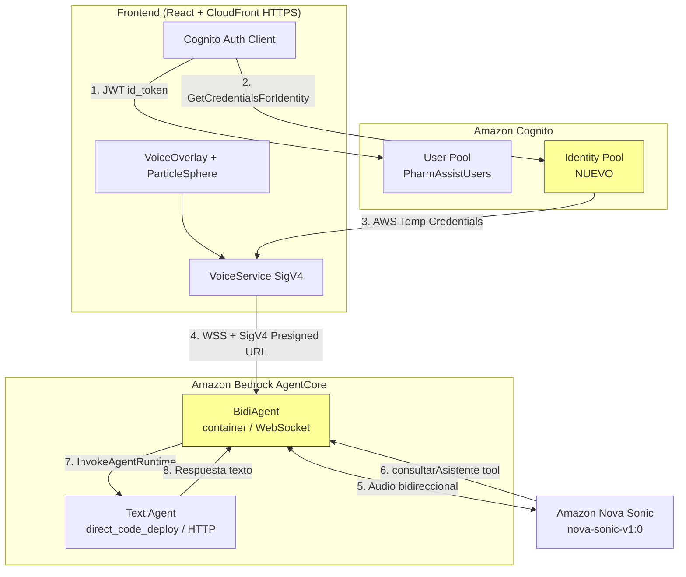
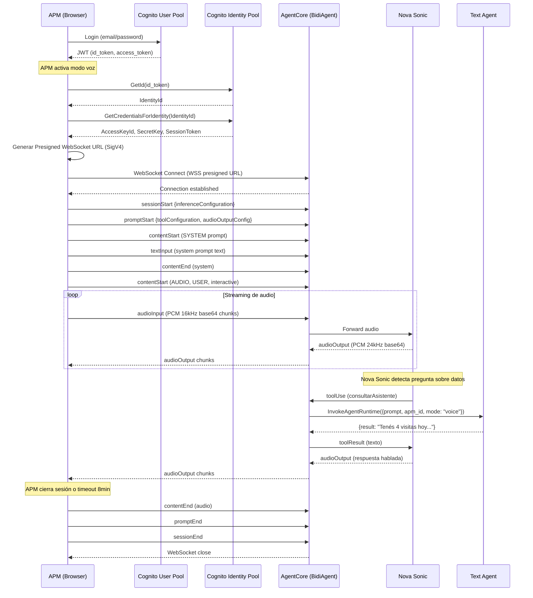
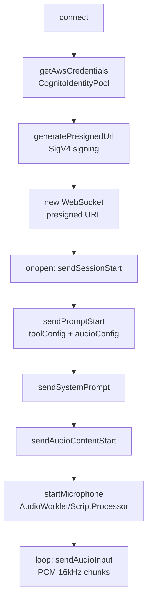

# Documento de Diseño — Migración Voice a BidiAgent + WebSocket Directo

## Resumen

Este diseño detalla la migración del modo voz de PharmAssist desde la arquitectura actual (Frontend → Socket.IO → ECS Fargate → Nova Sonic → AgentCore) hacia una arquitectura directa (Frontend → WSS + SigV4 → AgentCore BidiAgent → Nova Sonic interno). La migración elimina el servidor intermedio ECS Fargate, resuelve el problema de mixed content HTTPS/HTTP, reduce latencia y costos operativos (~$32/mes solo de NAT Gateway).

Los cambios principales son:
1. Nuevo **Cognito Identity Pool** para credenciales AWS temporales en el browser
2. Nuevo **BidiAgent** Python con Strands `BidiAgent` + tool `consultarAsistente`
3. **Frontend** reescribe `VoiceService` para WebSocket nativo con SigV4 presigned URL
4. **CDK** elimina toda la infraestructura ECS y agrega Identity Pool
5. Se elimina el directorio `voice-server/` completo

## Arquitectura

### Diagrama de Arquitectura Objetivo



### Diagrama de Secuencia — Flujo Completo de Sesión de Voz



### Comparación Antes/Después

| Aspecto | Antes (ECS) | Después (BidiAgent) |
|---------|-------------|---------------------|
| Protocolo frontend | Socket.IO (ws://) | WebSocket nativo (wss:// + SigV4) |
| Mixed content | ❌ Bloqueado en HTTPS | ✅ WSS funciona en HTTPS |
| Servidor intermedio | ECS Fargate (Node.js) | Ninguno (directo a AgentCore) |
| Infra requerida | VPC, NAT, ALB, ECS Cluster | Solo Identity Pool (serverless) |
| Costo mensual infra | ~$50+ (NAT $32 + ALB + Fargate) | ~$0 (Identity Pool sin costo) |
| Latencia | Frontend → ECS → Nova Sonic | Frontend → AgentCore → Nova Sonic |
| Deploy type | Docker en ECS | Container en AgentCore |


## Componentes e Interfaces

### 1. Cognito Identity Pool (CDK)

Nuevo recurso en `infrastructure/stacks/pharmassist_stack.py`:

```python
# Cognito Identity Pool — credenciales AWS temporales para modo voz
self.identity_pool = cognito.CfnIdentityPool(
    self, "PharmAssistIdentityPool",
    identity_pool_name="PharmAssistIdentityPool",
    allow_unauthenticated_identities=False,
    cognito_identity_providers=[
        cognito.CfnIdentityPool.CognitoIdentityProviderProperty(
            client_id=self.app_client.user_pool_client_id,
            provider_name=self.user_pool.user_pool_provider_name,
        )
    ],
)

# Rol IAM autenticado — solo InvokeAgentRuntime sobre el BidiAgent
authenticated_role = iam.Role(
    self, "CognitoAuthenticatedRole",
    assumed_by=iam.FederatedPrincipal(
        "cognito-identity.amazonaws.com",
        conditions={
            "StringEquals": {
                "cognito-identity.amazonaws.com:aud": self.identity_pool.ref
            },
            "ForAnyValue:StringLike": {
                "cognito-identity.amazonaws.com:amr": "authenticated"
            },
        },
        assume_role_action="sts:AssumeRoleWithWebIdentity",
    ),
)
authenticated_role.add_to_policy(iam.PolicyStatement(
    actions=["bedrock-agentcore:InvokeAgentRuntime"],
    resources=[f"arn:aws:bedrock-agentcore:{self.region}:{self.account}:runtime/*"],
))

# Attach role al Identity Pool
cognito.CfnIdentityPoolRoleAttachment(
    self, "IdentityPoolRoleAttachment",
    identity_pool_id=self.identity_pool.ref,
    roles={"authenticated": authenticated_role.role_arn},
)
```

**Interfaz**: El Identity Pool expone `IdentityPoolId` como stack output. El frontend lo usa para obtener credenciales temporales.

### 2. BidiAgent Python (`bidiagent/`)

Nuevo directorio en la raíz del proyecto:

```
bidiagent/
├── agent.py              # Entrypoint con BedrockAgentCoreApp + BidiAgent
├── requirements.txt      # strands-agents, bedrock-agentcore, boto3
├── Dockerfile            # Container para AgentCore WebSocket deployment
└── .bedrock_agentcore.yaml  # Config generada por agentcore configure
```

**`agent.py`** — Estructura principal:

```python
import os
import logging
import boto3
import json
from strands import Agent, tool
from strands.models import BedrockModel
from strands_agents.bidi_agent import BidiAgent
from bedrock_agentcore import BedrockAgentCoreApp

logger = logging.getLogger(__name__)

TEXT_AGENT_ARN = os.environ.get("TEXT_AGENT_ARN", "")
AWS_REGION = os.environ.get("AWS_REGION", "us-east-1")
BEDROCK_MODEL_ID = os.environ.get("BEDROCK_MODEL_ID", "amazon.nova-sonic-v1:0")

SYSTEM_PROMPT = (
    "Sos el asistente de voz de PharmAssist, una herramienta para Agentes de "
    "Propaganda Médica (APMs) de una farmacéutica argentina. Respondé en español "
    "argentino, de forma concisa y natural. Cuando el APM te pregunte sobre "
    "médicos, visitas, ventas o cualquier dato, usá la herramienta "
    "consultarAsistente para obtener la información. Mantené las respuestas "
    "cortas, de 2 a 3 oraciones, optimizadas para ser escuchadas. No uses "
    "markdown, tablas, emojis ni listas con viñetas."
)

agentcore_client = boto3.client("bedrock-agent-runtime", region_name=AWS_REGION)

@tool
def consultarAsistente(pregunta: str) -> str:
    """Consulta al asistente PharmAssist para obtener datos de médicos,
    visitas, ventas, minutas, sugerencias de próxima visita y más.
    Usá esta herramienta siempre que el APM pregunte algo que requiera
    datos del sistema.

    Args:
        pregunta: La pregunta del APM en lenguaje natural
    """
    try:
        # TODO: extraer apm_id del contexto de sesión WebSocket
        apm_id = "default"
        payload = json.dumps({
            "prompt": pregunta,
            "apm_id": apm_id,
            "mode": "voice"
        })
        response = agentcore_client.invoke_agent(
            agentId=extract_agent_id(TEXT_AGENT_ARN),
            agentAliasId="TSTALIASID",
            sessionId=f"voice-{apm_id}",
            inputText=payload,
        )
        result = ""
        for event in response.get("completion", []):
            if "chunk" in event and "bytes" in event["chunk"]:
                result += event["chunk"]["bytes"].decode("utf-8")
        return result or "No obtuve respuesta del asistente."
    except Exception as e:
        logger.error(f"Error invocando Text Agent: {e}")
        return "Lo siento, no pude obtener la información en este momento."

app = BedrockAgentCoreApp()

@app.entrypoint
def invoke(payload, context):
    bidi_agent = BidiAgent(
        model_id=BEDROCK_MODEL_ID,
        system_prompt=SYSTEM_PROMPT,
        tools=[consultarAsistente],
        audio_input_config={
            "mediaType": "audio/lpcm",
            "sampleRateHertz": 16000,
            "sampleSizeBits": 16,
            "channelCount": 1,
            "audioType": "SPEECH",
            "encoding": "base64",
        },
        audio_output_config={
            "mediaType": "audio/lpcm",
            "sampleRateHertz": 24000,
            "sampleSizeBits": 16,
            "channelCount": 1,
            "voiceId": "lupe",
            "encoding": "base64",
            "audioType": "SPEECH",
        },
        inference_config={
            "maxTokens": 1024,
            "topP": 0.9,
            "temperature": 0.7,
        },
    )
    return bidi_agent.handle(payload, context)

if __name__ == "__main__":
    app.run()
```

**`Dockerfile`**:

```dockerfile
FROM python:3.12-slim
WORKDIR /app
COPY requirements.txt .
RUN pip install --no-cache-dir -r requirements.txt
COPY . .
EXPOSE 8080
CMD ["python", "agent.py"]
```

**`requirements.txt`**:

```
bedrock-agentcore
strands-agents
strands-agents-tools
boto3
```

### 3. Frontend — VoiceService SigV4 (`frontend/src/api/voice.ts`)

Reescritura completa de `VoiceService`. Reemplaza Socket.IO por WebSocket nativo con SigV4.

**Dependencias nuevas**:
- `@aws-sdk/client-cognito-identity` — para obtener credenciales temporales
- `@aws-sdk/credential-providers` — `fromCognitoIdentityPool`
- Se elimina `socket.io-client`

**Interfaz pública** (se mantiene compatible con VoiceOverlay):

```typescript
interface VoiceServiceCallbacks {
  onStateChange: (state: VoiceState) => void;
  onAudioLevel: (level: number) => void;
  onError: (message: string) => void;
  onDisconnect: () => void;
}

class VoiceService {
  constructor(idToken: string, apmId: string, callbacks: VoiceServiceCallbacks);
  async connect(): Promise<void>;
  setMuted(muted: boolean): void;
  disconnect(): void;
}
```

**Flujo interno de `connect()`**:



**Generación de Presigned URL SigV4**:

```typescript
import { Sha256 } from '@aws-crypto/sha256-js';
import { SignatureV4 } from '@smithy/signature-v4';

async function generatePresignedUrl(
  credentials: AwsCredentials,
  region: string,
  agentArn: string,
): Promise<string> {
  const agentId = extractAgentId(agentArn);
  const host = `bedrock-agentcore.${region}.amazonaws.com`;
  const path = `/runtime/agent/${agentId}/converse-stream`;

  const signer = new SignatureV4({
    service: 'bedrock-agentcore',
    region,
    credentials,
    sha256: Sha256,
  });

  const request = {
    method: 'GET',
    protocol: 'wss:',
    hostname: host,
    path,
    headers: { host },
    query: {},
  };

  const presigned = await signer.presign(request, { expiresIn: 300 });
  const queryString = new URLSearchParams(presigned.query as Record<string, string>).toString();
  return `wss://${host}${path}?${queryString}`;
}
```

### 4. Frontend — Módulo de Credenciales (`frontend/src/api/credentials.ts`)

Nuevo módulo para manejar credenciales AWS temporales:

```typescript
import {
  CognitoIdentityClient,
  GetIdCommand,
  GetCredentialsForIdentityCommand,
} from '@aws-sdk/client-cognito-identity';

const REGION = import.meta.env.VITE_AWS_REGION ?? 'us-east-1';
const IDENTITY_POOL_ID = import.meta.env.VITE_IDENTITY_POOL_ID ?? '';
const USER_POOL_ID = import.meta.env.VITE_USER_POOL_ID ?? '';

export interface AwsCredentials {
  accessKeyId: string;
  secretAccessKey: string;
  sessionToken: string;
  expiration: Date;
}

let cachedCredentials: AwsCredentials | null = null;

export async function getAwsCredentials(idToken: string): Promise<AwsCredentials> {
  // Retornar cache si no expiró (con 5 min de margen)
  if (cachedCredentials && cachedCredentials.expiration.getTime() - Date.now() > 5 * 60 * 1000) {
    return cachedCredentials;
  }

  const client = new CognitoIdentityClient({ region: REGION });
  const providerName = `cognito-idp.${REGION}.amazonaws.com/${USER_POOL_ID}`;

  const { IdentityId } = await client.send(new GetIdCommand({
    IdentityPoolId: IDENTITY_POOL_ID,
    Logins: { [providerName]: idToken },
  }));

  const { Credentials } = await client.send(new GetCredentialsForIdentityCommand({
    IdentityId: IdentityId!,
    Logins: { [providerName]: idToken },
  }));

  cachedCredentials = {
    accessKeyId: Credentials!.AccessKeyId!,
    secretAccessKey: Credentials!.SecretKey!,
    sessionToken: Credentials!.SessionToken!,
    expiration: Credentials!.Expiration!,
  };

  return cachedCredentials;
}

export function clearCredentialsCache(): void {
  cachedCredentials = null;
}
```

### 5. Eliminación de Infraestructura ECS (CDK)

Se elimina del `pharmassist_stack.py`:

- Bloque condicional `if os.environ.get("DEPLOY_VOICE_SERVER")` completo (~100 líneas)
- Imports de `aws_ecs`, `aws_ec2`, `aws_elasticloadbalancingv2`, `aws_ecs_patterns`, `aws_ecr_assets`
- Variable `voice_alb_dns`
- Output `VoiceServerUrl` (si existe)

Se agregan:
- Identity Pool + rol IAM autenticado + role attachment
- Outputs: `IdentityPoolId`, `UserPoolId` (si no existe)

### 6. Protocolo de Eventos WebSocket

El protocolo sigue el estándar de Nova Sonic bidireccional. Cada mensaje es un JSON con estructura `{"event": {...}}`.

**Eventos del Cliente → BidiAgent**:

| Evento | Cuándo | Payload clave |
|--------|--------|---------------|
| `sessionStart` | Al conectar | `inferenceConfiguration: {maxTokens, topP, temperature}` |
| `promptStart` | Después de sessionStart | `promptName, toolConfiguration, audioOutputConfiguration` |
| `contentStart` (SYSTEM) | System prompt | `type: "TEXT", role: "SYSTEM"` |
| `textInput` | Contenido del system prompt | `content: "<system prompt>"` |
| `contentEnd` | Fin de cada content block | `promptName, contentName` |
| `contentStart` (AUDIO) | Inicio de audio del usuario | `type: "AUDIO", role: "USER", interactive: true` |
| `audioInput` | Chunks de audio continuo | `content: "<base64 PCM 16kHz>"` |
| `promptEnd` | Al cerrar sesión | `promptName` |
| `sessionEnd` | Fin de sesión | `{}` |

**Eventos del BidiAgent → Cliente**:

| Evento | Significado | Acción en UI |
|--------|-------------|--------------|
| `contentStart` (AUDIO, ASSISTANT) | Asistente empieza a hablar | Estado → `speaking` |
| `audioOutput` | Chunk de audio respuesta | Reproducir PCM 24kHz |
| `textOutput` (USER) | Transcripción del usuario | Estado → `listening` |
| `textOutput` (ASSISTANT) | Transcripción de respuesta | Log/debug |
| `textOutput` (`interrupted: true`) | Barge-in detectado | Detener playback, estado → `listening` |
| `toolUse` | BidiAgent invoca tool | Estado → `thinking` |
| `contentEnd` (AUDIO) | Asistente terminó de hablar | Estado → `listening` |

### 7. Audio Processing

**Input (micrófono → BidiAgent)**:
- Captura: `getUserMedia({ audio: { sampleRate: 16000, channelCount: 1 } })`
- Procesamiento: `ScriptProcessorNode` (o `AudioWorkletNode` si disponible)
- Formato: Float32 → Int16 PCM → Base64
- Chunk size: 4096 samples (~256ms a 16kHz)
- Envío: JSON `{"event": {"audioInput": {"content": "<base64>"}}}`

**Output (BidiAgent → speaker)**:
- Recepción: Base64 PCM 24kHz mono Int16
- Decodificación: Base64 → Int16Array → Float32Array
- Reproducción: `AudioContext` con `createBuffer(1, length, 24000)` + `BufferSource`
- Scheduling: Encadenado preciso con `nextPlayTime` para evitar gaps
- Barge-in: Detener playback inmediatamente cuando el usuario habla

**Nota**: El output usa 24kHz (no 16kHz como el input) porque Nova Sonic genera audio a mayor calidad. El `AudioContext` de playback debe crearse con `sampleRate: 24000` o usar un buffer con el sampleRate correcto.


## Modelos de Datos

### Credenciales AWS Temporales (Frontend)

```typescript
interface AwsCredentials {
  accessKeyId: string;
  secretAccessKey: string;
  sessionToken: string;
  expiration: Date;  // TTL ~1 hora, renovar con 5 min de margen
}
```

### Eventos del Protocolo WebSocket

```typescript
// Evento genérico (wrapper)
interface BidiEvent {
  event: Record<string, unknown>;
}

// Session Start
interface SessionStartEvent {
  event: {
    sessionStart: {
      inferenceConfiguration: {
        maxTokens: number;
        topP: number;
        temperature: number;
      };
    };
  };
}

// Prompt Start
interface PromptStartEvent {
  event: {
    promptStart: {
      promptName: string;
      textOutputConfiguration: { mediaType: string };
      audioOutputConfiguration: {
        mediaType: string;
        sampleRateHertz: number;  // 24000
        sampleSizeBits: number;   // 16
        channelCount: number;     // 1
        voiceId: string;          // "lupe"
        encoding: string;         // "base64"
        audioType: string;        // "SPEECH"
      };
      toolUseOutputConfiguration: { mediaType: string };
      toolConfiguration: {
        tools: Array<{
          toolSpec: {
            name: string;
            description: string;
            inputSchema: { json: string };
          };
        }>;
      };
    };
  };
}

// Content Start
interface ContentStartEvent {
  event: {
    contentStart: {
      promptName: string;
      contentName: string;
      type: "TEXT" | "AUDIO" | "TOOL";
      interactive: boolean;
      role: "SYSTEM" | "USER" | "ASSISTANT" | "TOOL";
      textInputConfiguration?: { mediaType: string };
      audioInputConfiguration?: {
        mediaType: string;
        sampleRateHertz: number;  // 16000
        sampleSizeBits: number;   // 16
        channelCount: number;     // 1
        audioType: string;        // "SPEECH"
        encoding: string;         // "base64"
      };
    };
  };
}

// Audio Input (client → server)
interface AudioInputEvent {
  event: {
    audioInput: {
      promptName: string;
      contentName: string;
      content: string;  // base64 PCM 16kHz
    };
  };
}

// Audio Output (server → client)
interface AudioOutputEvent {
  event: {
    audioOutput: {
      content: string;  // base64 PCM 24kHz
    };
  };
}

// Tool Use (server → client, informativo)
interface ToolUseEvent {
  event: {
    toolUse: {
      toolUseId: string;
      toolName: string;
      content: string;  // JSON con input del tool
    };
  };
}
```

### Configuración del BidiAgent (Python)

```python
@dataclass
class BidiAgentConfig:
    model_id: str = "amazon.nova-sonic-v1:0"
    system_prompt: str = SYSTEM_PROMPT
    voice_id: str = "lupe"
    input_sample_rate: int = 16000
    output_sample_rate: int = 24000
    max_tokens: int = 1024
    temperature: float = 0.7
    top_p: float = 0.9
    session_timeout_seconds: int = 480  # 8 minutos
    text_agent_arn: str = ""
```

### Variables de Entorno Nuevas

| Variable | Dónde | Descripción |
|----------|-------|-------------|
| `VITE_IDENTITY_POOL_ID` | Frontend | ID del Cognito Identity Pool |
| `VITE_BIDIAGENT_AGENT_ARN` | Frontend | ARN del BidiAgent en AgentCore |
| `VITE_USER_POOL_ID` | Frontend | ID del Cognito User Pool (ya existe como parte del auth) |
| `BIDIAGENT_AGENT_ARN` | .env raíz | ARN del BidiAgent desplegado |
| `IDENTITY_POOL_ID` | .env raíz | ID del Identity Pool creado por CDK |
| `TEXT_AGENT_ARN` | BidiAgent runtime | ARN del Text Agent existente para delegación |
| `BEDROCK_MODEL_ID` | BidiAgent runtime | `amazon.nova-sonic-v1:0` |

### CDK Stack Outputs Nuevos

| Output | Valor |
|--------|-------|
| `IdentityPoolId` | `self.identity_pool.ref` |
| `UserPoolId` | `self.user_pool.user_pool_id` |
| `UserPoolClientId` | `self.app_client.user_pool_client_id` |


## Propiedades de Correctitud

*Una propiedad es una característica o comportamiento que debe cumplirse en todas las ejecuciones válidas de un sistema — esencialmente, una declaración formal sobre lo que el sistema debe hacer. Las propiedades sirven como puente entre especificaciones legibles por humanos y garantías de correctitud verificables por máquinas.*

### Property 1: Audio PCM encoding round-trip

*For any* array de muestras de audio Float32 en el rango [-1.0, 1.0], convertir a Int16 PCM y luego de vuelta a Float32 debe producir valores con una diferencia absoluta menor a 1/32768 (~0.00003) por muestra. Análogamente, *for any* array Int16, codificar a base64 y decodificar debe producir el array Int16 original exacto.

**Validates: Requirements 4.3, 4.4**

### Property 2: Credential cache expiry decision

*For any* par de timestamps (expiración de credenciales, momento actual), la función de decisión de cache debe retornar "usar cache" si y solo si la diferencia (expiración - ahora) es mayor a 5 minutos. Si la diferencia es ≤ 5 minutos o las credenciales ya expiraron, debe retornar "renovar".

**Validates: Requirements 1.6**

### Property 3: consultarAsistente payload construction

*For any* string de pregunta no vacía y cualquier apm_id válido, el payload construido por `consultarAsistente` debe ser un JSON válido con exactamente los campos `prompt` (igual a la pregunta), `apm_id` (igual al apm_id recibido), y `mode` (igual a `"voice"`).

**Validates: Requirements 2.3**

### Property 4: Presigned WebSocket URL format

*For any* conjunto de credenciales AWS válidas (accessKeyId, secretAccessKey, sessionToken) y cualquier ARN de agente válido, la URL presignada generada debe: (a) comenzar con `wss://`, (b) contener el host `bedrock-agentcore.{region}.amazonaws.com`, (c) contener el path con el agentId extraído del ARN, (d) incluir los query parameters `X-Amz-Algorithm`, `X-Amz-Credential`, `X-Amz-Date`, `X-Amz-SignedHeaders`, `X-Amz-Signature`, y `X-Amz-Security-Token`.

**Validates: Requirements 4.2**

### Property 5: Event-to-UI-state mapping

*For any* evento de respuesta del BidiAgent, el mapeo a estado de UI debe ser determinístico: `contentStart` con role ASSISTANT y type AUDIO → `speaking`; `textOutput` con role USER → `listening`; `textOutput` con `interrupted: true` → `listening`; `toolUse` → `thinking`; `contentEnd` de audio ASSISTANT → `listening`. El mapeo nunca debe producir un estado no definido.

**Validates: Requirements 5.5**

### Property 6: Backoff exponential delay

*For any* número de intento N (1 ≤ N ≤ 3) y un baseDelay de 1000ms, el delay de reconexión debe ser exactamente `baseDelay * 2^(N-1)` milisegundos (1000, 2000, 4000). Para N > 3, no debe intentar reconexión.

**Validates: Requirements 7.5**

### Property 7: WebSocket event JSON serialization

*For any* evento válido del protocolo BidiAgent (sessionStart, promptStart, contentStart, audioInput, textInput, contentEnd, promptEnd, sessionEnd), la serialización a JSON debe producir un objeto con exactamente una key `"event"` cuyo valor es un objeto con exactamente una key correspondiente al tipo de evento.

**Validates: Requirements 5.1**

### Property 8: apm_id validation before Text Agent invocation

*For any* string apm_id, si el apm_id es vacío o compuesto solo de whitespace, `consultarAsistente` no debe invocar al Text Agent y debe retornar un mensaje de error. Si el apm_id es un string no vacío con al menos un carácter no-whitespace, debe proceder con la invocación.

**Validates: Requirements 10.4**


## Manejo de Errores

### Frontend — Errores por Capa

| Capa | Error | Acción | Mensaje al APM |
|------|-------|--------|----------------|
| Credenciales | `GetCredentialsForIdentity` falla | Deshabilitar botón voz | "No se pudieron obtener credenciales para el modo voz. Intentá reloguearte." |
| Credenciales | Credenciales expiran durante sesión | Renovar + reconectar silenciosamente | (sin mensaje si reconexión exitosa) |
| Micrófono | `getUserMedia` denegado/falla | No intentar conectar | "Se necesita acceso al micrófono para el modo voz." |
| WebSocket | Conexión falla | Reintentar con backoff (1s, 2s, 4s) | "No se pudo conectar al asistente de voz. Verificá tu conexión." (después de 3 intentos) |
| WebSocket | Conexión se cierra inesperadamente | Reconexión automática (3 intentos) | (sin mensaje si reconexión exitosa) |
| WebSocket | Reconexión falla 3 veces | Cerrar overlay de voz | "Se perdió la conexión con el asistente de voz." |
| Protocolo | Evento malformado del BidiAgent | Ignorar evento, log en console | (sin mensaje) |
| Nova Sonic | Error del modelo | Cerrar sesión, ofrecer chat texto | "El asistente de voz no está disponible." |
| Timeout | Sesión alcanza 8 minutos | Cerrar sesión, ofrecer reconectar | "La sesión de voz expiró. Podés iniciar una nueva." |

### BidiAgent — Errores Internos

| Error | Acción | Respuesta |
|-------|--------|-----------|
| `consultarAsistente` falla (Text Agent no responde) | Log error, retornar fallback | "Lo siento, no pude obtener la información en este momento." |
| `apm_id` vacío o inválido | No invocar Text Agent | "No se pudo identificar al usuario. Intentá reconectarte." |
| Nova Sonic stream error | Propagar error al cliente | Evento de error al WebSocket |
| Timeout de invocación al Text Agent | Retornar después de 30s | "La consulta está tardando más de lo esperado." |

### Principio de Aislamiento

Errores en el modo voz NO deben afectar:
- Chat de texto (WebSocket API Gateway independiente)
- Dashboard y endpoints HTTP
- Pipeline de notas de voz (S3 → Transcribe)

Cada sistema tiene su propia conexión y estado. El `VoiceService` es un objeto independiente que se crea/destruye sin afectar otros stores de Zustand.

## Estrategia de Testing

### Testing Dual: Unit Tests + Property-Based Tests

Esta feature combina lógica pura (conversión de audio, serialización de eventos, cálculo de backoff) con integraciones externas (Cognito, AgentCore, Nova Sonic). La estrategia usa:

- **Property-based tests** para lógica pura con amplio espacio de inputs
- **Unit tests** para ejemplos específicos, edge cases y mocks de servicios
- **CDK assertion tests** para verificar infraestructura
- **Integration tests** manuales post-deploy para flujo end-to-end

### Property-Based Tests (Vitest + fast-check)

Librería: `fast-check` para TypeScript (frontend), `hypothesis` para Python (BidiAgent).

Cada property test debe:
- Ejecutar mínimo 100 iteraciones
- Referenciar la propiedad del diseño con tag: `Feature: voice-bidiagent-migration, Property N: <título>`
- Usar generadores apropiados para el dominio (audio samples en [-1,1], strings no vacíos, etc.)

**Tests de propiedades del frontend** (`frontend/src/api/__tests__/voice.property.test.ts`):

| Property | Generador | Verificación |
|----------|-----------|--------------|
| P1: Audio round-trip | `fc.float({min: -1, max: 1})` arrays | `|original - roundtrip| < 1/32768` |
| P2: Credential cache | `fc.date()` pares (expiry, now) | Decisión cache vs renovar correcta |
| P4: Presigned URL format | `fc.string()` para credentials | URL tiene formato y params SigV4 |
| P5: Event-to-state mapping | `fc.oneof(eventTypes)` | Estado resultante es el esperado |
| P6: Backoff delay | `fc.integer({min:1, max:5})` | Delay = 1000 * 2^(n-1) o no-retry |
| P7: Event serialization | `fc.oneof(eventGenerators)` | JSON tiene estructura `{event: {type: ...}}` |

**Tests de propiedades del BidiAgent** (`bidiagent/tests/test_properties.py`):

| Property | Generador | Verificación |
|----------|-----------|--------------|
| P3: Payload construction | `st.text(min_size=1)` para pregunta/apm_id | JSON tiene prompt, apm_id, mode="voice" |
| P8: apm_id validation | `st.text()` incluyendo vacíos/whitespace | Vacíos/whitespace → error, válidos → invocación |

### Unit Tests (Ejemplos Específicos)

**Frontend** (`vitest`):
- VoiceService: conexión exitosa con mock WebSocket
- VoiceService: manejo de error de micrófono
- VoiceService: barge-in detiene playback
- VoiceService: timeout de 8 minutos cierra sesión
- Credentials: intercambio JWT → AWS credentials con mock Cognito
- Credentials: error de intercambio muestra mensaje correcto

**BidiAgent** (`pytest`):
- consultarAsistente: invocación exitosa con mock boto3
- consultarAsistente: error del Text Agent retorna fallback
- consultarAsistente: apm_id vacío retorna error sin invocar

**CDK** (`pytest` + CDK assertions):
- Identity Pool existe con User Pool como provider
- AllowUnauthenticatedIdentities es False
- Rol autenticado tiene solo InvokeAgentRuntime
- Rol autenticado NO tiene permisos DynamoDB/S3/Lambda
- No existen recursos ECS en el template
- Outputs IdentityPoolId y UserPoolId existen
- No existe output VoiceServerUrl

### Configuración de Tests

**Frontend** (`vitest.config.ts`):
```typescript
// fast-check para property-based testing
import fc from 'fast-check';
// Configurar 100 iteraciones mínimo
fc.configureGlobal({ numRuns: 100 });
```

**BidiAgent** (`conftest.py`):
```python
from hypothesis import settings
settings.register_profile("ci", max_examples=100)
settings.load_profile("ci")
```

### Tests NO incluidos (fuera de scope)

- Tests end-to-end de audio real (requieren micrófono + speaker)
- Tests de latencia/performance de WebSocket
- Tests de Nova Sonic directamente (servicio externo)
- Tests visuales de ParticleSphere/VoiceOverlay (sin cambios)
