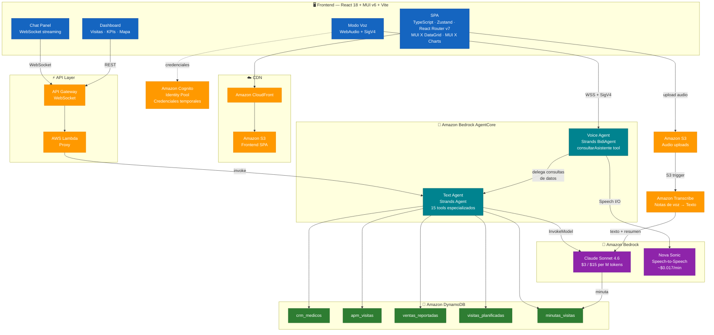

# PharmAssist — Presentación

## Qué es PharmAssist

PharmAssist es un asistente inteligente para visitadores médicos (APMs) de una farmacéutica argentina. Integra datos reales de CRM, historial de visitas y ventas con agentes de IA conversacionales para que el APM pueda gestionar su día a día desde una sola plataforma: consultar su cartera de médicos, preparar visitas, analizar ventas por zona y producto, y recibir sugerencias accionables — todo en español argentino, por texto o por voz.

---

## Para quién es

El usuario principal es el **Agente de Propaganda Médica (APM)**, el visitador que recorre consultorios y hospitales presentando productos del laboratorio a médicos. Secundariamente, gerentes de zona y dirección comercial que necesitan visibilidad del desempeño de sus equipos.

El APM típico:
- Gestiona una cartera de 50–150 médicos distribuidos en varias zonas geográficas
- Realiza entre 6 y 10 visitas presenciales por día
- Necesita preparar cada visita con contexto: qué productos presentar, qué se habló la última vez, qué ventas están cayendo en la zona
- Trabaja desde notebook, en movimiento, y valora respuestas rápidas y concretas

---

## Funcionalidades principales

### 1. Chat inteligente con datos reales
El APM escribe consultas en lenguaje natural y el agente IA (Strands + Claude en Bedrock) responde con datos concretos del CRM, visitas y ventas. Ejemplos:
- "¿Cuándo fue la última vez que visité al Dr. Herrera?"
- "¿Qué médicos de Belgrano no visité en los últimos 3 meses?"
- "Dame un resumen de ventas de PAMOXET en mi zona"

El agente tiene 15 herramientas especializadas que consultan DynamoDB en tiempo real, buscan información pública de médicos en internet, y generan briefs y mensajes personalizados.

### 2. Modo voz bidireccional
El APM puede hablar directamente con el asistente usando Nova Sonic (speech-to-speech). El agente de voz delega las consultas de datos al agente de texto, optimizando las respuestas para ser escuchadas (sin tablas, sin markdown, máximo 2-3 oraciones).

### 3. Dashboard del APM
Vista consolidada con:
- Visitas planificadas para hoy con mapa interactivo
- Alertas de SLA (médicos que necesitan visita según su cadencia)
- Cumpleaños de médicos de la semana
- KPIs de cobertura y frecuencia

### 4. Sugerencia inteligente de próxima visita
Algoritmo que combina días de SLA vencido, productos con caída de ventas en la zona del médico, y visitas planificadas pendientes para rankear los 5 médicos más prioritarios para visitar.

### 5. Generación de briefs y mensajes
- Brief pre-visita: combina datos CRM + búsqueda web + historial de visitas previas en un solo documento
- Mensajes de cumpleaños personalizados generados con IA, considerando intereses y hobbies del médico

### 6. Minutas automáticas de visitas
Grabación de audio post-visita → transcripción con Amazon Transcribe → resumen estructurado con Bedrock (productos discutidos, compromisos, próximos pasos) → almacenado en DynamoDB.

---

## Arquitectura técnica

### Stack tecnológico

| Capa | Tecnología |
|------|-----------|
| Frontend | React 18, TypeScript, MUI v6, Vite, Zustand |
| Agente de texto | Strands Agents SDK + Claude Sonnet 4.6 (Bedrock) |
| Agente de voz | Strands BidiAgent + Nova Sonic (Bedrock) |
| Runtime de agentes | Amazon Bedrock AgentCore (serverless) |
| Base de datos | Amazon DynamoDB (5 tablas, on-demand) |
| API | API Gateway WebSocket + Lambda proxy |
| CDN | CloudFront + S3 |
| Transcripción | Amazon Transcribe |
| IaC | AWS CDK en Python |
| Región | us-east-1 |

---

## Estimación de costos diarios en AWS

### Supuestos de uso (derivados de 200 APMs × 8 visitas/día)

| Métrica | Cálculo | Valor diario |
|---------|---------|-------------|
| Visitas médicas totales | 200 APMs × 8 visitas | 1.600 visitas/día |
| Consultas al chat (texto) | ~3 consultas por visita (prep + follow-up) + 2 consultas generales/día | 5.200 consultas/día |
| Sesiones de voz | ~20% de APMs usan voz, ~3 sesiones/día de ~2 min | 120 sesiones/día (~240 min) |
| Notas de voz (transcripción) | ~50% de visitas generan nota de voz de ~2 min | 800 notas/día (~1.600 min) |
| Requests al dashboard | ~10 page loads/día por APM (login + navegación) | 2.000 page loads/día |
| API requests (REST/WS) | ~15 requests por page load + chat messages | ~35.000 requests/día |

### Detalle de costos por servicio

Todos los precios corresponden a la región us-east-1, on-demand, sin free tier aplicado.

---

#### 1. Amazon Bedrock — Claude Sonnet 4.6 (agente de texto)

Modelo de pricing: por token. Claude Sonnet 4.6 cuesta $3.00/M input tokens y $15.00/M output tokens.

| Concepto | Estimación | Costo |
|----------|-----------|-------|
| Input tokens por consulta | ~2.000 tokens (system prompt + contexto + tool results) | — |
| Output tokens por consulta | ~500 tokens (respuesta) | — |
| Consultas diarias | 5.200 | — |
| Input tokens/día | 5.200 × 2.000 = 10.4M tokens | 10.4 × $3.00 = **$31.20** |
| Output tokens/día | 5.200 × 500 = 2.6M tokens | 2.6 × $15.00 = **$39.00** |
| **Subtotal Bedrock Claude** | | **$70.20/día** |

> Fuente: [AWS Bedrock Pricing](https://aws.amazon.com/bedrock/pricing/) — Claude Sonnet 4.6: $3/M input, $15/M output tokens.

---

#### 2. Amazon Bedrock — Nova Sonic (agente de voz)

Modelo de pricing: por token de speech. Nova Sonic cuesta $0.0034/1K speech input tokens y $0.0136/1K speech output tokens (~$0.017/min combinado).

| Concepto | Estimación | Costo |
|----------|-----------|-------|
| Minutos de voz/día | 240 min (120 sesiones × 2 min) | — |
| Costo por minuto | ~$0.017 | — |
| **Subtotal Nova Sonic** | 240 × $0.017 | **$4.08/día** |

> Fuente: [AWS Bedrock Pricing](https://aws.amazon.com/bedrock/pricing/) — Nova Sonic: $0.0034/1K speech input, $0.0136/1K speech output. Estimación ~$0.017/min según [rywalker.com](https://rywalker.com/research/aws-nova-2-sonic).

---

#### 3. Amazon Transcribe (notas de voz)

Modelo de pricing: $0.024/minuto (standard batch, tier 1 hasta 250K min/mes).

| Concepto | Estimación | Costo |
|----------|-----------|-------|
| Minutos de audio/día | 1.600 min (800 notas × 2 min) | — |
| Costo por minuto | $0.024 | — |
| **Subtotal Transcribe** | 1.600 × $0.024 | **$38.40/día** |

> Fuente: [Amazon Transcribe Pricing](https://aws.amazon.com/transcribe/pricing/) — $0.024/min standard batch.

---

#### 4. Amazon DynamoDB (5 tablas, on-demand)

Modelo de pricing: $1.25/M read request units (RRU), $1.25/M write request units (WRU). Storage: $0.25/GB-mes.

| Concepto | Estimación | Costo |
|----------|-----------|-------|
| Reads/día | ~5.200 consultas × 3 tool calls × 2 reads avg = 31.200 RRU + 35.000 dashboard reads = **66.200 RRU** | — |
| Writes/día | 800 minutas + 1.600 actualizaciones de visitas = **2.400 WRU** | — |
| Costo reads | 0.0662M × $1.25 | **$0.08** |
| Costo writes | 0.0024M × $1.25 | **$0.003** |
| Storage (~5 GB) | 5 × $0.25 / 30 | **$0.04** |
| **Subtotal DynamoDB** | | **$0.12/día** |

> Fuente: [Amazon DynamoDB Pricing](https://aws.amazon.com/dynamodb/pricing/on-demand/) — $1.25/M RRU, $1.25/M WRU (us-east-1).

---

#### 5. AWS Lambda (proxy WebSocket + API)

Modelo de pricing: $0.20/M requests + $0.0000166667/GB-segundo.

| Concepto | Estimación | Costo |
|----------|-----------|-------|
| Invocaciones/día | ~40.000 (API + WS messages) | — |
| Duración promedio | 200ms, 256MB | — |
| Costo requests | 0.04M × $0.20 | **$0.008** |
| Costo compute | 40.000 × 0.2s × 0.25GB × $0.0000166667 | **$0.03** |
| **Subtotal Lambda** | | **$0.04/día** |

> Fuente: [AWS Lambda Pricing](https://aws.amazon.com/lambda/pricing/) — $0.20/M requests, $0.0000166667/GB-s.

---

#### 6. API Gateway WebSocket

Modelo de pricing: $1.00/M messages + $0.25/M connection minutes.

| Concepto | Estimación | Costo |
|----------|-----------|-------|
| Messages/día | ~40.000 (ida + vuelta chat) | — |
| Connection minutes/día | ~200 APMs × 30 min avg = 6.000 min | — |
| Costo messages | 0.04M × $1.00 | **$0.04** |
| Costo connections | 0.006M × $0.25 | **$0.0015** |
| **Subtotal API GW** | | **$0.04/día** |

> Fuente: [Amazon API Gateway Pricing](https://aws.amazon.com/api-gateway/pricing/) — WebSocket: $1.00/M messages, $0.25/M connection minutes.

---

#### 7. Amazon Bedrock AgentCore Runtime (text + voice agents)

Modelo de pricing: consumo de CPU y memoria por segundo de sesión activa. Solo se cobra por recursos activos (I/O wait es gratis). Mínimo 128MB de memoria.

| Concepto | Estimación | Costo |
|----------|-----------|-------|
| Sesiones de texto/día | 5.200 consultas, ~5s activas cada una | — |
| Sesiones de voz/día | 120 sesiones, ~120s activas cada una | — |
| Costo estimado (text) | ~7.2 vCPU-hours + memoria | **~$3.00** |
| Costo estimado (voice) | ~4 vCPU-hours + memoria | **~$2.00** |
| **Subtotal AgentCore Runtime** | | **~$5.00/día** |

> Fuente: [Amazon Bedrock AgentCore Pricing](https://aws.amazon.com/bedrock/agentcore/pricing/) — Consumo activo de CPU/memoria por segundo. Estimación conservadora basada en el modelo de billing por recurso activo.

---

#### 8. Amazon S3 + CloudFront (frontend SPA)

| Concepto | Estimación | Costo |
|----------|-----------|-------|
| Storage S3 (~50 MB SPA) | 0.05 GB × $0.023 / 30 | **$0.00004** |
| CloudFront requests | 2.000 page loads × ~20 assets = 40.000 requests | — |
| CloudFront data transfer | ~40.000 × 50KB avg = ~2 GB | — |
| Costo requests | 0.04M × $0.01/10K = | **$0.04** |
| Costo transfer | 2 GB × $0.085 | **$0.17** |
| **Subtotal S3 + CF** | | **$0.21/día** |

> Fuentes: [Amazon S3 Pricing](https://aws.amazon.com/s3/pricing/) — $0.023/GB-mes. [Amazon CloudFront Pricing](https://aws.amazon.com/cloudfront/pricing/) — $0.085/GB, $0.01/10K HTTPS requests.

---

#### 9. Amazon Cognito (Identity Pool para voz)

| Concepto | Estimación | Costo |
|----------|-----------|-------|
| MAUs (200 APMs) | 200 MAUs | — |
| Costo | Dentro del free tier (10.000 MAUs gratis) | **$0.00/día** |

> Fuente: [Amazon Cognito Pricing](https://aws.amazon.com/cognito/pricing/) — Primeros 10.000 MAUs gratis en tier Essentials.

---

### Resumen de costos diarios

| Servicio | Costo/día | % del total |
|----------|----------|-------------|
| Bedrock — Claude Sonnet 4.6 | $70.20 | 59.4% |
| Bedrock — Transcribe | $38.40 | 32.5% |
| Bedrock — AgentCore Runtime | ~$5.00 | 4.2% |
| Bedrock — Nova Sonic | $4.08 | 3.5% |
| S3 + CloudFront | $0.21 | 0.2% |
| DynamoDB | $0.12 | 0.1% |
| API Gateway | $0.04 | <0.1% |
| Lambda | $0.04 | <0.1% |
| Cognito | $0.00 | 0% |
| **TOTAL DIARIO** | **~$118/día** | **100%** |
| **TOTAL MENSUAL (22 días hábiles)** | **~$2.600/mes** | |
| **Costo por APM/mes** | **~$13/APM/mes** | |
| **Costo por visita** | **~$0.07/visita** | |

---

### Observaciones sobre la estimación

- El **59% del costo es Bedrock (Claude)** para el agente de texto. Migrar a un modelo más económico como Claude Haiku ($0.25/$1.25 per M tokens) reduciría este componente en ~90%, bajando el total a ~$25/día.
- El **33% es Transcribe** para notas de voz. Si se reduce la adopción de notas de voz o se acortan las grabaciones, este costo baja proporcionalmente.
- La infraestructura serverless (Lambda, API Gateway, DynamoDB, S3, CloudFront) representa menos del 1% del costo total — la arquitectura escala sin costos fijos.
- AgentCore Runtime cobra solo por CPU/memoria activa (I/O wait es gratis), lo que lo hace eficiente para workloads agenticos donde el agente espera respuestas del LLM la mayor parte del tiempo.
- No se incluyen costos de transferencia de datos entre servicios AWS (intra-región, generalmente despreciables) ni costos de desarrollo/mantenimiento.
- Los precios son on-demand sin compromisos. Bedrock ofrece provisioned throughput con descuentos de hasta 50% para workloads predecibles.

---

*Precios consultados en abril 2026 para la región us-east-1. Los precios de AWS pueden variar. Consultar siempre la [página oficial de pricing](https://aws.amazon.com/pricing/) para valores actualizados.*
