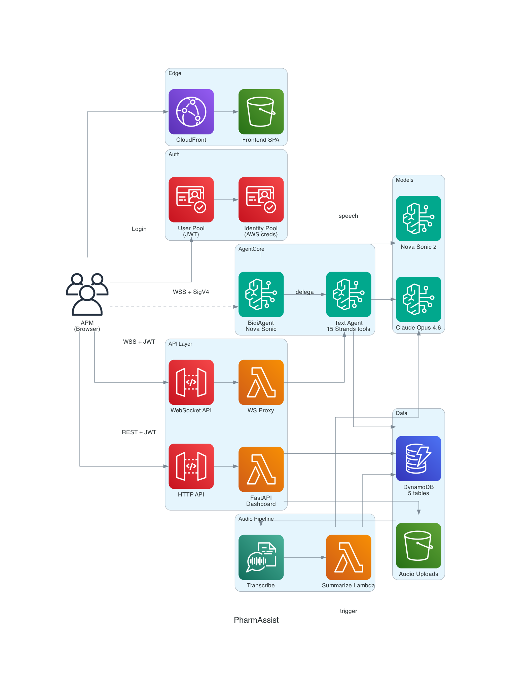
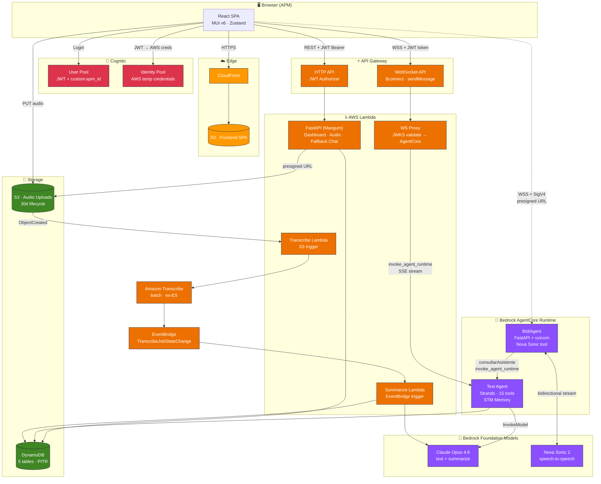
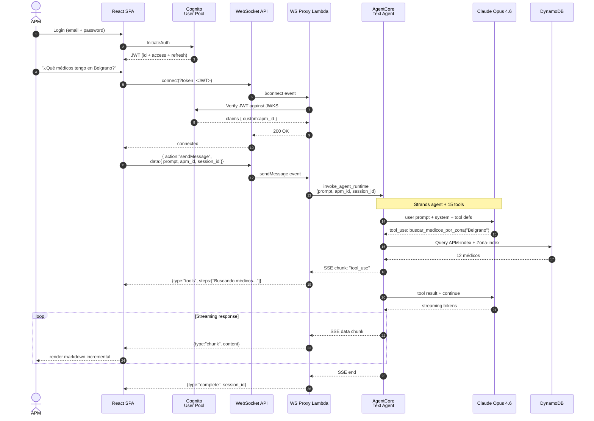

# PharmAssist

> Asistente inteligente para Agentes de Propaganda Médica (APMs) de una farmacéutica argentina. Dashboard, chat conversacional con streaming, modo voz bidireccional y minutas automáticas — respaldado por agentes IA desplegados en Amazon Bedrock AgentCore.


> Proyecto MVP publicado con fines de referencia y aprendizaje. Los datos (`crm_medicos.csv`, `apm_visitas.csv`, `ventas_reportadas.csv`) son **sintéticos** — nombres, emails, teléfonos y direcciones fueron generados para la demo.

---

## Tabla de contenidos

- [Demo](#demo)
- [Arquitectura](#arquitectura)
- [Stack tecnológico](#stack-tecnológico)
- [Funcionalidades](#funcionalidades)
- [Setup en 10 comandos](#setup-en-10-comandos)
- [Probar la demo](#probar-la-demo)
- [Desarrollo local](#desarrollo-local)
- [Setup manual detallado](#setup-manual-detallado)
- [Variables de entorno](#variables-de-entorno)
- [API Endpoints](#api-endpoints)
- [Tools del agente](#tools-del-agente)
- [Destruir todo](#destruir-todo)
- [Troubleshooting](#troubleshooting)
- [Seguridad y licencia](#seguridad-y-licencia)

---

## Demo

[](https://youtu.be/1TSOszoMHlE)

▶️ **[Ver demo en YouTube](https://youtu.be/1TSOszoMHlE)** — recorrido completo con audio: login, dashboard, chat conversacional, modo voz con Nova Sonic y generación de minutas.

---

## Arquitectura



### Diagrama de componentes



### Flujo de una pregunta de chat (streaming)



---

## Stack tecnológico

| Capa | Tecnología | Versión |
|---|---|---|
| Frontend | React + TypeScript + MUI v6 + Vite + Zustand | React 18, MUI 6, Vite 7 |
| Backend | FastAPI + Mangum (ASGI → Lambda) | Python 3.12 |
| Agente de texto | Strands Agents SDK + Claude Opus 4.6 | `us.anthropic.claude-opus-4-6-v1` |
| Agente de voz | Strands BidiAgent + Nova Sonic 2 | `amazon.nova-2-sonic-v1:0` |
| Runtime de agentes | Amazon Bedrock AgentCore (direct_code + container) | — |
| Base de datos | Amazon DynamoDB (5 tablas, PAY_PER_REQUEST, PITR habilitado) | on-demand |
| Autenticación | Amazon Cognito User Pool (JWT) + Identity Pool (SigV4) | — |
| Streaming | API Gateway WebSocket + Lambda Proxy | — |
| Transcripción | Amazon Transcribe (batch, es-ES) | — |
| Resumen de minutas | Amazon Bedrock — Nova 2 Lite | `us.amazon.nova-2-lite-v1:0` |
| Web search | DDGS (open source, sin API key) | 9.x |
| CDN | Amazon CloudFront + S3 | — |
| IaC | AWS CDK (Python) | ≥ 2.170 |
| Región | us-east-1 | — |

---

## Funcionalidades

### Autenticación (Cognito)
- Login con email/contraseña via Cognito User Pool
- JWT tokens en memoria (no localStorage), refresh automático
- Atributo `custom:apm_id` en el JWT para aislamiento de datos
- Identity Pool intercambia JWT por credenciales AWS temporales (modo voz SigV4)

### Dashboard
- **Visitas del mes**: agenda planificada con distribución por días hábiles, estados Pendiente/Completada/Vencida
- **Cumpleaños próximos**: médicos con cumpleaños en los próximos 30 días, generación de mensajes con IA, envío por WhatsApp
- **Alertas SLA**: médicos con visitas vencidas según su cadencia (Mensual/Trimestral/Semestral/Anual/Digital)

### Chat conversacional (WebSocket streaming)
- Streaming de respuestas en tiempo real (protocolo `chunk`/`complete`/`tools`/`error`)
- Reconexión automática con backoff exponencial
- Fallback a HTTP POST cuando WebSocket no está disponible
- Gestión de sesiones via AgentCore STM Memory
- 15 tools especializados (CRM, visitas, ventas, web search, generación)

### Modo voz (Nova Sonic 2 — BidiAgent)
- Interfaz fullscreen con esfera de partículas animada
- Speech-to-speech bidireccional via Nova Sonic 2
- Frontend se conecta directo a AgentCore via WSS + SigV4 (sin servidor intermedio)
- Tool `consultarAsistente` delega al Text Agent con `mode: "voice"`
- Soporte de interrupciones (barge-in)
- Voz femenina en español: `lupe`

### Pipeline de notas de voz
- Grabación → S3 presigned URL → Transcribe (es-ES) → EventBridge → Bedrock → DynamoDB
- Minuta estructurada con productos discutidos, compromisos y próximos pasos
- Revisión de minuta antes de confirmar

### Sugerencia inteligente de próxima visita
- Ranking combinando SLA vencido + caída de ventas + visitas pendientes
- Incluye contexto de última minuta si existe

---

## Setup en 10 comandos

El proyecto incluye un `Makefile` que orquesta todo el flujo. Un setup desde cero son ~15 minutos:

```bash
# 1. Clonar y configurar .env
cp .env.example .env
# Editar .env — completar AWS_PROFILE, AWS_ACCOUNT_ID y passwords demo
#              (los valores que dependen del CDK se llenan solos después)

# 2. Validar herramientas + credenciales AWS
make check-prereqs

# 3. Instalar dependencias (venvs Python + npm + symlink frontend/.env → .env)
make bootstrap

# 4. Bootstrapear CDK (solo la primera vez en cada cuenta + región)
make cdk-bootstrap

# 5. Deploy CDK (tarda ~5-8 min)
make deploy-infra

# 6. Escribir los outputs del stack en .env
make env-from-outputs

# 7. Cargar CSVs en DynamoDB + crear usuario demo "Peccy"
make seed

# 8. Deploy Text Agent a AgentCore (tarda ~3 min)
make deploy-text-agent

# 9. Deploy BidiAgent (voz) a AgentCore (tarda ~3-5 min, requiere Docker)
make deploy-bidi-agent

# 10. Redeploy del stack + build/deploy del frontend
make deploy-infra && make deploy-frontend
```

Al terminar, el último paso imprime la URL de CloudFront. Login con:

- **Email**: el que configuraste en `PECCY_EMAIL` en `.env` (default `peccy@example.com`)
- **Password**: el que configuraste en `PECCY_PASSWORD` en `.env`

Para ver todos los targets del Makefile: `make help`. Para destruir todo: `make destroy`.

### Prerequisitos

Antes de arrancar, necesitás:

| Herramienta | Versión | Comando |
|---|---|---|
| Node.js | 20+ | `node --version` |
| Python | 3.12+ | `python3 --version` |
| AWS CLI | v2 | `aws --version` |
| AWS CDK | 2.170+ | `npm install -g aws-cdk` |
| Docker Desktop | corriendo | `docker info` |
| `agentcore` CLI | latest | `pip install bedrock-agentcore-starter-toolkit` |

Además:

- **Perfil AWS** con permisos Admin (`aws configure --profile <tu-perfil>`).
- **Acceso a Bedrock habilitado** en [consola Bedrock → Model access](https://console.aws.amazon.com/bedrock/home?region=us-east-1#/modelaccess) para:
  - `anthropic.claude-opus-4-6` (inference profile `us.anthropic.claude-opus-4-6-v1`)
  - `amazon.nova-2-sonic-v1:0`
  - `amazon.nova-2-lite-v1:0`
- **Docker Desktop** abierto antes de deployar (CDK y el BidiAgent lo usan).

---

## Probar la demo

El usuario `Peccy` viene cargado con:

- 12 médicos asignados en Belgrano-Centro, Núñez-Centro y Palermo-Norte
- ~140 visitas históricas (2025-01 → 2026-12)
- ~50 visitas planificadas futuras
- Cumpleaños distribuidos en todos los meses
- Alertas SLA generadas automáticamente

### Preguntas sugeridas (chat)

1. "Dame un brief sobre el Dr. Martín Kreutzer" — combina CRM + búsqueda web + historial + minutas
2. "Se me liberó un hueco, ¿a quién puedo visitar?" — ranking por SLA + ventas + visitas pendientes
3. "¿Qué productos están cayendo en ventas en mi zona?" — análisis YoY con datos reales
4. "¿Cuántos médicos tengo asignados?" — consulta rápida al CRM
5. "¿Qué médicos tengo en Belgrano?" — filtro por zona
6. "¿Cuáles son mis visitas de hoy?" — agenda planificada
7. "Preparame talking points para visitar al Dr. Rodrigo Estévez que es Neurólogo" — generación contextual

### Demo de Kiro (prompt extendido para mostrar MCPs)

> "Armá una presentación speech de PharmAssist como archivo markdown. Incluí: para qué sirve, quién es el usuario target, funcionalidades principales, arquitectura técnica, y una estimación de costos diarios en AWS asumiendo 200 APMs activos que realizan entre 6 y 10 visitas médicas por día (promedio 8). Derivá los supuestos de uso (consultas al chat, sesiones de voz, notas de voz, requests al dashboard) a partir de ese volumen de visitas. Usá el MCP de pricing oficial de AWS para los precios."

---

## Desarrollo local

### Frontend
```bash
make dev-frontend          # http://localhost:5173
```

### Backend (FastAPI)
```bash
make dev-backend           # http://localhost:8000
```

En desarrollo local el `apm_id` se puede pasar como query parameter (fallback cuando no hay JWT).

### Text Agent local (sin deploy a AWS)
```bash
cd agentcore
source ../.env
agentcore dev --env BEDROCK_MODEL_ID=$BEDROCK_MODEL_ID
# En otra terminal:
agentcore invoke --dev '{"prompt": "Hola", "apm_id": "Peccy"}'
```

### BidiAgent local
```bash
cd bidiagent
source ../.env
TEXT_AGENT_ARN=$AGENTCORE_AGENT_ARN python agent.py
# WebSocket en ws://127.0.0.1:8080/ws
```

---

## Setup manual detallado

Si preferís no usar el Makefile o querés entender qué hace cada paso, podés correrlos manualmente:

```bash
# 1. Variables de entorno
cp .env.example .env
# editar .env

# 2. Instalar deps
cd infrastructure && python3 -m venv .venv && source .venv/bin/activate && pip install -r requirements.txt && cd ..
cd backend && python3 -m venv .venv && source .venv/bin/activate && pip install -r requirements.txt && cd ..
cd frontend && npm install && cd ..
ln -sf ../.env frontend/.env   # Vite lee .env del dir actual

# 3. Bootstrap CDK (solo primera vez)
cd infrastructure && source .venv/bin/activate
source ../.env
cdk bootstrap aws://$AWS_ACCOUNT_ID/$AWS_REGION --profile $AWS_PROFILE

# 4. Deploy stack
cdk deploy PharmAssistStack --profile $AWS_PROFILE --require-approval never
cd ..

# 5. Outputs → .env
bash scripts/env-from-outputs.sh

# 6. Seed datos + usuario Peccy
source .env
cd backend && source .venv/bin/activate
python -m data.loader \
  --medicos-table $MEDICOS_TABLE_NAME \
  --visitas-table $VISITAS_TABLE_NAME \
  --ventas-table $VENTAS_TABLE_NAME \
  --planificadas-table $PLANIFICADAS_TABLE_NAME \
  --data-dir .. --year $(date +%Y)
python ../scripts/setup_peccy_user.py
cd ..

# 7. Deploy Text Agent (el script extrae el ARN y adjunta permisos DDB al rol)
bash scripts/deploy-text-agent.sh

# 8. Deploy BidiAgent
bash scripts/deploy-bidi-agent.sh

# 9. Redeploy stack (para que el Lambda proxy reciba AGENTCORE_AGENT_ARN)
cd infrastructure && source .venv/bin/activate && source ../.env
cdk deploy PharmAssistStack --profile $AWS_PROFILE --require-approval never
cd ..

# 10. Frontend
bash scripts/deploy-frontend.sh
```

---

## Variables de entorno

| Variable | Componente | Descripción |
|---|---|---|
| `AWS_PROFILE` | CDK, AWS CLI, AgentCore | Perfil AWS CLI |
| `AWS_REGION` | Todos | Región AWS (default `us-east-1`) |
| `AWS_ACCOUNT_ID` | CDK | ID de cuenta AWS |
| `BEDROCK_MODEL_ID` | Agentes | Inference profile ID (prefix `us.`) |
| `TAG_PROJECT`, `TAG_ENVIRONMENT`, `TAG_OWNER` | CDK Aspects | Tags aplicados a todos los recursos |
| `MEDICOS_TABLE_NAME`, `VISITAS_TABLE_NAME`, `VENTAS_TABLE_NAME`, `PLANIFICADAS_TABLE_NAME`, `MINUTAS_TABLE_NAME` | Agente, Lambda | DynamoDB table names (outputs CDK) |
| `API_URL`, `VITE_API_URL` | Frontend, tests | HTTP API Gateway URL |
| `VITE_WS_URL` | Frontend | WebSocket API URL |
| `USER_POOL_ID`, `VITE_COGNITO_USER_POOL_ID` | Frontend, scripts | Cognito User Pool ID |
| `VITE_COGNITO_CLIENT_ID` | Frontend | Cognito App Client ID |
| `VITE_AWS_REGION` | Frontend | Región para Cognito SDK |
| `IDENTITY_POOL_ID`, `VITE_IDENTITY_POOL_ID` | Frontend | Identity Pool (credenciales SigV4 para voz) |
| `AGENTCORE_AGENT_ARN` | Lambda proxy | ARN del Text Agent en AgentCore |
| `BIDIAGENT_AGENT_ARN`, `VITE_BIDIAGENT_AGENT_ARN` | Frontend | ARN del BidiAgent para voz |
| `AGENTCORE_REGION` | AgentCore CLI | Región donde corre AgentCore |
| `AUDIO_BUCKET_NAME` | Lambdas audio | S3 bucket para audio uploads |
| `PECCY_EMAIL`, `PECCY_PASSWORD` | `scripts/setup_peccy_user.py` | Credenciales del usuario demo |
| `DEMO_USER_EMAIL`, `DEMO_USER_PASSWORD`, `DEMO_USER_APM_ID` | `scripts/create-demo-user.py` | Usuario demo adicional (opcional) |

**Importante**: Si un `*_APM_ID` contiene espacios (ej. `"Demo APM"`), debe ir entre comillas dobles para que `source .env` no lo interprete mal.

---

## API Endpoints

### HTTP API (Cognito JWT, excepto /health)

| Método | Endpoint | Descripción |
|---|---|---|
| GET | `/health` | Health check (público) |
| POST | `/api/chat` | Chat con el agente IA (fallback HTTP) |
| GET | `/api/dashboard/visits-today` | Visitas planificadas del mes |
| GET | `/api/dashboard/birthdays` | Cumpleaños próximos (30 días) |
| GET | `/api/dashboard/sla-alerts` | Alertas de SLA vencidas |
| POST | `/api/dashboard/visits/complete` | Marcar visita como completada |
| POST | `/api/dashboard/birthdays/generate-message` | Generar mensaje de cumpleaños con IA |
| GET | `/api/audio/presigned-url` | Presigned URL para subir audio a S3 |
| POST | `/api/minutas` | Guardar minuta de visita |
| GET | `/api/minutas` | Listar minutas |

### WebSocket API (chat streaming)

Conexión con JWT en query param `token`. Protocolo:

- **Cliente → Servidor**: `{"action": "sendMessage", "data": {"prompt": "...", "session_id": "..."}}`
- **Servidor → Cliente**: `{"type": "chunk|complete|tools|error", ...}`

### BidiAgent WebSocket (voz)

Conexión directa del browser a AgentCore via WSS + SigV4 presigned URL. Eventos:

| Evento | Dirección | Descripción |
|---|---|---|
| `init` | → BidiAgent | `{type: "init", apm_id: "..."}` |
| `bidi_audio_input` | → BidiAgent | Chunk PCM 16kHz mono (base64) |
| `bidi_audio_stream` | ← BidiAgent | Chunk de audio de respuesta |
| `bidi_transcript_stream` | ← BidiAgent | Transcripción parcial/final |
| `bidi_interruption` | ← BidiAgent | Barge-in detectado |

---

## Tools del agente

| Tool | Dominio | Descripción |
|---|---|---|
| `buscar_medico_por_nombre` | CRM | Busca médico por nombre/apellido |
| `buscar_medicos_por_zona` | CRM | Lista médicos de una zona |
| `buscar_medicos_por_apm` | CRM | Lista toda la cartera del APM |
| `obtener_perfil_medico` | CRM | Perfil completo por matrícula |
| `obtener_visitas_por_medico` | Visitas | Historial de visitas a un médico |
| `obtener_visitas_planificadas_hoy` | Visitas | Agenda de hoy |
| `obtener_historial_visitas_apm` | Visitas | Historial por rango de fechas |
| `obtener_minutas_medico` | Visitas | Últimas 3 minutas de un médico |
| `sugerir_proxima_visita` | Visitas | Ranking de médicos priorizados |
| `obtener_ventas_por_zona` | Ventas | Ventas de una zona en un período |
| `obtener_ventas_declinando` | Ventas | Productos con caída YoY (top 15) |
| `obtener_ventas_por_producto` | Ventas | Detalle de un producto en una zona |
| `buscar_info_publica_medico` | Web | Info pública del médico (DDGS) |
| `generar_brief_medico` | Generación | Brief completo (CRM + web + visitas + minutas) |
| `generar_mensaje_cumpleanos` | Generación | Mensaje personalizado con IA |

---

## Destruir todo

```bash
make destroy
```

O manualmente:

```bash
cd agentcore && AWS_PROFILE=$AWS_PROFILE agentcore destroy
cd ../bidiagent && AWS_PROFILE=$AWS_PROFILE agentcore destroy
cd ../infrastructure && source .venv/bin/activate
cdk destroy PharmAssistStack --profile $AWS_PROFILE --force
```

---

## Troubleshooting

- **`cdk deploy` falla con "Need to bootstrap"** → Ejecutá `make cdk-bootstrap` primero.
- **`cdk deploy` o `agentcore deploy` fallan con "Docker daemon not running"** → Abrí Docker Desktop y esperá a que termine de arrancar.
- **`source .env` rompe con "command not found"** → Alguna variable tiene un espacio sin quotear. Ponela entre comillas: `DEMO_USER_APM_ID="Demo APM"`.
- **`make env-from-outputs` falla** → El stack debe estar deployado (`make deploy-infra` primero).
- **`agentcore deploy` falla con "Agent X was not found"** → El `.bedrock_agentcore.yaml` local apunta a una cuenta AWS distinta. Los scripts detectan esto y lo limpian, pero si corrés `agentcore` manualmente borrá `.bedrock_agentcore.yaml` y `.bedrock_agentcore/` antes de deployar en otra cuenta.
- **Text Agent y BidiAgent colisionan en AgentCore** → El BidiAgent usa `--name pharmassist_bidi` explícito para no chocar con el Text Agent (default `agent`).
- **AgentCore responde "AccessDenied" al consultar DynamoDB** → El script `deploy-text-agent.sh` invoca automáticamente `grant-agent-ddb-access.sh`. Si lo corriste manual, ejecutá `bash scripts/grant-agent-ddb-access.sh`.
- **Login falla** → Verificá que `VITE_COGNITO_CLIENT_ID` y `VITE_COGNITO_USER_POOL_ID` en `.env` coinciden con los outputs del CDK (correr `make env-from-outputs`). Y que el usuario existe (`make seed` o `make seed-peccy`).
- **WebSocket no conecta** → Verificá `VITE_WS_URL` en `.env` y que la Lambda Proxy tiene `AGENTCORE_AGENT_ARN` configurado (redeploy del stack con `make deploy-infra` después de deployar el Text Agent).
- **Modo voz no conecta** → Verificá que `VITE_IDENTITY_POOL_ID` y `VITE_BIDIAGENT_AGENT_ARN` estén en `.env`. El Identity Pool debe tener el User Pool como proveedor y el rol autenticado debe tener `bedrock-agentcore:InvokeAgentRuntimeWithWebSocketStream`.
- **Frontend muestra "undefined" en URLs** → El build de Vite no leyó `.env`. Asegurate que `frontend/.env` existe (el Makefile hace el symlink automático).
- **Web search (DDGS) falla** → Puede ser rate-limit temporal. El brief se genera igual con datos del CRM.
- **`agentcore destroy` preserva la memoria** → El CLI marca como "pre-existing" a memorias que detecta al deployar. El target `make destroy` ejecuta `scripts/cleanup-orphan-memories.sh` al final para limpiarlas.
- **Buckets `bedrock-agentcore-codebuild-sources-<account>-<region>`** → Son compartidos por todos los agentes de esa cuenta. `make destroy` NO los borra para no romper otros deploys. Si querés borrarlos, hacelo manual con `aws s3 rb s3://<bucket> --force`.

---

## Seguridad y licencia

- Nunca commitees tu `.env` — usá `.env.example` como template.
- Los CSVs son **datos sintéticos**. No representan información real de médicos o pacientes.
- Reportá vulnerabilidades según [SECURITY.md](SECURITY.md).
- Para producción: rotá passwords, habilitá MFA en Cognito, revisá IAM al mínimo necesario.

Distribuido bajo la licencia MIT. Ver [LICENSE](LICENSE).

---

## Créditos

Construido con [Kiro](https://kiro.dev) — el IDE autónomo con AI que acompañó el diseño, la implementación, los specs y los dryruns de este proyecto.

Stack: [Strands Agents SDK](https://strandsagents.com/), [Amazon Bedrock AgentCore](https://aws.amazon.com/bedrock/agentcore/), [MUI v6](https://mui.com/) y [AWS CDK](https://aws.amazon.com/cdk/). Los datos de la demo son sintéticos.

### Referencias

La implementación del modo voz (BidiAgent + Nova Sonic + conexión SigV4 directa desde el browser) está basada en el sample oficial de AWS:

- **[aws-samples/sample-nova-sonic-websocket-agentcore](https://github.com/aws-samples/sample-nova-sonic-websocket-agentcore)** — Amazon Nova Sonic over WebSocket with Amazon Bedrock AgentCore. De ahí tomamos el patrón de FastAPI + uvicorn como runtime del BidiAgent en AgentCore (container deploy), el flujo de presigned URL con SigV4 desde el frontend y el protocolo de eventos `bidi_audio_input` / `bidi_audio_stream` / `bidi_transcript_stream`.
