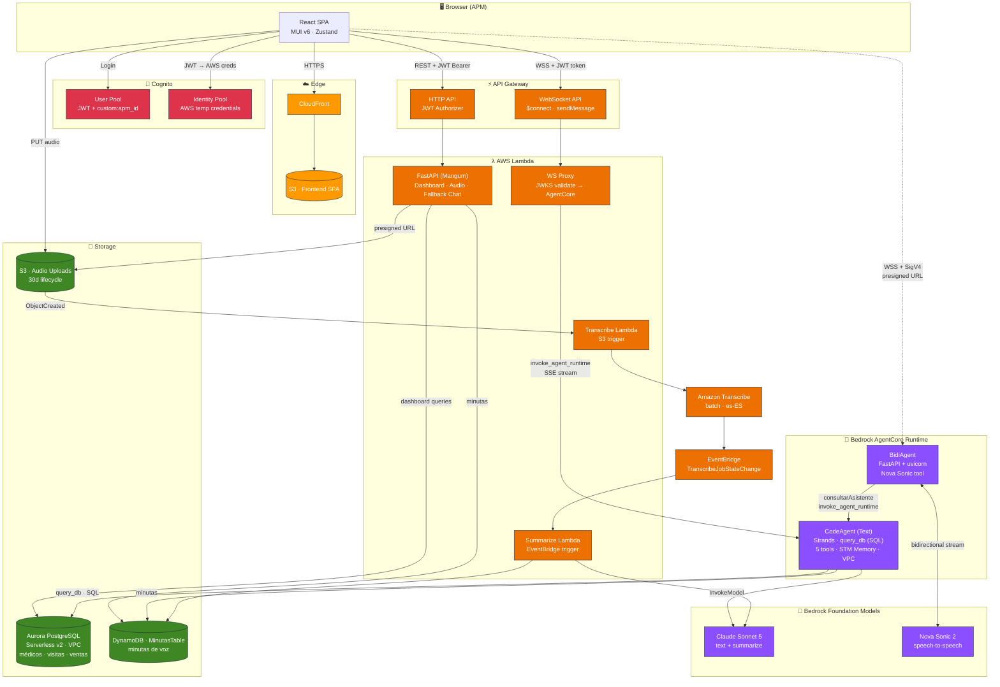
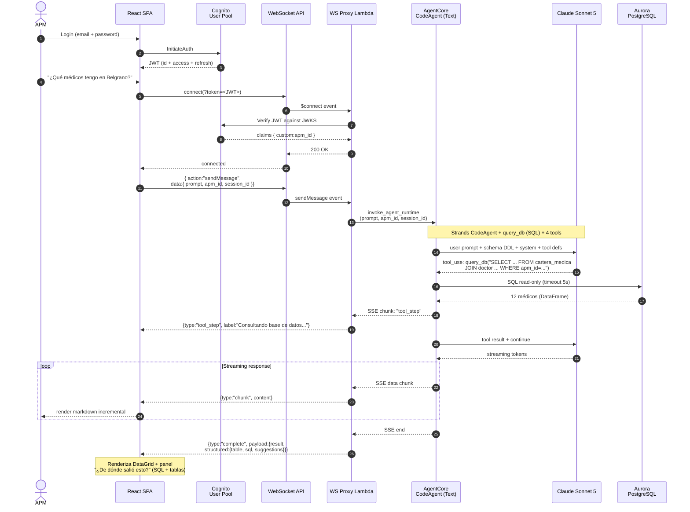

# PharmAssist

> Asistente inteligente para Agentes de Propaganda Médica (APMs) de una farmacéutica argentina. Dashboard, chat conversacional con streaming, modo voz bidireccional y minutas automáticas — respaldado por agentes IA desplegados en Amazon Bedrock AgentCore.


> Proyecto publicado con fines de referencia y aprendizaje. Los datos son **sintéticos** — médicos, visitas, prescripciones y ventas se generan en Amazon Aurora PostgreSQL mediante una Lambda de seed. Nombres, emails, teléfonos y direcciones fueron generados para la demo.

---

## Tabla de contenidos

- [Demo](#demo)
- [Arquitectura](#arquitectura)
- [Stack tecnológico](#stack-tecnológico)
- [Funcionalidades](#funcionalidades)
- [Setup en 10 comandos](#setup-en-10-comandos)
- [Probar la demo](#probar-la-demo)
- [Desarrollo local](#desarrollo-local)
- [Setup manual detallado](#setup-manual-detallado)
- [Variables de entorno](#variables-de-entorno)
- [API Endpoints](#api-endpoints)
- [Tools del agente](#tools-del-agente)
- [Modelo de datos](#modelo-de-datos)
- [Documentación](#documentación)
- [Destruir todo](#destruir-todo)
- [Troubleshooting](#troubleshooting)
- [Seguridad y licencia](#seguridad-y-licencia)
- [Estimación de costos](#estimación-de-costos)

---

## Demo

[](https://youtu.be/1TSOszoMHlE)

▶️ **[Ver demo en YouTube](https://youtu.be/1TSOszoMHlE)** — recorrido completo con audio: login, dashboard, chat conversacional, modo voz con Nova Sonic y generación de minutas.

---

## Arquitectura

### Diagrama de componentes



### Flujo de una pregunta de chat (streaming)



---

## Stack tecnológico

| Capa | Tecnología | Versión |
|---|---|---|
| Frontend | React + TypeScript + MUI v6 + Vite + Zustand | React 18, MUI 6, Vite 7 |
| Backend | FastAPI + Mangum (ASGI → Lambda) | Python 3.12 |
| Agente de texto | Strands CodeAgent (`query_db` SQL) + Claude Sonnet 5 | `us.anthropic.claude-sonnet-5` |
| Agente de voz | Strands BidiAgent + Nova Sonic 2 | `amazon.nova-2-sonic-v1:0` |
| Runtime de agentes | Amazon Bedrock AgentCore (direct_code + container, VPC mode) | — |
| Base de datos | Amazon Aurora PostgreSQL Serverless v2 (médicos, visitas, ventas) + DynamoDB (`MinutasTable`) | on-demand |
| Autenticación | Amazon Cognito User Pool (JWT) + Identity Pool (SigV4) | — |
| Streaming | API Gateway WebSocket + Lambda Proxy | — |
| Transcripción | Amazon Transcribe (batch, es-ES) | — |
| Resumen de minutas | Amazon Bedrock — Nova 2 Lite | `us.amazon.nova-2-lite-v1:0` |
| Web search | DDGS (open source, sin API key) | 9.x |
| CDN | Amazon CloudFront + S3 | — |
| IaC | AWS CDK (Python) | ≥ 2.170 |
| Región | us-east-1 | — |

---

## Funcionalidades

### Autenticación (Cognito)
- Login con email/contraseña via Cognito User Pool
- JWT tokens en memoria (no localStorage), refresh automático
- Atributo `custom:apm_id` en el JWT para aislamiento de datos
- Identity Pool intercambia JWT por credenciales AWS temporales (modo voz SigV4)

### Dashboard
- **Visitas del mes**: agenda planificada con distribución por días hábiles, estados Pendiente/Completada/Vencida
- **Cumpleaños próximos**: médicos con cumpleaños en los próximos 30 días, generación de mensajes con IA, envío por WhatsApp
- **Alertas SLA**: médicos con visitas vencidas según su cadencia (Mensual/Trimestral/Semestral/Anual/Digital)

### Chat conversacional (WebSocket streaming)
- Streaming de respuestas en tiempo real (protocolo `chunk`/`complete`/`tool_step`/`error`)
- Reconexión automática con backoff exponencial + refresh de token Cognito
- Fallback a HTTP POST cuando WebSocket no está disponible
- Gestión de sesiones via AgentCore STM Memory
- **CodeAgent**: el LLM genera SQL dinámicamente y lo ejecuta contra Aurora vía la tool `query_db` (read-only, timeout 5s), más 4 tools de apoyo (web search, brief, minutas, generación de mensajes)

### Data provenance ("¿De dónde salió esto?")
- Cada respuesta con datos muestra un panel desplegable con el **SQL exacto** que ejecutó el agente
- Deriva y lista las **tablas consultadas** y las **operaciones aplicadas** (agrupación, conteo, suma, cruce, ordenamiento) a partir del SQL
- Renderiza los resultados como **MUI DataGrid** interactivo con headers legibles (no nombres crudos de columna)
- Transparencia total: el APM ve que detrás de la respuesta en lenguaje natural hay una consulta real a datos estructurados

### Modo voz (Nova Sonic 2 — BidiAgent)
- Interfaz fullscreen con esfera de partículas animada
- Speech-to-speech bidireccional via Nova Sonic 2
- Frontend se conecta directo a AgentCore via WSS + SigV4 (sin servidor intermedio)
- Tool `consultarAsistente` delega al Text Agent con `mode: "voice"`
- Soporte de interrupciones (barge-in)
- Voz femenina en español: `lupe`

### Pipeline de notas de voz
- Grabación → S3 presigned URL → Transcribe (es-ES) → EventBridge → Bedrock → DynamoDB
- Minuta estructurada con productos discutidos, compromisos y próximos pasos
- Revisión de minuta antes de confirmar

### Sugerencia inteligente de próxima visita
- Ranking combinando SLA vencido + caída de ventas + visitas pendientes
- Incluye contexto de última minuta si existe

---

## Setup en 10 comandos

El proyecto incluye un `Makefile` que orquesta todo el flujo. Un setup desde cero son ~15 minutos:

```bash
# 1. Clonar y configurar .env
cp .env.example .env
# Editar .env — completar AWS_PROFILE, AWS_ACCOUNT_ID y passwords demo
#              (los valores que dependen de los stacks se llenan solos después)

# 2. Validar herramientas + credenciales AWS
make check-prereqs

# 3. Instalar dependencias (venvs Python + npm + symlink frontend/.env → .env)
make bootstrap

# 4. Bootstrapear CDK (solo la primera vez en cada cuenta + región)
make cdk-bootstrap

# 5. Deploy de la capa de datos (VPC + Aurora Serverless v2 + seed Lambda, ~8-12 min)
make deploy-data-layer

# 6. Deploy del stack principal (Cognito, API GW, WebSocket, Lambda, CloudFront, ~5-8 min)
make deploy-infra

# 7. Escribir los outputs de ambos stacks en .env
make env-from-outputs

# 8. Poblar Aurora (seed Lambda ~5-10 min) + crear usuario demo "Peccy" en Cognito
make seed

# 9. Deploy Text Agent (CodeAgent, VPC mode) + BidiAgent (voz) a AgentCore (~6-8 min, requiere Docker)
make deploy-text-agent && make deploy-bidi-agent

# 10. Redeploy del stack (para inyectar AGENTCORE_AGENT_ARN en el proxy) + build/deploy del frontend
make deploy-infra && make deploy-frontend
```

> Atajo: `make deploy-all` corre los pasos 5→10 en orden. El seed (paso 8) se corre una sola vez y es aparte.

Al terminar, el último paso imprime la URL de CloudFront. Login con:

- **Email**: el que configuraste en `PECCY_EMAIL` en `.env` (default `peccy@example.com`)
- **Password**: el que configuraste en `PECCY_PASSWORD` en `.env`

Para ver todos los targets del Makefile: `make help`. Para destruir todo: `make destroy`.

### Prerequisitos

Antes de arrancar, necesitas:

| Herramienta | Versión | Comando |
|---|---|---|
| Node.js | 20+ | `node --version` |
| Python | 3.12+ | `python3 --version` |
| AWS CLI | v2 | `aws --version` |
| AWS CDK | 2.170+ | `npm install -g aws-cdk` |
| Docker Desktop | corriendo | `docker info` |
| `agentcore` CLI | latest | `pip install bedrock-agentcore-starter-toolkit` |

Además:

- **Perfil AWS** con permisos Admin (`aws configure --profile <tu-perfil>`).
- **Acceso a Bedrock habilitado** en [consola Bedrock → Model access](https://console.aws.amazon.com/bedrock/home?region=us-east-1#/modelaccess) para:
  - `anthropic.claude-sonnet-5` (inference profile `us.anthropic.claude-sonnet-5`)
  - `amazon.nova-2-sonic-v1:0`
  - `amazon.nova-2-lite-v1:0`
- **Docker Desktop** abierto antes de deployar (CDK y el BidiAgent lo usan).

---

## Probar la demo

El usuario `Peccy` (`custom:apm_id = APM_001`) opera sobre los datos sintéticos generados en Aurora por la seed Lambda:

- ~112 médicos en su cartera, con especialidades e instituciones variadas
- Visitas históricas y agenda planificada por ciclo
- Prescripciones y ventas para análisis de share y tendencias
- Cumpleaños distribuidos en el año y alertas SLA por cadencia vencida

### Preguntas sugeridas (chat)

1. "¿Cuántos médicos tengo asignados?" — conteo rápido (mostrá el panel "¿De dónde salió esto?" para ver el SQL)
2. "Listame mis primeros 5 médicos con su especialidad" — DataGrid + data provenance
3. "¿Cuáles son mis visitas de hoy?" — agenda planificada del ciclo
4. "Dame un brief sobre el Dr. Pablo Torres" — combina datos internos + búsqueda web + historial + minutas
5. "¿Qué especialidades predominan en mi cartera?" — agregación (GROUP BY) sobre Aurora
6. "¿Qué marcas tienen mejor share en mi zona?" — análisis de market share con JOINs multi-tabla
7. "¿Qué médicos no visité en los últimos 2 ciclos?" — cobertura de cartera

> Cada respuesta con datos muestra el botón **"¿De dónde salió esto?"** con el SQL exacto, las tablas consultadas y las operaciones aplicadas.

---

## Desarrollo local

### Frontend
```bash
make dev-frontend          # http://localhost:5173
```

### Backend (FastAPI)
```bash
make dev-backend           # http://localhost:8000
```

En desarrollo local el `apm_id` se puede pasar como query parameter (fallback cuando no hay JWT).

### Text Agent local (sin deploy a AWS)
```bash
cd agentcore
source ../.env
agentcore dev --env BEDROCK_MODEL_ID=$BEDROCK_MODEL_ID
# En otra terminal:
agentcore invoke --dev '{"prompt": "Hola", "apm_id": "Peccy"}'
```

### BidiAgent local
```bash
cd bidiagent
source ../.env
TEXT_AGENT_ARN=$AGENTCORE_AGENT_ARN python agent.py
# WebSocket en ws://127.0.0.1:8080/ws
```

---

## Setup manual detallado

Si prefieres no usar el Makefile o quieres entender qué hace cada paso, puedes correrlos manualmente:

```bash
# 1. Variables de entorno
cp .env.example .env
# editar .env

# 2. Instalar deps
cd infrastructure && python3 -m venv .venv && source .venv/bin/activate && pip install -r requirements.txt && cd ..
cd backend && python3 -m venv .venv && source .venv/bin/activate && pip install -r requirements.txt && cd ..
cd frontend && npm install && cd ..
ln -sf ../.env frontend/.env   # Vite lee .env del dir actual

# 3. Bootstrap CDK (solo primera vez)
cd infrastructure && source .venv/bin/activate
source ../.env
cdk bootstrap aws://$AWS_ACCOUNT_ID/$AWS_REGION --profile $AWS_PROFILE
cd ..

# 4a. Deploy capa de datos (VPC + Aurora + seed Lambda)
cd produccion-poc/infrastructure && python3 -m venv .venv && source .venv/bin/activate && pip install -r requirements.txt
source ../../.env
cdk deploy ProduccionPocStack --profile $AWS_PROFILE --require-approval never
cd ../..

# 4b. Deploy stack principal
cd infrastructure && source .venv/bin/activate
cdk deploy PharmAssistStack --profile $AWS_PROFILE --require-approval never
cd ..

# 5. Outputs de ambos stacks → .env (Aurora secret, tabla minutas, Cognito, URLs)
bash scripts/env-from-outputs.sh

# 6. Poblar Aurora (invoca la seed Lambda) + usuario Peccy en Cognito
source .env
aws lambda invoke --function-name $POC_SEED_LAMBDA_ARN --payload '{}' \
  --cli-read-timeout 900 --profile $AWS_PROFILE /tmp/seed.json && cat /tmp/seed.json
cd backend && source .venv/bin/activate
python ../scripts/setup_peccy_user.py
cd ..

# 7. Deploy Text Agent (CodeAgent, VPC mode — conecta a Aurora vía DB_SECRET_ARN)
bash scripts/deploy-text-agent.sh

# 8. Deploy BidiAgent
bash scripts/deploy-bidi-agent.sh

# 9. Redeploy stack (para que el Lambda proxy reciba AGENTCORE_AGENT_ARN)
cd infrastructure && source .venv/bin/activate && source ../.env
cdk deploy PharmAssistStack --profile $AWS_PROFILE --require-approval never
cd ..

# 10. Frontend
bash scripts/deploy-frontend.sh
```

---

## Variables de entorno

| Variable | Componente | Descripción |
|---|---|---|
| `AWS_PROFILE` | CDK, AWS CLI, AgentCore | Perfil AWS CLI |
| `AWS_REGION` | Todos | Región AWS (default `us-east-1`) |
| `AWS_ACCOUNT_ID` | CDK | ID de cuenta AWS |
| `BEDROCK_MODEL_ID` | Agentes | Inference profile ID (prefix `us.`) |
| `TAG_PROJECT`, `TAG_ENVIRONMENT`, `TAG_OWNER` | CDK Aspects | Tags aplicados a todos los recursos |
| `DB_SECRET_ARN` | Agente, Lambda | ARN del secret de Aurora (output de ProduccionPocStack) |
| `POC_AURORA_ENDPOINT`, `POC_AURORA_SECRET_ARN`, `POC_VPC_ID`, `POC_SEED_LAMBDA_ARN` | Capa de datos | Outputs de ProduccionPocStack (Aurora, VPC, seed Lambda) |
| `AGENTCORE_VPC_SUBNET`, `AGENTCORE_VPC_SG` | Deploy del Text Agent | Subnet privada y security group para AgentCore en modo VPC (outputs `PrivateSubnetIds` y `AgentSecurityGroupId`) |
| `AGENTCORE_MEMORY_ID` | Text Agent | **Opcional.** Habilita memoria conversacional. Vacío = el agente responde igual pero sin recordar el hilo. Se crea con `agentcore memory create` |
| `MINUTAS_TABLE_NAME` | Agente, Lambda | DynamoDB table de minutas de voz (output PharmAssistStack) |
| `API_URL`, `VITE_API_URL` | Frontend, tests | HTTP API Gateway URL |
| `VITE_WS_URL` | Frontend | WebSocket API URL |
| `USER_POOL_ID`, `VITE_COGNITO_USER_POOL_ID` | Frontend, scripts | Cognito User Pool ID |
| `VITE_COGNITO_CLIENT_ID` | Frontend | Cognito App Client ID |
| `VITE_AWS_REGION` | Frontend | Región para Cognito SDK |
| `IDENTITY_POOL_ID`, `VITE_IDENTITY_POOL_ID` | Frontend | Identity Pool (credenciales SigV4 para voz) |
| `AGENTCORE_AGENT_ARN` | Lambda proxy | ARN del Text Agent en AgentCore |
| `BIDIAGENT_AGENT_ARN`, `VITE_BIDIAGENT_AGENT_ARN` | Frontend | ARN del BidiAgent para voz |
| `AGENTCORE_REGION` | AgentCore CLI | Región donde corre AgentCore |
| `AUDIO_BUCKET_NAME` | Lambdas audio | S3 bucket para audio uploads |
| `PECCY_EMAIL`, `PECCY_PASSWORD` | `scripts/setup_peccy_user.py` | Credenciales del usuario demo |
| `DEMO_USER_EMAIL`, `DEMO_USER_PASSWORD`, `DEMO_USER_APM_ID` | `scripts/create-demo-user.py` | Usuario demo adicional (opcional) |

**Importante**: Si un `*_APM_ID` contiene espacios (ej. `"Demo APM"`), debe ir entre comillas dobles para que `source .env` no lo interprete mal.

---

## API Endpoints

### HTTP API (Cognito JWT, excepto /health)

| Método | Endpoint | Descripción |
|---|---|---|
| GET | `/health` | Health check (público) |
| POST | `/api/chat` | Chat con el agente IA (fallback HTTP) |
| GET | `/api/dashboard/visits-today` | Visitas planificadas del mes |
| GET | `/api/dashboard/birthdays` | Cumpleaños próximos (30 días) |
| GET | `/api/dashboard/sla-alerts` | Alertas de SLA vencidas |
| POST | `/api/dashboard/visits/complete` | Marcar visita como completada |
| POST | `/api/dashboard/birthdays/generate-message` | Generar mensaje de cumpleaños con IA |
| GET | `/api/audio/presigned-url` | Presigned URL para subir audio a S3 |

> Las minutas de voz no tienen endpoint REST propio: las escribe el pipeline asincrónico (Transcribe → EventBridge → Lambda `summarize_minuta` → DynamoDB) y el agente las lee con la tool `obtener_minutas`.

### WebSocket API (chat streaming)

Conexión con JWT en query param `token`. Protocolo:

- **Cliente → Servidor**: `{"action": "sendMessage", "data": {"prompt": "...", "session_id": "..."}}`
- **Servidor → Cliente**: `{"type": "chunk|complete|tools|error", ...}`

### BidiAgent WebSocket (voz)

Conexión directa del browser a AgentCore via WSS + SigV4 presigned URL. Eventos:

| Evento | Dirección | Descripción |
|---|---|---|
| `init` | → BidiAgent | `{type: "init", apm_id: "..."}` |
| `bidi_audio_input` | → BidiAgent | Chunk PCM 16kHz mono (base64) |
| `bidi_audio_stream` | ← BidiAgent | Chunk de audio de respuesta |
| `bidi_transcript_stream` | ← BidiAgent | Transcripción parcial/final |
| `bidi_interruption` | ← BidiAgent | Barge-in detectado |

---

## Tools del agente

El CodeAgent usa **5 tools**. La consulta de datos se resuelve con una sola tool (`query_db`) que ejecuta SQL generado dinámicamente por el LLM contra Aurora — reemplaza las decenas de tools de dominio del enfoque anterior por SQL flexible sobre el schema completo.

| Tool | Dominio | Descripción |
|---|---|---|
| `query_db` | Datos (SQL) | Ejecuta SQL read-only (SELECT/WITH) contra Aurora PostgreSQL. Timeout 5s, máx. 100 filas en metadata. Cubre médicos, visitas, ventas, prescripciones, cartera, cumpleaños, SLA — cualquier consulta de datos |
| `buscar_info_publica` | Web | Info pública del médico vía DDGS (metabuscador, sin API key) |
| `generar_brief` | Generación | Brief pre-visita completo (datos Aurora + web + historial + minutas) |
| `obtener_minutas` | Visitas | Últimas minutas registradas de un médico (DynamoDB) |
| `generar_mensaje_cumpleanos` | Generación | Mensaje de cumpleaños personalizado con IA |

Cada respuesta con datos incluye el **SQL exacto ejecutado** en el payload `structured.sql`, que el frontend muestra en el panel de data provenance.

---

## Modelo de datos

El agente consulta un modelo **relacional** de 21 tablas (~2M filas) en Aurora PostgreSQL, que replica la estructura real de datos de un laboratorio farmacéutico argentino. Combina dos mundos que normalmente viven separados:

- **CRM interno** — a quién visito, qué le presenté, qué debo promocionar en el ciclo (`apm`, `doctor`, `cartera_medica`, `agenda`, `detalle_promocion_producto`, ...)
- **Auditoría de prescripciones y ventas** — qué prescribe realmente cada médico, con qué share de mercado y cómo evoluciona (`"UltimaMillaMedico"`, `"UltimaMillaMarca"`, ...)

El valor está en cruzarlos: el CRM dice a quién visitaste, la auditoría dice si eso se tradujo en prescripciones. Ninguna fuente sola responde "¿en qué médicos que visito estoy perdiendo share?".

**No usamos una ontología ni un grafo de conocimiento**, aunque estaban diseñados y documentados. El detalle del razonamiento está en el ADR, pero el resumen es: las preguntas reales del negocio son agregaciones sobre caminos de JOIN de profundidad **fija y conocida**, no traversals de profundidad variable; las relaciones de valor (`Médico —prescribe[share]→ Marca`) **ya vienen pre-computadas** por la fuente, así que modelarlas como aristas sólo habría agregado una copia a sincronizar; los LLM escriben SQL mucho mejor que openCypher; y mostrar el SQL al usuario es auditable por cualquier analista del laboratorio. El POC lo validó empíricamente: 85,7% de aciertos en menos de 6 s sobre 2M filas.

El conocimiento semántico que el DDL no expresa (los 5 caminos de JOIN, las 10 reglas de negocio, cómo se calcula EVO TRM) vive en el system prompt: una ontología ligera, versionada con git y editable sin migrar datos.

📖 **[`docs/data-model.md`](docs/data-model.md)** — modelo completo, diagrama ER, relaciones y reglas
📖 **[`docs/decisions/0001-postgres-en-vez-de-ontologia.md`](docs/decisions/0001-postgres-en-vez-de-ontologia.md)** — el ADR con los tradeoffs y cuándo revisar la decisión

---

## Documentación

| Documento | Contenido |
|---|---|
| [`docs/data-model.md`](docs/data-model.md) | Modelo de datos relacional: 21 tablas, diagrama ER, los 5 caminos de JOIN, reglas de negocio, métricas del dominio y controles de acceso del agente |
| [`docs/decisions/0001-postgres-en-vez-de-ontologia.md`](docs/decisions/0001-postgres-en-vez-de-ontologia.md) | ADR: por qué PostgreSQL relacional y no una ontología o grafo, con consecuencias negativas asumidas y disparadores para reevaluar |
| [`docs/kiro-skills.md`](docs/kiro-skills.md) | Cómo trabajar en este repo con Kiro: las 5 skills, los 8 steering files, specs y hooks. Punto de entrada recomendado para contribuir |
| [`docs/road-to-prod.md`](docs/road-to-prod.md) | Camino de demo a MLP productivo: ingesta multi-fuente, data lake Iceberg, los 3 carriles de respuesta, fases y costos |
| [`docs/research-external-schemas.md`](docs/research-external-schemas.md) | Schemas de las fuentes externas y las 15 preguntas priorizadas por el cliente que sirven de test suite |
| [`docs/specs-roadmap.md`](docs/specs-roadmap.md) | Tracker de los specs con notas de cierre: decisiones tomadas, desvíos y gotchas de cada uno |
| [`docs/session-handoff.md`](docs/session-handoff.md) | Estado actual del despliegue y prompt para retomar el trabajo |
| [`produccion-poc/README.md`](produccion-poc/README.md) | El POC que validó el CodeAgent contra el modelo de datos completo |

### Exportables para stakeholders

`docs/road-to-prod.md` tiene un render HTML con estilo de presentación (diagramas Mermaid incluidos) para compartir con audiencias no técnicas:

```bash
make docs-html      # requiere pandoc: brew install pandoc
```

Genera `docs/road-to-prod.html` desde el Markdown usando `docs/road-to-prod.template.html`. Los `.html` son artefactos derivados y están en `.gitignore`; el template sí se versiona. **Regenerá el HTML después de editar el Markdown** para que no queden desincronizados.

---

## Destruir todo

```bash
make destroy
```

Pide confirmación escribiendo `destroy` y corre 4 pasos en orden, más la limpieza de memorias AgentCore huérfanas.

O manualmente, **en este orden** (el BidiAgent depende del Text Agent, así que va primero):

```bash
source .env

# 1. BidiAgent (voz)
cd bidiagent && AWS_PROFILE=$AWS_PROFILE agentcore destroy --force --delete-ecr-repo

# 2. Text Agent
cd ../agentcore && AWS_PROFILE=$AWS_PROFILE agentcore destroy --force --delete-ecr-repo

# 3. Stack principal (Cognito, APIs, Lambda, CloudFront, MinutasTable)
cd ../infrastructure && source .venv/bin/activate
cdk destroy PharmAssistStack --profile $AWS_PROFILE --force

# 4. Capa de datos — ESTE es el que corta el costo fijo (Aurora + NAT ≈ $76/mes)
cd ../produccion-poc/infrastructure && source .venv/bin/activate
cdk destroy ProduccionPocStack --profile $AWS_PROFILE --force

# 5. Memorias AgentCore que el CLI marca como "pre-existing" y no borra
cd ../.. && bash scripts/cleanup-orphan-memories.sh
```

> **No te saltees el paso 4.** Destruir solo el stack principal deja Aurora Serverless v2 y el NAT Gateway corriendo, que son el **baseline fijo de ~$76/mes** independientemente de si usás la app o no.
>
> Los buckets `bedrock-agentcore-codebuild-sources-<account>-<region>` **no** se borran: son compartidos por todos los agentes AgentCore de la cuenta. Su costo es despreciable (~$0.01/mes).

---

## Troubleshooting

- **`cdk deploy` falla con "Need to bootstrap"** → Ejecuta `make cdk-bootstrap` primero.
- **`cdk deploy` o `agentcore deploy` fallan con "Docker daemon not running"** → Abre Docker Desktop y espera a que termine de arrancar.
- **`source .env` rompe con "command not found"** → Alguna variable tiene un espacio sin quotear. Ponla entre comillas: `DEMO_USER_APM_ID="Demo APM"`.
- **`make env-from-outputs` falla** → El stack debe estar deployado (`make deploy-infra` primero).
- **`agentcore deploy` falla con "Agent X was not found"** → El `.bedrock_agentcore.yaml` local apunta a una cuenta AWS distinta. Los scripts detectan esto y lo limpian, pero si ejecutas `agentcore` manualmente borra `.bedrock_agentcore.yaml` y `.bedrock_agentcore/` antes de deployar en otra cuenta.
- **Text Agent y BidiAgent colisionan en AgentCore** → El BidiAgent usa `--name pharmassist_bidi` explícito para no chocar con el Text Agent (default `agent`).
- **AgentCore responde "AccessDenied" al consultar DynamoDB** → El script `deploy-text-agent.sh` invoca automáticamente `grant-agent-ddb-access.sh`. Si lo ejecutaste manual, corre `bash scripts/grant-agent-ddb-access.sh`.
- **Login falla** → Verifica que `VITE_COGNITO_CLIENT_ID` y `VITE_COGNITO_USER_POOL_ID` en `.env` coinciden con los outputs del CDK (ejecuta `make env-from-outputs`). Y que el usuario existe (`make seed` o `make seed-peccy`).
- **WebSocket no conecta** → Verifica `VITE_WS_URL` en `.env` y que la Lambda Proxy tiene `AGENTCORE_AGENT_ARN` configurado (redeploy del stack con `make deploy-infra` después de deployar el Text Agent).
- **Modo voz no conecta** → Verifica que `VITE_IDENTITY_POOL_ID` y `VITE_BIDIAGENT_AGENT_ARN` estén en `.env`. El Identity Pool debe tener el User Pool como proveedor y el rol autenticado debe tener `bedrock-agentcore:InvokeAgentRuntimeWithWebSocketStream`.
- **Frontend muestra "undefined" en URLs** → El build de Vite no leyó `.env`. Asegúrate que `frontend/.env` existe (el Makefile hace el symlink automático).
- **Web search (DDGS) falla** → Puede ser rate-limit temporal. El brief se genera igual con datos del CRM.
- **Rotar la credencial del rol read-only sin regenerar los datos** → la Lambda de seed acepta `{"action": "grants"}`, que reaplica índices y grants y rota el password de `codeagent_readonly` en menos de 1 s:
  ```bash
  source .env
  aws lambda invoke --function-name $POC_SEED_LAMBDA_ARN \
    --cli-binary-format raw-in-base64-out --payload '{"action":"grants"}' \
    --profile $AWS_PROFILE /tmp/out.json && cat /tmp/out.json
  ```
  También acepta `{"action": "validate"}` para verificar conteos, índices y el rol sin modificar nada.
- **`agentcore destroy` preserva la memoria** → El CLI marca como "pre-existing" a memorias que detecta al deployar. El target `make destroy` ejecuta `scripts/cleanup-orphan-memories.sh` al final para limpiarlas.
- **Buckets `bedrock-agentcore-codebuild-sources-<account>-<region>`** → Son compartidos por todos los agentes de esa cuenta. `make destroy` NO los borra para no romper otros deploys. Si quieres borrarlos, hazlo manual con `aws s3 rb s3://<bucket> --force`.

---

## Seguridad y licencia

- Nunca hagas commit de tu `.env` — usa `.env.example` como template.
- Los datos son **sintéticos**: los genera la Lambda de seed directamente en Aurora. Nombres, matrículas, emails e instituciones son ficticios y no representan información real de médicos ni pacientes. El laboratorio de origen del modelo no se identifica en el repo.
- **Aislamiento de datos por APM**: el `apm_id` se toma del claim `custom:apm_id` del JWT de Cognito y se inyecta en el system prompt del lado del servidor — no es un valor que el usuario pueda manipular desde el prompt.
- **El agente no puede escribir en la base**: se conecta con un rol `GRANT SELECT` y la tool `query_db` sólo acepta `SELECT`/`WITH`, rechaza sentencias múltiples y aplica un timeout de 5 s. Ver [`docs/data-model.md`](docs/data-model.md#acceso-del-agente-a-los-datos).
- Reporta vulnerabilidades según [SECURITY.md](SECURITY.md).
- Para producción: rota passwords, habilita MFA en Cognito, revisa IAM al mínimo necesario.

Distribuido bajo la licencia MIT. Ver [LICENSE](LICENSE).

---

## Estimación de costos

El costo tiene **dos componentes**: un **baseline fijo de infraestructura** (Aurora + NAT Gateway de la capa de datos, ~$76/mes, independiente de la cantidad de APMs) y un **costo variable por APM** (Bedrock + Transcribe + serverless). Todos los precios son **on-demand en us-east-1** al 27-abr-2026 — precios en otras regiones varían (ver notas al final).

### Baseline fijo de infraestructura (compartido por todos los APMs)

| Recurso | Costo/mes | Notas |
|---|---|---|
| Aurora PostgreSQL Serverless v2 | ~$43 | 0.5 ACU mínimo × $0.12/ACU-hr × 730h |
| NAT Gateway (VPC de Aurora) | ~$32 | $0.045/hr × 730h + procesamiento |
| Secrets Manager | ~$0.40 | credenciales de Aurora |
| **Subtotal fijo** | **~$76/mes** | independiente de la cantidad de APMs |

> El stack está configurado con `serverless_v2_min_capacity=0.5` (máx. 4 ACU, un solo writer) y **1 NAT Gateway**, así que el baseline es el de arriba.
>
> Aurora Serverless v2 [soporta escalar a 0 ACU con auto-pausa](https://docs.aws.amazon.com/AmazonRDS/latest/AuroraUserGuide/aurora-serverless-v2-auto-pause.html): poniendo el mínimo en 0, la base se pausa cuando no hay conexiones y el baseline baja de ~$76 a ~$33/mes (sólo el NAT). El tradeoff es el **cold start** al reanudar, que puede exceder el timeout de 5 s de `query_db` en la primera consulta. Para una demo con uso intermitente suele valer la pena; para un entorno con SLA de respuesta, no. Para entornos efímeros la opción más simple sigue siendo destruir la capa de datos con `make destroy` cuando no se usa.

### Costo variable — 1 APM activo

### Supuestos de uso (1 APM × 22 días hábiles/mes)

Derivados de un APM que visita **8 médicos/día** (~176 visitas/mes):

| Interacción | Volumen diario | Volumen mensual | Justificación |
|---|---|---|---|
| Logins | 1 | 22 | Cognito InitiateAuth al inicio del día |
| Page loads al dashboard | 10 | 220 | Login + 9 navegaciones durante la jornada |
| Endpoints dashboard (REST) | 30 | 660 | 3 cards × 10 loads: `/visits-today`, `/birthdays`, `/sla-alerts` |
| Consultas al chat (texto) | 5 | 110 | Brief antes + follow-up después + 2-3 consultas generales |
| Tool calls al Text Agent | 15 | 330 | Promedio 3 tool calls por consulta (CRM + visitas + ventas) |
| Sesiones de voz | 2 | 44 | Uso opcional del modo voz, ~2 min c/u |
| Minutos de voz (Nova Sonic) | 4 | 88 | 2 sesiones × 2 min |
| Minutas de audio grabadas | 4 | 88 | 50% de las visitas generan nota de voz post-visita |
| Minutos de audio (Transcribe) | 8 | 176 | 4 minutas × 2 min promedio |
| WebSocket messages | ~175 | ~3.850 | 5 prompts + ~30 SSE chunks de respuesta c/u + tool events |
| AgentCore Runtime (CPU activa) | ~290 s | ~6.380 s | ~10s por consulta texto + 240s por 4 min de voz (Nova Sonic) |

### Precios unitarios (us-east-1, consultados 27-abr-2026)

| Servicio | Unidad | Precio |
|---|---|---|
| Bedrock — Claude Sonnet 5 (input) | 1M tokens | $3.00 |
| Bedrock — Claude Sonnet 5 (output) | 1M tokens | $15.00 |
| Bedrock — Nova Sonic 2 (input speech) | 1M tokens | $0.33 |
| Bedrock — Nova Sonic 2 (output speech) | 1M tokens | $2.75 |
| Bedrock — Nova 2 Lite (summarize) | 1M input / 1M output | [pricing](https://aws.amazon.com/bedrock/pricing/) |
| Bedrock AgentCore Runtime (CPU) | 1 vCPU-hour | $0.0895 |
| Bedrock AgentCore Runtime (memoria) | 1 GB-hour | $0.00945 |
| Bedrock AgentCore STM Memory | 1K new events | $0.25 |
| Amazon Transcribe (batch, tier 1) | 1 min audio | $0.024 |
| DynamoDB on-demand | 1M read/write request units | $1.25 / $1.25 |
| Lambda (requests + compute) | 1M req + 1 GB-s | $0.20 + $0.0000166667 |
| API Gateway HTTP | 1M requests | $1.00 |
| API Gateway WebSocket | 1M messages / 1M min conn. | $1.00 / $0.25 |
| CloudFront (transfer) | 1 GB | $0.085 |
| S3 Standard | 1 GB-mes | $0.023 |
| Cognito User Pool | 1 MAU | $0.00 (primeros 10K gratis) |

### Cálculo por servicio (1 APM / mes)

Tamaño típico de un prompt al Text Agent: **~3.000 tokens input** (system prompt + historial STM + user prompt + tool results) y **~400 tokens output**.

| Servicio | Cálculo | Costo mensual |
|---|---|---|
| **Bedrock — Claude Sonnet 5 (chat)** | 110 consultas × 3.000 tokens input = 330K → $0.99<br>110 consultas × 400 tokens output = 44K → $0.66 | **$1.65** |
| **Bedrock — Nova Sonic 2 (voz)** | 88 min × ~1.500 input tokens/min × 1.000 → 132K → $0.04<br>88 min × ~4.000 output tokens/min → 352K → $0.97 | **$1.01** |
| **Bedrock — Nova 2 Lite (minutas)** | 88 minutas × 1.500 input tokens + 200 output → 132K in + 17.6K out | **~$0.03** |
| **Bedrock AgentCore Runtime** | ~6.380 s × 0.5 vCPU ÷ 3.600 = 0.886 vCPU-hours × $0.0895 = $0.08<br>+ memoria ~1 GB × 1.77 h × $0.00945 = $0.02 | **~$0.10** |
| **Bedrock AgentCore STM Memory** | ~110 consultas × 2 eventos = 220 events/mes / 1.000 × $0.25 | **~$0.06** |
| **Amazon Transcribe** | 176 min × $0.024 | **$4.22** |
| **DynamoDB (MinutasTable)** | ~88 writes + lecturas de minutas / 1M × $1.25 | **<$0.01** |
| **Aurora + NAT (prorrateado)** | baseline fijo ~$76/mes ÷ N APMs (ver nota abajo) | **variable** |
| **AWS Lambda** | ~4.500 invocaciones (API + WS + Transcribe + Summarize) × 500ms × 512MB | **<$0.05** |
| **API Gateway HTTP** | 660 requests / 1M × $1.00 | **<$0.01** |
| **API Gateway WebSocket** | ~3.850 messages + ~660 min conexión / 1M | **<$0.01** |
| **S3 + CloudFront (frontend)** | ~50 MB SPA servido ~220 veces + ~90 MB audio uploads | **~$0.03** |
| **Amazon Cognito** | 1 MAU dentro de los 10.000 gratis | **$0.00** |
| **TOTAL variable** | | **~$7.16 / APM / mes** |

> **Costo total 1 APM** = baseline fijo (~$76) + variable (~$7.16) = **~$83/mes**. El baseline se amortiza al agregar más APMs.
>
> Precios con Sonnet 5 a tarifa estándar ($3/$15 por 1M input/output). Hasta el 31-ago-2026 aplica la tarifa promocional de lanzamiento ($2/$10), que baja el costo de chat a ~$1.10/APM.

### Desglose por componente

| Componente | % del costo variable | Observación |
|---|---|---|
| Amazon Transcribe | 59% | El pipeline de minutas de voz es el mayor driver del variable |
| Claude Sonnet 5 (chat) | 23% | Bajaría con la promo de lanzamiento ($2/$10) o ~95% con Nova 2 Lite |
| Nova Sonic 2 (voz) | 14% | Directamente proporcional al tiempo de conversación |
| AgentCore Runtime + Memory | 2% | Serverless, solo cobra uso activo |
| Resto (Lambda, API GW, DynamoDB, S3/CF, Cognito) | <2% | Serverless, escala con el uso |

### Escalado

El costo total es **baseline fijo (~$76/mes) + ~$7.16/mes por APM**:

| APMs | Fijo | Variable | Total/mes | Costo por APM |
|---|---|---|---|---|
| 1 | $76 | $7 | **~$83** | $83 |
| 50 | $76 | $358 | **~$434** | ~$9 |
| 200 | $76 | $1.432 | **~$1.508** | ~$8 |

A mayor cantidad de APMs, el baseline fijo se amortiza y el costo por APM tiende al variable (~$8-9). El grueso del costo variable es serverless (Bedrock + Transcribe), que escala linealmente con el uso. Aurora Serverless v2 escalaría sus ACU con la carga concurrente, pero para cientos de APMs el piso de 0.5 ACU alcanza holgadamente.

### Optimizaciones disponibles

- **Aurora con mínimo 0 ACU** (auto-pausa): baja el baseline fijo de ~$76 a ~$33/mes. La palanca más grande del costo fijo, a cambio de cold start en la primera consulta
- **Tarifa promocional de Sonnet 5** ($2/$10 por 1M hasta 31-ago-2026): reduce el costo de chat ~33% mientras esté vigente
- **Prompt caching** (hasta 90% de ahorro en input) y **batch processing** (50%): grandes palancas sobre el costo de Bedrock. El prompt caching aplica especialmente bien acá, porque el system prompt incluye el DDL completo y se repite en cada request
- **Migrar el agente a Nova 2 Lite**: reduce Bedrock ~90% del costo, impacto mínimo en calidad para queries factuales
- **Desactivar minutas de voz** o restringirlas a visitas priorizadas: elimina el ~59% del costo (Transcribe)
- **Provisioned Throughput** para workloads predecibles: descuentos hasta 50% en Bedrock

### Notas y exclusiones

- Precios **on-demand en us-east-1** consultados el 27-abr-2026 y revalidados el 08-jul-2026 en los dos drivers principales (Aurora Serverless v2 a $0,12/ACU-hora y Claude Sonnet 5 a $3/$15 estándar con promo $2/$10 vigente hasta el 31-ago-2026). Otras regiones varían ±20-30% (ej. Sydney y Sao Paulo son más caras).
- Bedrock usa inference profiles con prefijo `us.` — el routing puede agregar pequeño sobrecosto cross-region.
- **No incluye**: data transfer entre servicios AWS intra-región (despreciable), costo de desarrollo/mantenimiento, CloudWatch logs, X-Ray traces, ni WAF.
- La **primera vez** que se deploya cada AgentCore agent, el CLI crea un bucket S3 (`bedrock-agentcore-codebuild-sources-<account>-<region>`) compartido entre todos tus agentes. Su costo de almacenamiento es despreciable (~$0.01/mes).
- **Free tier**: 60 min/mes gratis de Transcribe durante los primeros 12 meses, y 10.000 MAUs gratis en Cognito Essentials — aplicables al cálculo.

> Para una estimación precisa para tu caso particular, usa el [AWS Pricing Calculator](https://calculator.aws/).

---

## Créditos

Construido con [Kiro](https://kiro.dev) — el IDE autónomo con AI que acompañó el diseño, la implementación, los specs y los dryruns de este proyecto.

Stack: [Strands Agents SDK](https://strandsagents.com/), [Amazon Bedrock AgentCore](https://aws.amazon.com/bedrock/agentcore/), [MUI v6](https://mui.com/) y [AWS CDK](https://aws.amazon.com/cdk/). Los datos de la demo son sintéticos.

### De demo a producción

Esta implementación es un **demo técnico** optimizado para clarificar conceptos y facilitar el onboarding. Para llevarla a un **Minimum Lovable Product (MLP) productivo** que soporte cientos de APMs con datos corporativos vivos, ver [`docs/road-to-prod.md`](docs/road-to-prod.md) — caso de estudio del camino de evolución para un laboratorio farmacéutico real, con ingesta desde 3 fuentes (CRM interno + CloseUp + IQVIA), data lake con Apache Iceberg, los 3 carriles de respuesta (instantáneo / conversacional / análisis profundo async), capa semántica para el agente y plan por fases con costos estimados.

### POC: CodeAgent con Aurora PostgreSQL

El directorio `produccion-poc/` contiene un **Proof of Concept** que valida la factibilidad de operar PharmAssist con el modelo de datos completo del cliente (21 tablas, 2M+ filas, JOINs de 5-6 niveles) usando un CodeAgent que genera SQL dinámicamente.

**Resultado**: 85.7% accuracy (12/14 preguntas correctas) con datos realistas en <6s por interacción.

Ver [`produccion-poc/README.md`](produccion-poc/README.md) para setup, deploy y teardown.

### Referencias

La implementación del modo voz (BidiAgent + Nova Sonic + conexión SigV4 directa desde el browser) está basada en el sample oficial de AWS:

- **[aws-samples/sample-nova-sonic-websocket-agentcore](https://github.com/aws-samples/sample-nova-sonic-websocket-agentcore)** — Amazon Nova Sonic over WebSocket with Amazon Bedrock AgentCore. De ahí tomamos el patrón de FastAPI + uvicorn como runtime del BidiAgent en AgentCore (container deploy), el flujo de presigned URL con SigV4 desde el frontend y el protocolo de eventos `bidi_audio_input` / `bidi_audio_stream` / `bidi_transcript_stream`.
