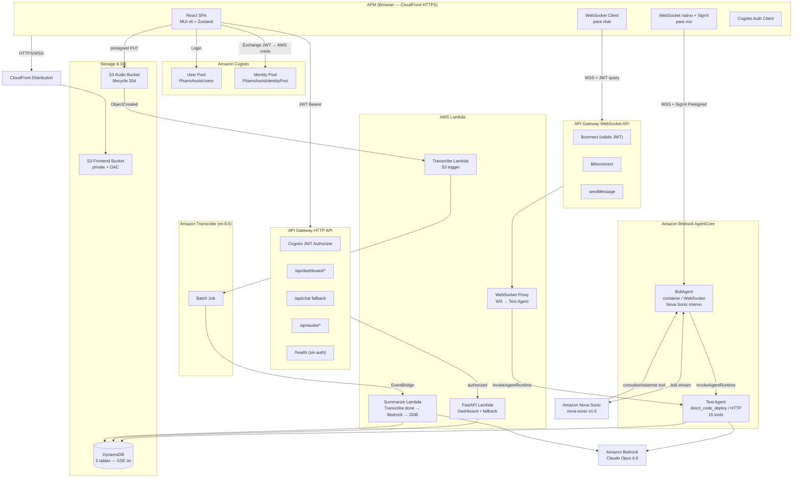
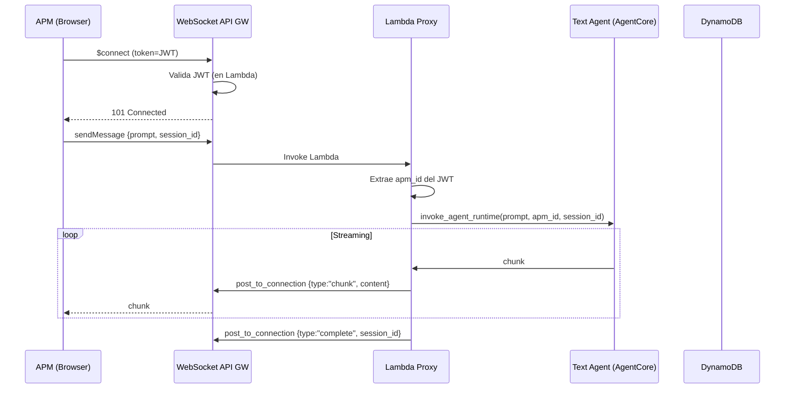
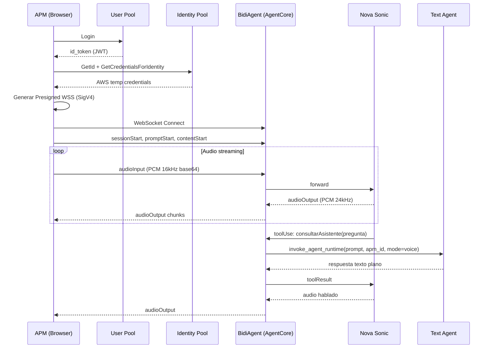
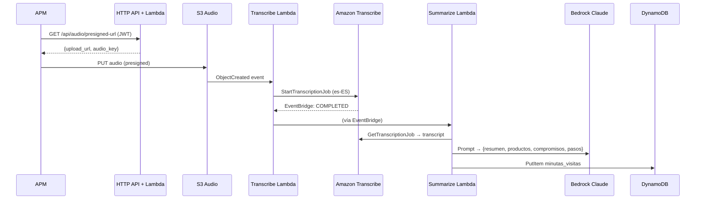
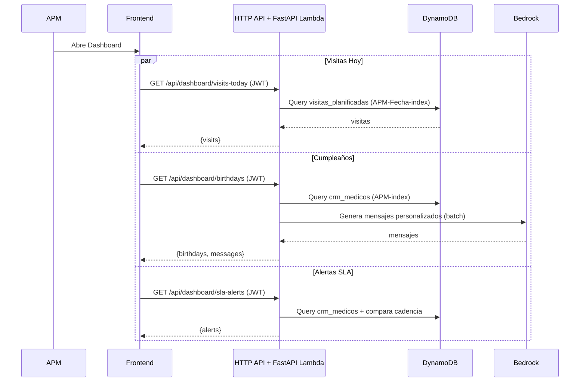

# PharmAssist — Documento de Diseño Consolidado

> Documento único que consolida los artefactos de diseño de las tres specs del proyecto PharmAssist:
> 1. `apm-assistant` — MVP del asistente para APMs (dashboard + chat + agente Strands)
> 2. `agentcore-chat-migration` — Migración del chat a AgentCore + Cognito Auth + pipeline de voz + modo voz (v1 con ECS)
> 3. `voice-bidiagent-migration` — Migración del modo voz a BidiAgent con WebSocket directo (elimina ECS)
>
> **Convención**: las tres specs se integran cronológicamente. La migración de voz (spec 3) reemplaza la arquitectura de voz de la spec 2. Donde haya conflicto, prevalece la spec más reciente.

## Índice

1. [Visión General](#1-visión-general)
2. [Decisiones Arquitectónicas Clave](#2-decisiones-arquitectónicas-clave)
3. [Arquitectura General](#3-arquitectura-general)
4. [Flujos Principales](#4-flujos-principales)
5. [Componentes e Interfaces](#5-componentes-e-interfaces)
6. [Modelos de Datos](#6-modelos-de-datos)
7. [Seguridad y Autenticación](#7-seguridad-y-autenticación)
8. [Despliegue e Infraestructura CDK](#8-despliegue-e-infraestructura-cdk)
9. [Propiedades de Correctitud](#9-propiedades-de-correctitud)
10. [Manejo de Errores](#10-manejo-de-errores)
11. [Estrategia de Testing](#11-estrategia-de-testing)
12. [Trazabilidad Spec → Requerimientos](#12-trazabilidad-spec--requerimientos)

---

## 1. Visión General

PharmAssist es una webapp mobile-first que funciona como "Single Pane of Glass" para Agentes de Propaganda Médica (APMs) de Megalabs Argentina. Combina un dashboard con tarjetas contextuales (visitas del día, cumpleaños, alertas SLA) y un chat conversacional respaldado por un agente Strands sobre Amazon Bedrock (Claude Opus 4.6). Incluye modo voz bidireccional con Amazon Nova Sonic y un pipeline de notas de voz con Amazon Transcribe.

### Stack Tecnológico

- **Frontend**: React 18 + TypeScript, Material UI v6, Vite, Zustand, React Router v7
- **Backend**: Python 3.12+, FastAPI (dashboard endpoints + chat fallback), Strands Agents SDK
- **LLM**: Amazon Bedrock — Claude Opus 4.6 (`us.anthropic.claude-opus-4-6-v1`)
- **Speech**: Amazon Nova Sonic (`amazon.nova-sonic-v1:0`) para voz bidireccional
- **Transcripción asíncrona**: Amazon Transcribe (es-ES)
- **Database**: Amazon DynamoDB (5 tablas)
- **Web Search**: DDGS (Dux Distributed Global Search) — metabuscador open source, sin API key
- **Auth**: Amazon Cognito (User Pool + Identity Pool)
- **Runtime del agente**: Amazon Bedrock AgentCore (Text Agent + BidiAgent)
- **IaC**: AWS CDK (Python)
- **CDN**: CloudFront + S3 para frontend SPA


---

## 2. Decisiones Arquitectónicas Clave

### 2.1 Single Agent con Tools vs Multi-Agent

| Criterio | Single Agent + Tools | Multi-Agent (Coordinador + Especialistas) |
|----------|---------------------|------------------------------------------|
| Latencia | Menor — 1 sola invocación LLM | Mayor — N invocaciones LLM en cadena |
| Complejidad | Baja — 1 system prompt, N tools | Alta — N system prompts, routing logic |
| Confiabilidad demo | Alta — menos puntos de falla | Media — fallas en routing o delegación |
| Costo Bedrock | Menor — 1 llamada por query | Mayor — múltiples llamadas por query |
| Escalabilidad | Media — system prompt crece | Alta — cada agente es independiente |

**Decisión: Single Agent con Tools especializados.** Para el MVP, un solo agente Strands con tools dedicados por dominio (CRM, visitas, ventas, web search, generación IA) ofrece menor latencia, mayor confiabilidad y menor complejidad. Claude Opus 4.6 es suficientemente capaz para seleccionar el tool correcto basándose en docstrings descriptivos.

### 2.2 Web Search con DDGS

| Opción | Costo | API Key | Confiabilidad | Latencia |
|--------|-------|---------|---------------|----------|
| DDGS (`pip install ddgs`) | Gratis | No requiere | Alta — múltiples backends | ~1-2s |
| Google Custom Search API | Gratis hasta 100 queries/día | Sí | Alta | ~0.5s |
| Strands `http_request` + scraping | Gratis | No | Baja | Variable |
| Strands `browser` (Chromium) | Gratis | No | Media | ~5-10s |

**Decisión: DDGS** — Librería open source que agrega resultados de Google, Bing, DuckDuckGo y Brave. Cero configuración, sin API keys, sin límites duros para un prototipo.

### 2.3 Chat Migration: Opción A (Lambda Proxy)

| Criterio | Opción A (Lambda Proxy) | Opción B (Presigned URL) | Opción C (Híbrido) |
|----------|------------------------|--------------------------|---------------------|
| Seguridad | Alta — auth en Lambda | Media — URL firmada expuesta | Media |
| Control | Total — logging, rate limiting | Limitado | Parcial |
| Producción | Patrón estándar AWS | Más simple, menos controlable | Mezcla de patrones |
| Streaming | WS API GW → Lambda → AgentCore | Nativo WS a AgentCore | Mixto |

**Decisión: Opción A** — Patrón recomendado para producción: permite autenticación centralizada, logging, rate limiting y no expone el ARN de AgentCore al frontend.

### 2.4 Voice Migration: BidiAgent vs ECS Server

| Aspecto | Antes (ECS Fargate) | Después (BidiAgent) |
|---------|---------------------|---------------------|
| Protocolo frontend | Socket.IO (ws://) | WebSocket nativo (wss:// + SigV4) |
| Mixed content | ❌ Bloqueado en HTTPS | ✅ WSS funciona en HTTPS |
| Servidor intermedio | ECS Fargate (Node.js) | Ninguno (directo a AgentCore) |
| Infra requerida | VPC, NAT, ALB, ECS Cluster | Solo Identity Pool (serverless) |
| Costo mensual infra | ~$50+ (NAT $32 + ALB + Fargate) | ~$0 (Identity Pool sin costo) |
| Deploy type | Docker en ECS | Container en AgentCore |

**Decisión: BidiAgent con WebSocket directo + SigV4.** Elimina el servidor intermedio ECS, resuelve el problema de mixed content HTTPS/HTTP, reduce latencia y elimina ~$32/mes solo de NAT Gateway. El frontend obtiene credenciales AWS temporales via Cognito Identity Pool y firma la URL WebSocket con SigV4.

### 2.5 Coexistencia de Agentes

- **Text Agent** (existente): `direct_code_deploy`, protocolo HTTP. Maneja chat de texto y contiene los 15 tools de negocio.
- **BidiAgent** (nuevo): `container` deployment, protocolo WebSocket. Maneja voz bidireccional. Delega consultas de datos al Text Agent via tool `consultarAsistente`.

Ambos agentes son independientes en AgentCore y se invocan por separado.


---

## 3. Arquitectura General

### 3.1 Diagrama de arquitectura objetivo (post-migraciones)



### 3.2 Componentes principales

| Componente | Propósito | Tecnología |
|-----------|-----------|------------|
| Frontend SPA | UI del APM | React 18 + MUI v6 + Zustand + Vite |
| CloudFront | CDN + HTTPS enforcement | AWS CloudFront |
| Cognito User Pool | Autenticación de APMs | Amazon Cognito |
| Cognito Identity Pool | Credenciales AWS temporales para voz | Amazon Cognito |
| HTTP API Gateway | Dashboard endpoints + chat fallback | API Gateway v2 |
| WebSocket API Gateway | Chat streaming | API Gateway v2 |
| FastAPI Lambda | Dashboard endpoints | AWS Lambda (Python 3.12) |
| WebSocket Proxy Lambda | Forwarding WS → AgentCore | AWS Lambda (Python 3.12) |
| Text Agent (AgentCore) | Agente de negocio con 15 tools | Strands + Bedrock |
| BidiAgent (AgentCore) | Voz bidireccional con Nova Sonic | Strands BidiAgent |
| Transcribe Lambda | S3 trigger → Transcribe job | AWS Lambda |
| Summarize Lambda | Transcribe done → Bedrock → DDB | AWS Lambda |
| DynamoDB | Datos de negocio (5 tablas) | Amazon DynamoDB |
| S3 Audio Bucket | Audio uploads (30d lifecycle) | Amazon S3 |
| S3 Frontend Bucket | SPA estática | Amazon S3 |


---

## 4. Flujos Principales

### 4.1 Flujo de Chat (WebSocket + AgentCore)



### 4.2 Flujo de Voz (BidiAgent directo)



### 4.3 Flujo de Nota de Voz → Minuta



### 4.4 Flujo de Dashboard (tarjetas contextuales)




---

## 5. Componentes e Interfaces

### 5.1 Frontend

```
src/
├── api/
│   ├── client.ts         # Axios instance con interceptor JWT
│   ├── auth.ts           # Cognito auth (login, refresh)
│   ├── credentials.ts    # Identity Pool → AWS temp credentials
│   ├── voice.ts          # VoiceService (WebSocket + SigV4)
│   └── websocket.ts      # ChatWebSocket class
├── components/
│   ├── Chat/             # ChatPanel, FABChat
│   ├── Voice/            # VoiceOverlay, ParticleSphere
│   ├── Audio/            # GrabadorAudio
│   └── Cards/            # Tarjetas (VisitasHoy, Cumpleaños, SLA)
├── pages/
│   ├── LoginPage.tsx
│   └── DashboardPage.tsx
├── stores/
│   ├── useAuthStore.ts   # JWT + apm_id
│   ├── useAppStore.ts
│   └── useThemeStore.ts
└── types/
```

### 5.2 Backend HTTP Endpoints

| Método | Endpoint | Auth | Descripción |
|--------|----------|------|-------------|
| GET | `/health` | No | Health check |
| GET | `/api/dashboard/visits-today` | Cognito | Visitas planificadas hoy del APM |
| GET | `/api/dashboard/birthdays` | Cognito | Cumpleaños próximos 30 días + mensajes IA |
| GET | `/api/dashboard/sla-alerts` | Cognito | Médicos con SLA vencido |
| POST | `/api/chat` | Cognito | Chat fallback (no streaming) |
| POST | `/api/audio/presigned-url` | Cognito | Presigned URL para subir audio a S3 |
| GET | `/api/minutas` | Cognito | Lista de minutas del APM |
| POST | `/api/minutas` | Cognito | Guarda minuta editada |

`apm_id` se extrae del claim `custom:apm_id` del JWT en todos los endpoints autenticados.

### 5.3 Strands Agent — Tools del Text Agent

**CRM / Médicos** (`medicos_tools.py`):
- `buscar_medico_por_nombre(nombre, apm_id)`
- `buscar_medicos_por_zona(zona, apm_id)`
- `buscar_medicos_por_apm(apm_id)`
- `obtener_perfil_medico(medico_mn, apm_id)`

**Visitas** (`visitas_tools.py`):
- `obtener_visitas_por_medico(medico_mn, apm_id)`
- `obtener_visitas_planificadas_hoy(apm_id)`
- `obtener_historial_visitas_apm(apm_id, fecha_desde, fecha_hasta)`

**Ventas** (`ventas_tools.py`):
- `obtener_ventas_por_zona(zona, anio, mes)`
- `obtener_ventas_declinando(zonas)`
- `obtener_ventas_por_producto(producto, zona)`

**Generación** (`generacion_tools.py`):
- `generar_brief_medico(medico_mn, apm_id)`
- `generar_mensaje_cumpleanos(medico_mn)`

**Minutas** (`minutas_tools.py`):
- `obtener_minutas_medico(medico_mn, apm_id)`

**Sugerencias** (`sugerencias_tools.py`):
- `sugerir_proxima_visita(apm_id)` — combina SLA + ventas + minutas

**Web Search** (`web_search_tools.py`):
- `buscar_info_publica_medico(nombre, apellido, especialidad, hospital)` — DDGS

Todos los tools retornan el patrón estándar:
```python
{"success": bool, "message": str, "data": Any}
```

### 5.4 BidiAgent — Estructura

```
bidiagent/
├── agent.py              # BedrockAgentCoreApp + BidiAgent de Strands
├── Dockerfile            # Container para AgentCore WebSocket deployment
├── requirements.txt      # strands-agents, bedrock-agentcore, boto3
└── .bedrock_agentcore.yaml
```

El BidiAgent expone un único tool `consultarAsistente(pregunta: str)` que delega al Text Agent con `mode: "voice"`. El flag `mode=voice` instruye al Text Agent a responder en texto plano, sin markdown, sin tablas, sin emojis, optimizado para TTS.

### 5.5 Protocolos

**Chat WebSocket — Cliente → Servidor**:
```json
{"action":"sendMessage","data":{"prompt":"...","session_id":"uuid"}}
```

**Chat WebSocket — Servidor → Cliente**:
```json
{"type":"chunk","content":"..."}
{"type":"tools","steps":["Consultando agenda","Enriqueciendo..."]}
{"type":"complete","session_id":"uuid"}
{"type":"error","message":"..."}
```

**Voice WebSocket (Nova Sonic bidi)** — JSON `{"event": {...}}` con tipos:
- Cliente → BidiAgent: `sessionStart`, `promptStart`, `contentStart`, `textInput`, `audioInput`, `contentEnd`, `promptEnd`, `sessionEnd`
- BidiAgent → Cliente: `contentStart`, `audioOutput`, `textOutput` (con `interrupted` para barge-in), `toolUse`, `contentEnd`

**AgentCore Payload — mode flag**:
```json
{"prompt":"...", "apm_id":"Valentina Pérez", "mode":"text|voice"}
```


---

## 6. Modelos de Datos

### 6.1 DynamoDB — 5 tablas

**Tabla 1: `crm_medicos`** (~500 registros)

| Atributo | Tipo | Key | Descripción |
|----------|------|-----|-------------|
| Medico_MN | N | PK | Matrícula Nacional |
| APM | S | GSI1-PK | APM asignado |
| Zona | S | GSI2-PK | Zona geográfica |
| Nombre, Apellido | S | | — |
| Mail, Telefono_Consultorio, Telefono_Celular | S | | PII |
| Especialidad_Medica | S | | — |
| Calle, Altura, Barrio | S | | Dirección |
| Fecha_Ultima_Visita, Fecha_Nacimiento | S | | ISO date |
| Hobby_Intereses, Religion | S | | PII sensible |
| Cadencia | S | | Mensual/Trimestral/Semestral/Anual/Digital |
| Hospital, Facultad, Anio_Egresado | S,S,N | | — |
| Latitud, Longitud | N,N | | Coordenadas |

- GSI1 (APM-index): PK=`APM`
- GSI2 (Zona-index): PK=`Zona`

**Tabla 2: `apm_visitas`** (~2500 registros)
- PK: `Visita_ID` (N), GSI1 (APM-Fecha), GSI2 (Medico-Fecha)
- Campos: APM, Medico_MN, Fecha_Visita, Zona, Tipo_Visita, Productos_Presentados, Notas

**Tabla 3: `ventas_reportadas`** (~6000 registros)
- PK compuesta: `Zona_Producto` (S), SK: `Anio_Mes` (S)
- GSI1 (Zona-index): PK=`Zona`, SK=`Anio_Mes`
- Campos: Producto, Presentacion, Tipo_OTC_RX, Unidades_Vendidas, Valor_Venta_ARS, Crecimiento_YoY_Pct, Farmacia

**Tabla 4: `visitas_planificadas`** (generada automáticamente)
- PK compuesta: `APM_Fecha` (S), SK: `Medico_MN` (N)
- GSI1 (APM-Fecha-index): PK=`APM`, SK=`Fecha_Planificada`
- Campos: Zona, Tipo_Visita, Productos_Sugeridos

**Tabla 5: `minutas_visitas`** (nuevas, generadas por IA)
- PK: `Minuta_ID` (S, UUID)
- GSI1 (APM-Fecha): PK=`APM`, SK=`Fecha_Creacion`
- GSI2 (Medico-Fecha): PK=`Medico_MN`, SK=`Fecha_Creacion`
- Campos: Transcripcion, Resumen, Productos_Discutidos, Compromisos, Proximos_Pasos, Audio_S3_Key, Estado

### 6.2 Datos de referencia (código)

**`product_catalog.py`** — mapeos constantes:
```python
ESPECIALIDAD_PRODUCTOS: dict[str, list[str]] = {
    "Gastroenterología": ["ALACIR", "CIRUELAX MINITABS"],
    "Psiquiatría": ["APSICO", "PAMOXET"],
    "Dermatología": ["PANCUTAN NF", "TRIMACREM PLUS", "MENCOGRIN AP", "SUTRICO TAR", "TRICOPLUS"],
    # ... 12 especialidades mapeadas
}

CADENCIA_DIAS: dict[str, int] = {
    "Mensual": 30, "Trimestral": 90, "Semestral": 180,
    "Anual": 365, "Digital": 60,
}
```

### 6.3 Clasificación de datos sensibles

| Categoría | Elementos | Ubicación | Criticidad |
|-----------|-----------|-----------|------------|
| **PII de médicos** | Nombre, Apellido, Mail, Teléfonos, Dirección, Fecha_Nacimiento | `crm_medicos` | Alta |
| **PII sensible** | Religion, Hobby_Intereses | `crm_medicos` | Media |
| **Datos de negocio** | Visitas, productos presentados, notas | `apm_visitas`, `minutas_visitas` | Media |
| **Datos comerciales** | Ventas, YoY, farmacias | `ventas_reportadas` | Media (confidencialidad interna) |
| **Credenciales** | JWT tokens, AWS temp credentials | Memoria del browser, logs | Crítica |
| **Audio** | Grabaciones de notas de voz | S3 Audio Bucket | Alta (contiene PII hablada) |
| **Transcripciones** | Texto extraído de audio | `minutas_visitas.Transcripcion` | Alta |

Estas clasificaciones se usan en la Sección 7 (Seguridad) para decidir políticas de encryption, logging redaction y retention.


---

## 7. Seguridad y Autenticación

Esta sección cubre la postura de seguridad completa del sistema. Está organizada alrededor de los dominios de control que audita el framework: autenticación, autorización, acceso privilegiado, protección de información, logging, protección de logs, secretos, configuración segura por defecto y criptografía.

### 7.1 Autenticación

**Users — APMs:**
- Amazon Cognito User Pool (`PharmAssistUsers`) con sign-in por email
- Flujos habilitados: `USER_PASSWORD_AUTH` y `USER_SRP_AUTH`
- App Client sin secret (SPA)
- Atributo custom: `custom:apm_id` (string, mutable)
- Password policy (ver 7.8 Secure by Default)
- Los tokens JWT (id_token, access_token, refresh_token) se almacenan solo en memoria del SPA (no `localStorage`). Refresh automático antes del vencimiento.

**Service-to-service:**
- Lambda → DynamoDB: IAM role (sin secrets)
- Lambda → Bedrock: IAM role
- Frontend → AgentCore (voz): credenciales AWS temporales via Cognito Identity Pool, firmadas con SigV4. Duración máxima 1 hora, renovación automática con 5 min de margen.
- Lambda Proxy → AgentCore: IAM role de la Lambda

**Validación de JWT:**
- HTTP API Gateway: Cognito JWT Authorizer nativo valida `iss`, `aud`, `exp`, firma (JWKS).
- WebSocket API Gateway: API Gateway WS no soporta authorizer JWT nativo, por lo tanto la Lambda Proxy valida el JWT manualmente en `$connect` (valida firma JWKS, `iss`, `aud`, `exp`, `token_use=id`).

### 7.2 Autorización

#### 7.2.1 Modelo de roles

| Rol | Alcance | Mecanismo de asignación |
|-----|---------|------------------------|
| **APM** | Usuario final. Solo accede a médicos/visitas/ventas asignadas a su `apm_id`. | Usuario en Cognito User Pool con `custom:apm_id`. |
| **Gerente de zona** (futuro) | Acceso a múltiples APMs bajo su gerencia. | Cognito Group + claim `custom:manager_apms` con lista de APMs. |
| **Admin de negocio** (futuro) | Acceso de lectura a todas las zonas. Genera reportes. | Cognito Group `admins` + claim `custom:role=admin`. |
| **Admin técnico** | Administración de infra AWS, CDK, AgentCore. NO tiene usuario Cognito. | IAM user/role federado en la cuenta AWS. |

**MVP actual**: solo existe el rol APM. Los roles Gerente/Admin de negocio están definidos en el modelo pero no implementados. La sección 7.3 cubre admin técnico.

#### 7.2.2 Enforcement — APM data isolation

La autorización de datos se enforza en **tres capas**:

1. **API Gateway Authorizer** — rechaza requests sin JWT válido (HTTP 401).
2. **Backend code** — toda función Lambda y todo tool de Strands extrae `apm_id` del JWT (no de un parámetro de request) y lo usa como filtro obligatorio en cada query a DynamoDB. Los tools nunca aceptan `apm_id` desde el LLM, lo reciben del contexto de sesión.
3. **System prompt del agente** — instruye al LLM que rechace consultas sobre médicos fuera de la cartera del APM con el mensaje "No tenés acceso a la información de ese médico."

Propiedad formal: **Property 12 (APM data isolation)** — para cualquier query y cualquier `apm_id`, todos los registros retornados pertenecen al APM identificado. Campos sensibles (`Telefono_Celular`, `Mail`, `Religion`, `Hobby_Intereses`) solo se incluyen si el médico está asignado al APM.

#### 7.2.3 Permisos IAM por componente (least-privilege)

| Componente | Recurso | Permisos |
|-----------|---------|----------|
| FastAPI Lambda | DynamoDB tablas | `Query`, `GetItem`, `PutItem` (solo en tablas PharmAssist, sin `*`) |
| FastAPI Lambda | Bedrock | `InvokeModel` sobre `anthropic.claude-*` (no `*`) |
| FastAPI Lambda | S3 Audio | `PutObject` con prefix `uploads/` (presigned URL generation) |
| WebSocket Proxy Lambda | AgentCore | `bedrock-agentcore:InvokeAgentRuntime` sobre ARN específico del Text Agent |
| WebSocket Proxy Lambda | API Gateway | `execute-api:ManageConnections` sobre `arn:aws:execute-api:...:*/@connections/*` |
| Transcribe Lambda | Transcribe | `StartTranscriptionJob`, `GetTranscriptionJob` |
| Transcribe Lambda | S3 Audio | `GetObject` sobre el bucket de audio |
| Summarize Lambda | DynamoDB | `PutItem` solo en `minutas_visitas` |
| Summarize Lambda | Bedrock | `InvokeModel` sobre Claude |
| Text Agent (AgentCore execution role) | DynamoDB | `Query`, `GetItem`, `Scan` (solo tablas PharmAssist) |
| Text Agent | Bedrock | `InvokeModel`, `InvokeModelWithResponseStream` |
| BidiAgent (AgentCore execution role) | Bedrock | `InvokeModel` sobre `amazon.nova-sonic-v1:0` |
| BidiAgent | AgentCore | `InvokeAgentRuntime` sobre ARN del Text Agent |
| Cognito Authenticated Role (Identity Pool) | AgentCore | `bedrock-agentcore:InvokeAgentRuntime` sobre **solo el ARN del BidiAgent** |
| Cognito Unauthenticated Role | — | **No existe** (unauthenticated access deshabilitado) |

Todas las políticas se definen en el CDK Stack con condiciones explícitas (`StringEquals`, resource ARNs) y se revisan con `cdk synth` antes de deployar.

### 7.3 Acceso Privilegiado (Administrative Access)

#### 7.3.1 Quiénes son los administradores

| Rol administrativo | Responsabilidad | Identidad |
|--------------------|-----------------|-----------|
| **CDK Deployer** | Ejecutar `cdk deploy` sobre la cuenta AWS | IAM user/role en cuenta AWS del proyecto |
| **AgentCore Operator** | `agentcore configure`, `agentcore deploy`, `agentcore destroy` | Mismo perfil AWS que CDK Deployer |
| **Cognito User Admin** | Crear/deshabilitar usuarios APM, reset de passwords | Permisos `cognito-idp:AdminCreateUser`, `cognito-idp:AdminSetUserPassword` |
| **DynamoDB Operator** | Carga inicial de CSVs, troubleshooting | Permisos `dynamodb:BatchWriteItem`, `Scan` sobre tablas del proyecto |
| **Observability Reader** | Ver CloudWatch logs y métricas | Permisos `logs:GetLogEvents`, `cloudwatch:GetMetricData` (solo lectura) |

Para el MVP, estos roles están concentrados en un solo perfil AWS (`AWS_PROFILE` del desarrollador principal). En producción se segregarán via IAM roles + SSO (ver 7.3.3).

#### 7.3.2 Privilege boundaries

- **No se usa `AdministratorAccess` en producción.** Se usa solo para el entorno `dev` por simplicidad. En `prod`, el CDK Deployer recibe un `PowerUser`-like policy con explicit-deny sobre `iam:CreateUser`, `iam:AttachUserPolicy` para cuentas no-CDK, y `organizations:*`.
- **Permission Boundary** aplicada a todos los IAM roles creados por CDK: impide que cualquier role auto-escalate a `AdministratorAccess`. Definida como `CfnManagedPolicy` en el stack.
- **IAM Access Analyzer** habilitado en la cuenta para detectar recursos con acceso externo inesperado.
- **MFA obligatorio** para el perfil AWS del CDK Deployer y cualquier acceso humano (ver 7.8).
- **Session duration** limitada a 1 hora para roles administrativos federados.

#### 7.3.3 Segregation of duties (target state)

```
GitHub / AWS SSO (IdP)
        │
        ├── DevTeam role        → cdk synth, cdk diff, read logs
        ├── Deployer role       → cdk deploy (asumido vía OIDC desde CI/CD)
        ├── SecOps role         → IAM Access Analyzer, GuardDuty, audit logs
        └── DataOps role        → DynamoDB data loads, S3 data access
```

En el MVP una sola persona cubre todos los roles; el CDK stack está preparado para separarlos cuando haya equipo.

#### 7.3.4 Audit logging de acciones administrativas

Toda acción administrativa queda registrada (ver 7.5 para detalles completos):
- **CloudTrail Management Events** (habilitado a nivel cuenta, retención 90 días en S3 con versioning + MFA delete): captura `cdk deploy`, cambios en IAM, Cognito AdminCreateUser, DynamoDB table modifications, etc.
- **CloudTrail Data Events** (habilitado selectivamente): S3 PutObject/GetObject en el bucket de audio, DynamoDB data-plane events en tablas con PII.
- **CloudWatch Logs** para Lambda (retention 30 días dev / 1 año prod).
- **Cognito User Pool logs** (Advanced Security): logins, password changes, MFA challenges.
- **AgentCore Observability**: invocaciones del agente, tools ejecutados, tokens consumidos.

#### 7.3.5 Access reviews

Procedimiento trimestral (documentado en runbook):
1. Exportar lista de usuarios del User Pool → validar que todos sigan siendo APMs activos.
2. Exportar IAM roles con `bedrock-agentcore:*` o `dynamodb:*Item` → validar justificación de cada uno.
3. Revisar últimos 90 días de CloudTrail para acciones privilegiadas (`iam:*`, `cognito-idp:AdminCreateUser`, `dynamodb:DeleteTable`).
4. Documentar hallazgos y acciones correctivas en `docs/security-reviews/YYYY-QN.md`.


### 7.4 Protección de Información (Information Protection)

#### 7.4.1 Clasificación de datos

Ver Sección 6.3 para la tabla de clasificación. Resumen:
- **Alta**: PII de médicos, audio, transcripciones, credenciales
- **Media**: Datos de negocio (visitas, ventas, hobbies/religión)
- **Crítica**: JWT tokens, AWS credentials

#### 7.4.2 Encryption at rest

| Recurso | Configuración | Clave |
|---------|---------------|-------|
| DynamoDB (5 tablas) | Server-Side Encryption **obligatoria** (no opcional en DynamoDB) | AWS owned key en dev, AWS managed key (`aws/dynamodb`) en prod, CMK KMS en producción futura |
| S3 Audio Bucket | SSE-S3 (AES-256) por default; opción SSE-KMS con CMK | `aws/s3` (AWS managed) |
| S3 Frontend Bucket | SSE-S3 (AES-256) | `aws/s3` |
| CloudWatch Logs | Encryption con `aws/logs` en dev, CMK en prod | KMS |
| Lambda Environment Variables | Encriptadas con clave de Lambda service (`aws/lambda`) | KMS |
| Cognito User Pool | Encriptación transparente gestionada por AWS | AWS managed |
| AgentCore state / STM memory | Encriptado gestionado por el servicio | AWS managed |

El CDK stack **declara explícitamente** `encryption=TableEncryption.AWS_MANAGED` en cada `dynamodb.Table` y `encryption=BucketEncryption.S3_MANAGED` en cada `s3.Bucket`.

#### 7.4.3 Encryption in transit

- **Browser ↔ CloudFront**: HTTPS only (viewer protocol policy `REDIRECT_TO_HTTPS`), TLS 1.2 mínimo (TLS 1.3 preferido).
- **Browser ↔ HTTP API Gateway**: HTTPS obligatorio (API Gateway solo expone HTTPS).
- **Browser ↔ WebSocket API Gateway**: WSS solo.
- **Browser ↔ AgentCore BidiAgent**: WSS con SigV4.
- **Lambda ↔ DynamoDB, Bedrock, S3**: TLS via AWS SDK (enforced por el SDK).
- **Lambda ↔ AgentCore**: TLS via `boto3.client("bedrock-agentcore")`.
- **AgentCore ↔ Nova Sonic**: canal interno AWS, cifrado.
- **Transcribe ↔ S3**: canal interno AWS, cifrado.

Ningún componente del sistema expone endpoints HTTP (no-TLS) públicos. El bucket S3 Audio rechaza PUT/GET no-HTTPS via bucket policy `aws:SecureTransport=true`.

#### 7.4.4 Integridad de datos

- **DynamoDB**: sin conflict resolution custom; writes son atómicos por item. Para updates multi-item se usa `TransactWriteItems`.
- **Audio uploads**: el SPA calcula `Content-MD5` y lo envía en el PUT presigned; S3 valida en recepción.
- **JWT**: firma RSA validada por API Gateway (issuer = Cognito User Pool URL) — alteraciones invalidan el token.
- **SigV4**: las requests WebSocket al BidiAgent incluyen hash del body firmado; tampering invalida la firma.
- **CloudTrail**: log file integrity validation habilitada (`IsLogFileValidationEnabled=true`) — permite detectar si alguien modifica logs en S3.

#### 7.4.5 Retención y eliminación

| Dato | Retención | Mecanismo |
|------|-----------|-----------|
| Audio raw (S3) | 30 días | S3 Lifecycle Policy (auto-delete) |
| Transcripciones (DynamoDB) | Indefinida (dato de negocio) | Manual |
| Minutas (DynamoDB) | Indefinida | Manual |
| CloudTrail logs | 90 días en S3 + archivado a Glacier 2 años | Lifecycle Policy |
| CloudWatch Logs | 30 días (dev), 1 año (prod) | `log_retention` en CDK |
| Cognito user tokens (refresh) | 30 días default | Cognito config |
| Temp AWS credentials | 1 hora | Identity Pool config |
| Presigned URLs (upload y WSS) | 5 minutos | Parámetro en generación |

Borrado de datos de un médico (right to erasure, si aplica): script `scripts/erase_medico.py` que elimina de `crm_medicos`, `apm_visitas` (por `Medico_MN`), `minutas_visitas` (por `Medico_MN`) y objetos S3 asociados.

### 7.5 Audit Logging

#### 7.5.1 Eventos de seguridad loggeados

**Autenticación y sesión** (Cognito Advanced Security):
- `SignIn success/failure` con email, IP, user agent, riskScore
- `PasswordReset`, `AdminCreateUser`, `AdminDisableUser`
- Token refresh failures
- MFA challenges (cuando esté habilitado)

**Autorización** (Lambda logs, estructurados):
- JWT validation failures en WebSocket `$connect`
- Cross-APM access attempts (cuando un APM consulta datos de otro APM — el tool lo detecta y logea)
- Tool invocation denied por el agente

**Data access** (CloudTrail Data Events + app logs):
- DynamoDB reads/writes (Data Event, solo tablas con PII)
- S3 audio uploads/downloads
- AgentCore invocations con `apm_id`, `session_id`, prompt length, response length, tools invocados

**Administrative actions** (CloudTrail Management Events):
- `cdk deploy` (via `cloudformation:*`, `iam:*`)
- User pool management (`cognito-idp:AdminCreateUser`, `AdminDeleteUser`, `AdminResetUserPassword`)
- AgentCore lifecycle (`bedrock-agentcore:CreateAgentRuntime`, `UpdateAgentRuntime`, `DeleteAgentRuntime`)
- IAM changes

**Application events** (app logs):
- Chat messages procesados (sin el contenido del prompt, solo metadata)
- Voice sessions iniciadas/cerradas con duración
- Audio uploads completados
- Transcription jobs completados
- Minuta generada

#### 7.5.2 Campos loggeados por evento

Todos los logs estructurados de aplicación usan JSON con campos mínimos:

```json
{
  "timestamp": "2026-04-29T10:15:30.123Z",
  "event_type": "chat.message | voice.session | data.access | auth.login | admin.action",
  "apm_id": "Valentina Pérez",
  "session_id": "uuid",
  "request_id": "AWS request id",
  "source_ip": "1.2.3.4 (solo primeros 3 octetos en prod)",
  "user_agent": "resumido",
  "resource": "medico_mn=123 | table=crm_medicos | tool=buscar_medico_por_nombre",
  "action": "read | write | invoke",
  "outcome": "success | failure | denied",
  "duration_ms": 1234,
  "error_code": "opcional",
  "details": { /* específico del evento, sin PII */ }
}
```

**Reglas de redacción** (ver 7.6):
- **Nunca loggear**: contenido de chats, transcripciones, audio keys raw, JWT/tokens completos, passwords, números de teléfono, emails (solo hash si es necesario), nombres completos de médicos en logs masivos.
- **OK loggear**: `apm_id`, `session_id`, `medico_mn`, `request_id`, IPs (truncadas en prod), tool names, duraciones, status codes.

#### 7.5.3 Completitud y tamper-resistance

- **CloudTrail** habilitado en la cuenta AWS, multi-region, `IsLogFileValidationEnabled=true`. Logs entregados a un bucket S3 dedicado con versioning + MFA delete + bucket policy que deniega writes fuera del servicio CloudTrail.
- **CloudWatch Logs** con `retention` declarado vía CDK; destruir un log group require `logs:DeleteLogGroup` no otorgado a roles aplicativos.
- **Application logs** emitidos con `logger.info` (nunca `print`) para garantizar formato estructurado.
- **Health check de logging**: alarma CloudWatch que dispara si un Lambda no genera logs por 15 min durante horario de negocio (indicador de fallo en logging).
- **Integridad de CloudTrail** verificable con `aws cloudtrail validate-logs`.

#### 7.5.4 Métricas y alarmas de seguridad

CloudWatch Alarms declaradas en CDK:
- `HighFailedLoginRate`: >10 SignIn failures en 5 min → SNS topic
- `CrossApmAccessAttempts`: >0 intentos de acceso cross-APM → alerta
- `WebSocketAuthFailures`: >10 JWT invalid en `$connect` en 5 min → alerta
- `AdminActionFromUnusualIp`: acción administrativa desde IP fuera del allow-list → alerta crítica
- `AgentCoreInvocationErrors`: error rate >5% en 5 min → SNS

### 7.6 Protección de Logs

#### 7.6.1 Redacción de datos sensibles

Implementada en una utility compartida `backend/utils/logging_filter.py`:

```python
SENSITIVE_FIELDS = {
    "password", "token", "access_token", "id_token", "refresh_token",
    "jwt", "secret", "authorization", "x-api-key",
    "telefono_celular", "telefono_consultorio", "mail",
    "transcripcion", "prompt", "content", "audio", "notas",
}

def redact(record: dict) -> dict:
    """Redacta campos sensibles antes de loggear."""
    for key in list(record.keys()):
        if any(s in key.lower() for s in SENSITIVE_FIELDS):
            record[key] = "[REDACTED]"
    return record
```

Reglas aplicadas:
- Prompts de chat: se loggea longitud y hash SHA-256 del prompt, no el contenido.
- Transcripciones: se loggea `minuta_id` y longitud, no el texto.
- JWT: se loggea solo los claims no sensibles (`sub`, `apm_id`, `iat`, `exp`), nunca el token completo.
- IPs del APM: en producción se truncan a `/24` (primeros 3 octetos) para reducir trazabilidad individual.
- Teléfonos/emails: nunca se loggean; si aparecen accidentalmente, el filtro los redacta.

#### 7.6.2 Access control a logs

| Log store | Permisos de lectura | Permisos de escritura |
|-----------|---------------------|------------------------|
| CloudWatch Logs (Lambda) | `Observability Reader` role, `DevTeam` role | Solo Lambda execution roles (`logs:CreateLogStream`, `logs:PutLogEvents` sobre log group propio) |
| CloudTrail S3 bucket | `SecOps` role, `Observability Reader` (read-only) | Solo servicio CloudTrail (enforced via bucket policy) |
| Cognito Advanced Security logs | Cognito admin role | Solo servicio Cognito |
| AgentCore Observability | AgentCore operator + DevTeam | Solo servicio AgentCore |

El bucket de CloudTrail tiene bucket policy explícita que **deniega** todas las acciones a principals distintos de `cloudtrail.amazonaws.com` y los roles de lectura autorizados.

#### 7.6.3 Retención

Ver tabla en 7.4.5. Logs de seguridad (CloudTrail) se archivan a Glacier después de 90 días y se retienen 2 años. Los logs de aplicación se retienen 30 días en dev, 1 año en prod.

#### 7.6.4 Cifrado

- CloudWatch Logs: `kms_key` declarado en CDK con `aws/logs` (dev) o CMK (prod)
- CloudTrail S3 bucket: SSE-KMS con CMK dedicada, bucket key habilitado
- Log streams a destinos externos (si se agregan): solo via endpoints TLS

### 7.7 Secretos

**Inventario de secretos del sistema**:
- **Demo user password**: `DEMO_USER_PASSWORD` en `.env` local (no en repo). En CI/CD se pasa como GitHub Actions secret. Se usa una sola vez en `agentcore deploy` para crear el usuario demo.
- **AWS credentials del desarrollador**: perfil `~/.aws/credentials` gestionado por SSO/AWS CLI. No tocado por el código.
- **No hay API keys de terceros**: DDGS (web search) no requiere API key; Bedrock/Transcribe/Nova Sonic usan IAM.
- **Tokens JWT de APMs**: solo en memoria del browser, nunca loggeados, nunca enviados a servicios externos.

**Principio general**: el sistema minimiza secrets usando IAM roles y credenciales temporales para toda comunicación service-to-service. Los pocos secretos que existen (password del demo user) se gestionan con AWS Secrets Manager en producción futura, no commiteados al repo.

**.gitignore** excluye: `.env`, `.env.local`, `.env.genia-backup`, `cdk.context.json`, `*.pem`, `*.key`, `.bedrock_agentcore.yaml`.


### 7.8 Secure by Default

Configuraciones por defecto de cada recurso, declaradas explícitamente en CDK:

#### 7.8.1 S3 Buckets

```python
s3.Bucket(
    self, "AudioBucket",
    block_public_access=s3.BlockPublicAccess.BLOCK_ALL,  # default: all public access blocked
    encryption=s3.BucketEncryption.S3_MANAGED,
    enforce_ssl=True,                                    # bucket policy deny non-TLS
    versioned=False,                                     # audio no requiere versioning
    lifecycle_rules=[s3.LifecycleRule(
        expiration=Duration.days(30),
        enabled=True,
    )],
    removal_policy=RemovalPolicy.DESTROY,                # solo dev; RETAIN en prod
    auto_delete_objects=True,                            # solo dev
)
```

Para el Frontend bucket: idéntico + `versioned=True`, servido via CloudFront con Origin Access Control (OAC), **sin** acceso público directo (`public_read_access=False`).

#### 7.8.2 DynamoDB

```python
dynamodb.Table(
    self, "MedicosTable",
    partition_key=dynamodb.Attribute(name="Medico_MN", type=dynamodb.AttributeType.NUMBER),
    billing_mode=dynamodb.BillingMode.PAY_PER_REQUEST,
    encryption=dynamodb.TableEncryption.AWS_MANAGED,     # SSE con aws/dynamodb
    point_in_time_recovery_specification=dynamodb.PointInTimeRecoverySpecification(
        point_in_time_recovery_enabled=True,             # PITR on
    ),
    deletion_protection=True,                            # en prod
    removal_policy=RemovalPolicy.DESTROY,                # solo dev
)
```

#### 7.8.3 CloudFront

```python
cloudfront.Distribution(
    self, "FrontendDistribution",
    default_behavior=cloudfront.BehaviorOptions(
        origin=origins.S3BucketOrigin.with_origin_access_control(frontend_bucket),
        viewer_protocol_policy=cloudfront.ViewerProtocolPolicy.REDIRECT_TO_HTTPS,
        allowed_methods=cloudfront.AllowedMethods.ALLOW_GET_HEAD,
        cache_policy=cloudfront.CachePolicy.CACHING_OPTIMIZED,
        response_headers_policy=cloudfront.ResponseHeadersPolicy.SECURITY_HEADERS,  # HSTS, X-Frame-Options, etc.
    ),
    minimum_protocol_version=cloudfront.SecurityPolicyProtocol.TLS_V1_2_2021,
    geo_restriction=cloudfront.GeoRestriction.allowlist("AR", "UY"),  # solo Argentina + Uruguay
)
```

#### 7.8.4 Cognito User Pool

```python
cognito.UserPool(
    self, "PharmAssistUsers",
    sign_in_aliases=cognito.SignInAliases(email=True),
    self_sign_up_enabled=False,                          # solo admin crea usuarios
    password_policy=cognito.PasswordPolicy(
        min_length=12,                                   # >= 12 caracteres
        require_lowercase=True,
        require_uppercase=True,
        require_digits=True,
        require_symbols=True,                            # símbolos obligatorios en prod
    ),
    mfa=cognito.Mfa.OPTIONAL,                            # OPTIONAL en MVP, REQUIRED en prod
    mfa_second_factor=cognito.MfaSecondFactor(sms=False, otp=True),  # TOTP only
    account_recovery=cognito.AccountRecovery.EMAIL_ONLY,
    advanced_security_mode=cognito.AdvancedSecurityMode.ENFORCED,    # risk-based adaptive auth
    device_tracking=cognito.DeviceTracking(
        challenge_required_on_new_device=True,
        device_only_remembered_on_user_prompt=True,
    ),
    removal_policy=RemovalPolicy.DESTROY,                # solo dev
)
```

#### 7.8.5 Cognito Identity Pool

```python
cognito.CfnIdentityPool(
    self, "IdentityPool",
    identity_pool_name="PharmAssistIdentityPool",
    allow_unauthenticated_identities=False,              # nunca permitir anónimos
    cognito_identity_providers=[...],
)
```

El rol `authenticated` solo tiene `bedrock-agentcore:InvokeAgentRuntime` sobre el ARN del BidiAgent. No tiene DynamoDB, S3, Lambda, ni nada más.

#### 7.8.6 API Gateway

- HTTP API: authorizer default = Cognito JWT. Rutas nuevas deben explícitamente excluir auth (solo `/health`).
- WebSocket API: `$connect` valida JWT en la Lambda antes de aceptar.
- Throttling: 1000 req/s por API, 100 burst — ajustable.
- CORS: allowlist del dominio CloudFront del frontend (no `*` en prod).

#### 7.8.7 Lambda

- `tracing=Tracing.ACTIVE` (X-Ray habilitado para audit trail)
- `log_retention=logs.RetentionDays.THIRTY_DAYS` (dev) o `ONE_YEAR` (prod)
- `environment_encryption=kms_key` para env vars con CMK en prod
- `reserved_concurrent_executions` para limitar blast radius de bugs
- Runtime patching: `Python 3.12` (versión activa), upgrade automático con re-deploy

#### 7.8.8 CDK Aspects

Se aplica un Aspect que valida que cada recurso cumpla defaults seguros. Falla el synth si detecta:
- S3 bucket sin `enforce_ssl=True`
- DynamoDB sin encryption
- Lambda sin tracing
- API Gateway sin authorizer (excepto `/health`)
- Recurso sin tags `TAG_PROJECT`, `TAG_ENVIRONMENT`, `TAG_OWNER`

### 7.9 Criptografía de Confianza

El sistema **no implementa criptografía custom**. Toda operación criptográfica delega en servicios AWS gestionados:

| Operación | Servicio / Librería |
|-----------|---------------------|
| Hashing de password | Cognito (interno, sin acceso desde código) |
| JWT sign/verify | Cognito (RS256, JWKS público) |
| TLS | ACM + CloudFront + API Gateway |
| SigV4 signing | `@smithy/signature-v4` (JS) / `botocore` (Python) |
| Encryption at rest | KMS (gestionado por S3, DynamoDB, CloudWatch, Lambda) |
| PCM audio encoding | WebAudio API (browser) — no criptográfico |
| Base64 encoding/decoding | Nativo browser/Python — no criptográfico |

**No hay**: encryption custom, hashing de contraseñas en código, key management manual, algoritmos propios. Este control aplica NOT_APPLICABLE.

### 7.10 Otros controles transversales

- **Dependency scanning**: `pip-audit` para Python, `npm audit` para Node, Dependabot en GitHub. Bloquean merge si hay CVE críticas.
- **Secret scanning**: `gitleaks` pre-commit hook + GitHub secret scanning.
- **SBOM**: generado en CI con `cyclonedx-py` y `cyclonedx-npm`, subido como artifact del release.
- **Container scanning**: `docker scan` sobre el image del BidiAgent antes del deploy, bloquea si hay vulnerabilidades críticas.
- **Aislamiento por componente**: errores en voice NO afectan chat; errores en chat NO afectan dashboard; errores en audio pipeline NO afectan nada más.
- **DoS protection**: CloudFront + WAF (planificado), API Gateway throttling, Lambda reserved concurrency.
- **Data residency**: todos los recursos en `us-east-1`. Si se requiere residencia argentina, el stack es región-agnóstico.


---

## 8. Despliegue e Infraestructura CDK

### 8.1 Stack único — `PharmAssistStack`

Todos los recursos viven en un solo stack (`infrastructure/stacks/pharmassist_stack.py`):

- **Cognito**: User Pool, App Client, Identity Pool, roles IAM autenticado
- **DynamoDB**: 5 tablas con GSIs, PITR, encryption
- **Lambda**: FastAPI, WebSocket Proxy, Transcribe, Summarize
- **API Gateway**: HTTP API (con Cognito Authorizer) + WebSocket API
- **S3**: Frontend bucket (OAC + CloudFront), Audio uploads bucket (lifecycle 30d)
- **CloudFront**: distribution con security headers policy
- **CloudTrail**: trail multi-region con log validation
- **IAM Roles**: ejecución de cada Lambda, boundaries, execution role de AgentCore
- **Outputs**: `UserPoolId`, `UserPoolClientId`, `IdentityPoolId`, `WebSocketUrl`, `HttpApiUrl`, `AudioBucketName`, 5 nombres de tablas DynamoDB, `CloudFrontDomain`

Tags aplicados globalmente via CDK Aspect: `Project=PharmAssist`, `Environment={dev|prod}`, `Owner={team}`.

Removal policies: `DESTROY` en dev (para iterar rápido), `RETAIN` en prod para tablas y buckets con datos.

### 8.2 Deploy de Agentes en AgentCore

**Text Agent** (`agentcore/`):
```bash
agentcore configure -e agent.py -ni -r $AGENTCORE_REGION
agentcore deploy -auc \
  -env BEDROCK_MODEL_ID=$BEDROCK_MODEL_ID \
  -env MEDICOS_TABLE_NAME=$MEDICOS_TABLE_NAME \
  -env VISITAS_TABLE_NAME=$VISITAS_TABLE_NAME \
  -env VENTAS_TABLE_NAME=$VENTAS_TABLE_NAME \
  -env PLANIFICADAS_TABLE_NAME=$PLANIFICADAS_TABLE_NAME \
  -env MINUTAS_TABLE_NAME=$MINUTAS_TABLE_NAME
```

**BidiAgent** (`bidiagent/`):
```bash
agentcore configure -e agent.py -ni -r $AGENTCORE_REGION --protocol websocket --deployment-type container
agentcore deploy -auc \
  -env BEDROCK_MODEL_ID=amazon.nova-sonic-v1:0 \
  -env TEXT_AGENT_ARN=$TEXT_AGENT_ARN
```

### 8.3 Frontend Deploy

```bash
cd frontend
npm run build
aws s3 sync dist/ s3://$FRONTEND_BUCKET/ --delete
aws cloudfront create-invalidation --distribution-id $CF_DIST_ID --paths "/*"
```

### 8.4 Variables de entorno (resumen)

Referencia completa en `.env.example`. Variables clave por capa:

- **Shared**: `AWS_REGION`, `AWS_ACCOUNT_ID`, `BEDROCK_MODEL_ID`, `TAG_*`
- **Frontend (Vite)**: `VITE_API_URL`, `VITE_WS_URL`, `VITE_USER_POOL_ID`, `VITE_COGNITO_CLIENT_ID`, `VITE_IDENTITY_POOL_ID`, `VITE_BIDIAGENT_AGENT_ARN`, `VITE_AWS_REGION`
- **Backend Lambdas**: nombres de tablas DynamoDB, `USER_POOL_ID`, `AGENTCORE_AGENT_ARN`, `AUDIO_BUCKET_NAME`
- **AgentCore BidiAgent**: `TEXT_AGENT_ARN`, `AWS_REGION`, `BEDROCK_MODEL_ID`

---

## 9. Propiedades de Correctitud

Resumen de las propiedades formales unificadas de las tres specs. Cada propiedad debe validarse con property-based tests (Hypothesis / fast-check) con mínimo 100 iteraciones.

### 9.1 Core del agente (spec `apm-assistant`)

| # | Propiedad | Valida Req |
|---|-----------|-----------|
| P1 | Visit filtering by APM and date | 1.1 |
| P2 | Digital cadencia excludes presencial visits | 1.5, 9.4 |
| P3 | Visit distribution within daily bounds (3-5) | 1.6, 9.2 |
| P4 | Google Maps URL construction from lat/lon | 1.3 |
| P5 | Declining sales filtering and sorting (YoY negative, asc) | 2.2 |
| P6 | APM zone extraction (distinct zones from CRM) | 2.4 |
| P7 | Audio duration validation (>= 3s) | 3.7 |
| P8 | Birthday filtering and proximity sorting (30 días) | 4.1, 4.3 |
| P9 | Phone number cleaning (digits-only) | 4.9 |
| P10 | WhatsApp deep link construction (wa.me/{phone}?text={encoded}) | 4.10 |
| P11 | Visit history summary aggregation | 5.5 |
| P12 | APM data isolation (cross-tenant guard) | 5.8, 7.7, 10.1, 10.2 |
| P13 | SLA breach calculation and sorting | 6.1, 6.2, 6.4, 6.6 |
| P14 | Visit generation cadencia frequency | 9.1 |
| P15 | Generated visit completeness and APM assignment | 9.3, 9.5 |
| P16 | Specialty to product mapping | 9.6 |

### 9.2 Migración chat (spec `agentcore-chat-migration`)

| # | Propiedad | Valida Req |
|---|-----------|-----------|
| M1 | JWT apm_id extraction round-trip | 1.8 |
| M2 | WebSocket message format (cliente → servidor) | 4.1, 5.1 |
| M3 | Lambda Proxy parsing y forwarding | 3.4, 3.6 |
| M4 | Protocolo de respuesta WebSocket — tipos válidos | 5.2-5.6 |
| M5 | Acumulación de chunks produce texto completo | 4.3 |
| M6 | Aislamiento de datos por apm_id en tools | 6.4 |
| M7 | Mapeo de errores a mensajes en español | 10.2 |
| M8 | Respuesta parcial con sufijo "(respuesta incompleta)" | 10.6 |
| M9 | Ranking de sugerencia de visita — orden y límite 5 | 12.2, 12.3, 12.4 |
| M10 | Inclusión de contexto de minutas en sugerencias | 12.6, 14.3 |
| M11 | Minutas ordenadas y limitadas a 3 | 14.4 |
| M12 | Payload de consultarAsistente incluye `mode: voice` | 15.13, 15.18, 15.19 |
| M13 | Formato de respuesta en modo voz (sin markdown) | 15.15 |

### 9.3 Migración voz (spec `voice-bidiagent-migration`)

| # | Propiedad | Valida Req |
|---|-----------|-----------|
| V1 | Audio PCM encoding round-trip (Float32 ↔ Int16) | 4.3, 4.4 |
| V2 | Credential cache expiry decision (5 min margin) | 1.6 |
| V3 | consultarAsistente payload construction | 2.3 |
| V4 | Presigned WebSocket URL format (SigV4) | 4.2 |
| V5 | Event-to-UI-state mapping (determinístico) | 5.5 |
| V6 | Backoff exponential delay (1s, 2s, 4s) | 7.5 |
| V7 | WebSocket event JSON serialization | 5.1 |
| V8 | apm_id validation before Text Agent invocation | 10.4 |


---

## 10. Manejo de Errores

### 10.1 Principios generales

1. Nunca exponer errores técnicos al usuario — siempre mensajes en español argentino amigables.
2. Degradación graceful — si WebSocket falla, el chat HTTP fallback sigue disponible.
3. Aislamiento por componente — errores en voz no afectan chat, errores en chat no afectan dashboard.
4. Logging estructurado — todos los errores se loggean con `apm_id`, `session_id`, timestamp (ver Sección 7.5).
5. Retry automático — WebSocket reconecta 3 veces con backoff exponencial; presigned URLs se regeneran.
6. Los mensajes de error al usuario **no** contienen stack traces, nombres de excepciones, ni ARNs.

### 10.2 Matriz de errores por capa

#### Autenticación (Cognito)

| Error | Acción Frontend |
|-------|----------------|
| Credenciales inválidas | "Credenciales inválidas. Verificá tu email y contraseña." |
| Token expirado | Refresh automático con refresh_token |
| Refresh token expirado | Redirect a login |
| GetCredentialsForIdentity falla | Deshabilitar botón voz, "No se pudieron obtener credenciales para el modo voz." |

#### Chat WebSocket

| Error | Acción Frontend | Acción Backend |
|-------|-----------------|----------------|
| Conexión rechazada (JWT inválido) | "Sesión expirada. Recargá la página." | Log + return 401 |
| Desconexión inesperada | Reconectar (3 intentos, backoff 1s/2s/4s) | Log disconnect |
| Reconexión fallida 3x | "Se perdió la conexión" + botón reconectar | — |
| Timeout 120s | "El asistente está tardando. Intentá de nuevo." | Log warning |
| AgentCore error | "El asistente no está disponible." | Log + `{type: "error"}` |
| Desconexión mid-stream | Mostrar texto parcial + "(respuesta incompleta)" | — |

#### Voz (BidiAgent)

| Error | Acción |
|-------|--------|
| Micrófono denegado | "Se necesita acceso al micrófono para el modo voz." |
| Credenciales expiran mid-sesión | Renovar + reconectar silenciosamente |
| Sesión alcanza 8 min | "La sesión de voz expiró. Podés iniciar una nueva." |
| Nova Sonic error | "El asistente de voz no está disponible." |
| consultarAsistente timeout | "Lo siento, no pude obtener la información en este momento." (el BidiAgent responde con fallback) |

#### Pipeline de Notas de Voz

| Error | Acción |
|-------|--------|
| Upload S3 falla | "Error al subir audio. Intentá de nuevo." |
| Transcribe falla | "No se pudo transcribir" + `Estado=error` en DDB |
| Bedrock falla | "No se pudo generar resumen" + guardar solo transcripción |
| Audio < 3s | "La grabación es muy corta. Grabá al menos 3 segundos." |

### 10.3 Patrón de tools Strands

Todos los tools devuelven:
```python
{"success": bool, "message": str, "data": Any | None}
```

El system prompt del agente instruye al LLM a:
- Nunca exponer raw error messages al usuario
- Sugerir consultas alternativas cuando un tool falla
- Responder en español argentino incluso en casos de error

---

## 11. Estrategia de Testing

### 11.1 Property-Based Testing

- **Python**: [Hypothesis](https://hypothesis.readthedocs.io/) para backend
- **TypeScript**: [fast-check](https://fast-check.dev/) para frontend
- **Configuración**: mínimo 100 iteraciones por property test
- **Tag format**: `Feature: {spec-name}, Property {N}: {título}`

Cada propiedad del Sección 9 se implementa como un PBT. Mapeo detallado en los designs originales de cada spec.

### 11.2 Unit Tests (ejemplos)

- Frontend: render tests por cada tarjeta, ChatPanel, GrabadorAudio, VoiceOverlay
- Empty states de dashboard (1.7, 4.5, 6.7, 2.5)
- Responsive layout (<600px vs >=600px)
- Disambiguation: múltiples médico matches
- Access denied: cross-APM query

### 11.3 Integration Tests

- Agent end-to-end: queries contra AgentCore real (post-deploy)
- Auth E2E: login → JWT → API call → 200
- WebSocket E2E: connect → send → receive chunks → complete
- Voice E2E: WSS + SigV4 → audio → Nova Sonic → response
- Audio pipeline: upload → Transcribe → Summarize → DDB
- Dashboard regression: all endpoints return same shape with JWT

### 11.4 CDK Assertion Tests

Validar que el CloudFormation template generado cumple los requisitos de Sección 7.8:
- User Pool con password policy >= 12, símbolos, MFA OPTIONAL
- Identity Pool con `AllowUnauthenticatedIdentities=False`
- DynamoDB con SSE y PITR
- S3 buckets con `block_public_access=ALL` y `enforce_ssl=True`
- CloudFront con `minimum_protocol_version=TLS_V1_2_2021`
- CloudTrail con log validation habilitada
- Rol authenticated del Identity Pool solo con `bedrock-agentcore:InvokeAgentRuntime`
- Ningún recurso ECS (post voice-bidiagent-migration)

### 11.5 Security Tests

- **IAM policy simulation**: `aws iam simulate-principal-policy` para validar que roles solo pueden lo necesario
- **Data isolation fuzz**: generar pares (apm_id_A, apm_id_B) y verificar que queries de A nunca retornan datos de B
- **Log redaction**: fuzz de inputs con contenido sensible, verificar que nunca aparecen en logs
- **Dependency scan** en CI: `pip-audit`, `npm audit`, bloquean en vulnerabilidades críticas

### 11.6 Test Infrastructure

- Backend: `pytest + hypothesis + moto` (AWS mocks) + `pytest-asyncio`
- Frontend: `vitest + fast-check + @testing-library/react + MSW`
- CI: GitHub Actions corre todos los tests en cada PR
- DynamoDB Local o `moto` para integration tests offline

---

## 12. Trazabilidad Spec → Requerimientos

El detalle completo de requerimientos y criterios de aceptación vive en las specs originales. Este documento consolida los artefactos de diseño; los requerimientos se referencian por número.

| Documento | Cantidad de requerimientos | Archivo original |
|-----------|---------------------------|------------------|
| apm-assistant | 10 requerimientos | `.kiro/specs/apm-assistant/requirements.md` |
| agentcore-chat-migration | 15 requerimientos | `.kiro/specs/agentcore-chat-migration/requirements.md` |
| voice-bidiagent-migration | 10 requerimientos | `.kiro/specs/voice-bidiagent-migration/requirements.md` |

Los tasks de implementación viven en los `tasks.md` correspondientes. Este documento consolidado es de referencia; las specs individuales son la fuente de verdad operativa.

---

## Apéndice A — Mapeo con controles de seguridad auditados

| Control ID | Control | Sección del documento |
|------------|---------|-----------------------|
| Privileged Access Best Practices | 7.3 (Acceso Privilegiado) |
| Audit Logging Best Practices | 7.5 (Audit Logging) |
| Authentication Best Practices | 7.1 (Autenticación) |
| Authorization Best Practices | 7.2 (Autorización) |
| Trusted Cryptography Best Practices | 7.9 (Criptografía de Confianza) |
| Information Protection Best Practices | 7.4 (Protección de Información) + 6.3 |
| Tenant Isolation Best Practices | 7.2.2 (APM data isolation) — single-tenant, el aislamiento es intra-tenant |
| Secret Protection Best Practices | 7.7 (Secretos) |
| Secure by Default Best Practices | 7.8 (Secure by Default) |
| Log Protection Best Practices | 7.6 (Protección de Logs) |

## Apéndice B — Historial de revisiones

| Fecha | Autor | Cambio |
|-------|-------|--------|
| 2026-04-29 | Kiro | Consolidación inicial de las 3 specs (apm-assistant, agentcore-chat-migration, voice-bidiagent-migration) |
| 2026-04-29 | Kiro | Expansión Sección 7 (Seguridad) para cubrir controles con INSUFFICIENT_DATA: Privileged Access, Audit Logging, Authorization, Information Protection, Secure by Default, Log Protection |
