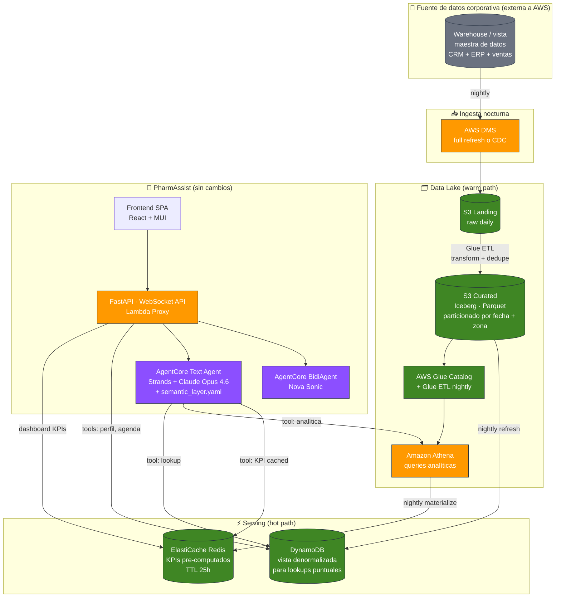

# De Demo a Producto: camino hacia un MLP escalable

> Esta guía describe cómo evolucionar PharmAssist desde la demo (datos sintéticos en CSVs → DynamoDB, un solo APM, todo en un mismo lugar) hacia un **Minimum Lovable Product (MLP)** listo para soportar un laboratorio farmacéutico real con cientos de APMs, datos corporativos vivos y SLAs de producción.

## Índice

- [Contexto: la demo vs. la realidad](#contexto-la-demo-vs-la-realidad)
- [Conceptos clave: hot path y warm path](#conceptos-clave-hot-path-y-warm-path)
- [Arquitectura objetivo](#arquitectura-objetivo)
- [Plan de evolución por fases](#plan-de-evolución-por-fases)
- [Componentes en detalle](#componentes-en-detalle)
  - [Fuente de datos corporativa](#fuente-de-datos-corporativa)
  - [Ingesta con AWS DMS](#ingesta-con-aws-dms)
  - [Curated layer: S3 + Apache Iceberg](#curated-layer-s3--apache-iceberg)
  - [Hot path: DynamoDB](#hot-path-dynamodb)
  - [Warm path: Athena](#warm-path-athena)
  - [Caché de KPIs: ElastiCache Redis](#caché-de-kpis-elasticache-redis)
  - [Búsqueda: cuándo pasar a OpenSearch](#búsqueda-cuándo-pasar-a-opensearch)
  - [Capa semántica: YAML en prompt](#capa-semántica-yaml-en-prompt)
- [Comparativa de costos](#comparativa-de-costos)
- [Cuándo escalar qué](#cuándo-escalar-qué)

---

## Contexto: la demo vs. la realidad

La demo actual usa un atajo pedagógico: los CSVs (`crm_medicos.csv`, `apm_visitas.csv`, `ventas_reportadas.csv`) se cargan de una en DynamoDB, y el agente consulta DynamoDB directamente. Es simple, es didáctico, funciona para un APM y datos sintéticos.

En un entorno corporativo real, el escenario cambia en varias dimensiones:

| Aspecto | Demo | Producción |
|---|---|---|
| **Fuente de datos** | 3 CSVs locales | Un warehouse corporativo o vista maestra de datos (fuera de AWS), que consolida CRM + ERP + ventas + visitas médicas |
| **Frescura esperada** | Cualquiera (son estáticos) | Batch diario, el APM prepara la agenda del día siguiente con datos a día vencido |
| **Volumen** | ~500 médicos, ~2.500 visitas, ~6.000 ventas | Miles de médicos, cientos de miles de visitas históricas, millones de líneas de venta |
| **Usuarios concurrentes** | 1-3 en la demo | 200-500 APMs activos en horario laboral |
| **Patrones de query** | Lookup puntual por ID | Mixto: lookup (perfil de un médico) + analítico (ranking YoY, ventas por zona, cobertura por producto) |
| **SLAs** | Best effort | Chat < 3s end-to-end, dashboard < 1s |
| **Gobierno de datos** | No aplica | PII, aislamiento por APM, audit trail, retention policies |

La demo no quiere tirarse a la basura cuando pasás a producción. Al contrario: **el agente, las tools, la UI, el stack de Bedrock AgentCore y la arquitectura de WebSocket/voz son reutilizables al 100%**. Lo que cambia es **de dónde vienen los datos** y **cómo se sirven para que las queries sigan siendo rápidas** a escala real.

---

## Conceptos clave: hot path y warm path

Un sistema que combina lookups y analítica no puede servir todo desde el mismo lugar sin hacer concesiones. La idea de **"hot path" y "warm path"** es un patrón estándar de arquitecturas de datos que separa los tipos de acceso para optimizar cada uno por separado.

### Hot path

Datos a los que el usuario accede **ahora mismo, con frecuencia, y espera respuesta en milisegundos**.

Ejemplos en PharmAssist:
- Perfil completo del Dr. Peralta cuando el APM entra a prepararlo
- Agenda planificada de hoy cuando el APM abre el dashboard
- Últimas 3 visitas a un médico cuando el agente arma un brief

Características del storage hot:
- Optimizado para **lookups por clave** (`GetItem`, `Query`)
- Latencia sub-10ms
- Costo por request, no por GB escaneado
- Puede ser más caro por GB almacenado, pero nunca sirve todo el histórico

**Elección en AWS**: DynamoDB (principal), ElastiCache Redis (caché de valores pre-computados).

### Warm path

Datos a los que el usuario accede **a veces, cuando pregunta algo analítico, y puede tolerar 1-3 segundos**.

Ejemplos:
- "¿Qué productos están cayendo en ventas en mi zona en los últimos 12 meses?"
- "Dame los 10 médicos que más prescribieron X en 2025"
- "¿Cómo viene mi cobertura comparada con el trimestre anterior?"

Características del storage warm:
- Optimizado para **queries analíticas** (`GROUP BY`, `JOIN`, `WINDOW`)
- Latencia 1-3 segundos
- Muy barato por GB almacenado (formato columnar comprimido)
- Barato por query (cobra sólo por lo escaneado, y con particionado + compresión escanea poco)

**Elección en AWS**: S3 + Apache Iceberg + Athena (principal), Redshift si el volumen justifica un cluster dedicado.

### Cold path (mencionado por completitud)

Datos archivados por compliance o auditoría, consultados muy esporádicamente. En PharmAssist hoy no aplica. Se implementaría con S3 Glacier si hubiera retención regulatoria de varios años sobre visitas médicas.

### Cómo se conectan

El mismo dato puede vivir en **los dos lados**. Ejemplo: la tabla de ventas de 5 años completa vive en S3 Iceberg (warm). Una vista materializada con los últimos 30 días agregados por zona vive en DynamoDB (hot), porque el dashboard del APM la consulta 10 veces por día por persona.

La regla práctica: **si un dato se consulta más de 100 veces al día sin cambiar**, merece estar en hot.

---

## Arquitectura objetivo



Lo que **no cambia** respecto a la demo: todo el stack del agente (AgentCore, Strands, Claude Opus, Nova Sonic, frontend, WebSocket, voz). Los tools existentes siguen existiendo pero cada uno decide internamente contra qué storage ejecuta.

Lo que **cambia**: aparece un pipeline de ingesta nocturna, aparece S3 como source of truth histórico, y DynamoDB pasa a ser una vista materializada de una porción caliente de esos datos.

---

## Plan de evolución por fases

Cada fase es deployable, operable y da valor por sí sola. No hay que hacer todo junto.

### Fase 0 — Demo (estado actual)

- CSVs → `loader.py` → DynamoDB
- Un APM (Peccy), datos sintéticos
- Todos los tools del agente leen de DynamoDB directo
- Stack completo de AgentCore funcionando

**Sirve para**: mostrar capacidades, validar UX, demos comerciales, onboarding de nuevos devs.

### Fase 1 — Warehouse → S3 Iceberg (el "data lake" del proyecto)

- Se configura **AWS DMS** para replicar la vista maestra del cliente a S3 cada noche
- Los datos landean en S3 como Parquet particionado por fecha
- **AWS Glue Crawler** descubre el schema y lo registra en Glue Data Catalog
- **Athena** puede querear los datos directamente sin infra adicional
- Los devs validan que los datos llegan correctos comparando contra el warehouse origen

**Duración estimada**: 1-2 semanas.

**Valor**: tenés los datos del cliente en AWS, consultables con SQL estándar, sin tocar el agente.

### Fase 2 — Refill nocturno de DynamoDB desde Iceberg

- Un **Glue ETL job** corre después de la ingesta de DMS
- Lee las tablas Iceberg curadas
- Denormaliza lo necesario (médicos + últimas visitas + asignación APM)
- Wipe + bulk-write a DynamoDB
- Los tools de lookup del agente **no cambian**: siguen consultando DynamoDB

**Duración estimada**: 1 semana.

**Valor**: el agente ahora consulta datos reales del cliente sin cambios de código. Demo funcional con datos productivos.

### Fase 3 — Warm path (tools analíticos via Athena)

- Se agregan **nuevos tools** al agente que ejecutan queries en Athena para casos analíticos reales:
  - `obtener_ventas_yoy_zona(zona, periodo)` — ya no limitado a la demo
  - `obtener_tendencias_prescripcion(medico_mn)` — histórico de 2-3 años
  - `obtener_cobertura_trimestral(apm_id)` — comparativos trimestrales
- Los tools existentes siguen en DynamoDB, solo los nuevos van a Athena
- El agente decide qué tool usar según la pregunta (el LLM entiende la diferencia por el docstring)

**Duración estimada**: 2 semanas.

**Valor**: el agente responde preguntas analíticas reales que la demo no podía. Insights sobre 2-3 años de historia.

### Fase 4 — Caché de KPIs con Redis

- Se agrega **ElastiCache Redis** a la VPC
- Una Lambda "KPI Materializer" corre después del ETL nocturno, ejecuta las queries analíticas que alimentan el dashboard, y las deja pre-computadas en Redis con TTL 25 horas
- Los endpoints de dashboard leen de Redis; si el dato no está, caen a Athena (lazy cache)

**Duración estimada**: 1 semana.

**Valor**: latencia de dashboard baja de ~2s (Athena) a ~10ms (Redis). Costo de Athena por dashboard baja >95%.

### Fase 5 — Capa semántica YAML en prompt

- Se crea un archivo `semantic_layer.yaml` con: entidades del dominio, sus campos, relaciones entre entidades, métricas conocidas del negocio
- Se inyecta como parte del system prompt del agente
- El LLM usa ese contexto para generar tool calls más correctos y entender preguntas ambiguas ("cobertura" ya no es ambiguo, está definido)

**Duración estimada**: 3-5 días.

**Valor**: el agente entiende mejor el lenguaje del negocio farmacéutico. Menos hallucinations, más preguntas respondidas correctamente en el primer intento.

### Fase 6 — Opcional según dolor observado

- **OpenSearch** si aparece necesidad de búsqueda fuzzy avanzada o full-text sobre notas de visitas
- **Neptune** si aparecen 3+ fuentes heterogéneas que requieren federación semántica
- **Redshift** si el volumen analítico supera los ~50 TB y Athena se queda corto

No son parte del MLP base.

---

## Componentes en detalle

### Fuente de datos corporativa

El punto de partida en cualquier cliente real: existe **un sistema maestro de datos externo a AWS** donde vive la información viva del negocio. Puede ser:

- Un data warehouse corporativo (Snowflake, Databricks, Synapse, BigQuery, Redshift on-premise)
- Una vista maestra construida sobre múltiples fuentes (CRM + ERP + sistemas transaccionales)
- Una base relacional de tamaño considerable que hace las veces de warehouse ad-hoc

Características típicas:
- Se actualiza vía batch nocturno desde los sistemas transaccionales
- Contiene las entidades que nos interesan: médicos, visitas, ventas, productos, asignaciones
- Tiene una "vista maestra" o conjunto de vistas que ya denormalizan y limpian los datos
- Accesible vía JDBC/ODBC con credenciales de read-only

**Decisión clave**: no vamos a **reemplazar** ese sistema (es la fuente de verdad del cliente). Vamos a **replicar** la vista maestra a AWS con periodicidad diaria y servir desde AWS.

### Ingesta con AWS DMS

**AWS Database Migration Service (DMS)** es el servicio managed de AWS para replicar datos entre bases. Soporta la mayoría de orígenes JDBC (SQL Server, Oracle, PostgreSQL, MySQL, Snowflake, etc.) y puede escribir a múltiples destinos (S3, DynamoDB, Redshift, Kinesis).

Para PharmAssist elegimos escribir a **S3 como Parquet**. Eso nos da:
- Formato columnar estándar del ecosistema analítico
- Schema preservado
- Lectura eficiente por Athena y Glue
- Costo de almacenamiento bajísimo

Tiene dos modos:

**Full Load** (simple, recomendado para arrancar):
- Una tarea DMS corre cada noche a las 2am
- Trae snapshot completo de las tablas/vistas configuradas
- Sobrescribe el landing zone en S3
- Perfecto cuando el volumen es manejable (hasta decenas de GBs) y la ventana nocturna alcanza

**CDC ongoing** (eficiente pero más complejo):
- DMS lee el transaction log del origen
- Aplica solo los diffs (inserts/updates/deletes) a S3 como nuevos archivos
- El Glue ETL de limpieza después compacta los diffs contra la vista anterior
- Vale la pena cuando el volumen es grande (cientos de GB) y las ventanas de batch empiezan a excederse

**Costo**: una instancia `dms.t3.medium` corriendo 24/7 son ~$50/mes. Si usás modo "on-demand scheduled tasks" (DMS Serverless) podés bajar a ~$15/mes para el batch nocturno.

### Curated layer: S3 + Apache Iceberg

Los datos que llegan de DMS caen en una **landing zone** tal cual vienen. Antes de que el agente los consulte, un **Glue ETL job** los transforma en un formato curado:

- **Deduplica** (en modo CDC pueden venir múltiples versiones del mismo registro)
- **Aplica reglas de limpieza** (tipos, nulls, normalización de texto)
- **Particiona** por `fecha_visita` + `zona` para que las queries escaneen poco
- **Convierte a Apache Iceberg**

**Por qué Iceberg en particular, no solo Parquet**:
- **Schema evolution**: cuando el cliente agregue columnas en su warehouse, no rompe nada. Iceberg maneja versiones de schema.
- **Time travel**: podés consultar cómo estaban los datos ayer, la semana pasada, hace un mes. Valiosísimo para auditoría.
- **ACID transactions sobre S3**: si un ETL falla a la mitad, no queda el lake inconsistente.
- **Agnóstico de engine**: Athena, EMR, Redshift Spectrum, Databricks, Snowflake — todos leen Iceberg. No te atás a nadie.

**Glue Data Catalog** es el índice de metadata: registra qué tablas existen, qué columnas tiene cada una, dónde están físicamente en S3. Es gratis hasta el primer millón de objetos.

### Hot path: DynamoDB

Después de que los datos estén curados en S3, un **segundo Glue ETL job** (o Lambda) toma los datos relevantes para el agente y **rellena DynamoDB**. La lógica:

- **Wipe** de las tablas que se van a refrescar (médicos, asignaciones, últimas visitas)
- **Bulk write** de las filas nuevas
- Se hace a las 3am, después de que termine el ETL del warm path

**Qué va a DynamoDB**:
- Todos los médicos (tabla completa, tamaño contenido)
- Visitas de los últimos 90 días (no 5 años enteros, eso vive en Iceberg)
- Asignaciones APM → médico (relación que el agente consulta en cada tool call)
- Agenda planificada de los próximos 30 días

**Qué NO va a DynamoDB**:
- Histórico completo de visitas (Iceberg)
- Histórico completo de ventas (Iceberg)
- Transacciones detalladas de prescripción (Iceberg)

**Por qué DynamoDB y no una RDS/PostgreSQL**:
- El patrón del agente es `GetItem(medico_mn)` o `Query(APM-index)`. Para eso DynamoDB da P50 <10ms sin cluster que gestionar.
- Pay-per-request en on-demand: sin capacidad que estimar, escala solo.
- Ya lo tenemos en la demo. Menos piezas nuevas.

### Warm path: Athena

**Amazon Athena** es un motor SQL serverless que ejecuta queries sobre S3. No hay cluster que gestionar, no hay horas de cómputo reservadas, cobra por TB escaneado ($5/TB en us-east-1).

Se conecta a Glue Data Catalog y consulta las tablas Iceberg. Un dev escribe SQL estándar:

```sql
SELECT producto, SUM(valor_venta) AS ventas_2025
FROM ventas
WHERE anio = 2025 AND zona = 'Belgrano-Centro'
GROUP BY producto
ORDER BY ventas_2025 DESC
LIMIT 10
```

Con particionado por zona + anio, esa query escanea <10 MB y cuesta <$0.001.

**Cómo lo usa el agente**: se agregan tools específicos que construyen y ejecutan queries parametrizadas. Por ejemplo:

```python
@tool
def obtener_ventas_yoy_zona(zona: str, periodo_meses: int) -> dict:
    """Compara ventas de los últimos N meses vs. mismo periodo del año anterior.
    
    Usar cuando el APM pide análisis YoY o comparativos de tendencia por zona.
    """
    query = f"""
    WITH actual AS (
        SELECT producto, SUM(valor_venta) AS monto
        FROM ventas WHERE zona = %s AND fecha >= current_date - interval '{periodo_meses}' month
        GROUP BY producto
    ),
    anterior AS (
        SELECT producto, SUM(valor_venta) AS monto
        FROM ventas WHERE zona = %s 
          AND fecha BETWEEN current_date - interval '{periodo_meses + 12}' month
                       AND current_date - interval '12' month
        GROUP BY producto
    )
    SELECT actual.producto,
           (actual.monto - anterior.monto) / anterior.monto * 100 AS yoy_pct
    FROM actual LEFT JOIN anterior USING (producto)
    ORDER BY yoy_pct ASC
    LIMIT 15
    """
    return _execute_athena(query, [zona, zona])
```

Athena devuelve resultados en 1-3 segundos. Para una pregunta del APM donde la respuesta final tarda 5-8 segundos en total (por los tokens de Claude también), eso es perfectamente aceptable.

### Caché de KPIs: ElastiCache Redis

Esta es la pieza que probablemente no conoces. Te la explico con detalle.

**Qué es ElastiCache Redis**:

Un servicio managed de AWS que corre [Redis](https://redis.io/) por vos. Redis es una base de datos en memoria RAM, clave-valor, open source, que domina el mercado de caches desde hace 15 años. Piénsalo como un diccionario Python gigante, compartido entre todas tus Lambdas, que vive fuera del proceso y sobrevive entre invocaciones.

**Qué lo distingue de una base tradicional**:

- Todo en RAM, latencia de lectura <1ms (100x más rápido que DynamoDB, 1000x más rápido que Athena)
- Estructuras de datos nativas: strings, hashes, listas, sets, sorted sets, streams
- TTL por clave: podés decir "este valor expira en 25 horas" y Redis lo borra solo
- Pub/sub si algún día lo necesitás para eventos en tiempo real

**Qué problema resuelve en PharmAssist**:

Sin caché, el flujo del dashboard es así:

```
APM abre el dashboard
→ GET /api/dashboard/sla-alerts
  → Lambda FastAPI
    → Athena query sobre histórico de visitas
    → 2 segundos, $0.0005
  → respuesta
→ GET /api/dashboard/ventas-declinando  (en paralelo)
  → Lambda FastAPI
    → Athena query YoY
    → 2.5 segundos, $0.0008
  → respuesta
→ GET /api/dashboard/birthdays
  → similar
```

Cada vez que el APM abre el dashboard, lo mismo. Con 200 APMs que abren dashboard 10 veces al día = 2000 veces al día × 3 endpoints = **6000 queries a Athena por día = ~$4/día = ~$120/mes solo en Athena**.

Y lo peor: los KPIs **no cambian durante el día**. El batch nocturno corre a las 3am, los datos son del día anterior, y van a seguir siendo los mismos hasta la noche siguiente. Estamos recalculando lo mismo 6000 veces por día.

**Con Redis**:

```
A las 3:30 AM (después del ETL nocturno):
  Lambda "KPIMaterializer" corre
    Para cada APM:
      → ejecuta query Athena "sla-alerts"
      → guarda JSON en Redis, clave "sla-alerts:apm=Peccy", TTL 25h
      → ejecuta query Athena "ventas-declinando-zona"
      → guarda en Redis, TTL 25h
      → ... para cada KPI
  Total: 200 APMs × 5 KPIs = 1000 queries Athena × $0.0005 = $0.50 una vez al día

Durante el día:
  APM abre dashboard
    → Lambda FastAPI
      → Redis.GET("sla-alerts:apm=Peccy")
      → HIT: devuelve JSON en 5ms
    → respuesta total: <50ms end-to-end
```

**Resultado**:
- Latencia de dashboard de 2s → <50ms (40x más rápido)
- Costo de Athena de $4/día → $0.50/día (8x más barato)
- Costo adicional de Redis: ~$12/mes (instancia `cache.t4g.micro` o Redis Serverless)

**Cómo se deploya**:

ElastiCache vive dentro de una VPC por seguridad (Redis no tiene auth robusta built-in; se aísla con security groups). Las Lambdas que lo consultan necesitan estar en esa misma VPC.

```python
# En el Lambda de dashboard:
import redis

# El endpoint viene de variable de entorno, poblada por CDK output
r = redis.Redis(host=os.environ["REDIS_HOST"], port=6379, decode_responses=True)

@app.get("/api/dashboard/sla-alerts")
def sla_alerts(apm_id: str):
    cached = r.get(f"sla-alerts:apm={apm_id}")
    if cached:
        return json.loads(cached)
    # Lazy fallback si el cache está frío
    result = _athena_query_sla_alerts(apm_id)
    r.setex(f"sla-alerts:apm={apm_id}", 90000, json.dumps(result))
    return result
```

**Patrón recomendado**: "cache-aside lazy" con materialización proactiva. El KPIMaterializer llena el cache de noche, pero si por alguna razón un valor no está, el Lambda lo calcula on-demand y lo guarda.

**Cuándo lo metés**: fase 4, cuando Athena empieza a costar más de unos dólares al día o la latencia de dashboard se nota.

**Alternativa más simple**: DAX (DynamoDB Accelerator). Si los KPIs se guardan en DynamoDB en lugar de Athena, DAX es un cache cluster específico para DynamoDB con menos config. Pero si ya vas a tener Athena para queries analíticas, Redis cubre ambos casos y es más flexible.

### Búsqueda: cuándo pasar a OpenSearch

La búsqueda por nombre de médico en la demo es simple: el agente tiene el `apm_id`, consulta el GSI `APM-index` que devuelve todos los médicos de ese APM (son 50-200 en el peor caso), y hace un match en memoria con Python. Funciona perfecto hasta que se rompe en alguno de estos casos:

1. **Typos** del APM en un teclado mobile. "perala" no matchea "Peralta" con un `in` simple.
2. **Tildes y normalización**. "garcia" no matchea "García".
3. **Búsqueda combinada** por múltiples dimensiones: "neuróloga en Palermo que se llama algo con García".
4. **Full-text sobre notas libres** de visitas: "qué médicos mencionaron interés en el producto X".

Para los primeros dos casos, la solución es un **normalizador de texto en Python** que saca tildes y hace lowercase, más opcionalmente un `difflib.SequenceMatcher` para fuzzy matching. Son 10 líneas de código, no agrega infra.

```python
from unicodedata import normalize

def _normalize(text: str) -> str:
    nfkd = normalize("NFKD", text.lower().strip())
    return "".join(c for c in nfkd if ord(c) < 128)
```

Solo cuando aparece el caso 3 o 4 de forma recurrente justificás agregar **OpenSearch Serverless**. Es un cluster de búsqueda inverted-index que cuesta desde $350/mes (mínimo 2 OCUs). A escala de laboratorio con 500 APMs y 20.000 médicos, no se nota ese costo. Pero es infra adicional: hay que replicarle los datos desde DynamoDB o desde Iceberg, y mantenerla sincronizada.

**Regla práctica**: no es parte del MLP base. Se agrega en Fase 6 si aparece un requerimiento concreto.

### Capa semántica: YAML en prompt

Los LLMs funcionan mejor cuando tienen **contexto estructurado del dominio** en el system prompt. Una capa semántica es un documento que describe:

- **Entidades** del negocio (Médico, Visita, Producto, Zona)
- **Atributos** de cada entidad (qué significa cada campo)
- **Relaciones** (una Visita pertenece a un Médico y es hecha por un APM)
- **Métricas** conocidas (cómo se calcula "cobertura de APM", qué es "SLA de visita")
- **Mapping físico** (qué tabla tiene qué datos)

En la arquitectura propuesta, esto vive como un YAML que se inyecta en el system prompt de Claude:

```yaml
# semantic_layer.yaml (fragmento)
entidades:
  Medico:
    descripcion: "Profesional de la salud visitado por un APM."
    storage:
      hot: dynamodb.medicos
      warm: s3.ventas, s3.visitas (históricos)
    clave_primaria: Medico_MN
    campos_clave:
      - MN: matrícula nacional
      - Especialidad_Medica: especialidad clínica
      - Zona: zona geográfica asignada
    relaciones:
      - asignado_a: APM (via campo APM)
      - visitado_en: Visita (via Medico_MN)
      - recibe: Prescripciones (vía histórico)

metricas:
  cobertura_apm:
    formula: "count(Médicos visitados en últimos 30d) / count(Médicos asignados)"
    tool_sugerido: buscar_medicos_por_apm + obtener_historial_visitas_apm

  sla_vencido:
    definicion: "Un médico está en SLA vencido si días_desde_ultima_visita > dias_cadencia"
    cadencias: {Mensual: 30, Trimestral: 90, Semestral: 180, Anual: 365}
```

**Qué gana el agente**:
- Cuando el APM pregunta "¿cómo está mi cobertura?", Claude sabe exactamente qué calcular y qué tool usar.
- Cuando el APM pregunta "ventas de producto X en los últimos 2 años", Claude sabe que eso va al warm path, no al hot.
- Menos hallucinations de nombres de campos o cálculos inventados.

**Costo**: cero. Es un archivo markdown/yaml que agregás al system prompt y redeployás el agente.

**Cuándo se hace trade-off**: si el YAML supera ~50 KB (unas 10.000 entidades documentadas en detalle), empieza a pesar en el context window y en el costo de Claude (input tokens cobran). En ese momento se migra a **Neptune** (capa semántica como grafo queryable), pero ese escenario es cuando ya tenés varias fuentes federadas. No es el caso del MLP.

---

## Comparativa de costos

Para 200 APMs activos en horario laboral, us-east-1, on-demand:

| Componente | Fase 0 (demo) | Fase 1-2 (MLP) | Fase 3-4 (MLP completo) |
|---|---|---|---|
| Bedrock (Claude Opus 4.6 + Nova Sonic) | ~$750/mes | ~$750/mes | ~$750/mes |
| AgentCore Runtime | ~$20/mes | ~$20/mes | ~$20/mes |
| DynamoDB on-demand | ~$10/mes | ~$30/mes | ~$30/mes |
| Amazon Transcribe | ~$850/mes | ~$850/mes | ~$850/mes |
| Lambda + API Gateway | ~$15/mes | ~$20/mes | ~$20/mes |
| S3 + CloudFront (frontend) | ~$15/mes | ~$20/mes | ~$20/mes |
| **AWS DMS** | — | ~$50/mes | ~$50/mes |
| **S3 Iceberg + Glue ETL** | — | ~$30/mes | ~$30/mes |
| **Athena** | — | ~$15/mes | ~$3/mes (con cache) |
| **ElastiCache Redis** | — | — | ~$15/mes |
| **Total** | **~$1.660/mes** | **~$1.785/mes** | **~$1.788/mes** |

Observaciones:

- **El costo base (Bedrock + Transcribe) es el 95% del total**. Los componentes de data engineering son <5%.
- **DMS + Iceberg + Athena suman ~$95/mes** para tener el warehouse del cliente replicado y queryable. Es barato comparado con el valor que da.
- **Redis paga su propio costo** evitando queries Athena innecesarias, y mejora latencia 40x. Trade-off muy favorable.
- Costo por APM por mes: ~$9.

---

## Cuándo escalar qué

Indicadores concretos para decidir cada upgrade:

| Observación en producción | Acción recomendada |
|---|---|
| Los CSV del cliente se actualizan manualmente cada noche | Fase 1 (DMS + S3 Iceberg) |
| El agente no tiene datos reales del negocio | Fase 2 (refill DynamoDB desde Iceberg) |
| APMs piden análisis históricos y el agente no puede responder | Fase 3 (tools Athena) |
| Dashboard tarda >1s en cargar | Fase 4 (ElastiCache Redis) |
| APMs escriben mal los nombres y no encuentran médicos | Normalización en Python (sin infra nueva) |
| APMs hacen búsquedas full-text complejas regularmente | Fase 6 (OpenSearch) |
| Data engineers suman 3ra fuente heterogénea al lake | Fase 6 (Neptune como capa semántica unificada) |
| Queries analíticas superan 50 TB/mes escaneados | Fase 6 (Redshift cluster dedicado) |

La regla meta: **no agregar infra antes de medir el dolor que resuelve**. Arrancás con la arquitectura mínima (Fase 1-3), medís latencia y costo reales, y agregás el siguiente componente cuando los datos te dicen que vale la pena.

---

## Referencias

- [AWS DMS](https://docs.aws.amazon.com/dms/latest/userguide/Welcome.html) — Database Migration Service
- [Apache Iceberg en AWS](https://docs.aws.amazon.com/prescriptive-guidance/latest/apache-iceberg-on-aws/introduction.html) — Guía oficial
- [Amazon Athena](https://docs.aws.amazon.com/athena/latest/ug/what-is.html) — Motor SQL serverless sobre S3
- [ElastiCache for Redis](https://docs.aws.amazon.com/AmazonElastiCache/latest/red-ug/WhatIs.html) — Caché managed
- [AWS Glue ETL](https://docs.aws.amazon.com/glue/latest/dg/what-is-glue.html) — Spark serverless para transformaciones
