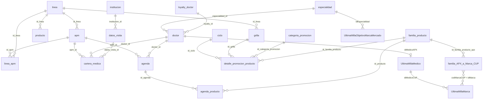

# Modelo de datos

PharmAssist opera sobre un modelo **relacional** en Amazon Aurora PostgreSQL Serverless v2: 21 tablas, ~2M filas, con integridad referencial declarada. El agente no tiene tools de dominio por entidad — genera SQL contra este schema mediante la tool `query_db`.

Este documento describe el modelo, las relaciones entre entidades y las reglas de negocio que se derivan de ellas. Para la justificación de por qué el modelo es relacional y no una ontología o un grafo, ver [`decisions/0001-postgres-en-vez-de-ontologia.md`](decisions/0001-postgres-en-vez-de-ontologia.md).

## Origen y naturaleza de los datos

El schema replica la estructura real de datos de un laboratorio farmacéutico argentino, que combina **dos mundos de información** que históricamente viven separados:

| Origen | Qué aporta | Tablas |
|---|---|---|
| **CRM interno** (referido como `APX` en el schema) | Quién es el APM, qué médicos tiene asignados, qué visitó y cuándo, qué productos promociona en cada ciclo | `apm`, `doctor`, `cartera_medica`, `agenda`, `agenda_producto`, `detalle_promocion_producto`, `familia_producto`, `producto`, `grilla`, `linea`, `ciclo`, catálogos |
| **Auditoría de prescripciones** (referida como `CUP` / última milla, del tipo que proveen Close-Up e IQVIA) | Qué prescribe efectivamente cada médico, con qué share de mercado y cómo evoluciona trimestre a trimestre | `UltimaMillaMedico`, `UltimaMillaMarca`, `UltimaMillaObjetivoMarcaMercado` |
| **Cruce entre ambos** | Puente entre el catálogo interno de productos y las marcas del mercado auditado | `familia_APX_a_Marca_CUP` |

El valor del producto está justamente en **cruzar los dos mundos**: el CRM dice a quién visitaste y qué le presentaste; la auditoría dice si eso se tradujo en prescripciones. Ninguna de las dos fuentes responde sola preguntas como "¿en qué médicos que visito estoy perdiendo share?".

> **Datos sintéticos.** Todos los datos del repo se generan por una Lambda de seed (`produccion-poc/infrastructure/lambda/seed/`). Nombres, matrículas, emails e instituciones son ficticios. El schema es fiel a la estructura real; los datos no. El laboratorio de origen no se identifica: el laboratorio propio se codifica como `'ELE'` y la competencia como `LAB_A`..`LAB_E`.

## Convención de nombres del schema

El schema mezcla dos convenciones porque refleja dos sistemas de origen. Esto **no es accidental** y hay que respetarlo al escribir SQL:

- Tablas del CRM: `snake_case` sin comillas (`cartera_medica`, `familia_producto`), pero con **columnas en `camelCase` entrecomilladas** (`"primerNombre"`, `"matriculaNacional"`).
- Tablas de última milla: **nombre de tabla en PascalCase entrecomillado** (`"UltimaMillaMarca"`) y columnas también entrecomilladas (`"idMedicoCUP"`, `"ShareMarcaTrim"`).

En PostgreSQL, un identificador entrecomillado es case-sensitive. Omitir las comillas en `"UltimaMillaMarca"` produce `relation "ultimamillamarca" does not exist`. El system prompt del agente incluye el DDL completo para que genere las comillas correctamente.

## Diagrama de entidades



La frontera entre los dos mundos son exactamente dos aristas:

- `doctor.id → "UltimaMillaMedico"."idMedicoAPX"` — el mismo médico en ambos sistemas
- `familia_APX_a_Marca_CUP."codMarcaCUP" → "UltimaMillaMarca"."idMarca"` — el mismo producto en ambos sistemas

## Tablas por dominio

### Catálogos (sin dependencias)

| Tabla | PK | Contenido |
|---|---|---|
| `especialidad` | `id` | Especialidad médica (cardiología, gastroenterología, ...) |
| `loyalty_doctor` | `id` | Nivel de fidelidad del médico hacia el laboratorio |
| `institucion` | `id` | Hospital, sanatorio o consultorio donde se visita |
| `linea` | `id` | Línea comercial / unidad de negocio (agrupa productos y APMs) |
| `ciclo` | `id` | Ciclo promocional con `inicio` y `fin` (DATE) |
| `categoria_promocion` | `id` | `'1'` = Hiperfoco (HP), `'2'` = Foco (FC) |

### Entidades principales

| Tabla | PK | Campos relevantes | FKs |
|---|---|---|---|
| `apm` | `id` | `"primerNombre"`, `"primerApellido"`, `email`, `gerente_regional_id`, `"codigoPromotor"`, `inactivo` | `id_linea` → `linea` |
| `doctor` | `id` | `"primerNombre"`, `"primerApellido"`, `"matriculaNacional"`, `categoria_id`, `inactivo` | `especialidad_id` → `especialidad`, `loyalty_id` → `loyalty_doctor` |
| `familia_producto` | `id` | `nombre`, `principio_activo`, `accion_terapeutica` | — |
| `producto` | `id` | `nombre` (presentación comercial concreta) | `id_linea` → `linea` |
| `grilla` | `id` | `nombre_grilla` (grilla promocional por línea) | `id_linea` → `linea` |

> `familia_producto` es el nivel al que se promociona y se mide (la molécula/marca), mientras `producto` es la presentación comercial. Las visitas y la promoción se registran contra `familia_producto`, no contra `producto`.

### Operativas

| Tabla | PK | Qué representa | FKs |
|---|---|---|---|
| `linea_apm` | `id` | Qué líneas comerciales maneja cada APM | `id_apm` → `apm`, `id_linea` → `linea` |
| `datos_visita` | `id` | Parámetros de visita: `frecuencia` (Mensual/Trimestral/Semestral/Anual) | `institucion_id` → `institucion` |
| `cartera_medica` | `id` | **Asignación APM ↔ médico** (con su frecuencia esperada), `inactivo` | `apm_id` → `apm`, `doctor_id` → `doctor`, `datos_visita_id` → `datos_visita` |
| `agenda` | `id` | **Visita** planificada o realizada: `inicio`, `fin`, `visita_exitosa`, `visita_tipo` (Presencial/Virtual/Telefónica), `observaciones`, `inactivo` | `apm_id` → `apm`, `doctor_id` → `doctor` |
| `agenda_producto` | `id` | Qué familias se presentaron en cada visita | `id_agenda` → `agenda`, `id_producto` → `familia_producto` |
| `detalle_promocion_producto` | `id` | **Qué promocionar en qué ciclo y con qué prioridad** | `id_familia_producto`, `id_grilla`, `id_categoria_promocion`, `id_ciclo` |

`cartera_medica` es la tabla más importante del modelo operativo: define el **scope de datos de cada APM**. Todo lo que el agente responde se filtra por ella.

### Analíticas — última milla (prescripciones)

| Tabla | PK | Contenido |
|---|---|---|
| `"UltimaMillaMedico"` | `"idMedicoCUP"` | Un registro por médico auditado. `"idMedicoAPX"` → `doctor(id)` es el puente al CRM. Métricas globales: `"IETrim"`, `"ShareTrim"`, `"ShareTrim_1"`, `"ShareMes"` |
| `"UltimaMillaMarca"` | `"idMedicoCUP"` + `"idMarca"` | **Tabla más grande (~1,5M filas)**: prescripciones por médico y marca. `"idLaboratorio"`, `"marcaNombre"`, `"idMercado"`, `"ShareMarcaMercado"`, `"ShareMarcaMes"`, `"IEMarcaTrim"`, `"ShareMarcaTrim"`, `"ShareMarcaTrim_1"` |
| `"UltimaMillaObjetivoMarcaMercado"` | `"idEspecialidad"` + `"idMarca"` + `"idMercado"` | Objetivo de marca/mercado por especialidad |
| `familia_APX_a_Marca_CUP` | `id_familia_producto_apx` + `"codMarcaCUP"` | Cruce catálogo interno ↔ marcas del mercado auditado |

## Relaciones clave (los 5 caminos de JOIN)

Estos son los paths que el agente usa para responder casi cualquier pregunta. Están declarados explícitamente en el system prompt (`agentcore/prompts/system_prompt.py`) porque son el conocimiento no obvio del schema.

**1. APM → su cartera de médicos**
```
apm.id → cartera_medica.apm_id → cartera_medica.doctor_id → doctor.id
```
Responde: cuántos médicos tengo, qué especialidades, quiénes son.

**2. APM → visitas → productos presentados**
```
apm.id → agenda.apm_id → agenda.id → agenda_producto.id_agenda → familia_producto.id
```
Responde: qué visité, cuándo, qué presenté en cada visita.

**3. Médico → sus prescripciones**
```
doctor.id → "UltimaMillaMedico"."idMedicoAPX"
          → "UltimaMillaMedico"."idMedicoCUP"
          → "UltimaMillaMarca"."idMedicoCUP"
```
Responde: qué prescribe realmente este médico y con qué share. **Es el salto CRM → mercado.**

**4. Ciclo → productos foco**
```
ciclo.id → detalle_promocion_producto.id_ciclo
         (WHERE id_categoria_promocion IN ('1','2'))
         → familia_producto.id
```
Responde: qué tengo que promocionar este ciclo y con qué prioridad.

**5. Producto interno → marca de mercado**
```
familia_producto.id → familia_APX_a_Marca_CUP.id_familia_producto_apx
                    → "codMarcaCUP" → "UltimaMillaMarca"."idMarca"
```
Responde: cómo le va en el mercado a un producto de nuestro catálogo.

Las preguntas de mayor valor combinan varios paths. "¿A qué médicos de mi cartera debería visitar para crecer en el producto X?" recorre 1 + 5 + 3 y termina en un JOIN de 5-6 niveles.

## Reglas de negocio que dependen del modelo

Estas reglas viven en el system prompt del agente porque no se pueden inferir del DDL solo:

| # | Regla | Implementación en SQL |
|---|---|---|
| 1 | **Aislamiento por APM** (obligatoria) | `cartera_medica.apm_id`, `agenda.apm_id`, `linea_apm.id_apm` siempre filtrados por el APM autenticado |
| 2 | Cartera activa | `cartera_medica.inactivo = false` |
| 3 | Agenda activa | `agenda.inactivo = false` (los inactivos son visitas canceladas) |
| 4 | **EVO TRM** (evolución trimestral) | `"ShareMarcaTrim" - "ShareMarcaTrim_1"`. Positivo = la marca creció |
| 5 | Foco / Hiperfoco | `id_categoria_promocion = '1'` (HP) o `'2'` (FC), filtrando por `id_ciclo` |
| 6 | Laboratorio propio vs competencia | `"idLaboratorio" = 'ELE'` / `!= 'ELE'` |
| 7 | Cruce APX → CUP | Path 5 de arriba |
| 8 | Ciclo vigente | Se inyecta como parámetro en el prompt |
| 9 | Cruce Doctor → prescripciones | Path 3 de arriba |
| 10 | **Shares son proporciones (0.0–1.0), no porcentajes** | Multiplicar × 100 solo al presentar |

La regla 1 es la más crítica: **es el control de acceso a datos**. El `apm_id` no viene del prompt del usuario sino del claim `custom:apm_id` del JWT de Cognito, y se inyecta en el system prompt del lado del servidor. Un APM no puede pedirle al agente los datos de otro APM porque el identificador no es algo que el usuario controle.

## Métricas del dominio

| Métrica | Cálculo | Interpretación |
|---|---|---|
| `ShareMarcaMercado` | dato de la auditoría | Participación de la marca en su mercado para ese médico |
| `ShareMarcaTrim` / `ShareMarcaTrim_1` | dato de la auditoría | Share del trimestre actual / anterior |
| **EVO TRM** | `ShareMarcaTrim - ShareMarcaTrim_1` | Crecimiento o caída de prescripciones trimestre contra trimestre |
| `IEMarcaTrim` | dato de la auditoría | Índice de evolución de la marca en el trimestre |
| Cobertura de cartera | visitas en el ciclo ÷ médicos asignados | Cumplimiento del APM |
| SLA de visita | `agenda.inicio` más reciente vs `datos_visita.frecuencia` | Si el médico está vencido según su cadencia |

## Volúmenes (datos sintéticos del seed)

Valores configurados en `seed_handler.py`:

| Tabla | Filas |
|---|---|
| `especialidad` | 50 |
| `institucion` | 500 |
| `linea` | 5 |
| `ciclo` | 12 |
| `grilla` | 10 |
| `familia_producto` | 40 |
| `producto` | 150 |
| `apm` | 200 |
| `linea_apm` | ~300 |
| `doctor` | 30.000 |
| `datos_visita` | 25.000 |
| `cartera_medica` | 25.000 (~23.700 activas) |
| `agenda` | 150.000 |
| `agenda_producto` | 300.000 |
| `"UltimaMillaMedico"` | 30.000 (1 por médico) |
| `"UltimaMillaMarca"` | **~1.500.000** (~50 marcas por médico) |
| **Total** | **~2M filas** |

Los volúmenes están dimensionados para que las queries del agente enfrenten un costo realista: si un JOIN de 6 niveles sobre 1,5M filas responde en menos de 5 segundos, el enfoque es viable en producción.

## Índices

10 índices, elegidos según los paths de JOIN reales y no de forma genérica. Los de las tablas operativas son **índices parciales** (`WHERE inactivo = false`) porque las reglas 2 y 3 hacen que ese filtro esté en casi toda query:

```sql
CREATE INDEX idx_cartera_medica_apm ON cartera_medica(apm_id) WHERE inactivo = false;
CREATE INDEX idx_agenda_apm_inicio  ON agenda(apm_id, inicio DESC) WHERE inactivo = false;
CREATE INDEX idx_ultima_milla_marca_medico ON "UltimaMillaMarca"("idMedicoCUP", "idMarca");
-- ... (ver ddl.sql para los 10)
```

Se crean **después** de la carga masiva del seed, no antes: insertar 1,5M filas con los índices ya construidos es sensiblemente más lento.

## Acceso del agente a los datos

El agente **no tiene credenciales de escritura**. El DDL crea un rol dedicado:

```sql
CREATE USER codeagent_readonly WITH PASSWORD '<aleatorio, generado en el seed>';
GRANT CONNECT ON DATABASE pharmassist_poc TO codeagent_readonly;
GRANT USAGE ON SCHEMA public TO codeagent_readonly;
GRANT SELECT ON ALL TABLES IN SCHEMA public TO codeagent_readonly;
```

El `ddl.sql` versionado lleva un placeholder en el password y `seed_handler.py` lo reemplaza por un valor aleatorio (`secrets.token_urlsafe(32)`) antes de ejecutarlo, así que el repo no publica una credencial usable.

Sobre eso, la tool `query_db` (`agentcore/toolkit.py`) aplica cuatro controles antes de ejecutar cualquier SQL que haya generado el LLM:

1. **Solo lectura**: acepta únicamente sentencias que arrancan con `SELECT` o `WITH`; rechaza `INSERT`, `UPDATE`, `DELETE`, `DROP`, `ALTER`, `CREATE`, `TRUNCATE`, `GRANT`, `REVOKE`.
2. **Una sentencia por vez**: rechaza `;` intermedios para evitar multi-statement.
3. **Timeout**: `SET LOCAL statement_timeout = '5000'` (5 s) — una query mal armada no puede degradar la base.
4. **Errores sanitizados**: `_safe_error_message()` remueve host, IP y connection string antes de que el mensaje llegue al LLM o al usuario.

Es defensa en capas: incluso si el LLM generara SQL destructivo, el rol de base de datos no tiene permiso para ejecutarlo.

## Trazabilidad (data provenance)

El toolkit registra cada query ejecutada durante una invocación. `agent.py` adjunta ese registro a la respuesta y el frontend lo expone en el panel **"¿De dónde salió esto?"** con el SQL exacto, las tablas consultadas y las operaciones aplicadas.

Esto es una decisión de producto, no solo de debugging: en un dominio donde el usuario toma decisiones comerciales sobre los datos, poder auditar de dónde salió un número es lo que hace confiable una respuesta en lenguaje natural.

## Referencias

- DDL completo: [`produccion-poc/infrastructure/lambda/seed/ddl.sql`](../produccion-poc/infrastructure/lambda/seed/ddl.sql)
- Generadores de datos sintéticos: [`produccion-poc/infrastructure/lambda/seed/generators/`](../produccion-poc/infrastructure/lambda/seed/generators/)
- Schema y reglas que ve el LLM: [`agentcore/prompts/system_prompt.py`](../agentcore/prompts/system_prompt.py)
- Implementación de `query_db`: [`agentcore/toolkit.py`](../agentcore/toolkit.py)
- Decisión de arquitectura de datos: [`decisions/0001-postgres-en-vez-de-ontologia.md`](decisions/0001-postgres-en-vez-de-ontologia.md)
- Schemas de las fuentes externas: [`research-external-schemas.md`](research-external-schemas.md)
