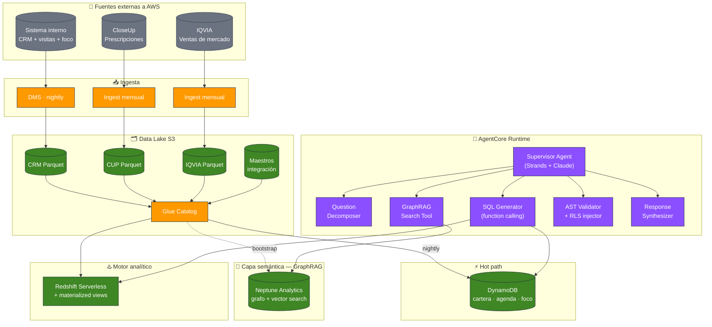

# De demo a MLP — PharmAssist para la industria farmacéutica

> Análisis de las decisiones necesarias para llevar la demo actual de PharmAssist a un producto productivo en un laboratorio real. El documento se apoya en patrones de referencia publicados por AWS (text-to-SQL con Amazon Bedrock, GraphRAG con Neptune Analytics, Redshift MCP Server) y deja explícitas las decisiones que dependen de mediciones pendientes contra datos reales del cliente.

## Índice

- [El caso de estudio](#el-caso-de-estudio)
- [Las 3 fuentes de datos de la industria pharma](#las-3-fuentes-de-datos-de-la-industria-pharma)
- [Cómo se cruzan hoy estas fuentes](#cómo-se-cruzan-hoy-estas-fuentes)
- [Las preguntas que generan valor real](#las-preguntas-que-generan-valor-real)
- [Por qué la demo actual requiere evolución](#por-qué-la-demo-actual-requiere-evolución)
- [Posicionamiento frente a Amazon Quick Suite](#posicionamiento-frente-a-amazon-quick-suite)
- [Patrón de referencia: text-to-SQL con Amazon Bedrock](#patrón-de-referencia-text-to-sql-con-amazon-bedrock)
- [Arquitectura propuesta](#arquitectura-propuesta)
- [Ingesta y almacenamiento](#ingesta-y-almacenamiento)
- [La capa semántica: GraphRAG con Neptune Analytics](#la-capa-semántica-graphrag-con-neptune-analytics)
- [Latencias esperadas y experiencia de usuario](#latencias-esperadas-y-experiencia-de-usuario)
- [Spike de validación antes de comprometer arquitectura](#spike-de-validación-antes-de-comprometer-arquitectura)
- [Plan de evolución por fases](#plan-de-evolución-por-fases)
- [Costos estimados](#costos-estimados)
- [Riesgos abiertos](#riesgos-abiertos)
- [Resumen](#resumen)
- [Referencias](#referencias)


---

## El caso de estudio

La demo actual de PharmAssist utiliza un atajo didáctico: tres CSVs sintéticos (CRM, visitas, ventas) cargados en DynamoDB, con un único APM (Peccy) y 12 médicos. Sirve para validar la experiencia de usuario, el stack de agentes con Strands, el modo voz con Nova Sonic y la integración con Amazon Bedrock AgentCore.

Un entorno productivo real cambia la ecuación en varias dimensiones simultáneamente. Este documento explora las decisiones que habría que tomar para llegar a ese escenario, apoyándose en patrones de referencia publicados por AWS y dejando explícitas las variables que dependen de mediciones contra datos reales del cliente.

### Perfil del caso

- **Industria**: laboratorio farmacéutico argentino de mediano o gran porte
- **Usuarios**: 200–500 APMs (Agentes de Propaganda Médica) distribuidos geográficamente
- **Escenario típico**: los APMs preparan su agenda desde notebooks, en horario laboral o nocturno. Los datos a día vencido (batch nocturno) son aceptables.
- **Fuentes de datos existentes**: 3 datasets externos a AWS, cada uno en su plataforma (típicamente SQL Server, Synapse, Databricks o similar)
- **Patrón de uso**: mixto. Consultas puntuales (quién, dónde, cuándo), preguntas analíticas (rankings, tendencias) y análisis más complejos que cruzan las 3 fuentes.

### Qué se quiere lograr

Un asistente conversacional que le permita al APM **hablar con sus datos** — no con un catálogo limitado de preguntas pre-cocinadas. El diferencial frente a un dashboard tradicional es justamente esa libertad: el APM pregunta lo que necesita en lenguaje natural y el agente arma la consulta sobre los datos reales.

Esto implica tres compromisos de diseño:

1. El agente debe **generar SQL dinámico** sobre los datasets reales, no elegir entre queries pre-definidas
2. La latencia debe ser **tolerable para una conversación** (objetivo: la mayoría de las preguntas en menos de 5 segundos end-to-end)
3. El costo operativo debe ser **predecible y escalar linealmente** con los usuarios


---

## Las 3 fuentes de datos de la industria pharma

En la industria farmacéutica argentina y latinoamericana los laboratorios trabajan con una combinación típica de **1 fuente interna + 2 fuentes externas estándar de la industria**. Cada una aporta un tipo distinto de información y los datos cobran pleno sentido cuando se cruzan.

### Fuente 1 — Sistema interno (CRM + gestión de visitas)

Es el sistema propio del laboratorio. Guarda lo que el laboratorio conoce y controla:

- **Cartera médica**: qué APM atiende a qué médicos
- **Agenda de visitas**: planificadas, realizadas, con tiempos y tipos
- **Muestras entregadas**: qué producto, qué cantidad, lote, fecha
- **Productos foco del ciclo actual**: qué se está empujando por línea/región
- **Estructura del producto**: familia, línea, categoría (foco/hiperfoco), ciclos, grillas
- **Perfil del médico**: datos personales, especialidad, matrícula

**Tamaño típico**: tablas pequeñas-medianas (miles a decenas de miles de filas). Schema normalizado con decenas de tablas. Cambios diarios.

### Fuente 2 — Prescripciones (CloseUp / CUP)

[CloseUp](https://www.closeupsolutions.com/) es un proveedor externo estándar en pharma latinoamericana. Comercializa datasets de **prescripciones médicas** capturadas en farmacias. Es la vía que tiene un laboratorio para conocer qué recetan los médicos, incluido qué productos de competidores recetan.

Contiene:

- Tabla de **prescripciones** (fact table grande: decenas a centenas de millones de filas históricas)
- Maestros de **médicos con identificador propio** (`CDGMED`), distinto del interno del laboratorio
- Maestros de **mercados** (agrupaciones de productos competidores en una misma categoría terapéutica)

**Tamaño típico**: fact table en el orden de GB a TB. Schema dimensional. Actualización mensual o quincenal.

### Fuente 3 — Ventas de mercado (IQVIA)

[IQVIA](https://www.iqvia.com/) es el proveedor global dominante de datos de mercado. Comercializa datasets de **ventas a farmacias y distribuidoras**, agregados por producto, droga, clase terapéutica, laboratorio, período y geografía.

Contiene:

- Fact table de **ventas valorizadas** con unidades, dosis, valor en ARS y USD
- Dimensiones estándar: droga, forma farmacéutica, presentación, laboratorio, clase terapéutica, período

**Tamaño típico**: fact table grande (cientos de millones de filas). Schema dimensional. Actualización mensual.


---

## Cómo se cruzan hoy estas fuentes

Este es uno de los puntos más subestimados de cualquier proyecto pharma: **las 3 fuentes no comparten identificadores de productos ni de médicos**. Cruzarlas no es un detalle técnico — es un proceso operativo que requiere trabajo humano continuo.

### El problema

- **Productos**: el laboratorio utiliza su SKU interno. CloseUp utiliza un código propio (`codigo_marca`). IQVIA utiliza EAN-11 o `idProducto`. Los tres sistemas fueron diseñados independientemente.
- **Médicos**: el CRM interno utiliza un ID propio. CloseUp utiliza `CDGMED`. IQVIA directamente **no tiene nivel médico** (sus datos agregan a nivel producto × geografía × período).
- **Geografías**: cada fuente puede utilizar su propia segmentación de regiones, ciudades o zonas.

### Los tres mecanismos que se utilizan en la práctica

#### 1. Tablas maestras de integración mantenidas manualmente (dominante)

Cada laboratorio mantiene tablas de mapeo con un equipo interno:

- **`maestro_integrador_producto`**: mapea SKU interno ↔ código CUP ↔ código IQVIA. Se actualiza cuando:
  - El laboratorio lanza un producto nuevo
  - CloseUp o IQVIA agregan una presentación
  - Cambia un EAN

- **`maestro_medicos`**: mapea ID interno del CRM ↔ `CDGMED` de CloseUp. Es el más complejo:
  - CloseUp tiene médicos que el laboratorio no conoce (no son cartera)
  - El laboratorio tiene médicos que CloseUp no captura (baja prescripción)
  - La intersección se construye con matching heurístico: matrícula nacional cuando existe, o (nombre + apellido + especialidad + ciudad), con validación humana.

**La realidad operativa**: estos maestros tienen **cobertura típica del 70-85%**. Un 15-30% de productos y médicos puede quedar sin mapeo — existen en una fuente pero no están vinculados a las otras.

#### 2. Matching determinístico por EAN / GTIN (productos)

Cuando el código de barras existe y coincide entre las fuentes, el cruce es directo. Funciona bien para productos propios con EAN consistente. Presenta dificultades cuando:

- Un producto tiene múltiples presentaciones con distintos EANs
- CloseUp agrega a nivel "marca" y IQVIA a nivel "presentación"
- Productos de competidores: puede faltar EAN en el maestro interno

#### 3. Matching fuzzy + humano (médicos sin matrícula)

La matrícula nacional es el ID ideal, aunque:

- CloseUp la tiene en aproximadamente 60-70% de los registros
- El CRM interno a veces registra matrícula provincial, no nacional
- Cuando no hay MN, el matching se realiza por (nombre normalizado + apellido + especialidad + provincia), con revisión manual. Tasa de falsos positivos típica: 3-8%.

### Qué implica esto para el agente y el proyecto

- **Las tablas maestras son un recurso del cliente, no algo que se construye desde cero en el proyecto**. Al inicio corresponde confirmar:
  - Si el cliente ya las tiene mantenidas
  - Cuál es la cobertura real (% de productos y médicos mapeados)
  - Con qué frecuencia se actualizan
  - Quién es el dueño operativo de mantenerlas
- **Si el cliente no tiene maestros establecidos**, existe una fase previa de construcción (semanas de trabajo con su equipo de datos). Esto impacta el timeline del proyecto y conviene dimensionarlo desde el inicio.
- **El agente debe ser transparente respecto a los huecos**. Cuando responde "hay 47 médicos con prescripciones en el mercado X", conviene que también pueda comunicar "de los 62 médicos de la cartera, 15 no están mapeados en la tabla integradora, por lo que no se incluyeron en el análisis".
- **La capa semántica debe documentar las rutas de cruce explícitamente** para que el LLM no infiera joins sobre columnas que solo parecen equivalentes. Este es un riesgo real: los LLMs tienden a asumir que `doctor_id` y `CDGMED` representan la misma entidad si los nombres sugieren similitud.


---

## Las preguntas que generan valor real

Los APMs hacen preguntas de **3 niveles de complejidad distintos**. Diseñar bien el sistema comienza por entender esa diferencia.

### Preguntas operativas (un dashboard las resuelve)

Preguntas puntuales, con una sola fuente de datos. Hoy están en tableros estáticos que el APM consulta antes de salir. No son el diferencial del agente, pero **es importante que respondan rápido** porque son las más frecuentes.

Ejemplos:

- "¿Cuáles son mis objetivos de visita este mes?"
- "¿A qué médicos todavía no visité en el ciclo actual?"
- "¿Cuándo fue la última visita al Dr. X?"
- "¿Qué promocioné en la última visita al Dr. X?"

**Fuentes involucradas**: solo el CRM interno del laboratorio.
**Patrón**: lookup por ID o filtro simple sobre cartera.
**Frecuencia**: múltiples veces por día por APM.

### Preguntas de rankings y agregaciones

Preguntas donde el APM quiere confirmar una intuición con datos, o ver un ranking ordenado. Agregan agregaciones sobre volúmenes grandes.

Ejemplos:

- "¿Cuáles son los médicos que visito con más o menos frecuencia?"
- "¿Cuáles son los 5 productos que más prescribe el Dr. X?"
- "¿Cuáles son los 5 productos de mi laboratorio que más prescribe el Dr. X?"

**Fuentes involucradas**: CRM interno y/o prescripciones (CloseUp).
**Patrón**: agregación con group by + order + limit, acotada a un médico o APM.
**Frecuencia**: varias veces por semana.

### Preguntas analíticas cross-source

Esta es la categoría donde el agente **justifica su existencia**. Preguntas que cruzan las 3 fuentes, requieren combinar prescripciones + cartera + productos foco + ventas de mercado, y devuelven insights accionables que hoy ningún dashboard puede dar.

Ejemplos:

- "Recomendame a qué médicos visitar según sus prescripciones y mis productos foco"
- "¿Qué médicos vienen creciendo en prescripción de mis productos foco y los estoy visitando poco?"
- "¿A qué médicos debería visitar primero para crecer con el producto X?"
- "¿En qué productos de mi laboratorio tengo Evolución Trimestral negativa, tomando todos los mercados que trabajo?"
- "De los medicamentos que le promociono al Dr. X, ¿cuál es el que más prescribe?"

**Fuentes involucradas**: las 3 en simultáneo, con joins multi-tabla vía maestros de integración.
**Patrón**: queries con varias agregaciones, ventanas temporales (YoY, evolución trimestral, MAT), filtros por cartera del APM.
**Frecuencia**: 1-3 veces por día por APM. Son preguntas "pensadas" que el APM realiza al planificar su semana o preparar una visita estratégica.

### La tensión que define todo el diseño

Las preguntas operativas son las más frecuentes pero las menos diferenciadoras. Las cross-source son las menos frecuentes pero las que justifican el producto.

**El sistema debe servir bien a ambas**, sin que las operativas se vuelvan lentas por sobre-ingeniería ni las cross-source se vuelvan inaccesibles por sub-ingeniería.


---

## Por qué la demo actual requiere evolución

La demo utiliza DynamoDB como única fuente. Funciona muy bien para 12 médicos sintéticos, y será necesario extenderla para el escenario productivo por cuatro razones concretas:

### 1. DynamoDB no está diseñado para joins analíticos

Todas las preguntas cross-source requieren cruzar 2 o 3 fuentes. DynamoDB, por diseño, no soporta joins. Las alternativas para resolverlo solo con DynamoDB presentan trade-offs:

- **Denormalizar en una sola tabla**: el tamaño se incrementa significativamente, ya que habría que replicar prescripciones por cada médico × producto foco × mercado
- **Hacer múltiples queries + join en Lambda**: funciona para volúmenes chicos; su escalabilidad se degrada con millones de prescripciones
- **Limitar las preguntas a las pre-diseñadas**: reduce el diferencial del agente

La solución natural es incorporar un motor SQL por encima, complementando a DynamoDB.

### 2. El histórico tiene un fit mejor en almacenamiento analítico

Una fact table de prescripciones de 100 millones de filas en DynamoDB tiene un costo considerablemente mayor que la misma en S3 + Parquet. DynamoDB está optimizado para hot storage — excelente para queries puntuales de baja latencia. Los datos históricos grandes tienen un fit natural con almacenamiento analítico columnar.

### 3. Las tres fuentes cambian con frecuencias distintas

- CRM interno cambia varias veces por día
- CloseUp actualiza mensual o quincenalmente
- IQVIA actualiza mensualmente

Un único pipeline nocturno que refresca todo no aprovecha estas diferencias. Cada fuente se beneficia de su propia cadencia.

### 4. "Hablar con los datos" se potencia con SQL dinámico

El diferencial del agente es que el APM pregunta en lenguaje natural y el agente arma la consulta. Esto se potencia con un motor donde el LLM puede generar SQL libremente sobre un schema conocido. DynamoDB se destaca en otros escenarios, principalmente como hot path complementario.


---

## Posicionamiento frente a Amazon Quick Suite

Antes de justificar por qué un text-to-SQL custom tiene sentido, corresponde posicionar lo que AWS ya ofrece en el espacio de self-service BI.

[Amazon Quick Suite](https://aws.amazon.com/quicksuite/) — anteriormente Amazon QuickSight — es la suite de inteligencia de negocios con capacidades de IA generativa de AWS. Incluye **Quick Sight** (el sucesor directo del producto de BI), **Quick Research**, **Quick Flows**, **Quick Automate** y **Quick Index**, todos accesibles a través de **Quick chat** como interfaz conversacional unificada.

Quick Sight con natural language querying resuelve **muy bien** una clase amplia de necesidades analíticas:

- Dashboards con filtros conversacionales
- Preguntas sobre datasets curados (tablas con definiciones claras, métricas pre-configuradas)
- Generación de visualizaciones a partir de prompts
- Executive summaries automáticos, data stories, generative Q&A

AWS publicó un blog que sistematiza [cinco patrones distintos para retrieval de datos estructurados con IA generativa](https://aws.amazon.com/blogs/machine-learning/choosing-the-right-approach-for-generative-ai-powered-structured-data-retrieval/), y Quick Suite cubre los primeros tres.

### Cuándo Quick Suite alcanza y cuándo no

**Quick Suite alcanza cuando**:
- Los datos viven en un warehouse único con schema limpio
- Las métricas del negocio están bien definidas y son estables
- Las preguntas caen dentro de semantic layers curados o dashboards modelados
- Los usuarios trabajan principalmente con datos ya preparados

**Un text-to-SQL custom se justifica cuando** (lo que sucede en pharma):
- Los usuarios necesitan cruzar **múltiples fuentes con schemas que no se diseñaron coordinadamente** (CRM + CloseUp + IQVIA)
- Existe **lógica de negocio específica** que no cabe en un semantic layer genérico (productos foco por ciclo, mercados por línea terapéutica, cadencias de visita, cobertura imperfecta de maestros)
- Las preguntas incluyen **joins ad-hoc sobre tablas fuera de semantic models pre-configurados**
- El agente necesita **explicar los huecos de datos** y razonar sobre tablas maestras de integración mantenidas manualmente

Este posicionamiento es importante porque **no queremos competir con Quick Suite** — queremos complementarlo. Un laboratorio puede usar Quick Sight para sus dashboards de management y PharmAssist para el APM en campo. Son productos para usuarios, contextos y profundidades distintas.


---

## Patrón de referencia: text-to-SQL con Amazon Bedrock

AWS publicó en 2025 un [blog oficial que detalla un patrón probado de text-to-SQL con Amazon Bedrock](https://aws.amazon.com/blogs/machine-learning/text-to-sql-solution-powered-by-amazon-bedrock/), desplegado a escala por equipos internos. La arquitectura que propone para PharmAssist se apoya fuertemente en ese patrón, con adaptaciones al dominio farmacéutico.

El patrón de referencia establece cinco etapas operativas:

### Etapa 1 — Análisis y descomposición de la pregunta

Cuando llega una pregunta, un procesador la clasifica:

- **Preguntas atómicas** (factuales, de una sola métrica) van directamente al pipeline de data retrieval
- **Preguntas compuestas o multi-parte** se descomponen en subpreguntas independientes que pueden procesarse **en paralelo por equipos de agentes separados**

Esta descomposición es la que permite manejar preguntas complejas (que cruzan dominios, períodos, dimensiones) sin pagar latencia secuencial.

### Etapa 2 — Recuperación de contexto de negocio vía GraphRAG

Acá es donde el sistema resuelve el "context barrier" — el problema de traducir terminología de negocio a tablas y columnas correctas. Es el diferencial más importante frente a un text-to-SQL ingenuo.

El contexto de negocio vive en un **knowledge graph** que captura:

- Ontología de tablas (qué tabla es qué, qué representa cada columna)
- Relaciones entre entidades de negocio (médico, producto, mercado, ciclo, foco)
- Definiciones de métricas (EVO trimestral, MAT, cobertura, frecuencia vs cadencia)
- Mapeos de terminología (los APMs dicen "mis mercados" y el LLM debe entender qué tablas filtrar)
- Reglas de negocio (qué significa "médico de cartera", qué define "foco")

Este grafo se enriquece con conocimiento de los dueños de cada tabla y SMEs de negocio.

Cuando llega una pregunta, el sistema ejecuta una **búsqueda GraphRAG en tres fases**:

1. **Vector search**: encuentra columnas, valores y descripciones semánticamente relevantes usando embeddings
2. **Graph traversal**: sigue las relaciones del grafo desde los matches encontrados hacia sus tablas padre, construyendo un mapa de qué datos son relevantes y cómo se conectan
3. **Relevance scoring**: rankea y estructura el contexto recuperado de forma que el generador de SQL reciba precisamente lo que necesita

### Etapa 3 — Generación estructurada y validación del SQL

El LLM genera SQL como **structured output** vía function calling, no como texto que hay que parsear. Esto elimina regex frágiles y mejora significativamente la confiabilidad.

Las queries generadas pasan por **validadores determinísticos a nivel AST (Abstract Syntax Tree)**. Los validadores identifican queries que son sintácticamente correctas pero semánticamente riesgosas:

- Escaneos sin filtros acotados
- Filtros faltantes (ej. sin filtro por `apm_id` donde corresponde)
- Lógica de agregación incorrecta
- Joins sobre rutas no permitidas

Cuando un validador encuentra un problema, devuelve feedback detallado. El agente itera automáticamente hasta producir una query válida o agotar un límite configurable de reintentos. El blog oficial reporta que esta capa evita efectivamente errores serios en las queries generadas y la posiciona como "non-negotiable safety mechanism".

### Etapa 4 — Test-time parallel compute (opcional)

Para preguntas ambiguas o complejas, el sistema puede enviar la misma pregunta a **múltiples agentes en paralelo** y sintetizar los resultados vía majority voting. Mejora precisión a cambio de más tokens, y es particularmente valioso cuando hay ambigüedad en la interpretación.

No es necesario para el MLP inicial, pero es una optimización disponible.

### Etapa 5 — Síntesis de respuesta

Los resultados crudos (números, dataframes, logs de ejecución) se sintetizan en una narrativa de lenguaje natural. El usuario recibe el insight **y** puede inspeccionar el SQL generado y los datos subyacentes en cualquier momento, construyendo trust.

### Latencias reportadas

El blog reporta que con estas optimizaciones, **queries simples de SQL se generan típicamente en 3-5 segundos** end-to-end. Los tiempos reales varían con performance del warehouse, complejidad de la query, elección del modelo y tamaño del knowledge graph.

Este número es una buena referencia para lo que podemos esperar en el MLP, pero corresponde medirlo contra los datos reales del cliente durante el spike.


---

## Arquitectura propuesta

La arquitectura sigue el patrón del blog oficial de Bedrock text-to-SQL, adaptado al dominio pharma y a nuestro stack Strands + AgentCore.



### Piezas y responsabilidades

| Componente | Rol | Referencia |
|---|---|---|
| **AWS DMS / ingest jobs** | Replica cada fuente a S3 con su cadencia | [AWS DMS docs](https://docs.aws.amazon.com/dms/) |
| **S3 + Parquet + Glue Catalog** | Fuente única de verdad histórica | [AWS Glue Data Catalog](https://docs.aws.amazon.com/glue/latest/dg/components-overview.html) |
| **DynamoDB** | Vista hot de cartera, agenda, foco, últimas visitas | Ya en uso en la demo |
| **Neptune Analytics** | Grafo semántico con vector search integrado (GraphRAG) | [Neptune Analytics](https://docs.aws.amazon.com/neptune-analytics/latest/userguide/what-is-neptune-analytics.html) |
| **Redshift Serverless** | Motor SQL para queries analíticas y cross-source | [Redshift Serverless](https://docs.aws.amazon.com/redshift/latest/mgmt/serverless-whatis.html) |
| **Materialized views en Redshift** | Agregaciones base pre-computadas (EVO trimestral, rankings) | Aceleran queries frecuentes sin limitar el SQL dinámico |
| **Amazon Bedrock AgentCore Runtime** | Hosting del agente Strands con orquestación de flujo | [AgentCore Runtime](https://docs.aws.amazon.com/bedrock-agentcore/latest/devguide/agents-tools-runtime.html) |
| **Strands Agents SDK** | Framework del agente con herramientas MCP | [Strands](https://strandsagents.com/) |
| **Amazon Bedrock (Claude Opus 4.6)** | LLM para thinking, function calling, síntesis | [Bedrock Models](https://docs.aws.amazon.com/bedrock/latest/userguide/models-supported.html) |

### Flujo de una pregunta

1. El APM escribe/habla en el frontend. El prompt llega al **supervisor agent** hosteado en AgentCore Runtime.
2. El **question decomposer** clasifica la pregunta como atómica o compuesta. Si es compuesta, genera subpreguntas independientes.
3. Para cada subpregunta, el **GraphRAG Search Tool** consulta Neptune Analytics: vector search + graph traversal + relevance scoring. Retorna el contexto de negocio (tablas, columnas, rutas de join, reglas) relevante.
4. El **SQL generator** produce SQL estructurado vía function calling, usando el contexto recuperado como base.
5. El **AST validator** verifica la query y **RLS injector** agrega filtros de seguridad por `apm_id`. Si algo falla, retorna al paso 4 con feedback.
6. La query se ejecuta contra **Redshift Serverless** (o **DynamoDB** si es hot path).
7. El **response synthesizer** convierte los resultados crudos en narrativa de lenguaje natural, manteniendo transparencia del SQL y los datos.
8. La respuesta se streamea al frontend.

### Por qué AgentCore Runtime

Amazon Bedrock AgentCore Runtime es el patrón oficial AWS para hosting de agentes. Provee:

- **Serverless hosting** framework-agnostic (Strands, LangGraph, CrewAI, custom)
- **Session isolation** — separación total entre sesiones de usuario
- **Embedded identity management** — integración con AWS IAM y proveedores corporativos
- **Timeouts extendidos** — hasta 15 minutos por request, con soporte async para tareas más largas
- **Bi-directional streaming con WebSocket nativo** — usado para el modo voz con Nova Sonic
- **Observabilidad integrada** — traces y métricas a CloudWatch
- **Pricing por consumo activo** — no se paga por I/O wait ni idle

Existe un [blog oficial](https://aws.amazon.com/cn/blogs/china/implement-agentic-analytics-based-on-redshift-mcp-server-sdk-runtime/) que documenta exactamente el patrón Strands + AgentCore Runtime + Redshift MCP Server para agentic analytics, que es el escenario de PharmAssist.

### La pieza delicada: el SQL generado por el LLM

Un LLM generando SQL sobre un warehouse real requiere controles específicos. El patrón oficial los aborda:

1. **Function calling** para estructura — el SQL se genera como structured output, no texto
2. **AST-level validation** antes de ejecutar — detecta problemas semánticos, no solo sintácticos
3. **Retry loop automático** — si el validator encuentra un problema, el agente itera
4. **Row-level security inyectado** — filtros por `apm_id` se agregan automáticamente post-generación
5. **Query limits** — timeouts, máximo de bytes escaneados, LIMIT máximo en resultados
6. **Logging completo** — cada SQL generado queda auditado para mejora continua

Estos controles no son opcionales. Son el "safety-critical layer" que hace que el agente sea confiable en producción.


---

## Ingesta y almacenamiento

Cada fuente se replica a AWS con su propia cadencia. No hay un único pipeline universal.

### Sistema interno (CRM del laboratorio)

- **Origen**: base corporativa (SQL Server, Oracle, PostgreSQL). Schema normalizado.
- **Cadencia**: batch nocturno
- **Herramienta**: AWS DMS en modo Full Load o CDC
- **Destino**: S3 Parquet particionado por `fecha_carga` (snapshot diario)
- **Nota**: si el CRM ya tiene vistas maestras que denormalizan parte del schema, replicarlas directamente simplifica el ETL.

### Prescripciones (CloseUp)

- **Origen**: dataset mensual o quincenal, entregado como archivos (Parquet/CSV) a un FTP/S3 del cliente, o como tablas en un warehouse compartido
- **Cadencia**: mensual o quincenal
- **Herramienta**: Lambda de ingesta que detecta archivos nuevos, o DMS Full Load mensual si es warehouse
- **Destino**: S3 Parquet particionado por `anio_mes`
- **Particularidad**: fact table grande. El ETL debe ser idempotente — si la carga se ejecuta dos veces, no debe duplicar prescripciones.

### Ventas de mercado (IQVIA)

- **Origen**: IQVIA entrega el dataset mensualmente, típicamente por SFTP o su portal
- **Cadencia**: mensual
- **Herramienta**: cliente SFTP + Lambda de ingest que convierte a Parquet
- **Destino**: S3 Parquet particionado por `anio_mes`

### Maestros de integración

Las tablas maestras (`maestro_integrador_producto`, `maestro_medicos`) son pequeñas pero **críticas**. Se cargan cuando cambian (baja frecuencia). Viven en S3 como tablas chicas, consultables junto con las demás.

**Decisión clave a definir con el cliente al inicio**: ¿quién mantiene estos maestros? ¿Cuál es su cobertura actual? ¿Cómo se sincroniza el mantenimiento con las actualizaciones de CloseUp e IQVIA?

### Estructura del bucket

```
s3://pharmassist-lake/
├── crm/                      ← cadencia diaria
│   ├── cartera_medica/
│   ├── agenda/
│   ├── familia_producto/
│   ├── detalle_promocion_producto/
│   └── ...
├── cup/                      ← cadencia mensual
│   ├── medico/
│   ├── prescricao/           ← fact table grande
│   ├── mercados/
│   └── marca/
├── iqvia/                    ← cadencia mensual
│   ├── dim_droga/
│   ├── dim_presentacion/
│   ├── fact_mercado_valor/   ← fact table grande
│   └── ...
└── maestros/                 ← cadencia baja
    ├── maestro_integrador_producto/
    ├── maestro_medicos/
    └── familia_interno_a_marca_cup/
```

### Parquet vs Iceberg

**Parquet simple** alcanza para el MLP productivo inicial. Es más económico, más simple, y todas las herramientas lo leen.

**Iceberg** se justifica cuando:

- Hay múltiples writers concurrentes sobre las mismas tablas
- Se requiere time travel frecuente para auditoría
- Las fact tables crecen al punto que la compactación automática aporta valor

**Decisión pragmática**: iniciar con Parquet. Migrar a Iceberg solo si aparece una necesidad concreta.

### Particionado

Cada fact table se particiona por columnas de alta selectividad:

| Tabla | Particionado |
|---|---|
| `cup/prescricao` | `anio, mes, cdgreg_pmix` (región del APM) |
| `iqvia/fact_mercado_valor` | `idperiodo` (año-mes) |
| `crm/agenda` | `fecha_visita` |

Con partitioning + formato columnar Parquet, una query típica escanea decenas de MB en lugar de GB.

---

## La capa semántica: GraphRAG con Neptune Analytics

Esta es la pieza más diferenciadora del diseño y la que más trabajo requiere. El LLM por sí solo no conoce qué es un "producto foco", cómo se calcula "Evolución Trimestral", ni que `CDGMED` se cruza con `id_doctor` vía `maestro_medicos`. La capa semántica es el artefacto que le aporta ese dominio.

### Por qué Neptune Analytics y no un YAML

Un acercamiento inicial tentador es mantener la capa semántica como un YAML inyectado al system prompt. Funciona para dominios simples. Para pharma con 3 fuentes cruzadas, maestros imperfectos y ~15-20 entidades de negocio con relaciones complejas, un YAML se vuelve frágil rápido.

[Amazon Neptune Analytics](https://docs.aws.amazon.com/neptune-analytics/latest/userguide/what-is-neptune-analytics.html) es el motor gráfico in-memory de AWS diseñado para workloads analíticos sobre grafos. Características relevantes para el caso:

- **Vector search nativo integrado con el grafo** — consultas que combinan similarity search sobre embeddings con graph traversal en la misma query
- **Soporte oficial para GraphRAG** — AWS publicó un [GraphRAG Toolkit open-source](https://aws.amazon.com/about-aws/whats-new/2025/01/amazon-neptune-open-source-graphrag-toolkit/) que construye automáticamente el grafo desde datos no estructurados
- **Integración directa con Bedrock Knowledge Bases** como vector store para GraphRAG
- **openCypher** como lenguaje de query
- **In-memory**: toda la data del grafo vive en memoria, latencias bajas para traversals

### Qué vive en el grafo

**Nodos (entidades)**:

- `Medico` (con `id_interno`, `CDGMED`, embeddings de nombre + especialidad)
- `Producto` (con `SKU_interno`, `codigo_CUP`, `EAN`, `idProducto_IQVIA`, embeddings de nombre + composición)
- `Mercado` (con `CDG_MERCADO`, embeddings de descripción)
- `APM` (con `apm_id`, líneas asignadas)
- `Metrica` (con nombre, aliases, definición, SQL template, embeddings)
- `Tabla` (con nombre físico, schema, descripción)
- `Columna` (con nombre, tipo, descripción, embeddings)

**Aristas (relaciones)**:

- `Medico — [MAPEADO_CON, cobertura: 0.78] — Medico_CUP`
- `Producto — [MAPEADO_CON, cobertura: 0.82] — Producto_CUP`
- `APM — [ATIENDE] — Medico`
- `Producto — [ES_FOCO_EN] — Ciclo`
- `Mercado — [AGRUPA] — Producto_CUP`
- `Metrica — [CALCULADA_SOBRE] — Tabla`
- `Tabla — [JOIN_VIA] — Tabla` (con ruta de join explícita)

Cada nodo importante tiene **embeddings** asociados, de forma que vector search pueda matchear "productos para diabetes" con nodos de mercado terapéutico aunque el término exacto no aparezca.

### Qué sucede cuando llega una pregunta

Ejemplo: *"¿Cuáles son los 5 productos que más prescribe el Dr. Peralta en mis mercados?"*

1. **Vector search**: encuentra nodos relevantes — `Medico: Peralta`, `Metrica: top_prescripciones`, `Entidad: mercado`
2. **Graph traversal**: desde el APM actual, sigue `[ATIENDE] -> Medico -> [MAPEADO_CON] -> Medico_CUP` para obtener el `CDGMED` del Dr. Peralta. Desde el APM, sigue `[TRABAJA_MERCADOS] -> Mercado -> [AGRUPA] -> Producto_CUP` para obtener los mercados del APM.
3. **Relevance scoring**: estructura el contexto — tablas involucradas (`cup.prescricao`, `cup.mercados_productos`), columnas relevantes, rutas de join, y la regla de negocio "top prescripciones = SUM(cantidad) con GROUP BY producto"
4. El contexto se pasa al **SQL generator** que produce la query acotada

### Dimensionamiento y costo de Neptune Analytics

Neptune Analytics se mide en **m-NCU (memory-optimized Neptune Capacity Units)**. El precio en us-east-1 es **aproximadamente $0.030 por m-NCU-hora** (validado contra AWS Pricing API en abril 2026). La capacidad mínima es 128 m-NCU.

**Para un grafo semántico pharma del tamaño esperado** (~10k-50k nodos, ~50k-200k relaciones, embeddings de 1024 dimensiones):

- 128 m-NCU probablemente alcanza para el MLP inicial
- Costo siempre-on: **~$2,000-2,100/mes**
- Se puede pausar al 10% del precio (~$200/mes cuando pausado), útil para staging
- En producción, típicamente se mantiene siempre-on para evitar latencia de arranque

Este es el componente de data engineering más caro del stack. Tiene que justificarse frente al cliente, y **el spike debe dimensionar el grafo real antes de comprometer este número**.

### Alternativa económica si el costo no justifica

Si durante el spike el grafo resulta más chico de lo esperado, o si el cliente tiene restricción de costo, la alternativa es:

- **OpenSearch Serverless** como vector store (~$700-1,200/mes)
- **YAML estructurado** con las relaciones, inyectado al system prompt
- **Bedrock Knowledge Bases** orquestando embeddings y retrieval

Esto reduce el costo significativamente, al precio de perder traversals multi-hop. El spike debe indicar si pharma realmente los necesita o si un vector store plano alcanza.

### Construcción y mantenimiento del grafo

El grafo **no se construye una vez y se olvida**. Requiere:

- **Ingesta inicial**: bulk load desde S3 con las entidades y relaciones conocidas (~1 día de trabajo con el GraphRAG Toolkit de AWS)
- **Enriquecimiento manual**: los table owners y SMEs aportan descripciones de métricas, reglas de negocio, definiciones de dominio
- **Refresh periódico**: cuando cambian los maestros, los ciclos de foco, o aparecen productos nuevos
- **Validación continua**: correr el test suite de preguntas de referencia después de cada cambio

Este es trabajo de **DataOps continuo** y hay que dimensionarlo en el proyecto.

### Validación de la capa semántica

Un error común es asumir que el LLM "comprende" el grafo y alcanza. Corresponde validar con un test suite.

Se arma un **conjunto de 30-50 preguntas de referencia** que cubren los 3 niveles de complejidad (operativas, rankings, cross-source). Para cada una:

1. Se ejecuta el agente con el grafo cargado
2. Se captura el SQL que genera
3. Se valida manualmente que el SQL utiliza los joins correctos, las métricas correctas, y respeta las reglas de negocio
4. Si no cumple, se ajusta el grafo (agregar aristas explícitas, refinar descripciones, agregar ejemplos)

Este ciclo se repite hasta que el 90%+ de las preguntas de referencia generen SQL correcto. Solo entonces el grafo queda listo para producción.

---

## Latencias esperadas y experiencia de usuario

El objetivo es que el APM perciba una conversación, no un proceso batch. El blog oficial de text-to-SQL de AWS reporta que **queries simples se resuelven típicamente en 3-5 segundos end-to-end** con la arquitectura completa. Ese es un buen punto de referencia para el MLP.

### Qué latencia tolera una conversación

La percepción de "rápido" vs "lento" en un chat con agente no es lineal con la latencia:

- **Menos de 500 ms de datos**: se percibe instantáneo. Claude apenas terminó el prefacio cuando el dato está listo.
- **500 ms – 2 s**: aceptable. El streaming de Claude cubre la espera naturalmente.
- **2 – 4 s**: límite superior tolerable. Claude acompaña con un prefacio más extenso ("dame un segundo, cruzo las prescripciones con tu cartera..."). Se percibe espera pero sin fricción.
- **4 – 8 s**: la percepción empieza a degradarse. El usuario empieza a mirar el spinner.
- **Más de 8 s**: la experiencia conversacional se degrada notoriamente.

### Desglose del total end-to-end

El tiempo total que el APM percibe se compone de:

```
Tiempo total = Claude (thinking + tool invocation)
             + GraphRAG retrieval
             + SQL generation + validation
             + SQL execution
             + Claude (streaming response)
```

Con la arquitectura del patrón oficial:

- **Claude thinking + tool calls**: ~800 ms - 1.5 s
- **GraphRAG retrieval (Neptune Analytics)**: ~100-400 ms
- **SQL generation + validation**: ~400-800 ms (con function calling y AST validator)
- **SQL execution (Redshift Serverless)**: ~200 ms - 2 s según complejidad y cache hit
- **Claude streaming response**: ~1-2 s
- **Total**: **~2.5 - 6.5 segundos** para la mayoría de los casos

### Cómo se posiciona cada tipo de pregunta

**Preguntas operativas (DynamoDB hot path)**: 10-50 ms de datos → total ~2-3 s end-to-end.

**Preguntas de rankings (Redshift con materialized views)**:
- Cache hit: 20-100 ms → total ~2.5-3.5 s
- Cache miss: 400-900 ms → total ~3-4 s

**Preguntas cross-source (Redshift con joins multi-tabla)**:
- Con MV que cubre la agregación: 500 ms - 1.5 s → total ~3.5-5 s
- Sin MV, ad-hoc: 1-3 s P50, 3-4 s P95 → total ~4-6 s

**Proyección**: 80-90% de las preguntas deberían caer en rango aceptable (menos de 5 s). El 10-20% restante requiere mitigaciones (materialized views adicionales, streaming narrativo más rico).

### Qué hacer si P95 se degrada

Si el spike muestra P95 elevado en algunas preguntas cross-source complejas, existen tres mitigaciones:

1. **Materialized views adicionales** para las agregaciones costosas. No limita al LLM, solo acelera.
2. **Streaming narrativo más rico** — Claude cubre la latencia con explicación de qué está procesando
3. **Question decomposition + parallel execution** — cuando una pregunta compleja se descompone en subpreguntas independientes y se ejecutan en paralelo, la latencia total es el máximo de los tiempos individuales, no la suma

El patrón oficial de AWS no recurre a experiencias asincrónicas con notificación diferida — la decomposition + paralelismo + streaming sincronizado cubren el rango de latencias esperables para pharma.

---

## Spike de validación antes de comprometer arquitectura

Antes de comprometer la arquitectura al cliente, se realiza un spike de 5-7 días con objetivos medibles. El spike es lo que permite reemplazar estimaciones por mediciones y justificar cada pieza del stack frente al cliente.

### Objetivos del spike

1. **Medir P50 y P95 reales** de queries canónicas contra Redshift Serverless con datos reales del cliente
2. **Dimensionar Neptune Analytics** con el grafo real (cuántos m-NCU hacen falta)
3. **Validar cobertura de los maestros de integración** (qué porcentaje de la cartera queda con huecos)
4. **Estimar costos operativos reales** según volumen proyectado
5. **Validar que el patrón text-to-SQL funciona** con 15-20 preguntas representativas del cliente

### Plan del spike

#### Día 1-2 — Ingesta mínima

- Cargar 1 mes de prescripciones CloseUp reales a S3 Parquet
- Cargar 1 mes de ventas IQVIA reales
- Cargar snapshot del CRM interno
- Cargar maestros de integración
- Todo particionado como lo haría producción

#### Día 3 — Setup de motores

- Crear Redshift Serverless con configuración base (8 RPU)
- Configurar Glue Data Catalog compartido
- Materializar 3-4 views para agregaciones base

#### Día 4 — Grafo semántico mínimo

- Crear Neptune Analytics con capacidad mínima (128 m-NCU)
- Cargar entidades principales (Medico, Producto, Mercado, APM, Metrica)
- Cargar aristas de cruce (mapeos de maestros, relaciones de foco)
- Generar embeddings con Bedrock y cargarlos al vector index

#### Día 5-6 — Benchmark

Seleccionar **15-20 queries representativas** que cubran los 3 niveles:

- 5 operativas (1 tabla, filtro simple)
- 5 de rankings (1-2 tablas, agregación)
- 5-10 cross-source (3+ tablas con joins vía maestros)

Para cada query, ejecutar **10 veces** y medir:

- Tiempo de ejecución end-to-end (agente + GraphRAG + SQL + síntesis)
- Bytes escaneados en Redshift
- RPU-segundos utilizados
- Hit rate del grafo en GraphRAG
- P50 y P95

Adicionalmente medir:

- **Cobertura del maestro de productos**: % de productos del laboratorio con mapeo CUP e IQVIA
- **Cobertura del maestro de médicos**: % de médicos de cartera con `CDGMED`
- **Tamaño del grafo cargado**: nodos, aristas, memoria ocupada en m-NCU

#### Día 7 — Análisis y decisión

- Consolidar mediciones en un reporte
- Proyectar costos mensuales según patrón de uso esperado
- Validar sizing de Neptune Analytics (128 m-NCU alcanza o hay que escalar)
- Identificar queries que se benefician de tratamiento especial (MVs, rediseño de grafo)

### Criterios de decisión

**La arquitectura propuesta se confirma si**:

- P50 de queries cross-source está consistentemente por debajo de 2 s
- P95 de queries cross-source está por debajo de 4 s en el 90% de los casos
- El grafo semántico cabe en 128-256 m-NCU
- La cobertura de los maestros supera el 70%
- 90%+ de las preguntas de referencia generan SQL correcto

**Se considera la alternativa económica si**:

- El grafo resulta más chico de lo esperado y OpenSearch Serverless + YAML alcanza
- El cliente tiene restricción de costo fuerte que no justifica Neptune Analytics
- La complejidad de traversals multi-hop no aparece en las preguntas reales

**Se ajusta el diseño si**:

- La cobertura de los maestros es inferior al 50% (sugiere una fase previa de mejora de maestros)
- Las fact tables son órdenes de magnitud más grandes de lo esperado
- Aparecen patrones de preguntas que el diseño no contempla


---

## Plan de evolución por fases

Cada fase es **deployable y operable de forma independiente**, entrega valor medible, y permite validar supuestos antes de continuar.

### Fase 0 — Demo actual (ya implementada)

- CSVs sintéticos → DynamoDB → Agente Strands
- 1 APM (Peccy), 12 médicos
- Stack AgentCore + modo voz Nova Sonic + frontend React
- **Valor**: mostrar capacidad técnica, alinear UX con el cliente

### Fase 1 — Spike de validación (1 semana)

- Ingesta mínima de datos reales
- Benchmark Redshift + Neptune Analytics contra queries representativas
- Medición de cobertura de maestros
- **Entregable**: reporte con decisión de arquitectura fundamentada en datos
- **Valor**: evita comprometer una arquitectura antes de tener evidencia

### Fase 2 — Ingesta productiva + hot path en DynamoDB (2-3 semanas)

- Configurar DMS para el CRM interno, con cadencia nocturna
- Configurar ingesta de CloseUp e IQVIA con cadencias mensuales
- Glue Data Catalog con todas las tablas
- ETL nocturno que mantiene DynamoDB con cartera + agenda + productos foco + últimas visitas
- Migrar los tools del hot path del agente a datos reales
- **Valor**: el agente responde preguntas operativas con datos productivos

### Fase 3 — Capa semántica con Neptune Analytics + GraphRAG Tool (3-4 semanas)

- Desplegar Neptune Analytics con el sizing validado en el spike
- Construcción inicial del grafo (entidades, relaciones, embeddings)
- Enriquecimiento con métricas, reglas de negocio, aliases
- Implementar el `GraphRAG Search Tool` en el agente
- Test suite de preguntas de referencia
- **Valor**: el agente entiende el dominio farmacéutico y puede razonar sobre cruces entre fuentes

### Fase 4 — Motor analítico + SQL dinámico (3-4 semanas)

- Desplegar Redshift Serverless
- Materializar views base para agregaciones frecuentes
- Implementar el `SQL Generator` con function calling (structured output)
- Implementar `AST Validator` con reglas de seguridad pharma
- Implementar `RLS Injector` automático por `apm_id`
- **Valor**: el agente responde preguntas de rankings y cross-source con SQL dinámico

### Fase 5 — Orquestación completa y question decomposition (2 semanas)

- Supervisor agent con routing entre hot path y analítico
- Question decomposer para preguntas compuestas
- Paralelización de subpreguntas independientes
- Response synthesizer con transparencia del SQL
- **Valor**: la experiencia conversacional se estabiliza con latencias consistentes

### Fase 6 — Hardening y observabilidad (2 semanas)

- Métricas por tipo de query (P50/P95 de latencia, costo por query, cache hit rate)
- Alertas CloudWatch (latencia degradada, errores de ETL, queries con escaneo excesivo)
- Logging completo del SQL generado para auditoría
- Load testing con perfil realista (50-200 APMs concurrentes)
- Documentación operativa para el equipo del cliente
- Runbooks para incidentes comunes
- **Valor**: el sistema es observable, operable y productivo

### Fase 7 — Optimización iterativa (continuo)

- Revisión mensual del log de queries SQL generadas
- Identificación de queries frecuentes que se benefician de nuevas materialized views
- Enriquecimiento continuo del grafo semántico según feedback
- Refinamiento del prompt del agente según errores observados
- **Valor**: el sistema evoluciona con el uso

### Fase 8 — Evolución condicional

Solo si el uso real lo justifica:

- **Test-time parallel compute con majority voting** para preguntas ambiguas
- **Prompt caching en Bedrock** para optimizar costo de tokens
- **Migración a Iceberg** si aparecen necesidades concretas (time travel, writers concurrentes)
- **AgentCore Memory** para memoria persistente entre sesiones del mismo APM

### Total estimado

Fases 1 a 6 = **13-16 semanas** hasta un MLP productivo. Fase 7 es continuo.


---

## Costos estimados

Los números que siguen son estimaciones para **200 APMs activos** en horario laboral, us-east-1, on-demand. Los precios de AWS fueron validados contra AWS Pricing API en abril 2026. Deben revisarse contra las mediciones reales del spike, que es la referencia confiable.

### Costo por fase del MLP

| Componente | Fase 0 (demo) | Fase 2 | Fase 3 | Fase 4+ |
|---|---|---|---|---|
| Bedrock (Claude Opus 4.6) | ~$700 | ~$800 | ~$2,500-3,500 | ~$2,500-3,500 |
| Amazon Transcribe (modo voz) | ~$850 | ~$850 | ~$850 | ~$850 |
| AgentCore Runtime | ~$15 | ~$20 | ~$20 | ~$20 |
| DynamoDB on-demand | ~$10 | ~$40 | ~$40 | ~$40 |
| Lambda + API Gateway | ~$15 | ~$25 | ~$35 | ~$35 |
| S3 + CloudFront | ~$15 | ~$20 | ~$25 | ~$25 |
| **AWS DMS (3 fuentes)** | — | ~$25 | ~$25 | ~$25 |
| **S3 data lake + Glue Catalog** | — | ~$20 | ~$30 | ~$30 |
| **Glue ETL nocturno** | — | ~$30 | ~$40 | ~$40 |
| **Neptune Analytics (128 m-NCU)** | — | — | ~$2,000-2,100 | ~$2,000-2,100 |
| **Redshift Serverless** | — | — | — | ~$1,000-2,000 |
| **TOTAL mensual** | **~$1,605** | **~$1,830** | **~$5,565-6,665** | **~$6,565-8,665** |

### Observaciones sobre los costos

**Bedrock representa la mayor parte del costo variable**. La estimación ($2,500-3,500/mes en Fase 3+) asume:

- 200 APMs × 20 preguntas/día × 22 días hábiles ≈ 88,000 invocaciones/mes
- Promedio de 3k tokens input (system prompt + contexto GraphRAG + schema) + 800 tokens output
- Claude Opus 4.6 con pricing vigente

**Con [prompt caching](https://aws.amazon.com/bedrock/prompt-caching/)** habilitado, el costo de input tokens repetidos se reduce aproximadamente al 10% del costo normal. Para system prompts largos y estables como los de este diseño, el ahorro típico es 40-50% del componente Bedrock. Activarlo en Fase 4 es razonable.

**Neptune Analytics es el costo fijo más alto**. Se paga por hora mientras el grafo está activo. Validado contra AWS Pricing API:

- 128 m-NCU × $0.030/m-NCU-hora × 730 horas = **~$2,800/mes siempre-on**
- Con pausas nocturnas (10% del costo cuando pausado) podría bajar a ~$1,800/mes
- Para producción con APMs que consultan también fuera de horario, típicamente siempre-on

**Redshift Serverless** se paga por RPU-hora cuando hay actividad. Validado: $0.375/RPU-hora on-demand en us-east-1. Con 8 RPU base y uso concentrado en horario laboral (~12 horas/día), el costo estimado es $1,000-2,000/mes. [Serverless Reservations](https://aws.amazon.com/blogs/big-data/save-up-to-24-on-amazon-redshift-serverless-compute-costs-with-reservations/) ofrecen hasta 24% de descuento con compromiso de 1 año.

**Transcribe (~$850/mes)** asume que el modo voz está habilitado. Si el cliente no lo utiliza, este costo no aplica.

**AgentCore Runtime** resulta muy bajo por el modelo de consumo activo: solo se paga CPU y memoria cuando el agente procesa. Los períodos de I/O wait (esperando Claude, Redshift, Neptune) no se cobran. Validado: $0.0895 por vCPU-hora y $0.00945 por GB-hora.

### Costo por APM por día (Fase 4+)

~$33-43/APM/mes ≈ **~$1.50-2/APM/día hábil**.

Este número corresponde contrastarlo frente al costo actual de las herramientas que PharmAssist reemplaza o complementa en el laboratorio.

### Optimizaciones disponibles post-MLP

Cuando haya métricas reales de uso:

- **[Prompt caching](https://aws.amazon.com/bedrock/prompt-caching/)** — ahorro de 40-50% en componente Bedrock
- **Redshift Serverless Reservations** — hasta 24% de descuento con compromiso anual
- **Migrar consultas simples a Claude Sonnet** en lugar de Opus para el síntesis final
- **Pausado nocturno de Neptune Analytics** si el uso fuera de horario es despreciable
- **Intelligent tiering en S3** para el lake
- **Archivar prescripciones > 24 meses a Glacier**
- **AgentCore Runtime** ya factura solo por uso activo — no hay optimización adicional


---

## Riesgos abiertos

Esta sección existe para explicitar los puntos que requieren validación continua durante el proyecto.

### 1. Las latencias dependen de mediciones pendientes

El análisis de latencia se apoya en números del blog oficial de AWS text-to-SQL y estimaciones razonables para cada componente. Hasta ejecutar el spike contra los datos reales del cliente, estos números son hipótesis. Si resultan optimistas, corresponde ajustar la arquitectura.

### 2. La cobertura de los maestros puede ser menor de la esperada

Si el cliente tiene un maestro de médicos con 50% de cobertura, los resultados del agente tendrán huecos significativos. Mitigaciones:

- Validar cobertura en el spike
- Si la cobertura es baja, incluir una fase previa de mejora de maestros antes del MLP
- Comunicar explícitamente los huecos al APM en cada respuesta

### 3. El dimensionamiento de Neptune Analytics es una incógnita

128 m-NCU es una estimación inicial razonable, pero el tamaño real del grafo depende de:

- Cuántas entidades concretas aparecen en el CRM del cliente
- Cuántos embeddings se generan y con qué dimensionalidad
- Cuántas relaciones cruzadas requiere el dominio

Si el sizing real requiere 256 o 512 m-NCU, el costo mensual se duplica o cuadruplica. El spike debe dar la respuesta.

### 4. El SQL generado requiere controles robustos

El patrón oficial aborda los riesgos de SQL generado por LLM mediante function calling + AST validation + RLS injection + retry loop. Implementar estos controles bien es trabajo serio. No son opcionales.

### 5. El costo de Bedrock es la mayor variable

Con 200 APMs haciendo 20 preguntas/día, el costo Bedrock puede variar entre $1,500 y $5,000/mes según:

- Cuántas preguntas invocan el pipeline completo (con contexto GraphRAG extenso)
- Si se usa Opus 4.6 u otro modelo más económico para partes del pipeline
- Si se aplica prompt caching

El presupuesto debe ser transparente y monitoreable desde Fase 2.

### 6. El mantenimiento de la capa semántica es DataOps continuo

El grafo en Neptune Analytics no es "desplegar una vez". Cada cambio en las fuentes (CloseUp agrega una columna, el laboratorio cambia su estructura de líneas, aparecen productos nuevos) requiere actualizar el grafo, correr el test suite, y validar que el agente sigue respondiendo correctamente. El cliente debe asumir este trabajo o contratarlo.

### 7. El modo voz con Nova Sonic tiene consideraciones operativas

Sesiones de 8 minutos máximo, con reconexión. Funciona bien para consultas cortas. En conversaciones largas por voz, la experiencia requiere ajustes adicionales. Corresponde evaluar si el modo voz va al MLP o se incorpora en fase posterior.

### 8. "Hablar con los datos" crea expectativas que corresponde acotar

Si se presenta el agente como "preguntá lo que quieras", el APM podría preguntar temas fuera del dominio (pronósticos, análisis de sentimiento, comparaciones con competidores que no están en los datos). La capa semántica tiene un alcance definido y el agente debe poder comunicar "esta pregunta excede el dominio disponible con los datos actuales". Requiere diseño explícito del **scope del agente** y comunicación clara al APM.

---

## Resumen

El MLP productivo de PharmAssist se apoya en **cinco decisiones principales**, alineadas con patrones oficiales publicados por AWS:

**1. Data lake en S3 como fuente única de verdad analítica**, con las 3 fuentes replicadas con sus propias cadencias. DynamoDB se mantiene para el hot path (cartera, agenda, foco). Los maestros de integración se tratan como ciudadanos de primera clase del proyecto.

**2. Redshift Serverless como motor analítico** para queries dinámicas generadas por el LLM. Decisión que se valida contra datos reales del cliente en el spike antes de comprometer.

**3. Neptune Analytics como capa semántica GraphRAG** — grafo + vector search integrado. Reemplaza el enfoque de YAML inyectado al prompt. El [GraphRAG Toolkit open-source de AWS](https://aws.amazon.com/about-aws/whats-new/2025/01/amazon-neptune-open-source-graphrag-toolkit/) provee la base técnica. Alternativa económica con OpenSearch + YAML si el grafo resulta más chico.

**4. Agente con libertad para generar SQL dinámico**, sostenido por el patrón oficial de AWS text-to-SQL: function calling para structured output, AST validator para safety, RLS injector automático, retry loop con feedback. Supervisor agent en AgentCore Runtime con question decomposition para preguntas compuestas.

**5. Experiencia conversacional sincrónica**. Objetivo: 80-90% de las preguntas responden en menos de 5 segundos end-to-end. Sin carril asincrónico como patrón central — se mitiga con streaming narrativo, materialized views y paralelización de subpreguntas.

**Lo que este documento deliberadamente no cierra**:

- El dimensionamiento exacto de Neptune Analytics
- El costo operativo exacto (depende del volumen de uso real)
- El timeline exacto del MLP (depende de la cobertura de los maestros del cliente)
- Si el modo voz con Nova Sonic va al MLP inicial o se incorpora posteriormente
- Si se requiere eventualmente test-time parallel compute o AgentCore Memory

Son decisiones que se toman con información que aún no está disponible. El rol de este documento es presentar el marco de análisis, los trade-offs, y el camino de validación a través del spike.

---

## Referencias

### Patrones de referencia oficiales AWS

- [Text-to-SQL solution powered by Amazon Bedrock](https://aws.amazon.com/blogs/machine-learning/text-to-sql-solution-powered-by-amazon-bedrock/) — patrón oficial de la arquitectura multi-agente con GraphRAG, function calling y AST validation
- [Implement agentic analytics based on Redshift MCP Server + Strands + AgentCore Runtime](https://aws.amazon.com/cn/blogs/china/implement-agentic-analytics-based-on-redshift-mcp-server-sdk-runtime/) — caso de referencia del stack completo
- [Choosing the right approach for generative AI-powered structured data retrieval](https://aws.amazon.com/blogs/machine-learning/choosing-the-right-approach-for-generative-ai-powered-structured-data-retrieval/) — cinco patrones distintos y cuándo aplica cada uno
- [Accelerating SQL analytics with Amazon Redshift MCP server](https://aws.amazon.com/blogs/big-data/accelerating-sql-analytics-with-amazon-redshift-mcp-server/) — MCP server open-source para Redshift
- [Amazon Neptune now supports open-source GraphRAG toolkit](https://aws.amazon.com/about-aws/whats-new/2025/01/amazon-neptune-open-source-graphrag-toolkit/) — toolkit oficial para construir el grafo

### Documentación de servicios

- [Amazon Bedrock AgentCore Runtime](https://docs.aws.amazon.com/bedrock-agentcore/latest/devguide/agents-tools-runtime.html)
- [Amazon Bedrock AgentCore Pricing](https://aws.amazon.com/bedrock/agentcore/pricing/)
- [Amazon Bedrock prompt caching](https://aws.amazon.com/bedrock/prompt-caching/)
- [Amazon Neptune Analytics](https://docs.aws.amazon.com/neptune-analytics/latest/userguide/what-is-neptune-analytics.html)
- [Amazon Neptune Pricing](https://aws.amazon.com/neptune/pricing/)
- [Amazon Redshift Serverless](https://docs.aws.amazon.com/redshift/latest/mgmt/serverless-whatis.html)
- [Amazon Redshift Pricing](https://aws.amazon.com/redshift/pricing/)
- [AWS Database Migration Service](https://docs.aws.amazon.com/dms/)
- [Amazon Quick Suite](https://aws.amazon.com/quicksuite/)

### Frameworks

- [Strands Agents SDK](https://strandsagents.com/)
- [Model Context Protocol](https://modelcontextprotocol.io/)

### Proveedores de datos de la industria pharma

- [CloseUp Solutions](https://www.closeupsolutions.com/) — datasets de prescripciones
- [IQVIA](https://www.iqvia.com/) — datasets de ventas de mercado farmacéutico
