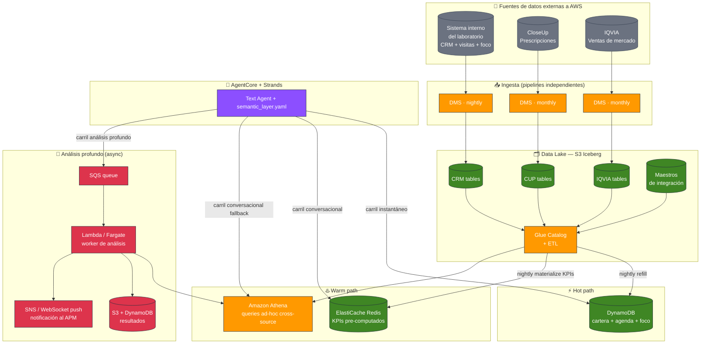
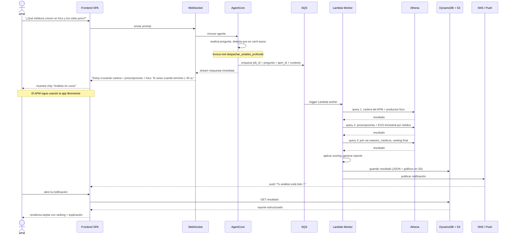

# Caso de estudio: De Demo a MLP — PharmAssist para la industria farmacéutica

> Cómo convertir la demo actual de PharmAssist en un Minimum Lovable Product productivo capaz de responder preguntas de alto valor para Agentes de Propaganda Médica (APMs), cruzando múltiples fuentes de datos corporativas y externas de la industria farmacéutica, con latencias aceptables y una experiencia de usuario moderna.

## Índice

- [El caso de estudio](#el-caso-de-estudio)
- [Las 3 fuentes de datos de la industria pharma](#las-3-fuentes-de-datos-de-la-industria-pharma)
- [Las preguntas que generan valor real](#las-preguntas-que-generan-valor-real)
- [Por qué la demo actual no alcanza](#por-qué-la-demo-actual-no-alcanza)
- [Principios de diseño del MLP](#principios-de-diseño-del-mlp)
- [Arquitectura objetivo](#arquitectura-objetivo)
- [Los 3 carriles de respuesta](#los-3-carriles-de-respuesta)
- [Ingesta: warehouse externo → AWS](#ingesta-warehouse-externo--aws)
- [Almacenamiento: data lake con 3 dominios](#almacenamiento-data-lake-con-3-dominios)
- [Capa semántica: el agente entiende el negocio](#capa-semántica-el-agente-entiende-el-negocio)
- [Experiencia async para análisis profundo](#experiencia-async-para-análisis-profundo)
- [Latencias esperadas por tipo de pregunta](#latencias-esperadas-por-tipo-de-pregunta)
- [Plan de evolución por fases](#plan-de-evolución-por-fases)
- [Costos estimados](#costos-estimados)

---

## El caso de estudio

La demo actual de PharmAssist usa un atajo didáctico: tres CSVs sintéticos (CRM, visitas, ventas) cargados directamente en DynamoDB, con un único APM (Peccy) y 12 médicos. Sirve para validar la experiencia de usuario, el stack de agentes, el modo voz con Nova Sonic y la integración con AgentCore.

En un entorno productivo real de la industria farmacéutica, el escenario cambia en múltiples dimensiones simultáneamente. Este documento describe cómo evolucionar el diseño para soportar un laboratorio real con cientos de APMs, datos corporativos vivos consolidados desde múltiples fuentes, y preguntas de negocio que hoy ningún tablero resuelve.

### Perfil del caso

- **Industria**: laboratorio farmacéutico argentino de mediano o gran porte
- **Usuarios**: 200–500 APMs (visitadores médicos) distribuidos geográficamente
- **Escenario**: los APMs preparan su agenda del día siguiente desde sus notebooks, en horario laboral o nocturno. Expectativa de datos a día vencido (batch nocturno aceptable)
- **Fuentes de datos existentes**: 3 warehouses/datasets externos a AWS, cada uno en su propia plataforma (típicamente SQL Server, Synapse, Databricks o similar)
- **Patrón de uso**: mixto. El APM consulta datos puntuales (quién, dónde, cuándo), hace preguntas analíticas (rankings, tendencias, comparativos) y ocasionalmente pide análisis profundos multi-fuente ("qué médicos crecen en prescripción de mis productos foco y los estoy visitando poco")

### Objetivo del MLP

Construir un asistente conversacional que:

1. Responda preguntas **rápidas** (<500 ms data side) con la misma velocidad que un dashboard
2. Responda preguntas **conversacionales** (2–5 segundos end-to-end) con análisis ad-hoc sobre datos frescos
3. Entregue **análisis profundos** cross-source (15–60 segundos) sin romper la experiencia del APM — vía experiencia asincrónica con notificación
4. Conserve la libertad del LLM de "hablar con los datos" — **no** pre-cocina respuestas
5. Tenga costo operativo predecible y escale linealmente con usuarios


---

## Las 3 fuentes de datos de la industria pharma

En la industria farmacéutica argentina (y latinoamericana) los laboratorios trabajan con una combinación típica de **1 fuente interna + 2 fuentes externas estándar de la industria**. Cada una aporta un tipo distinto de información y los datos solo cobran sentido cuando se cruzan entre sí.

### Fuente 1 — Sistema interno (CRM + gestión de visitas)

Es el sistema propio del laboratorio. Guarda todo lo que el laboratorio conoce y controla:

- **Cartera médica**: qué APM atiende a qué médicos
- **Agenda de visitas**: planificadas, realizadas, con tiempos y tipos
- **Muestras entregadas**: qué producto, qué cantidad, lote, fecha
- **Productos foco del ciclo actual**: qué promoción se está empujando por línea/región
- **Estructura del producto**: familia, línea, categoría (foco/hiperfoco), ciclos de promoción, grillas
- **Perfil del médico**: datos personales, especialidad, hobbies, matrícula

**Tamaño típico**: tablas pequeñas-medianas (miles a decenas de miles de rows por tabla). Schema normalizado con decenas de tablas relacionadas. Cambios diarios.

### Fuente 2 — Prescripciones (CloseUp / CUP)

[CloseUp](https://www.closeupsolutions.com/) es un proveedor externo estándar en pharma latinoamericana. Vende datasets de **prescripciones médicas** capturadas en farmacias. Es la única forma que tiene un laboratorio de saber qué recetan los médicos — incluido qué productos de competidores recetan.

Contiene:

- Tabla de **prescripciones** (fact table muy grande: decenas o centenas de millones de rows históricas)
- Maestros de **médicos con identificador propio** (CDGMED), distinto del identificador interno del laboratorio
- Maestros de **mercados** (agrupaciones de productos competidores en una misma categoría terapéutica)
- Tabla de **visitados/no visitados** por representante

**Tamaño típico**: fact table de prescripciones en el orden de los GB-TB. Schema dimensional (star schema clásico). Actualización mensual o quincenal.

### Fuente 3 — Ventas de mercado (IQVIA)

[IQVIA](https://www.iqvia.com/) es el proveedor global dominante de datos de mercado farmacéutico. Vende datasets de **ventas a farmacias y distribuidoras**, agregados por producto, droga, clase terapéutica, laboratorio, período y geografía.

Contiene:

- Fact table de **ventas valorizadas** (`fact_mercado_valor`) con unidades, dosis, valor en ARS y USD
- Dimensiones estándar: **droga, forma farmacéutica, presentación, laboratorio, clase terapéutica, combinación, período**
- Relaciones entre presentaciones y drogas/formas para poder agregar a distintos niveles

**Tamaño típico**: fact table grande (cientos de millones de rows). Schema dimensional puro. Actualización mensual.

### El desafío: las claves no coinciden entre fuentes

Las 3 fuentes **no comparten identificadores de productos ni de médicos**. Cada una usa su propia codificación:

- **Productos**: código interno del laboratorio (SKU propio) vs código CUP (de CloseUp) vs código EAN-11 o idProducto (de IQVIA)
- **Médicos**: id interno del CRM del laboratorio vs CDGMED de CloseUp (no hay intersección en IQVIA porque IQVIA no tiene nivel médico)

Para cruzar las 3 fuentes existen **tablas maestras de integración** (el típico `maestro_integrador_producto` y `maestro_medicos`) que mapean los IDs entre sí. **Estas tablas maestras son críticas** — sin ellas, ninguna pregunta cross-source es posible.


---

## Las preguntas que generan valor real

Los APMs hacen preguntas de **3 niveles de valor muy distintos**. Diseñar bien el sistema empieza por entender esa diferencia.

### Preguntas de bajo valor (un dashboard las resuelve)

Preguntas operativas, puntuales, con una sola fuente de datos. Hoy están en tableros estáticos que el APM consulta antes de salir. No son el diferencial del agente, pero **sí tienen que responder rápido** porque son las más frecuentes.

Ejemplos del patrón:

- *"¿Cuáles son mis objetivos de visita este mes?"*
- *"¿A qué médicos todavía no visité en el ciclo actual?"*
- *"¿Cuándo fue la última visita al Dr. X?"*
- *"¿Qué promocioné en la última visita al Dr. X?"*

**Fuentes involucradas**: solo el CRM interno del laboratorio.
**Patrón**: lookup por ID o filtro simple sobre cartera.
**Latencia esperada**: <2 segundos end-to-end.
**Frecuencia**: múltiples veces por día por APM.

### Preguntas de valor medio (el APM intuye la respuesta)

Preguntas donde el APM ya tiene cierta noción de la respuesta pero quiere confirmarla con datos, o donde quiere ver un ranking ordenado. Siguen siendo operativas pero agregan agregaciones.

Ejemplos del patrón:

- *"¿Cuáles son los médicos que visito con más/menos frecuencia?"*
- *"¿Cuáles son los 5 productos que más prescribe el Dr. X?"*
- *"¿Cuáles son los 5 productos de mi laboratorio que más prescribe el Dr. X?"*

**Fuentes involucradas**: CRM interno y/o prescripciones (CloseUp).
**Patrón**: agregación con group by + order + limit, típicamente acotada a un médico o un APM.
**Latencia esperada**: 2–5 segundos end-to-end.
**Frecuencia**: varias veces por semana.

### Preguntas de gran valor (el agente muestra lo que ningún dashboard puede)

Esta es la categoría donde el agente **justifica su existencia**. Son preguntas analíticas complejas que cruzan las 3 fuentes, requieren combinar prescripciones + cartera + productos foco + ventas de mercado, y devuelven insights accionables que hoy ningún APM puede obtener por sí mismo.

Ejemplos del patrón:

- *"Recomendame a qué médicos debería visitar según sus prescripciones y mis productos foco"* — cruza CRM interno (cartera + foco) con CloseUp (prescripciones) y la tabla maestra de productos
- *"¿Qué médicos vienen creciendo en prescripción de mis productos foco y los estoy visitando poco?"* — cruza frecuencia de visitas (CRM interno) con evolución trimestral de prescripciones (CloseUp)
- *"¿A qué médicos debería visitar primero para crecer con el producto X?"* — ranking sobre cartera cruzado con market share y evolución del médico
- *"¿En qué productos de mi laboratorio tengo Evolución Trimestral negativa en unidades, tomando todos los mercados que trabajo?"* — cruza mercados del APM (CRM interno) con ventas IQVIA
- *"De los medicamentos que le promociono / no le promociono al Dr. X, ¿cuál es el que más prescribe?"* — cruza agenda (CRM interno) con prescripciones (CloseUp)

**Fuentes involucradas**: las 3 en simultáneo, con joins multi-tabla vía maestros de integración.
**Patrón**: queries analíticas con varias agregaciones, ventanas temporales (YoY, evolución trimestral, MAT — Moving Annual Total), filtros por cartera del APM.
**Latencia esperada**: aquí está el giro — **15 a 60 segundos** si se hacen ad-hoc sobre los datasets completos. Esto fuerza una experiencia distinta (ver sección "Los 3 carriles").
**Frecuencia**: 1–3 veces por día por APM. Son preguntas "pensadas" que el APM hace cuando planifica su semana o prepara una visita estratégica.

### La conclusión operativa

Un sistema que sirve **las 3 categorías con la misma infraestructura** termina siendo mediocre para todas. Las preguntas de bajo valor quedan lentas. Las de gran valor quedan imposibles. La única forma de hacerlo bien es reconocer que son **3 productos en uno** y diseñar 3 carriles de respuesta.


---

## Por qué la demo actual no alcanza

La demo usa DynamoDB como única fuente. Eso funciona para el set de preguntas de Peccy (12 médicos sintéticos) pero se quiebra en producción por 4 razones concretas:

### 1. DynamoDB no hace joins

Todas las preguntas de gran valor requieren cruzar 2 o 3 fuentes. DynamoDB no tiene joins. Las opciones son:

- **Denormalizar en una sola tabla**: explotaría el tamaño porque habría que replicar prescripciones por cada médico × cada producto foco × cada mercado
- **Hacer múltiples queries + join en Lambda**: funciona para volúmenes chicos pero no escala a millones de prescripciones
- **No responder esas preguntas**: lo peor de los tres

Ninguna es aceptable. Hace falta un engine SQL por encima del data lake.

### 2. El histórico de prescripciones y ventas no cabe en DynamoDB a costo razonable

Una fact table de prescripciones de 100 millones de rows en DynamoDB cuesta órdenes de magnitud más que la misma en S3 + Iceberg. DynamoDB es hot storage (caro por GB, barato por query). Los datos históricos deben vivir en warm storage.

### 3. Las tres fuentes cambian con frecuencias distintas

- CRM interno del laboratorio cambia varias veces por día
- CloseUp actualiza mensual o quincenalmente
- IQVIA actualiza mensualmente

Un único pipeline que refresca todo cada noche es subóptimo. Necesitamos pipelines separados con frecuencias propias.

### 4. Las preguntas de gran valor requieren experiencia async

Si el agente tarda 45 segundos en cruzar CRM interno + CloseUp + IQVIA para dar un ranking inteligente de médicos a visitar, la conexión WebSocket aguanta (hasta 2 horas de AgentCore session) pero la **experiencia de usuario es pobre**: el APM mira la pantalla sin saber qué pasa.

El diseño productivo debe ofrecer una **experiencia asincrónica** donde el APM hace la pregunta, sigue trabajando, y recibe una notificación cuando el análisis termina. Esto es un cambio arquitectónico, no una optimización.

---

## Principios de diseño del MLP

Antes de entrar a la arquitectura, cinco principios que guían cada decisión:

### 1. El agente mantiene siempre libertad de razonamiento

No pre-cocinamos respuestas. El LLM decide qué tools invocar en cada pregunta. Lo que pre-computamos son **datos agregados** que los tools pueden leer. Si el APM hace una pregunta que no anticipamos, el agente la responde igual — solo con un poco más de latencia.

### 2. Hot, warm y async son carriles distintos con SLA distinto

Cada pregunta se clasifica en el momento de razonamiento del agente. El agente tiene tools de tres tipos; cada uno lee de su storage óptimo. No hay un tool "universal" que haga todo porque eso obliga a comprometer algún SLA.

### 3. El data lake es fuente única de verdad para analítica

Las 3 fuentes se replican a S3 como **tablas Iceberg independientes**. No las pre-joineamos durante la ingesta. Athena queryea las 3 según haga falta, con los maestros de integración. Esto deja el schema original intacto y fácil de debuggear.

### 4. Pre-computación agresiva pero selectiva

Las preguntas de medio y gran valor que sabemos que el APM hace **todos los días** se materializan en Redis/DynamoDB durante el batch nocturno. Así el 80% de las preguntas comunes responden en <500 ms. El 20% restante va ad-hoc a Athena.

### 5. Experiencia async para análisis profundos

Preguntas de gran valor que requieren 15–60 segundos de cómputo no bloquean al APM. Se despachan a un job, el APM recibe confirmación inmediata ("Analizando, te aviso cuando esté listo"), sigue navegando la app, y recibe una notificación push cuando el resultado está listo.


---

## Arquitectura objetivo



### Piezas clave y qué hace cada una

| Componente | Rol | Cuándo se usa |
|---|---|---|
| **AWS DMS** (x3) | Replica cada fuente externa a S3 con su propia cadencia | Ingesta nocturna/mensual |
| **S3 + Apache Iceberg** | Almacena las 3 fuentes como tablas independientes, versionables, con schema evolution | Source of truth analítico |
| **Glue Data Catalog + ETL** | Indexa metadata, normaliza y prepara las tablas curadas | Una vez al día post-ingesta |
| **DynamoDB** | Vista materializada hot de cartera, agenda, productos foco, últimas visitas | Queries del carril instantáneo |
| **ElastiCache Redis** | KPIs pre-computados por APM (rankings, alertas, evolución propia) | Queries del carril conversacional |
| **Athena** | Engine SQL serverless sobre el lake, queryea las 3 fuentes con joins vía maestros | Carril conversacional (fallback) + carril async |
| **SQS + Worker (Lambda/Fargate)** | Cola de análisis profundos + worker que ejecuta queries multi-fuente largas | Carril async |
| **SNS / WebSocket push** | Notifica al APM cuando el análisis profundo termina | Cierre del carril async |
| **AgentCore Runtime** | Ejecuta el agente Strands con Claude Opus 4.6 | Toda pregunta del APM |


---

## Los 3 carriles de respuesta

Cada pregunta del APM se resuelve por uno de estos 3 carriles. **El agente Strands decide cuál usar** según el tool que invoca. El APM no elige manualmente.

### Carril 1 — Instantáneo (<500 ms data, 2–3 s total)

**Para qué**: preguntas operativas y de bajo valor. Lookup por ID, filtro simple sobre cartera, últimas visitas.

**Cómo funciona**: el tool del agente lee directamente de DynamoDB, que tiene una vista pre-denormalizada del sistema interno (cartera, agenda, productos foco del APM, últimas visitas por médico). Refresh nocturno.

**Streaming sincrónico**: el agente streamea la respuesta por WebSocket como en la demo actual. El APM ve la respuesta aparecer palabra por palabra.

**Ejemplos de preguntas**:

- *"¿Cuándo fue la última visita al Dr. Peralta?"*
- *"¿Qué promocioné en la última visita?"*
- *"¿Cuántos médicos tengo asignados?"*
- *"¿Qué médicos tengo en Belgrano?"*
- *"¿Cuáles son mis visitas de hoy?"*

### Carril 2 — Conversacional (2–5 s total)

**Para qué**: preguntas de valor medio y algunas de gran valor que son frecuentes. Rankings, top-N, agregaciones acotadas al APM o a un médico específico.

**Cómo funciona (ruta feliz)**: el tool del agente intenta primero **Redis**. Si hay un KPI pre-computado que matchea la pregunta (ej. "top 5 productos más prescritos por el Dr. X en mi cartera"), lo devuelve en <10 ms. El KPI fue calculado durante el batch nocturno usando Athena + maestros de integración.

**Cómo funciona (ruta de fallback)**: si la pregunta es una variante del set pre-computado o el APM la hace sobre un médico/zona fuera del cache, el tool cae a **Athena**. Query típica de 1–3 segundos sobre Iceberg con partitioning. Opcionalmente el resultado se guarda en Redis con TTL corto para futuras consultas similares.

**Streaming sincrónico**: el agente streamea mientras espera. Claude puede empezar con un prefacio ("Déjame revisar tus prescripciones...") antes de invocar el tool, llenando el tiempo que el APM percibe.

**Ejemplos de preguntas**:

- *"¿Cuáles son los médicos que visito con menos frecuencia?"* (ranking sobre CRM interno)
- *"¿Cuáles son los 5 productos que más prescribe el Dr. X?"* (agregación sobre CloseUp)
- *"¿Cuáles son los 10 médicos más prescriptores en el mercado de cardiología?"* (ranking sobre CloseUp)
- *"¿En qué productos tengo EVO Trimestral negativa tomando todos mis mercados?"* (cruzando IQVIA con mercados del APM en el CRM interno)

### Carril 3 — Análisis profundo async (15–60 s total, con notificación)

**Para qué**: preguntas de gran valor que requieren cruzar las 3 fuentes con agregaciones complejas, ventanas temporales y rankings multi-criterio. Son preguntas "pensadas" que el APM hace cuando planifica.

**Cómo funciona**: cuando el agente detecta que la pregunta entra en esta categoría (lo decide el LLM basándose en descripciones de tools y la capa semántica), no ejecuta la query inline. En su lugar:

1. **Encola el trabajo** en SQS con el payload de la pregunta estructurada
2. **Responde inmediatamente** al APM por el WebSocket: *"Estoy analizando tu cartera cruzada con prescripciones y productos foco. Esto puede tardar hasta un minuto; te aviso cuando esté listo. Mientras tanto podés seguir trabajando."*
3. Un **worker separado** (Lambda de 10 min o Fargate task) toma el mensaje de SQS, ejecuta las queries Athena cross-source, procesa los resultados
4. El worker **guarda el resultado** en S3 (si es un reporte rich) y/o DynamoDB (si es corto)
5. **Notifica al APM** vía SNS push a la app o vía WebSocket (si sigue conectado) con un link al resultado
6. Cuando el APM abre el resultado, lo ve renderizado como una "tarjeta de análisis" — con tablas, gráficos, y opcionalmente un resumen generado por Claude

**No bloquea al APM**: el usuario puede hacer otras preguntas, navegar el dashboard, irse a una visita. El resultado lo espera cuando vuelve.

**Ejemplos de preguntas** (son preguntas que justifican toda la arquitectura):

- *"Recomendame a qué médicos debería visitar según sus prescripciones y mis productos foco"* — cruza cartera + foco (CRM interno) + prescripciones (CloseUp) + maestros + scoring
- *"¿Qué médicos vienen creciendo en prescripción de mis productos foco y los estoy visitando poco?"* — análisis YoY + frecuencia de visitas + productos foco
- *"¿A qué médicos debería visitar primero para crecer con el producto X?"* — ranking multi-criterio sobre toda la cartera
- *"De los medicamentos que le promociono al Dr. X, ¿cuál es el que más prescribe?"* — intersección agenda + prescripciones + integrador de productos

### Comparación rápida de los 3 carriles

| Dimensión | Instantáneo | Conversacional | Análisis profundo (async) |
|---|---|---|---|
| Storage | DynamoDB | Redis + Athena | Athena sobre Iceberg |
| Latencia data | <30 ms | 10 ms – 3 s | 10 – 50 s |
| Latencia total percibida | 2–3 s | 2–5 s | Inmediato (ack) + 15–60 s (notificación) |
| Conexión | WS streaming sync | WS streaming sync | WS ack + SNS push async |
| Patrón de query | GetItem / Query | KPI lookup / SQL acotado | SQL cross-source con joins |
| Fuentes típicas | 1 (CRM interno) | 1–2 | 3 con maestros |
| Frecuencia por APM | decenas/día | unas/día | 1–3/día |


---

## Ingesta: warehouse externo → AWS

Cada una de las 3 fuentes se replica a AWS con su propia cadencia. No hay un único pipeline universal; cada fuente tiene características propias.

### Sistema interno (CRM del laboratorio)

- **Origen**: base corporativa (típicamente SQL Server, Oracle, PostgreSQL). Schema normalizado con decenas de tablas.
- **Cadencia**: batch nocturno (las operaciones OLTP cierran al final del día)
- **Herramienta**: AWS DMS en modo Full Load o CDC
- **Destino**: S3 Iceberg particionado por `fecha_carga` (snapshot diario)
- **Particularidad**: hay vistas maestras construidas sobre el schema normalizado que ya denormalizan parte del trabajo. Podemos replicar las vistas directamente para simplificar el ETL.

### Prescripciones (CloseUp)

- **Origen**: dataset que CloseUp entrega mensual o quincenalmente. Puede llegar como archivos (Parquet, CSV) a un FTP/S3 del cliente, o como tablas en un warehouse compartido.
- **Cadencia**: mensual (a veces quincenal)
- **Herramienta**: si es archivos, una Lambda que detecta llegada y mueve a landing zone. Si es warehouse, DMS en modo Full Load mensual.
- **Destino**: S3 Iceberg particionado por `anio_mes`
- **Particularidad**: la fact table es grande. El ETL debe ser idempotente (si la carga se ejecuta dos veces, no duplica prescripciones).

### Ventas de mercado (IQVIA)

- **Origen**: IQVIA entrega el dataset mensualmente, típicamente como archivos comprimidos o vía su portal.
- **Cadencia**: mensual
- **Herramienta**: típicamente un cliente SFTP más un ingest Lambda que convierte a Parquet
- **Destino**: S3 Iceberg particionado por `anio_mes`
- **Particularidad**: el schema viene bien estructurado (dimensional star schema), requiere transformación mínima.

### Maestros de integración

Las tablas maestras (`maestro_integrador_producto`, `maestro_medicos`, `Familia_Interno_a_Marca_CUP`) son pequeñas pero **críticas**. Se cargan manualmente o vía script cuando cambian (baja frecuencia). Viven en S3 Iceberg como tablas chicas, queryeables vía Athena junto con las demás.

### AWS DMS: costo y configuración

DMS se configura como una **replication instance** (EC2 managed) o como **DMS Serverless** (on-demand). Para el caso:

- **Serverless** para la carga del CRM interno (batch nocturno, instancia prendida solo 1 hora/día): ~$15/mes
- **On-demand scheduled tasks** para CloseUp e IQVIA (corre 1 vez al mes): ~$5/mes cada una

Total DMS: **~$25/mes** para las 3 fuentes.


---

## Almacenamiento: data lake con 3 dominios

Todo el histórico vive en **S3 como Apache Iceberg**, con 3 dominios separados + maestros. Las tablas nunca se pre-joinean durante la ingesta — eso ocurre en query time (Athena) o durante la materialización de KPIs (nightly job).

### Estructura del bucket

```
s3://pharmassist-lake/
├── crm/                      ← sistema interno, cadencia diaria
│   ├── cartera_medica/
│   ├── agenda/
│   ├── agenda_producto/
│   ├── familia_producto/
│   ├── detalle_promocion_producto/
│   ├── linea_apm/
│   ├── grilla/
│   └── ... (resto del schema del CRM interno)
├── cup/                      ← CloseUp, cadencia mensual
│   ├── medico/
│   ├── prescricao/          ← fact table grande
│   ├── mercados/
│   ├── mercados_productos/
│   └── marca/
├── iqvia/                    ← IQVIA, cadencia mensual
│   ├── dim_droga/
│   ├── dim_presentacion/
│   ├── dim_laboratorio/
│   ├── dim_periodo/
│   ├── fact_mercado_valor/  ← fact table grande
│   └── ... (resto del schema IQVIA)
└── maestros/                 ← tablas de integración, cadencia baja
    ├── maestro_integrador_producto/
    ├── maestro_medicos/
    └── familia_interno_a_marca_cup/
```

### Particionado para performance

Cada fact table se particiona por columnas de alta selectividad que los APMs usan en sus queries:

| Tabla | Particionado |
|---|---|
| `cup/prescricao` | `anio, mes, cdgreg_pmix` (región del APM) |
| `iqvia/fact_mercado_valor` | `idperiodo` (año-mes) |
| `crm/agenda` | `fecha_visita` |

Con particionado + formato columnar Parquet, una query del estilo *"prescripciones del Dr. X en los últimos 12 meses"* escanea decenas de MB, no GB. **Costo Athena por query típica: centavos.**

### Por qué Iceberg y no solo Parquet

- **Schema evolution**: cuando CloseUp agregue una columna nueva al mes que viene, no rompe queries existentes
- **Time travel**: podemos ver los datos como eran hace 3 meses para auditar un insight
- **ACID**: si el ETL falla en medio del Full Load, el lake no queda inconsistente
- **Compactación automática**: al tiempo los archivos chicos se vuelven problema; Iceberg los compacta
- **Engine agnóstico**: Athena, EMR, Redshift Spectrum, Databricks — todos leen la misma tabla sin replicar datos

### Glue Data Catalog

El catalog central que describe todas las tablas con su schema, ubicación, formato y particiones. Athena, Glue ETL, y cualquier herramienta de BI que el cliente conecte en el futuro usan este catalog como fuente de verdad del data lake.


---

## Capa semántica: el agente entiende el negocio

El LLM por sí solo no sabe qué es un "producto foco", cómo se calcula "Evolución Trimestral", ni que el `CDGMED` de CloseUp se cruza con el `id` de `doctor` del CRM interno vía la tabla `maestroMedicos`. La **capa semántica** es el artefacto que le enseña ese conocimiento de dominio.

### Qué contiene

Un archivo YAML (o colección de archivos) inyectado al system prompt del agente, con 4 bloques:

**1. Entidades del dominio** con sus atributos, tabla física y tags semánticos:

```yaml
entidades:
  Medico:
    descripcion: "Profesional de la salud visitado por un APM."
    id_interno: crm.doctor.id
    id_externo_prescripciones: cup.medico.CDGMED
    cruce: maestros.maestro_medicos (codInterno ↔ codCUP)
    atributos_clave:
      - especialidad: crm.doctor.especialidad_id → crm.especialidad.nombre
      - cartera_APM: crm.cartera_medica (apm_id → doctor_id)

  Producto:
    descripcion: "Producto farmacéutico del laboratorio o de competidores."
    id_laboratorio: crm.familia_producto.id
    id_closeup: cup.marca.codigo_marca
    id_iqvia: iqvia.dim_presentacion.idProducto
    cruce: maestros.maestro_integrador_producto
    categoria_comercial:
      - foco: detalle_promocion_producto.id_categoria = 'foco'
      - hiperfoco: detalle_promocion_producto.id_categoria = 'hiperfoco'
```

**2. Métricas del negocio** con su fórmula expresada en SQL o pseudocódigo:

```yaml
metricas:
  evolucion_trimestral_prescripciones:
    alias: [EVO_TRM, EVO trimestral]
    definicion: |
      Porcentaje de variación de prescripciones del trimestre actual vs
      el mismo trimestre del año anterior, por médico y producto/mercado.
    formula_pseudocodigo: |
      (px_trimestre_actual - px_trimestre_anterior_mismo_año)
      / px_trimestre_anterior_mismo_año * 100
    fuente: cup.prescricao
    ventana_temporal: trimestre vs trimestre Y-1

  productos_foco_del_apm:
    definicion: "Productos marcados como Foco o Hiperfoco en el ciclo activo para las líneas asignadas al APM."
    tablas: [crm.linea_apm, crm.grilla, crm.detalle_promocion_producto, crm.categoria, crm.ciclo]
    sql_template: |
      SELECT DISTINCT fp.*
      FROM crm.linea_apm la
      JOIN crm.grilla g ON g.id_linea = la.id_linea
      JOIN crm.detalle_promocion_producto dpp ON dpp.id_grilla = g.id
      JOIN crm.categoria c ON c.id = dpp.id_categoria
      JOIN crm.ciclo ci ON ci.id = dpp.id_ciclo
      JOIN crm.familia_producto fp ON fp.id = dpp.id_familia_producto
      WHERE la.apm_id = :apm_id
        AND c.nombre IN ('foco', 'hiperfoco')
        AND ci.activo = true
```

**3. Queries canónicas** — ejemplos de queries conocidas que el agente puede adaptar:

```yaml
queries_canonicas:
  ranking_medicos_prescriptores_en_mercado:
    pregunta_ejemplo: "Los 10 médicos más prescriptores en el mercado X"
    carril: conversacional
    sql: |
      SELECT m.CDGMED, m.nombre, SUM(p.cantidad) as px_total
      FROM cup.prescricao p
      JOIN cup.medico m ON m.CDGMED = p.CDGMED
      JOIN cup.mercados_productos mp ON mp.CDG_PROD = p.CDGPRO
      WHERE mp.CDG_MERCADO = :mercado_id
        AND p.DATA >= CURRENT_DATE - INTERVAL '12' MONTH
      GROUP BY m.CDGMED, m.nombre
      ORDER BY px_total DESC
      LIMIT 10
```

**4. Reglas del negocio** (las consideraciones del documento del cliente):

```yaml
reglas_negocio:
  - "Si un producto no tiene codProductoCUP, significa que no tuvo prescripciones."
  - "Si un producto no tiene codProductoBarrasEAN11 ni idProducto de IQVIA, no tuvo ventas."
  - "Un médico lo atiende el laboratorio solo si tiene codInterno en maestro_medicos."
  - "Los productos foco son a nivel APM (por sus líneas); los productos objetivo son a nivel médico."
  - "Para productos de promoción usar detalle_promocion_producto con categoria foco/hiperfoco."
```

### Cómo se inyecta

El `semantic_layer.yaml` se carga al iniciar el agente y se pasa como parte del system prompt de Claude. Cuando el APM hace una pregunta, el LLM tiene todo el contexto necesario para:

1. **Identificar qué entidades están involucradas** (médico, producto foco, prescripciones)
2. **Elegir qué tool invocar** (instantáneo, conversacional o async)
3. **Adaptar una query canónica** al contexto específico del APM
4. **Aplicar reglas de negocio** (filtros correctos, interpretaciones correctas de métricas)

### Por qué YAML y no Neptune

Para este MLP, YAML inyectado al prompt es suficiente. Cuando el archivo supere ~50 KB o aparezcan 3+ fuentes heterogéneas con relaciones complejas entre sí, conviene migrar a **Amazon Neptune** como grafo semántico queryable. No es parte del MLP base.

### Validación del YAML

Un paso a menudo ignorado: testear que el agente con la capa semántica responde bien las 12 preguntas de referencia. Se arma un test suite que corre contra el agente con prompts conocidos y chequea que genera el SQL correcto (o invoca el tool correcto). Este test corre antes de cada redeploy del `semantic_layer.yaml`.


---

## Experiencia async para análisis profundo

Este es el patrón más importante de todo el MLP. Convierte las preguntas de gran valor en una experiencia aceptable, y es lo que diferencia al agente de un dashboard estático.

### Flujo detallado



### Qué ve el APM

**Momento 1 — pregunta y ack inmediato** (2 segundos):

```
APM: "Recomendame a qué médicos debería visitar según sus prescripciones
     y mis productos foco."

Agente: Perfecto, voy a cruzar tu cartera de médicos con el histórico
        de prescripciones de los últimos 12 meses y tus productos foco
        del ciclo actual. Es un análisis que requiere un poco de tiempo
        (hasta un minuto). Te aviso cuando esté listo — podés seguir
        trabajando mientras tanto.

        [Chip en pantalla: "Análisis en curso • Recomendación de visitas"]
```

**Momento 2 — el APM sigue trabajando** (45 segundos)

El APM navega el dashboard, mira la agenda de hoy, hace otras preguntas cortas. El chip sigue visible en una esquina indicando que hay un análisis en proceso.

**Momento 3 — notificación cuando está listo**

```
🎯 Tu análisis está listo

Recomendación de visitas priorizadas:
1. Dra. Florencia Peralta — crecimiento +18% en ALACIR, visitada hace 45 días
2. Dr. Nicolás Peralta — prescribe APSICO (no foco) pero nunca PAMOXET
3. Dra. Lucía Giménez — EVO positiva en foco, cadencia trimestral incumplida
4. ...

[Ver análisis completo]  [Pedir reestructurar agenda]
```

### Componentes del carril async

**SQS (cola de trabajos)**
- Recibe los jobs serializados (apm_id, pregunta, contexto)
- Permite al agente responder inmediatamente sin esperar el cómputo
- Retry automático si el worker falla
- Costo: <$1/mes para este volumen

**Worker (Lambda o Fargate)**
- Lambda de hasta 10 minutos si el análisis es simple
- Fargate task si requiere más tiempo o más memoria
- El worker tiene su propia capa semántica para entender la pregunta y ejecutar la serie de queries Athena
- Opcionalmente invoca a Claude Opus de nuevo para generar un resumen en lenguaje natural del resultado
- Costo: pocos centavos por ejecución

**Storage del resultado**
- **DynamoDB** para la metadata del análisis (job_id, estado, timestamp, resumen corto)
- **S3** para payloads más pesados (tablas de datos, JSON completo, gráficos generados)
- **TTL de 7 días**: si el APM no consulta el resultado en 7 días, se borra automáticamente

**Notificación al APM**
- **WebSocket push** si el APM sigue conectado (común, dado que los APMs trabajan con la app abierta)
- **SNS mobile push** si la app tiene soporte PWA instalada
- **Email** como fallback si el APM cerró la app (opcional)

### Ventajas de este patrón

1. **No hay timeout que importe**. El WebSocket del chat solo carga el ack de 2 segundos. El cómputo largo corre en un worker sin límite de API Gateway ni AgentCore session.
2. **El APM sigue productivo**. No se queda esperando un spinner. Puede hacer otras preguntas, navegar, llamar a un médico.
3. **Escala bien**. Múltiples análisis en paralelo no bloquean al agente — cada uno es un worker independiente.
4. **Reintento automático**. Si un worker falla, SQS lo reintenta. El APM ni se entera.
5. **Mejora la percepción de valor**. Un análisis que se siente "profesional" — el APM asocia latencia con profundidad.


---

## Latencias esperadas por tipo de pregunta

Tabla de referencia que agrupa preguntas típicas, su carril, y el desglose de tiempo esperado. Los tiempos son estimaciones razonables basadas en benchmarks de AWS; cada caso real debe medirse.

| Pregunta | Carril | Tool data | Claude (tokens) | Total percibido |
|---|---|---|---|---|
| "¿Cuándo fue la última visita al Dr. X?" | Instantáneo | DDB 15 ms | ~800 ms | **~2 s** |
| "¿Qué médicos tengo en Belgrano?" | Instantáneo | DDB GSI 30 ms | ~1 s | **~2.5 s** |
| "¿Cuáles son mis visitas de hoy?" | Instantáneo | DDB Query 20 ms | ~900 ms | **~2 s** |
| "¿Cuáles son los 5 productos que más prescribe el Dr. X?" | Conversacional (cache hit) | Redis 5 ms | ~1.2 s | **~3 s** |
| "¿Cuáles son los 5 productos que más prescribe el Dr. X?" | Conversacional (cache miss) | Athena 1.5 s | ~1.2 s | **~4 s** |
| "¿Médicos que visito con menos frecuencia?" | Conversacional | Redis / Athena 1 s | ~1.5 s | **~3.5 s** |
| "¿EVO trimestral negativa en mis productos?" | Conversacional | Athena 2 s | ~1.5 s | **~4.5 s** |
| "¿A qué médicos visitar para crecer con producto X?" | Async | ack 2 s + job 30-45 s | — | **2 s ack + notif en ~45 s** |
| "¿Qué médicos crecen en foco y los visito poco?" | Async | ack 2 s + job 45-60 s | — | **2 s ack + notif en ~60 s** |
| "Recomendame médicos según prescripciones y foco" | Async | ack 2 s + job 30-60 s | — | **2 s ack + notif en ~45 s** |

### Observaciones

- **Las preguntas de bajo valor son las más frecuentes** (10x/día por APM). Optimizar su latencia es lo que hace sentir rápido al sistema.
- **Las preguntas de gran valor son las más diferenciadoras** (1-3x/día por APM). Aceptar 45 segundos con buena UX async es mucho mejor que bajar la calidad del análisis para forzar latencia <5 s.
- **Claude domina el tiempo total en los carriles 1 y 2**. La única forma de bajar más es usar un modelo más rápido (Claude Sonnet en lugar de Opus) o reducir la longitud de la respuesta. La optimización de data en esos carriles tiene rendimiento decreciente.
- **El carril async saca a Claude del camino crítico**. El worker puede invocar Claude para el resumen final pero eso no bloquea al APM.

---

## Plan de evolución por fases

Cada fase es **deployable y operable de forma independiente**, entrega valor medible al cliente, y permite validar asumptions antes de seguir. El camino completo son 5 fases de ~2-3 semanas cada una.

### Fase 0 — Demo actual (ya implementada)

- CSVs sintéticos → DynamoDB → Agent Strands
- 1 APM (Peccy), 12 médicos
- Stack AgentCore + modo voz Nova Sonic + frontend
- **Valor**: mostrar capacidad técnica, alineación con el cliente sobre UX

### Fase 1 — Ingesta del CRM interno a S3 Iceberg

**Duración**: 2 semanas

**Qué se hace**:
- Configurar DMS con credenciales del sistema interno del cliente
- Replicar las 15+ tablas del CRM interno a `s3://pharmassist-lake/crm/`
- Glue Crawler descubre el schema y registra en Data Catalog
- Athena queryea las tablas como prueba
- Cargar tablas maestras (`maestro_integrador_producto`, `maestro_medicos`)

**Valor entregado**: los datos reales del cliente están en AWS y son queryeables. El equipo de datos del cliente valida que los datos llegaron bien.

### Fase 2 — Refill nocturno de DynamoDB + migración del agente a datos reales

**Duración**: 2 semanas

**Qué se hace**:
- Glue ETL job nocturno que toma lo relevante de Iceberg y lo escribe en DynamoDB
- Los 15 tools del agente que hoy leen de DynamoDB siguen funcionando sin cambios — apuntan a datos reales
- Migración del usuario Peccy a APMs reales del cliente (con sus carteras)
- Testing contra preguntas de bajo y medio valor

**Valor entregado**: el agente responde preguntas del **carril instantáneo** con datos productivos. Primera demo "real" al cliente con sus propios APMs.

### Fase 3 — Ingesta CloseUp + IQVIA + carril conversacional

**Duración**: 3 semanas

**Qué se hace**:
- Configurar ingesta mensual de CloseUp y IQVIA a S3 Iceberg
- Construir `semantic_layer.yaml` con las 3 fuentes, métricas y queries canónicas
- Agregar tools al agente que queryean Athena cross-source
- ElastiCache Redis para KPIs pre-computados por APM
- Glue ETL nocturno que materializa los KPIs del carril conversacional

**Valor entregado**: el agente responde preguntas de **valor medio** (top prescriptores, EVO trimestral, rankings acotados). Este es el primer punto donde el agente hace cosas que un dashboard no.

### Fase 4 — Carril async para análisis profundo

**Duración**: 3 semanas

**Qué se hace**:
- SQS queue + Lambda worker para jobs async
- Tool del agente `despachar_analisis_profundo` que encola y responde inmediatamente
- DynamoDB + S3 para storage de resultados
- SNS / WebSocket push para notificaciones
- UI en el frontend: chip de "análisis en curso", panel de análisis, notificaciones

**Valor entregado**: el agente responde las preguntas de **gran valor**. Este es el diferenciador completo del producto. Es el momento del "wow" para los usuarios y stakeholders.

### Fase 5 — Hardening y observabilidad

**Duración**: 2 semanas

**Qué se hace**:
- Métricas por carril (P50/P95 de latencia, hit rate de Redis, costo Athena)
- Alertas CloudWatch (latencia degradada, errores de ETL, cola SQS con lag)
- Load testing con perfil realista (50-200 APMs concurrentes)
- Documentación operativa para el equipo del cliente
- Runbooks para incidentes comunes

**Valor entregado**: el sistema está listo para producción continua, observable, operable por el equipo del cliente.


---

## Costos estimados

Estimación mensual para **200 APMs activos** en horario laboral, us-east-1, on-demand. Los números son estimaciones conservadoras basadas en precios públicos de AWS a abril 2026; deben revisarse cada seis meses.

### Costo por fase

| Componente | Fase 0 (demo) | Fase 1-2 | Fase 3 | Fase 4-5 |
|---|---|---|---|---|
| Bedrock (Claude Opus 4.6 + Nova Sonic) | ~$750 | ~$750 | ~$850 | ~$900 |
| AgentCore Runtime | ~$20 | ~$20 | ~$20 | ~$30 |
| DynamoDB on-demand | ~$10 | ~$35 | ~$35 | ~$35 |
| Amazon Transcribe (voz) | ~$850 | ~$850 | ~$850 | ~$850 |
| Lambda + API Gateway | ~$15 | ~$20 | ~$25 | ~$35 |
| S3 + CloudFront (frontend) | ~$15 | ~$20 | ~$20 | ~$20 |
| **AWS DMS (3 fuentes)** | — | ~$25 | ~$25 | ~$25 |
| **S3 Iceberg + Glue Catalog** | — | ~$15 | ~$25 | ~$30 |
| **Glue ETL nightly** | — | ~$20 | ~$40 | ~$50 |
| **Amazon Athena** | — | — | ~$30 (warm queries) | ~$50 (+ carril async) |
| **ElastiCache Redis** | — | — | ~$15 | ~$15 |
| **SQS + Lambda worker async** | — | — | — | ~$15 |
| **SNS notificaciones** | — | — | — | ~$5 |
| **TOTAL mensual** | **~$1.660** | **~$1.755** | **~$1.935** | **~$2.060** |
| **Costo por APM / mes** | — | ~$8.8 | ~$9.7 | ~$10.3 |
| **Costo por APM / día hábil (22d)** | — | ~$0.40 | ~$0.44 | ~$0.47 |

### Observaciones clave

**El 80% del costo es Bedrock + Transcribe**, independiente de la arquitectura de datos. Optimizar Athena o DynamoDB tiene rendimiento decreciente frente a optimizar consumo de tokens de Claude o uso de modo voz.

**Los componentes de data engineering (DMS + Iceberg + Glue + Athena + Redis) suman ~$135/mes** para 200 APMs. Es barato comparado con el valor de tener las 3 fuentes consolidadas y queryeables.

**Athena escala por TB escaneado, no por query**. Con Iceberg + partitioning agresivo + compresión Parquet, las queries escanean decenas de MB típicamente. 10.000 queries al día cuestan centavos.

**Redis es costo-eficiente con cache warming nocturno**. Una instancia `cache.t4g.small` (~$15/mes) soporta el volumen de KPIs pre-computados para 500 APMs sin problema.

### Optimizaciones disponibles post-MLP

Una vez el MLP esté en producción y haya métricas reales, se pueden aplicar:

1. **Migrar consultas de bajo valor a Claude Sonnet 4.6 en lugar de Opus**: reduce ~60% del costo Bedrock en el carril instantáneo. Se sacrifica algo de calidad de redacción pero las respuestas siguen siendo buenas.

2. **Prompt caching de Anthropic**: el system prompt + capa semántica son largos y estables. Con prompt caching, Bedrock cobra solo 10% del input después de la primera request. Ahorro típico: 40-50% del costo de input tokens.

3. **Provisioned throughput para Bedrock** si el volumen de uso se estabiliza: descuentos de hasta 50% sobre on-demand para Claude con compromiso mensual.

4. **Redis Serverless** si el uso es variable: cobra solo por ECU-hour activo, útil en entornos con picos diarios concentrados.

5. **Archivar prescripciones > 24 meses a S3 Glacier**: reduce storage cost del lake en ~60% para esa partición.

6. **Intelligent tiering en S3** para el lake: mueve automáticamente datos fríos a Infrequent Access con descuento de 40%.

---

## Resumen ejecutivo

El MLP productivo de PharmAssist para la industria farmacéutica argentina se construye sobre **tres pilares**:

**Pilar 1 — Data lake unificado**. Las 3 fuentes (sistema interno + CloseUp + IQVIA) replicadas a S3 Iceberg con cadencias independientes. Las tablas maestras de integración permiten los joins cross-source en query time. El lake es la fuente única de verdad analítica.

**Pilar 2 — Tres carriles de respuesta con SLA propio**. Instantáneo (DynamoDB, <3 s), conversacional (Redis + Athena, 2-5 s), y análisis profundo async (SQS + worker, 15-60 s con notificación). Cada pregunta se enruta al carril correcto automáticamente por decisión del LLM.

**Pilar 3 — Capa semántica en el agente**. Un `semantic_layer.yaml` con entidades, métricas, queries canónicas y reglas de negocio, inyectado al system prompt. El LLM entiende productos foco, EVO trimestral, market share y cruces entre fuentes. Esto permite responder preguntas nuevas sin redeploy de código.

**La arquitectura responde al dilema original** de cómo dar "insights on-the-go" a los APMs sin comprometer latencia ni flexibilidad. Las preguntas de bajo valor responden tan rápido como un dashboard. Las de gran valor ofrecen análisis que ningún dashboard puede dar, con una experiencia async que no obliga al usuario a esperar mirando una pantalla.

**El camino a producción** es de ~12 semanas divididas en 5 fases. Cada fase entrega valor medible y permite al cliente validar asumptions antes de comprometer la siguiente inversión. El costo operativo se estabiliza en ~$2.000/mes para 200 APMs, con 80% en Bedrock y Transcribe (capacidades cognitivas del producto) y solo 20% en infraestructura de datos.

---

## Referencias

- [AWS DMS — Database Migration Service](https://docs.aws.amazon.com/dms/)
- [Apache Iceberg on AWS](https://docs.aws.amazon.com/prescriptive-guidance/latest/apache-iceberg-on-aws/introduction.html)
- [Amazon Athena](https://docs.aws.amazon.com/athena/)
- [ElastiCache for Redis](https://docs.aws.amazon.com/AmazonElastiCache/latest/red-ug/WhatIs.html)
- [Amazon Bedrock AgentCore](https://aws.amazon.com/bedrock/agentcore/)
- [CloseUp Solutions](https://www.closeupsolutions.com/) — datasets de prescripciones
- [IQVIA](https://www.iqvia.com/) — datasets de ventas de mercado farmacéutico
