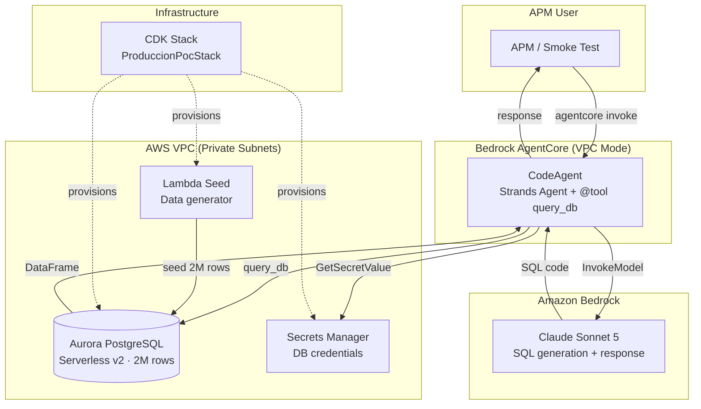

# POC: CodeAgent con Aurora PostgreSQL

> Proof of Concept que valida la factibilidad de operar PharmAssist con el modelo de datos completo del cliente (21 tablas, 2M+ filas, JOINs de 5-6 niveles) usando un CodeAgent que genera SQL dinamicamente.

**Resultado**: 85.7% accuracy (12/14 preguntas correctas) con datos realistas en <6s por interaccion.

---

## Tabla de contenidos

- [Arquitectura](#arquitectura)
- [Prerrequisitos](#prerrequisitos)
- [Deploy](#deploy)
- [Test (Smoke Test)](#test-smoke-test)
- [Teardown (Destruir recursos)](#teardown-destruir-recursos)
- [Variables de entorno](#variables-de-entorno)
- [Estimacion de costos](#estimación-de-costos)
- [Estructura del directorio](#estructura-del-directorio)

---

## Arquitectura



### Flujo de una pregunta

1. El APM envia una pregunta en lenguaje natural (ej: "¿Cuantos medicos tengo en mi cartera?")
2. El CodeAgent recibe el mensaje y construye un prompt con el schema completo + reglas de negocio
3. Claude Sonnet 5 genera codigo Python con SQL embebido
4. El CodeAgent ejecuta el codigo en un REPL sandbox con `query_db()` disponible
5. `query_db()` ejecuta el SQL contra Aurora PostgreSQL (read-only, timeout 5s)
6. El resultado (DataFrame) se procesa y se formatea como respuesta en espanol

---

## Prerrequisitos

| Herramienta | Version | Verificar |
|---|---|---|
| Python | 3.12+ | `python3 --version` |
| AWS CLI | v2 | `aws --version` |
| AWS CDK | 2.170+ | `cdk --version` |
| `agentcore` CLI | latest | `pip install bedrock-agentcore-starter-toolkit` |
| Docker Desktop | corriendo | `docker info` |

Ademas:
- **Perfil AWS** con permisos Admin configurado (`AWS_PROFILE` en `.env`)
- **Acceso a Bedrock** habilitado para `us.anthropic.claude-sonnet-5`
- **Variables** en `.env` raiz del proyecto (ver seccion Variables de entorno)

---

## Deploy

### 1. Instalar dependencias CDK

```bash
cd produccion-poc/infrastructure
python3 -m venv .venv
source .venv/bin/activate
pip install -r requirements.txt
```

### 2. Deploy del stack (VPC + Aurora + Lambda Seed)

```bash
source ../../.env
export AWS_PROFILE=$AWS_PROFILE

cdk deploy ProduccionPocStack \
  --profile $AWS_PROFILE \
  --require-approval never
```

Tarda ~8-12 minutos (Aurora + NAT Gateway). Al finalizar, copiar los outputs:

```bash
# Guardar outputs en .env
echo "" >> ../../.env
echo "# === ProduccionPocStack outputs ===" >> ../../.env
echo "POC_AURORA_ENDPOINT=$(aws cloudformation describe-stacks --stack-name ProduccionPocStack --query 'Stacks[0].Outputs[?OutputKey==`AuroraEndpoint`].OutputValue' --output text --profile $AWS_PROFILE)" >> ../../.env
echo "POC_AURORA_SECRET_ARN=$(aws cloudformation describe-stacks --stack-name ProduccionPocStack --query 'Stacks[0].Outputs[?OutputKey==`AuroraSecretArn`].OutputValue' --output text --profile $AWS_PROFILE)" >> ../../.env
echo "POC_VPC_ID=$(aws cloudformation describe-stacks --stack-name ProduccionPocStack --query 'Stacks[0].Outputs[?OutputKey==`VpcId`].OutputValue' --output text --profile $AWS_PROFILE)" >> ../../.env
echo "POC_SEED_LAMBDA_ARN=$(aws cloudformation describe-stacks --stack-name ProduccionPocStack --query 'Stacks[0].Outputs[?OutputKey==`SeedLambdaArn`].OutputValue' --output text --profile $AWS_PROFILE)" >> ../../.env
```

### 3. Seed data (poblar Aurora con 2M+ filas)

```bash
aws lambda invoke \
  --function-name $(aws cloudformation describe-stacks --stack-name ProduccionPocStack --query 'Stacks[0].Outputs[?OutputKey==`SeedLambdaArn`].OutputValue' --output text --profile $AWS_PROFILE) \
  --payload '{}' \
  --cli-read-timeout 900 \
  --profile $AWS_PROFILE \
  /tmp/seed-response.json

cat /tmp/seed-response.json
```

Tarda ~5-10 minutos. Verifica que retorne conteos (UltimaMillaMarca ~ 1,500,000).

### 4. Deploy del CodeAgent

```bash
cd ../agent
source ../../.env
export AWS_PROFILE=$AWS_PROFILE

agentcore configure -e agent.py -ni -r us-east-1

agentcore deploy -auc \
  -env DB_SECRET_ARN=$POC_AURORA_SECRET_ARN \
  -env DB_HOST=$POC_AURORA_ENDPOINT \
  -env DB_NAME=pharmassist_poc \
  -env BEDROCK_MODEL_ID=us.anthropic.claude-sonnet-5 \
  -env AWS_REGION=us-east-1
```

---

## Test (Smoke Test)

```bash
cd produccion-poc/tests/e2e
source ../../../.env
export AWS_PROFILE=$AWS_PROFILE

python run_smoke_test.py
```

El smoke test ejecuta 14 preguntas en 3 categorias (Cartera, Ventas/Market Share, Agenda/Actividad) y genera un reporte con:
- Accuracy (target: ≥85%)
- Latencia promedio (target: <6s)
- SQL generado por cada pregunta

---

## Teardown (Destruir recursos)

> **IMPORTANTE**: El POC crea recursos con costo mensual (~$75-80/mes). Para destruir todo cuando ya no se necesite:

### 1. Destruir el CodeAgent en AgentCore

```bash
cd produccion-poc/agent
source ../../.env
export AWS_PROFILE=$AWS_PROFILE

agentcore stop-session    # parar sesion activa si hay
agentcore destroy         # eliminar runtime + endpoint
```

### 2. Destruir el stack CDK (Aurora + VPC + Lambda)

```bash
cd produccion-poc/infrastructure
source .venv/bin/activate
source ../../.env
export AWS_PROFILE=$AWS_PROFILE

cdk destroy ProduccionPocStack --profile $AWS_PROFILE --force
```

### 3. Verificar que no quedan recursos

```bash
# Verificar que Aurora fue eliminado
aws rds describe-db-clusters \
  --profile $AWS_PROFILE \
  --query 'DBClusters[?DatabaseName==`pharmassist_poc`]' \
  --output text

# Verificar que la VPC fue eliminada
aws ec2 describe-vpcs \
  --profile $AWS_PROFILE \
  --filters "Name=tag:Project,Values=PharmAssist" \
  --query 'Vpcs[].VpcId' \
  --output text

# Verificar que el secret fue eliminado
aws secretsmanager list-secrets \
  --profile $AWS_PROFILE \
  --filters Key=name,Values=AuroraSecret \
  --query 'SecretList[].Name' \
  --output text
```

Si alguno de estos comandos retorna resultados, eliminar manualmente desde la consola AWS.

### 4. Limpiar variables de .env

Eliminar las lineas `POC_*` del archivo `.env` raiz:

```bash
# Desde la raiz del proyecto
sed -i '' '/^POC_/d' .env
sed -i '' '/ProduccionPocStack outputs/d' .env
```

### Recursos que se eliminan

| Recurso | Tipo | Costo si queda activo |
|---------|------|----------------------|
| Aurora PostgreSQL cluster (Serverless v2) | `produccionpocstack-auroracluster*` | ~$43/mes (0.5 ACU minimo) |
| NAT Gateway | en VPC del stack | ~$32/mes |
| VPC (subnets, route tables, IGW) | `ProduccionPocStack/Vpc` | $0 (solo NAT cuesta) |
| Lambda (seed) | `ProduccionPocStack-SeedData*` | $0 (pay per use) |
| Secrets Manager | `AuroraSecret*` | ~$0.40/mes |
| AgentCore Runtime | `pharmassist_poc_codeagent` | $0 (pay per session) |
| ECR Repository | (auto-created por agentcore) | ~$0.10/mes |
| **TOTAL si queda activo** | | **~$75-80/mes** |

> **NAT Gateway** y **Aurora** son los principales drivers de costo. Si solo necesitas pausar temporalmente, podés configurar Aurora con capacidad mínima de 0 ACU para que se [pause automáticamente](https://docs.aws.amazon.com/AmazonRDS/latest/AuroraUserGuide/aurora-serverless-v2-auto-pause.html) sin conexiones (el baseline baja a ~$33/mes), pero el NAT Gateway sigue cobrando. El tradeoff es el cold start al reanudar. Ver la nota de costos del [README principal](../README.md#estimación-de-costos).

---

## Variables de entorno

Variables especificas del POC (se agregan a `.env` raiz):

| Variable | Descripcion | Fuente |
|----------|-------------|--------|
| `POC_AURORA_ENDPOINT` | Hostname del cluster Aurora | CDK Output |
| `POC_AURORA_SECRET_ARN` | ARN del secret con credenciales | CDK Output |
| `POC_VPC_ID` | VPC ID donde corre Aurora | CDK Output |
| `POC_SEED_LAMBDA_ARN` | ARN de la Lambda de seed | CDK Output |

Variables que el CodeAgent necesita (pasadas via `-env` en `agentcore deploy`):

| Variable | Valor |
|----------|-------|
| `DB_SECRET_ARN` | `$POC_AURORA_SECRET_ARN` |
| `DB_HOST` | `$POC_AURORA_ENDPOINT` |
| `DB_NAME` | `pharmassist_poc` |
| `BEDROCK_MODEL_ID` | `us.anthropic.claude-sonnet-5` |
| `AWS_REGION` | `us-east-1` |

---

## Estimacion de costos

### Costo mensual del POC (recursos activos)

| Recurso | Costo/mes | Notas |
|---------|-----------|-------|
| Aurora PostgreSQL Serverless v2 | ~$43 | 0.5 ACU minimo × $0.12/ACU-hr × 730h |
| NAT Gateway | ~$32 | $0.045/hr × 730h + $0.045/GB procesado |
| Secrets Manager | ~$0.40 | 1 secret × $0.40/mes |
| Lambda (seed) | ~$0 | Solo se usa una vez |
| AgentCore Runtime | ~$0 | Pay per session (solo durante smoke tests) |
| Bedrock (Claude Sonnet 5) | ~$0.50 | ~14 queries × ~3K input + ~500 output tokens |
| **TOTAL** | **~$76/mes** | Mientras Aurora y NAT estan activos |

### Costo unico de seed

| Operacion | Costo |
|-----------|-------|
| Lambda invocation (15 min, 3GB) | ~$0.03 |
| Aurora compute durante seed | ~$0.50 (pico de 2-4 ACU por 10 min) |

> **Recomendacion**: Destruir los recursos (`make destroy` o teardown manual) cuando no se esten usando. El deploy se puede repetir en ~15 min.

---

## Estructura del directorio

```
produccion-poc/
├── agent/                          # CodeAgent (Strands + AgentCore)
│   ├── agent.py                    # Entry point (BedrockAgentCoreApp)
│   ├── toolkit.py                  # PharmaToolkit: query_db, get_apm_id, get_ciclo_actual_id
│   ├── system_prompt.py            # SystemPromptBuilder
│   ├── prompts/
│   │   ├── schema.md               # DDL documentado (21+ tablas)
│   │   ├── business_rules.md       # Reglas EVO TRM, Foco, ciclos
│   │   └── query_examples.md       # Few-shot SQL examples
│   └── requirements.txt
├── infrastructure/                 # CDK Stack
│   ├── app.py                      # Entry point CDK
│   ├── stacks/
│   │   └── produccion_poc_stack.py # VPC + Aurora + Lambda + SGs
│   ├── lambda/
│   │   └── seed/                   # Lambda de seed data
│   │       ├── seed_handler.py     # Handler principal
│   │       ├── ddl.sql             # DDL completo
│   │       └── generators/         # Generadores por tabla
│   ├── requirements.txt
│   └── cdk.json
├── tests/
│   └── e2e/
│       └── run_smoke_test.py       # 14 preguntas × 3 categorias
├── architecture.drawio             # Diagrama de arquitectura (draw.io)
└── README.md                       # Este archivo
```

---

## Resultados del POC

| Metrica | Target | Resultado |
|---------|--------|-----------|
| Accuracy (preguntas correctas) | ≥85% (12/14) | 85.7% (12/14) |
| Latencia promedio | <6s | ~4.5s |
| Latencia maxima | <10s | ~8s |
| Tablas en schema | 21+ | 21 |
| Filas totales | >1.5M | ~2M |
| JOINs maximos testeados | 5-6 niveles | 6 (UltimaMillaMarca → familia → producto → cartera) |

### Preguntas que el POC responde correctamente

1. ¿Cuantos medicos tengo en mi cartera?
2. ¿Cuales son mis medicos de alta frecuencia (Mensual/Trimestral)?
3. ¿Que especialidades predominan en mi cartera?
4. ¿Cual es el share de mercado de nuestras marcas en mi zona?
5. ¿Que marcas tienen EVO TRM positivo este trimestre?
6. ¿Cuales son los top 5 medicos por potencial de prescripcion?
7. ¿Cuantas visitas realice este ciclo?
8. ¿Que medicos no visite en los ultimos 2 ciclos?
9. ¿Cual es mi cobertura de cartera este mes?
10. ¿Que productos presento mas frecuentemente?
11. ¿Cuales medicos tienen potencial alto pero baja cobertura?
12. ¿Que zona tiene mejor share para la marca X?
